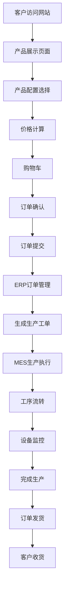

## 1. 产品概述

这是一个数码广告打印工厂管理系统的现代化重构项目，旨在将功能丰富但界面陈旧的系统用现代技术栈重构，打造一套完整的模块化工厂管理系统。

系统采用前后端分离架构，包含电商下单、ERP管理、MES生产执行、设备管理等核心模块，为广告打印工厂提供从客户下单到生产交付的全流程数字化解决方案。

目标用户包括：外部客户（在线下单）、内部员工（订单管理、生产管理）、工厂操作员（设备操作、工序流转）。

## 2. 核心功能

### 2.1 用户角色

| 角色 | 注册方式 | 核心权限 |
|------|----------|----------|
| 外部客户 | 手机号/邮箱注册 | 浏览产品、在线下单、查看订单状态、管理收货地址 |
| 内部员工 | 管理员创建账号 | 订单管理、客户管理、库存管理、生产调度 |
| 工厂操作员 | 工号登录 | 工单操作、工序流转、设备状态更新 |
| 系统管理员 | 超级管理员创建 | 系统配置、用户管理、权限分配、数据备份 |

### 2.2 功能模块

系统包含以下核心功能模块：

1. **在线下单系统**：产品展示、价格计算、购物车、订单提交
2. **ERP管理系统**：订单管理、客户管理、物料库存、BOM管理
3. **MES生产系统**：工单管理、生产排程、工序流转、实时看板
4. **设备管理**：设备监控、数据采集、故障报警、维护管理
5. **专业模块**：色彩管理、拼版集成、后道工艺处理

### 2.3 页面详情

| 页面名称 | 模块名称 | 功能描述 |
|-----------|-------------|-------------|
| 首页 | 产品分类导航 | 展示UV卷材、喷绘布等产品分类，支持分类筛选 |
| 产品详情页 | 产品信息展示 | 显示产品图片、规格参数、价格信息、库存状态 |
| 产品详情页 | 配置选择器 | 动态加载尺寸、工艺等属性选项，实时价格计算 |
| 购物车页面 | 购物车管理 | 添加/删除商品、修改数量、计算总价 |
| 订单确认页 | 订单信息填写 | 填写收货地址、选择配送方式、添加备注信息 |
| 订单管理页 | 订单列表 | 展示所有订单，支持状态筛选、搜索、分页 |
| 订单详情页 | 订单信息 | 显示订单详情、客户信息、产品配置、金额明细 |
| 订单详情页 | 状态管理 | 更新订单状态（待付款、生产中、已发货等） |
| 客户管理页 | 客户列表 | 展示客户信息，支持搜索、筛选、导出 |
| 客户详情页 | 客户信息 | 显示客户资料、历史订单、联系方式 |
| 库存管理页 | 物料列表 | 展示物料库存，支持入库、出库、盘点操作 |
| 库存管理页 | BOM管理 | 配置产品与物料的消耗关系 |
| 生产管理页 | 工单列表 | 展示生产工单，支持排程、分配、状态更新 |
| 生产管理页 | 工序流转 | 扫码或点击完成工序，自动流转到下一工序 |
| 设备监控页 | 设备状态 | 实时显示设备运行状态、墨水余量、错误信息 |
| 设备监控页 | 数据采集 | 自动采集设备数据，生成运行日志和报表 |
| 实时看板页 | 生产看板 | 大屏幕展示工单进度、设备状态、生产效率 |
| 色彩管理页 | ICC配置 | 为设备和材料配置ICC色彩配置文件 |
| 拼版集成页 | 文件处理 | 集成专业拼版软件，自动发送文件进行处理 |
| 后道工艺页 | 工艺配置 | 配置覆膜、包边、留白等后道工艺参数 |

## 3. 核心流程

### 外部客户流程
客户访问网站 → 浏览产品分类 → 选择产品配置 → 实时价格计算 → 添加到购物车 → 填写订单信息 → 提交订单 → 在线支付 → 查看订单状态 → 确认收货

### 内部员工流程
员工登录系统 → 查看新订单 → 审核订单信息 → 确认收款 → 生成生产工单 → 安排生产计划 → 分配设备和人员 → 监控生产进度 → 更新订单状态 → 安排发货

### 工厂操作员流程
操作员登录 → 查看分配工单 → 开始生产操作 → 完成当前工序 → 扫码流转 → 更新设备状态 → 记录生产数据 → 完成工单

## 4. 用户界面设计

### 4.1 设计风格

参考Apple官网的设计理念，采用简约现代的风格：

- **主色调**：纯白背景 (#FFFFFF) + 深灰色文字 (#1D1D1F)
- **强调色**：蓝色 (#007AFF) 用于按钮和链接
- **按钮样式**：圆角矩形，悬停效果明显，使用阴影增强层次感
- **字体系统**：苹方字体为主，标题使用加粗大字号，正文使用标准字号
- **布局风格**：卡片式布局，大量留白，内容居中显示
- **图标风格**：使用线性图标，简洁明了，统一风格
- **动画效果**：平滑的过渡动画，页面加载动画，按钮点击反馈

### 4.2 页面设计概述

| 页面名称 | 模块名称 | UI元素 |
|-----------|-------------|-------------|
| 首页 | 导航栏 | 白色背景，Logo居中，简约菜单图标 |
| 首页 | 产品分类 | 网格布局，产品卡片带阴影效果，悬停放大 |
| 产品详情页 | 产品图片 | 大图展示，支持放大镜查看，圆角边框 |
| 产品详情页 | 配置选择 | 下拉菜单使用原生样式，选项按钮圆角设计 |
| 购物车页面 | 商品列表 | 卡片式展示，包含缩略图、名称、价格 |
| 订单管理页 | 订单表格 | 简洁表格设计，状态标签使用彩色圆点 |
| 生产管理页 | 工单卡片 | 看板样式，拖拽操作，颜色区分状态 |
| 设备监控页 | 设备卡片 | 实时数据仪表盘，图表展示关键指标 |
| 实时看板页 | 大屏展示 | 全屏模式，大字体，高对比度配色 |

### 4.3 响应式设计

- **桌面端优先**：基础设计以1920x1080分辨率为标准
- **平板适配**：768px以上屏幕显示完整功能
- **手机适配**：375px以上屏幕支持核心功能
- **触摸优化**：按钮和交互元素适合触摸操作
- **断点设计**：1200px、768px、375px三个主要断点