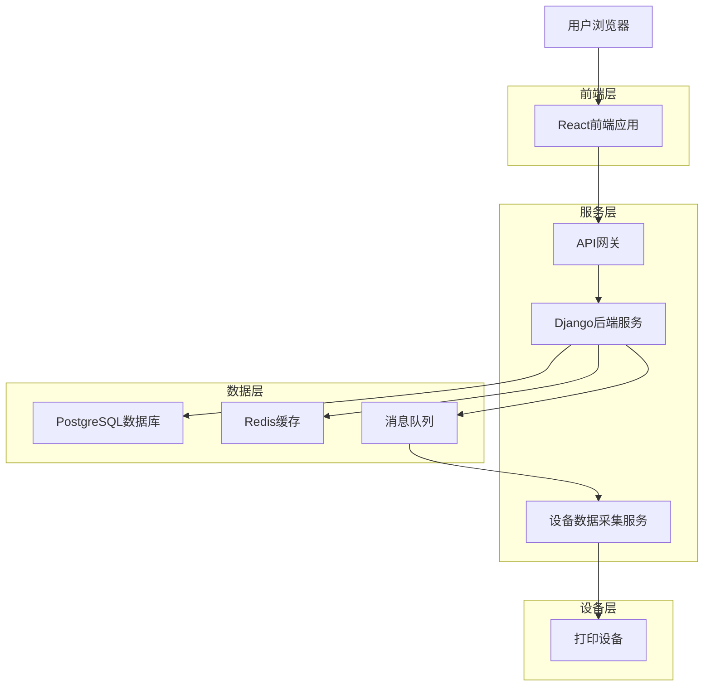
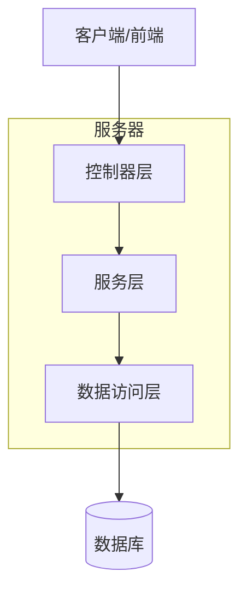
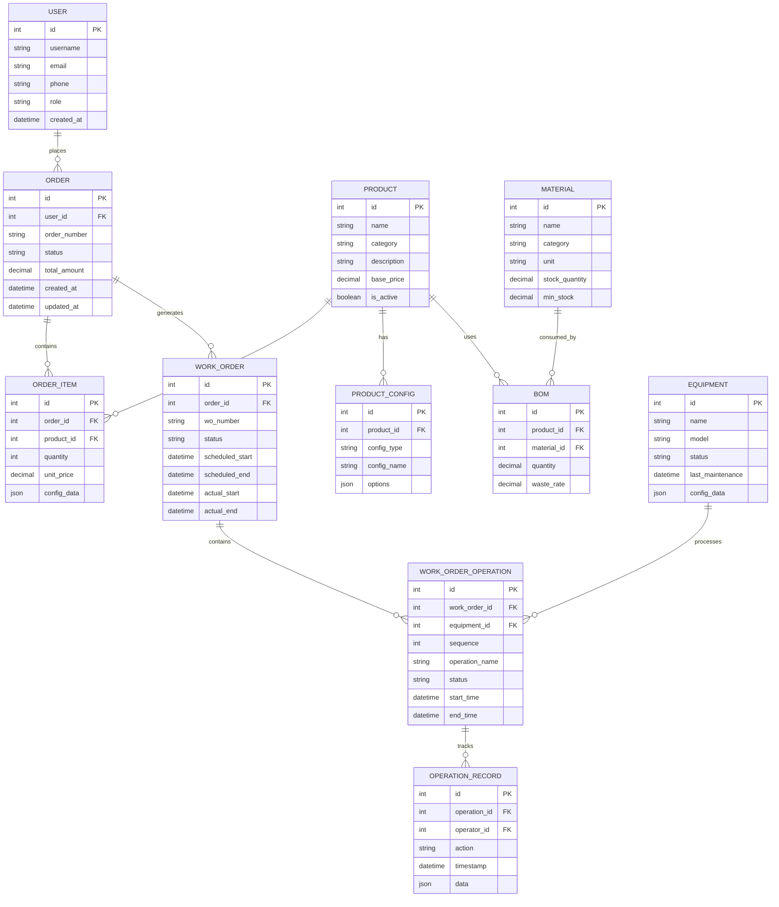

## 1. 架构设计



## 2. 技术描述

### 前端技术栈
- **框架**: React@18 + TypeScript
- **UI库**: Ant Design@5 + 自定义主题
- **样式**: TailwindCSS@3 + CSS Modules
- **状态管理**: Redux Toolkit + RTK Query
- **构建工具**: Vite@5
- **初始化工具**: vite-init

### 后端技术栈
- **框架**: Django@4.2 + Django REST Framework
- **数据库**: PostgreSQL@15
- **缓存**: Redis@7
- **消息与实时**: Redis + Django Channels
- **任务队列**: Celery + Redis
- **API文档**: drf-spectacular（OpenAPI 3.0）

### 部署与运维
- **容器化**: Docker + Docker Compose
- **Web服务器**: Nginx
- **WSGI服务器**: Gunicorn
- **进程管理**: Supervisor
- **监控**: Prometheus + Grafana

## 3. 路由定义

### 前端路由
| 路由 | 用途 |
|-------|---------|
| / | 首页，产品展示和分类导航 |
| /product/:id | 产品详情页，显示产品信息和配置选项 |
| /cart | 购物车页面，管理选购的商品 |
| /order/confirm | 订单确认页面，填写收货信息 |
| /order/success | 订单提交成功页面 |
| /user/orders | 用户订单列表页面 |
| /admin/dashboard | 管理后台首页，数据概览 |
| /admin/orders | 订单管理页面 |
| /admin/customers | 客户管理页面 |
| /admin/inventory | 库存管理页面 |
| /admin/production | 生产管理页面 |
| /admin/equipment | 设备管理页面 |
| /admin/reports | 报表统计页面 |
| /mes/dashboard | MES生产看板页面 |
| /mes/work-orders | 工单管理页面 |
| /mes/stations | 工位操作页面 |

## 4. API定义

### 4.1 核心API

#### 用户认证相关
```
POST /api/auth/login
```

请求参数：
| 参数名 | 参数类型 | 是否必需 | 描述 |
|-----------|-------------|-------------|-------------|
| username | string | 是 | 用户名或邮箱 |
| password | string | 是 | 密码 |

响应参数：
| 参数名 | 参数类型 | 描述 |
|-----------|-------------|-------------|
| token | string | JWT访问令牌 |
| refresh_token | string | 刷新令牌 |
| user | object | 用户信息 |

示例：
```json
{
  "username": "admin@example.com",
  "password": "password123"
}
```

#### 产品管理相关
```
GET /api/products/
POST /api/products/
GET /api/products/{id}/
PUT /api/products/{id}/
DELETE /api/products/{id}/
```

#### 订单管理相关
```
GET /api/orders/
POST /api/orders/
GET /api/orders/{id}/
PUT /api/orders/{id}/status/
```

#### 生产管理相关
```
GET /api/work-orders/
POST /api/work-orders/
PUT /api/work-orders/{id}/status/
POST /api/work-orders/{id}/complete-operation/
```

#### 设备监控相关
```
GET /api/equipment/
GET /api/equipment/{id}/status/
POST /api/equipment/{id}/data/
GET /api/equipment/realtime/
```

## 5. 服务器架构图



### 5.1 控制器层（Controller Layer）
- **职责**: 处理HTTP请求，验证输入参数，返回响应数据
- **组件**: Django ViewSets, APIViews
- **功能**: 路由分发，权限验证，数据序列化

### 5.2 服务层（Service Layer）
- **职责**: 业务逻辑处理，数据计算，流程控制
- **组件**: Service Classes, Business Logic
- **功能**: 订单处理，生产调度，库存计算，价格计算

### 5.3 数据访问层（Repository Layer）
- **职责**: 数据库操作，缓存管理，外部服务调用
- **组件**: Django ORM, Cache Clients, External APIs
- **功能**: CRUD操作，复杂查询，事务管理

## 6. 数据模型

### 6.1 数据模型定义



### 6.2 数据定义语言

#### 用户表（users）
```sql
-- 创建表
CREATE TABLE users (
    id UUID PRIMARY KEY DEFAULT gen_random_uuid(),
    username VARCHAR(50) UNIQUE NOT NULL,
    email VARCHAR(255) UNIQUE NOT NULL,
    phone VARCHAR(20),
    password_hash VARCHAR(255) NOT NULL,
    role VARCHAR(20) DEFAULT 'customer' CHECK (role IN ('customer', 'employee', 'operator', 'admin')),
    is_active BOOLEAN DEFAULT true,
    created_at TIMESTAMP WITH TIME ZONE DEFAULT NOW(),
    updated_at TIMESTAMP WITH TIME ZONE DEFAULT NOW()
);

-- 创建索引
CREATE INDEX idx_users_email ON users(email);
CREATE INDEX idx_users_role ON users(role);
```

#### 产品表（products）
```sql
-- 创建表
CREATE TABLE products (
    id UUID PRIMARY KEY DEFAULT gen_random_uuid(),
    name VARCHAR(255) NOT NULL,
    category VARCHAR(100) NOT NULL,
    description TEXT,
    base_price DECIMAL(10,2) NOT NULL,
    is_active BOOLEAN DEFAULT true,
    created_at TIMESTAMP WITH TIME ZONE DEFAULT NOW(),
    updated_at TIMESTAMP WITH TIME ZONE DEFAULT NOW()
);

-- 创建索引
CREATE INDEX idx_products_category ON products(category);
CREATE INDEX idx_products_active ON products(is_active);
```

#### 订单表（orders）
```sql
-- 创建表
CREATE TABLE orders (
    id UUID PRIMARY KEY DEFAULT gen_random_uuid(),
    user_id UUID REFERENCES users(id),
    order_number VARCHAR(50) UNIQUE NOT NULL,
    status VARCHAR(50) DEFAULT 'pending' CHECK (status IN ('pending', 'confirmed', 'processing', 'completed', 'cancelled')),
    total_amount DECIMAL(10,2) NOT NULL,
    shipping_address JSONB,
    notes TEXT,
    created_at TIMESTAMP WITH TIME ZONE DEFAULT NOW(),
    updated_at TIMESTAMP WITH TIME ZONE DEFAULT NOW()
);

-- 创建索引
CREATE INDEX idx_orders_user_id ON orders(user_id);
CREATE INDEX idx_orders_status ON orders(status);
CREATE INDEX idx_orders_created_at ON orders(created_at DESC);
```

#### 设备表（equipment）
```sql
-- 创建表
CREATE TABLE equipment (
    id UUID PRIMARY KEY DEFAULT gen_random_uuid(),
    name VARCHAR(255) NOT NULL,
    model VARCHAR(255),
    status VARCHAR(50) DEFAULT 'idle' CHECK (status IN ('idle', 'running', 'maintenance', 'error')),
    config_data JSONB,
    last_maintenance TIMESTAMP WITH TIME ZONE,
    created_at TIMESTAMP WITH TIME ZONE DEFAULT NOW(),
    updated_at TIMESTAMP WITH TIME ZONE DEFAULT NOW()
);

-- 创建索引
CREATE INDEX idx_equipment_status ON equipment(status);
```

#### 工单表（work_orders）
```sql
-- 创建表
CREATE TABLE work_orders (
    id UUID PRIMARY KEY DEFAULT gen_random_uuid(),
    order_id UUID REFERENCES orders(id),
    wo_number VARCHAR(50) UNIQUE NOT NULL,
    status VARCHAR(50) DEFAULT 'pending' CHECK (status IN ('pending', 'scheduled', 'in_progress', 'completed', 'cancelled')),
    priority INTEGER DEFAULT 1,
    scheduled_start TIMESTAMP WITH TIME ZONE,
    scheduled_end TIMESTAMP WITH TIME ZONE,
    actual_start TIMESTAMP WITH TIME ZONE,
    actual_end TIMESTAMP WITH TIME ZONE,
    created_at TIMESTAMP WITH TIME ZONE DEFAULT NOW(),
    updated_at TIMESTAMP WITH TIME ZONE DEFAULT NOW()
);

-- 创建索引
CREATE INDEX idx_work_orders_order_id ON work_orders(order_id);
CREATE INDEX idx_work_orders_status ON work_orders(status);
CREATE INDEX idx_work_orders_priority ON work_orders(priority);
```