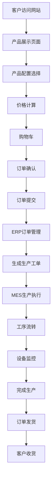

## 4. 业务流程

### 外部客户流程
客户访问网站 → 浏览产品分类 → 选择产品配置 → 实时价格计算 → 添加到购物车 → 填写订单信息 → 提交订单 → 在线支付 → 查看订单状态 → 确认收货

### 内部员工流程
员工登录系统 → 查看新订单 → 审核订单信息 → 确认收款 → 生成生产工单 → 安排生产计划 → 分配设备和人员 → 监控生产进度 → 更新订单状态 → 安排发货

### 工厂操作员流程
操作员登录 → 查看分配工单 → 开始生产操作 → 完成当前工序 → 扫码流转 → 更新设备状态 → 记录生产数据 → 完成工单

