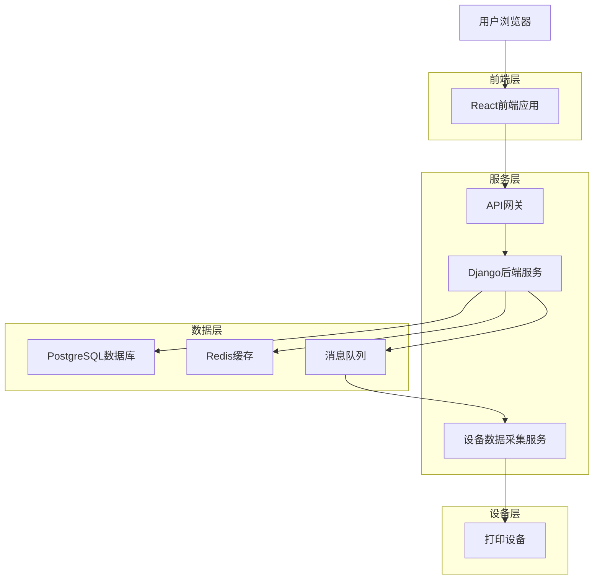

## 6. 技术架构与技术栈

### 前端技术栈
- 框架：React@18 + TypeScript
- UI库：Ant Design@5 + 自定义主题
- 样式：TailwindCSS@3 + CSS Modules
- 状态管理：Redux Toolkit + RTK Query
- 构建工具：Vite@5
- 初始化：vite-init

### 后端技术栈
- 框架：Django@4.2 + Django REST Framework
- 数据库：PostgreSQL@15
- 缓存：Redis@7
- 消息与实时：Redis + Django Channels
- 任务队列：Celery + Redis
- API文档：drf-spectacular（OpenAPI 3.0）

### 部署与运维
- 容器化：Docker + Docker Compose
- Web服务器：Nginx
- WSGI服务器：Gunicorn
- 进程管理：Supervisor
- 监控：Prometheus + Grafana