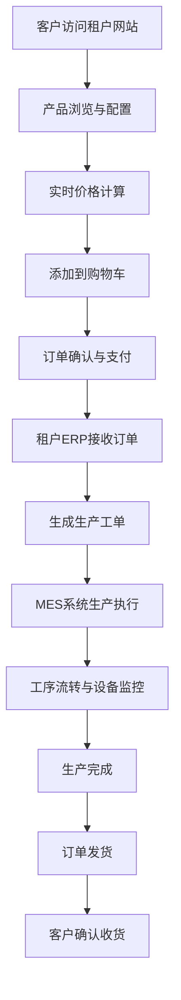
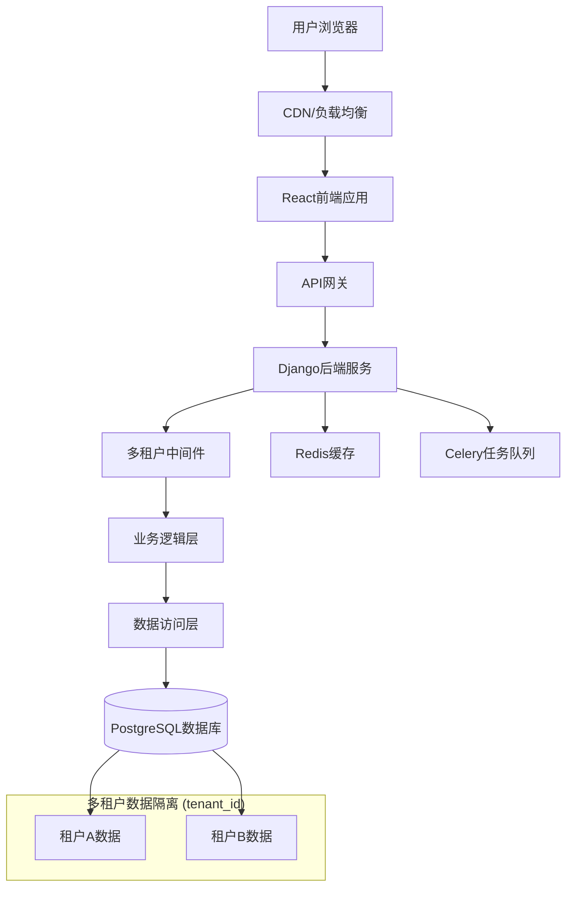

我建议按照以下逻辑进行合理的划分，这样可以消除重复，并让每个文档都有一个明确的核心主题：

1.  **文档一：核心SaaS平台架构设计**
    *   **内容来源**: 这部分将以《多租户SaaS广告打印平台技术架构文档》为主体，因为它代表了项目的最终架构形态。同时，我会从第一部分（初始的单体项目构想）中提取并整合有价值且不重复的内容，例如更详细的**用户界面设计理念**、**核心功能流程图**和**页面详情描述**，以丰富这份核心文档。初始构想中较为简单的架构图和API定义将被更完善的多租户版本替代。
    *   **核心目标**: 完整描述SaaS平台的核心技术栈、多租户架构、数据库模型、核心业务流程和API设计规范。

2.  **文档二：高级功能模块 - 图像矢量化与智能排版**
    *   **内容来源**: 完全基于《图片矢量化与智能排版优化模块技术文档》这一章节。
    *   **核心目标**: 作为一个独立的深度技术文档，详细阐述如何通过异步任务处理客户上传的位图文件，将其转换为矢量图，并利用智能排版算法优化材料利用率，实现生产自动化。

3.  **文档三：高级功能模块 - 金融级预充值与钱包系统**
    *   **内容来源**: 完全基于《金融级客户预充值与钱包系统技术文档》这一章节。
    *   **核心目标**: 详细说明客户钱包系统的设计，重点突出其金融级别的安全性、数据一致性、事务处理、并发控制以及与第三方支付的集成方案。

4.  **文档四：平台演进蓝图 - MES、ERP+与BI三层架构**
    *   **内容来源**: 完全基于《SaaS Platform Three-Tier Evolution Technical Architecture》这一章节。
    *   **核心目标**: 作为一份战略规划和技术展望文档，阐述平台如何从当前的SaaS系统进一步演进，整合生产执行（MES）、企业资源规划（ERP+）和商业智能（BI），构建一个更全面的数字化工厂解决方案。

---

现在，我将根据以上规划，为您生成这四份独立的文档。

### **文档一：核心SaaS平台架构与设计文档**

#### **1. 产品概述**

这是一个为数码广告打印工厂设计的现代化、多租户（Multi-Tenant）SaaS管理平台。系统旨在将功能丰富但陈旧的工厂管理流程，用现代技术栈（Python/Django后端 + React/TypeScript前端）重构，打造一套从电商接单、ERP管理到MES生产执行的全流程数字化解决方案。

*   **目标用户**:
    *   **外部客户**: 通过专属子域名访问平台，进行在线下单、文件上传和订单状态跟踪。
    *   **内部员工 (租户)**: 管理订单、客户、库存和生产调度。
    *   **工厂操作员 (租户)**: 通过工位终端进行工单操作和工序流转。
    *   **平台管理员**: 管理租户、订阅套餐和系统配置。

#### **2. 核心业务流程**



#### **3. 系统架构**

**3.1 多租户SaaS架构**

采用**共享数据库 + 共享Schema**的模式，通过 `tenant_id` 字段实现数据隔离，具有成本效益高、易于维护和扩展的优点。



**3.2 技术栈**

*   **前端**: React 18 + TypeScript + Ant Design / TailwindCSS
*   **状态管理**: Redux Toolkit + RTK Query
*   **后端**: Django 4.2 + Django REST Framework
*   **数据库**: PostgreSQL 15 (支持JSONB)
*   **缓存**: Redis 7
*   **任务队列**: Celery + Redis
*   **实时通信**: Django Channels (用于生产看板、消息通知)
*   **部署**: Docker + Docker Compose / Kubernetes

#### **4. 核心API设计 (安全与优化)**

**4.1 订单创建API (安全修复版)**

为防止价格篡改，API请求中**不应**包含由前端计算的 `unit_price` 和 `total_price`。所有价格必须在后端根据产品ID、数量和属性配置实时计算。

*   **请求**: `POST /api/orders/`
    ```json
    {
        "items": [
            {
                "product_id": 1,
                "quantity": 10.5,
                "attributes": [{"attribute_id": 1, "value_id": 2}]
            }
        ],
        "shipping_address": { ... },
        "delivery_method": "standard"
    }
    ```
*   **后端逻辑 (N+1查询优化)**:
    ```python
    def calculate_order_total(items):
        """
        优化后的价格计算函数，一次性查询所有产品和属性数据，
        在内存中构建查找字典，避免循环查询数据库。
        性能提升：从 O(n*m) 查询优化到 O(1) 字典查找。
        """
        # 1. 收集所有需要的 product_id 和 attribute_value_id
        # 2. 一次性从数据库查询出所有产品和属性值
        products = Product.objects.filter(id__in=product_ids)
        attr_values = AttributeValue.objects.filter(id__in=value_ids)
        # 3. 构建快速查找字典
        product_map = {p.id: p for p in products}
        attr_value_map = {av.id: av for av in attr_values}
        # 4. 在内存中循环计算总价，无数据库查询
        total = Decimal('0.00')
        for item in items:
            product = product_map.get(item['product_id'])
            # ... 价格计算逻辑 ...
        return total
    ```

#### **5. 数据库设计**

**5.1 核心表**

*   **tenants (租户表)**: 存储租户信息，如公司名、子域名、订阅状态。
*   **subscriptions (订阅表)**: 租户的订阅套餐、起止日期。
*   **products (产品表)**: 增加 `tenant_id` 外键，实现租户隔离。
*   **orders (订单表)**:
    *   增加 `tenant_id` 外键。
    *   增加**价格快照字段** (`subtotal_amount`, `total_amount`)，固化下单时的价格，防止后续产品价格变动影响历史订单，满足财务对账需求。
*   **order_items (订单项表)**:
    *   增加 `tenant_id` 外键。
    *   增加**价格快照字段** (`unit_price`, `total_price`)。

**5.2 `orders` 表结构示例**
```sql
CREATE TABLE orders (
    id SERIAL PRIMARY KEY,
    tenant_id INTEGER REFERENCES tenants(id) NOT NULL,
    order_number VARCHAR(50) NOT NULL,
    -- ... 其他字段
    -- 价格快照字段
    subtotal_amount DECIMAL(10,2) NOT NULL,    -- 商品小计
    discount_amount DECIMAL(10,2) DEFAULT 0.00, -- 折扣总额
    total_amount DECIMAL(10,2) NOT NULL,       -- 最终支付金额
    created_at TIMESTAMP DEFAULT CURRENT_TIMESTAMP,
    -- 租户内订单号唯一约束
    CONSTRAINT unique_order_number_per_tenant UNIQUE(tenant_id, order_number)
);
```

#### **6. 用户界面(UI)设计理念**

参考Apple官网的简约现代风格，为平台提供高质量的用户体验。

*   **主色调**: 纯白背景 (`#FFFFFF`) + 深灰色文字 (`#1D1D1F`)。
*   **强调色**: 蓝色 (`#007AFF`) 用于按钮、链接和高亮状态。
*   **布局**: 采用卡片式布局，增加大量留白，内容清晰、有呼吸感。
*   **字体**: 优先使用苹方、San Francisco等现代无衬线字体，通过字重和字号区分信息层级。
*   **图标**: 采用简洁、表意明确的线性图标。
*   **响应式设计**: 优先为桌面端设计，并适配平板和手机，确保核心功能在小屏幕上可用。

---

### **文档二：高级功能模块 - 图像矢量化与智能排版**

#### **1. 模块概述**

此模块是广告印刷生产自动化的核心，旨在解决两大痛点：
1.  **图片矢量化 (Raster to Vector)**: 自动将客户上传的JPG、PNG等位图，转换为可用于切割、雕刻的SVG、DXF等矢量图。
2.  **智能排版 (Nesting/Imposition)**: 将多个不规则形状的工件智能地排列在原材料上，最大限度减少浪费，提高材料利用率。

#### **2. 架构设计：异步任务处理**

矢量化和排版都是计算密集型任务，**严禁**在API请求中同步执行。必须采用基于**Celery**的异步任务队列。

*   **流程**:
    1.  前端上传文件，API接收后创建`Asset`记录，状态为`pending`。
    2.  API触发一个Celery异步任务（如 `vectorize_image.delay(asset_id)`）。
    3.  API立即返回成功响应，告知前端任务已开始处理。
    4.  独立的Celery Worker接收并执行任务。
    5.  前端通过**WebSocket**或**API轮询**来获取任务实时进度和最终结果。

*   **队列隔离**:
    为防止长时间的排版任务阻塞短时间的矢量化任务，应设置不同的Celery队列。
    ```python
    task_routes = {
        'vectorization.*': {'queue': 'vectorization'}, # 矢量化任务队列
        'nesting.*': {'queue': 'nesting'},           # 排版任务队列
    }
    ```

#### **3. 图片矢量化实现**

**3.1 技术选型**

*   **Potrace**: 开源、高效，适用于黑白轮廓图（如Logo、文字）的矢量化。
*   **Inkscape (命令行)**: 功能更强大，支持彩色图片描摹，但资源消耗更高。

**3.2 数据库设计 (`assets` 表)**
```sql
CREATE TABLE assets (
    id SERIAL PRIMARY KEY,
    tenant_id INTEGER REFERENCES tenants(id) NOT NULL,
    order_item_id INTEGER REFERENCES order_items(id),
    -- 原始文件信息
    uploaded_file_url VARCHAR(500),
    -- 矢量化后文件信息
    vector_file_url VARCHAR(500),
    vectorization_status VARCHAR(20) DEFAULT 'pending', -- pending, processing, success, failed
    vectorization_error TEXT,
    created_at TIMESTAMP DEFAULT CURRENT_TIMESTAMP
);
```

**3.3 异步任务示例 (`tasks/vectorization.py`)**
```python
from celery import shared_task
import subprocess

@shared_task(bind=True, max_retries=3)
def vectorize_image(self, asset_id: int):
    try:
        asset = Asset.objects.get(id=asset_id)
        asset.vectorization_status = 'processing'
        asset.save()
        
        input_path = "..." # 原始文件路径
        output_path = "..." # 输出SVG文件路径
        
        # 使用 potrace 命令行工具
        cmd = ['potrace', '-s', '-o', output_path, input_path]
        result = subprocess.run(cmd, capture_output=True, text=True)
        
        if result.returncode == 0:
            asset.vector_file_url = ...
            asset.vectorization_status = 'success'
            asset.save()
            # 通过WebSocket通知前端
        else:
            raise Exception(result.stderr)
            
    except Exception as exc:
        # 更新错误状态并触发重试
        asset.vectorization_status = 'failed'
        asset.vectorization_error = str(exc)
        asset.save()
        self.retry(exc=exc, countdown=60)
```

#### **4. 智能排版实现**

**4.1 技术选型**

排版属于NP-hard问题，不建议自研。应集成现有库或服务。
*   **SVGnest**: 开源，支持不规则SVG图形排版，效果较好。
*   **RectPack**: Python库，速度快，但仅支持矩形排版。
*   **商业API**: 提供更专业、高效的算法，但有额外成本。

**4.2 数据库设计 (`nesting_layouts` 表)**
```sql
CREATE TABLE nesting_layouts (
    id SERIAL PRIMARY KEY,
    tenant_id INTEGER REFERENCES tenants(id) NOT NULL,
    material_id INTEGER REFERENCES materials(id) NOT NULL,
    layout_file_url VARCHAR(500) NOT NULL, -- 生成的排版图 (SVG/DXF)
    utilization_rate DECIMAL(5,2) NOT NULL, -- 材料利用率
    status VARCHAR(20) DEFAULT 'pending', -- pending, optimizing, completed
    created_at TIMESTAMP DEFAULT CURRENT_TIMESTAMP
);

CREATE TABLE nesting_layout_items (
    id SERIAL PRIMARY KEY,
    layout_id INTEGER REFERENCES nesting_layouts(id) NOT NULL,
    work_order_id INTEGER REFERENCES work_orders(id) UNIQUE NOT NULL, -- 一个工单只能属于一个排版
    position_x DECIMAL(10,2), -- 在排版图中的坐标
    position_y DECIMAL(10,2),
    rotation_angle DECIMAL(5,2)
);
```

**4.3 与MES系统集成**

*   **工单状态扩展**: 增加 `pending_nesting` (待排版), `nested_ready` (已排版，待生产) 等状态。
*   **操作流程**: 生产经理在后台选择多个相同材质的`待排版`工单，触发一个智能排版任务。任务完成后，生成一个`nesting_layout`（排版布局），并将关联的工单状态更新为`已排版`，等待工厂操作员领取生产。

---

### **文档三：高级功能模块 - 金融级预充值与钱包系统**

#### **1. 模块概述**

为SaaS平台的客户提供安全、可靠的预充值钱包功能，支持余额支付、交易流水查询、在线充值和退款。系统设计遵循金融级标准，确保资金安全和数据一致性。

#### **2. 核心设计原则**

*   **数据一致性**: 所有资金操作必须在数据库**事务**中完成，保证原子性。
*   **账本不可变**: `wallet_transactions` (交易流水表) 只增不改，任何冲销操作都通过一笔相反的交易（如退款）来记录，便于审计。
*   **高精度计算**: 所有金额字段使用`DECIMAL(15, 4)`类型，后端计算使用Python的`Decimal`库，避免浮点数精度问题。
*   **并发控制**: 在高并发支付场景下，使用**悲观锁** (`select_for_update`) 锁定钱包行，防止超额扣款。
*   **幂等性**: 所有创建交易的API都需要支持幂等性，防止因网络重试导致重复创建交易。

#### **3. 数据库设计**

**3.1 `customer_wallets` (客户钱包表)**
```sql
CREATE TABLE customer_wallets (
    id BIGSERIAL PRIMARY KEY,
    tenant_id INTEGER NOT NULL REFERENCES tenants(id),
    customer_id INTEGER NOT NULL REFERENCES customers(id),
    balance DECIMAL(15, 4) NOT NULL DEFAULT 0.0000, -- 当前余额
    frozen_amount DECIMAL(15, 4) NOT NULL DEFAULT 0.0000, -- 冻结金额
    version INTEGER NOT NULL DEFAULT 1, -- 乐观锁版本号
    status VARCHAR(20) NOT NULL DEFAULT 'active', -- active, frozen
    UNIQUE(tenant_id, customer_id),
    CHECK (balance >= frozen_amount AND frozen_amount >= 0)
);```

**3.2 `wallet_transactions` (钱包交易流水表)**
```sql
CREATE TABLE wallet_transactions (
    id BIGSERIAL PRIMARY KEY,
    wallet_id BIGINT NOT NULL REFERENCES customer_wallets(id),
    transaction_no VARCHAR(64) NOT NULL UNIQUE, -- 全局唯一交易号
    transaction_type VARCHAR(30) NOT NULL, -- deposit, purchase, refund
    amount DECIMAL(15, 4) NOT NULL, -- 正数增加, 负数减少
    balance_before DECIMAL(15, 4) NOT NULL, -- 交易前余额
    balance_after DECIMAL(15, 4) NOT NULL, -- 交易后余额
    related_order_id INTEGER,
    description TEXT,
    status VARCHAR(20) NOT NULL DEFAULT 'completed',
    created_at TIMESTAMP WITH TIME ZONE DEFAULT CURRENT_TIMESTAMP,
    CHECK (balance_after = balance_before + amount) -- 数据一致性约束
);
```

#### **4. 核心逻辑实现 (余额支付)**

```python
from django.db import transaction
from decimal import Decimal

class WalletService:
    @transaction.atomic
    def process_wallet_payment(self, customer_id, order_id, amount):
        # 1. 使用悲观锁锁定钱包行，防止并发问题
        wallet = CustomerWallet.objects.select_for_update().get(
            customer_id=customer_id, status='active'
        )
        
        # 2. 检查可用余额
        available_balance = wallet.balance - wallet.frozen_amount
        if available_balance < Decimal(str(amount)):
            raise InsufficientBalanceError("余额不足")
        
        # 3. 记录交易前余额
        balance_before = wallet.balance
        
        # 4. 更新钱包余额
        wallet.balance -= Decimal(str(amount))
        wallet.save() # 此时数据库行锁释放
        
        # 5. 创建不可变的交易流水记录
        WalletTransaction.objects.create(
            wallet=wallet,
            transaction_no=generate_unique_no(),
            transaction_type='purchase',
            amount=-Decimal(str(amount)),
            balance_before=balance_before,
            balance_after=wallet.balance,
            related_order_id=order_id,
            description=f"订单支付 - {order_id}"
        )
        
        # 6. 更新订单状态
        # ...
        
        return {'success': True, 'balance_after': wallet.balance}
```

#### **5. 安全与合规**

*   **操作审计**: 记录所有敏感操作（冻结钱包、手动调账）的日志，包含操作人、IP地址和时间。
*   **风险监控**: 建立规则引擎，监控异常交易行为（如短时高频交易、超大额充值），并触发预警。
*   **数据加密**: 对存储在数据库中的敏感客户信息进行加密。

---

### **文档四：平台演进蓝图 - MES、ERP+与BI三层架构**

#### **1. 愿景概述**

为广告印刷行业提供一个从车间到管理、从执行到决策的**三位一体**数字化解决方案。本蓝图旨在将当前的SaaS平台从一个核心的订单和生产管理工具，演进为一个全面的企业级智能平台。

#### **2. 三层架构详解**

**2.1 MES层 - 车间数字化 (Shop Floor Digitization)**

*   **核心目标**: 实现生产过程的透明化、实时化和无纸化。
*   **关键功能**:
    *   **条码/二维码工序跟踪**: 为每个工单的每道工序生成唯一二维码。工人通过工位终端（平板或扫码枪）扫描二维码，自动记录工序的开始、结束时间和操作员，替代传统纸质流转卡。
    *   **设备综合效率(OEE)管理**:
        *   **可用性 (Availability)**: 记录设备开机、停机、故障和维护时间。
        *   **性能 (Performance)**: 对比理论产能和实际产出。
        *   **质量 (Quality)**: 统计合格品与次品数量。
        通过OEE分析，帮助管理者发现生产瓶颈。
    *   **设备维护计划**: 基于时间或设备运行小时数，自动生成预防性维护任务，并提前告警。

**2.2 ERP+CRM层 - 业务流程一体化 (Business Process Integration)**

*   **核心目标**: 打通从客户关系、销售、采购到库存的完整业务链条。
*   **关键功能**:
    *   **智能采购系统**:
        *   根据物料的最低库存水平和安全库存阈值，自动生成采购建议。
        *   系统根据供应商评分和历史采购价，推荐最优供应商。
        *   支持一键生成采购订单，并通过邮件自动发送给供应商。
    *   **供应商管理**: 维护供应商档案、合同、付款条件和绩效评级。
    *   **客户协作门户 (Proofing System)**:
        *   客户可在线上传、预览和校对设计稿。
        *   提供在线标注、评论和版本比较功能，所有沟通记录留痕，避免口头沟通导致的错误。
        *   客户在线点击“确认稿件”后，订单状态自动流转，直接进入生产待排产列表。

**2.3 BI层 - 数据驱动决策 (Data-Driven Decision Making)**

*   **核心目标**: 将业务数据转化为商业洞察，为管理者提供决策支持。
*   **关键功能**:
    *   **可定制仪表盘 (Dashboard)**: 管理者可以像拼接乐高一样，通过拖拽方式自由组合关心的KPI图表，打造个性化的数据驾驶舱。
    *   **核心KPI监控**:
        *   **销售分析**: 客户增长率、复购率、客单价、产品销售排行。
        *   **生产分析**: 订单准时交付率、平均生产周期、设备利用率。
        *   **财务分析**: 利润分析、成本构成、应收账款周转率。
    *   **数据聚合服务**: 在后台运行定时任务，对业务数据进行ETL（提取、转换、加载），生成用于BI分析的聚合数据，确保前台仪表盘查询的高性能。