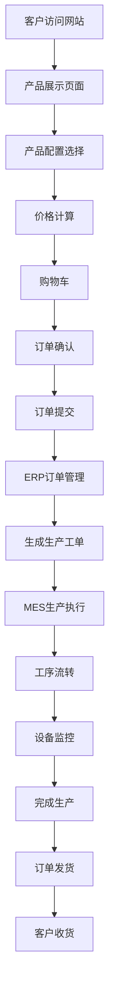
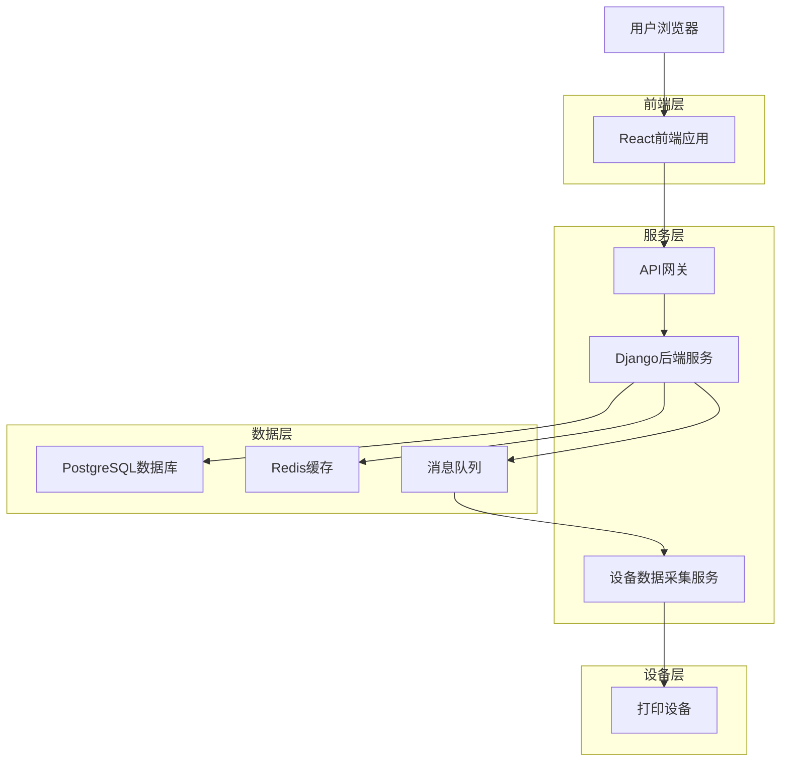
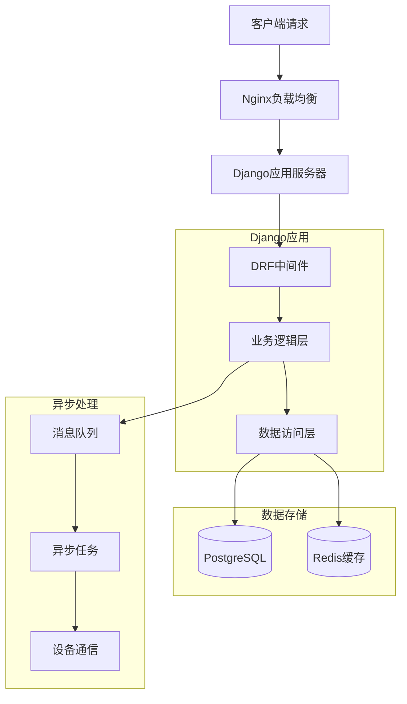
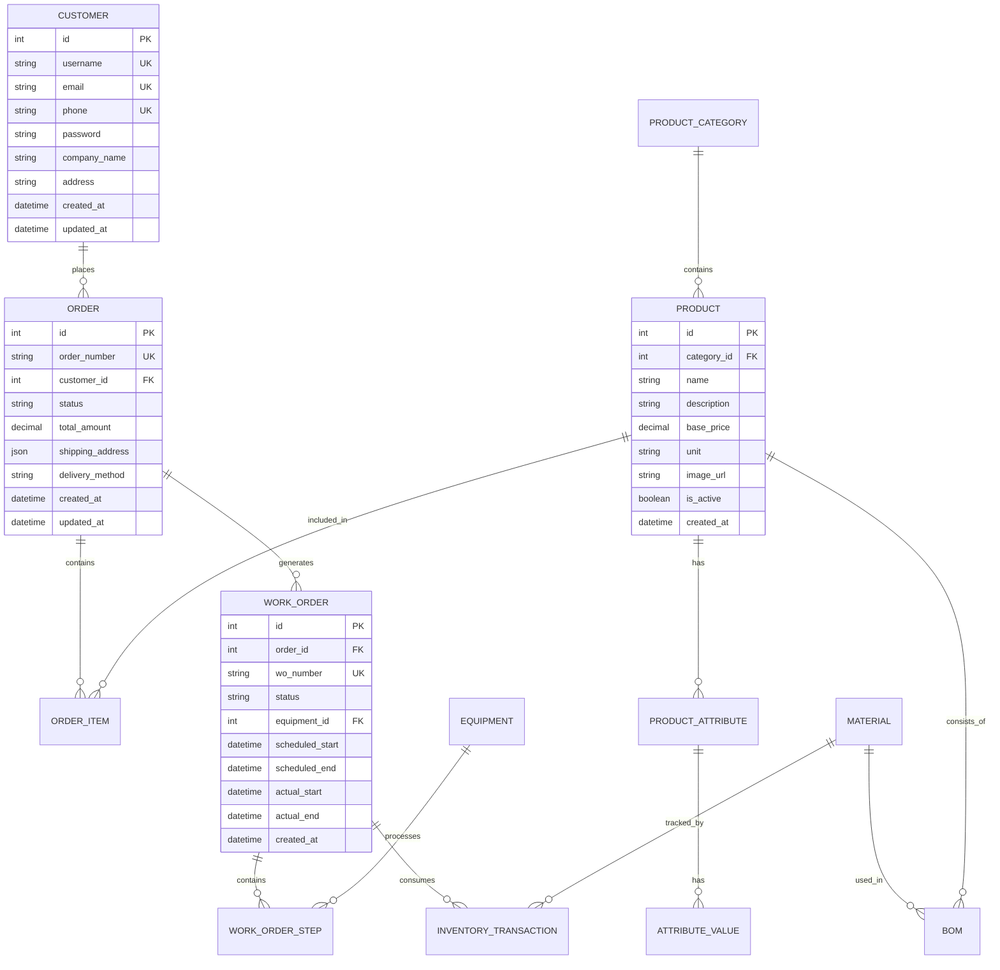
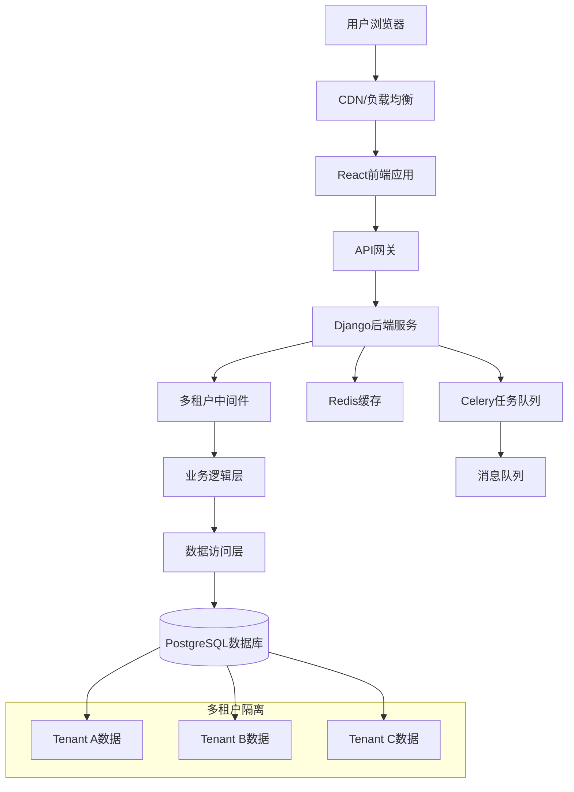
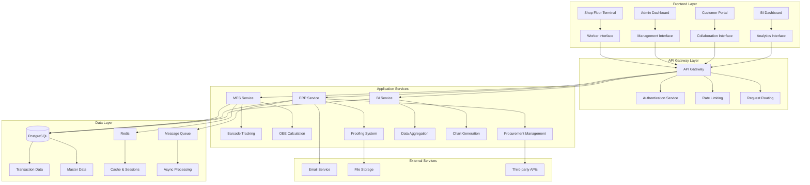

## 1. 产品概述

这是一个数码广告打印工厂管理系统的现代化重构项目，旨在将功能丰富但界面陈旧的系统用现代技术栈（Python后端 + 现代化前端）重构，打造一套完整的模块化工厂管理系统。

系统采用前后端分离架构，包含电商下单、ERP管理、MES生产执行、设备管理等核心模块，为广告打印工厂提供从客户下单到生产交付的全流程数字化解决方案。

目标用户包括：外部客户（在线下单）、内部员工（订单管理、生产管理）、工厂操作员（设备操作、工序流转）。

## 2. 核心功能

### 2.1 用户角色

| 角色 | 注册方式 | 核心权限 |
|------|----------|----------|
| 外部客户 | 手机号/邮箱注册 | 浏览产品、在线下单、查看订单状态、管理收货地址 |
| 内部员工 | 管理员创建账号 | 订单管理、客户管理、库存管理、生产调度 |
| 工厂操作员 | 工号登录 | 工单操作、工序流转、设备状态更新 |
| 系统管理员 | 超级管理员创建 | 系统配置、用户管理、权限分配、数据备份 |

### 2.2 功能模块

系统包含以下核心功能模块：

1. **在线下单系统**：产品展示、价格计算、购物车、订单提交
2. **ERP管理系统**：订单管理、客户管理、物料库存、BOM管理
3. **MES生产系统**：工单管理、生产排程、工序流转、实时看板
4. **设备管理**：设备监控、数据采集、故障报警、维护管理
5. **专业模块**：色彩管理、拼版集成、后道工艺处理

### 2.3 页面详情

| 页面名称 | 模块名称 | 功能描述 |
|-----------|-------------|-------------|
| 首页 | 产品分类导航 | 展示UV卷材、喷绘布等产品分类，支持分类筛选 |
| 产品详情页 | 产品信息展示 | 显示产品图片、规格参数、价格信息、库存状态 |
| 产品详情页 | 配置选择器 | 动态加载尺寸、工艺等属性选项，实时价格计算 |
| 购物车页面 | 购物车管理 | 添加/删除商品、修改数量、计算总价 |
| 订单确认页 | 订单信息填写 | 填写收货地址、选择配送方式、添加备注信息 |
| 订单管理页 | 订单列表 | 展示所有订单，支持状态筛选、搜索、分页 |
| 订单详情页 | 订单信息 | 显示订单详情、客户信息、产品配置、金额明细 |
| 订单详情页 | 状态管理 | 更新订单状态（待付款、生产中、已发货等） |
| 客户管理页 | 客户列表 | 展示客户信息，支持搜索、筛选、导出 |
| 客户详情页 | 客户信息 | 显示客户资料、历史订单、联系方式 |
| 库存管理页 | 物料列表 | 展示物料库存，支持入库、出库、盘点操作 |
| 库存管理页 | BOM管理 | 配置产品与物料的消耗关系 |
| 生产管理页 | 工单列表 | 展示生产工单，支持排程、分配、状态更新 |
| 生产管理页 | 工序流转 | 扫码或点击完成工序，自动流转到下一工序 |
| 设备监控页 | 设备状态 | 实时显示设备运行状态、墨水余量、错误信息 |
| 设备监控页 | 数据采集 | 自动采集设备数据，生成运行日志和报表 |
| 实时看板页 | 生产看板 | 大屏幕展示工单进度、设备状态、生产效率 |
| 色彩管理页 | ICC配置 | 为设备和材料配置ICC色彩配置文件 |
| 拼版集成页 | 文件处理 | 集成专业拼版软件，自动发送文件进行处理 |
| 后道工艺页 | 工艺配置 | 配置覆膜、包边、留白等后道工艺参数 |

## 3. 核心流程

### 外部客户流程
客户访问网站 → 浏览产品分类 → 选择产品配置 → 实时价格计算 → 添加到购物车 → 填写订单信息 → 提交订单 → 在线支付 → 查看订单状态 → 确认收货

### 内部员工流程
员工登录系统 → 查看新订单 → 审核订单信息 → 确认收款 → 生成生产工单 → 安排生产计划 → 分配设备和人员 → 监控生产进度 → 更新订单状态 → 安排发货

### 工厂操作员流程
操作员登录 → 查看分配工单 → 开始生产操作 → 完成当前工序 → 扫码流转 → 更新设备状态 → 记录生产数据 → 完成工单



## 4. 用户界面设计

### 4.1 设计风格

参考Apple官网的设计理念，采用简约现代的风格：

- **主色调**：纯白背景 (#FFFFFF) + 深灰色文字 (#1D1D1F)
- **强调色**：蓝色 (#007AFF) 用于按钮和链接
- **按钮样式**：圆角矩形，悬停效果明显，使用阴影增强层次感
- **字体系统**：苹方字体为主，标题使用加粗大字号，正文使用标准字号
- **布局风格**：卡片式布局，大量留白，内容居中显示
- **图标风格**：使用线性图标，简洁明了，统一风格
- **动画效果**：平滑的过渡动画，页面加载动画，按钮点击反馈

### 4.2 页面设计概述

| 页面名称 | 模块名称 | UI元素 |
|-----------|-------------|-------------|
| 首页 | 导航栏 | 白色背景，Logo居中，简约菜单图标 |
| 首页 | 产品分类 | 网格布局，产品卡片带阴影效果，悬停放大 |
| 产品详情页 | 产品图片 | 大图展示，支持放大镜查看，圆角边框 |
| 产品详情页 | 配置选择 | 下拉菜单使用原生样式，选项按钮圆角设计 |
| 购物车页面 | 商品列表 | 卡片式展示，包含缩略图、名称、价格 |
| 订单管理页 | 订单表格 | 简洁表格设计，状态标签使用彩色圆点 |
| 生产管理页 | 工单卡片 | 看板样式，拖拽操作，颜色区分状态 |
| 设备监控页 | 设备卡片 | 实时数据仪表盘，图表展示关键指标 |
| 实时看板页 | 大屏展示 | 全屏模式，大字体，高对比度配色 |

### 4.3 响应式设计

- **桌面端优先**：基础设计以1920x1080分辨率为标准
- **平板适配**：768px以上屏幕显示完整功能
- **手机适配**：375px以上屏幕支持核心功能
- **触摸优化**：按钮和交互元素适合触摸操作
- **断点设计**：1200px、768px、375px三个主要断点

## 1. 架构设计



## 2. 技术描述

### 前端技术栈
- **框架**: React@18 + TypeScript
- **UI库**: Ant Design@5 + 自定义主题
- **样式**: TailwindCSS@3 + CSS Modules
- **状态管理**: Redux Toolkit + RTK Query
- **构建工具**: Vite@5
- **初始化工具**: vite-init

### 后端技术栈
- **框架**: Django@4.2 + Django REST Framework
- **数据库**: PostgreSQL@15
- **缓存**: Redis@7
- **消息队列**: Redis + Django Channels
- **任务队列**: Celery + Redis
- **API文档**: drf-spectacular (OpenAPI 3.0)

### 部署与运维
- **容器化**: Docker + Docker Compose
- **Web服务器**: Nginx
- **WSGI服务器**: Gunicorn
- **进程管理**: Supervisor
- **监控**: Prometheus + Grafana

## 3. 路由定义

### 前端路由
| 路由 | 用途 |
|-------|---------|
| / | 首页，产品展示和分类导航 |
| /product/:id | 产品详情页，显示产品信息和配置选项 |
| /cart | 购物车页面，管理选购的商品 |
| /order/confirm | 订单确认页面，填写收货信息 |
| /order/success | 订单提交成功页面 |
| /user/orders | 用户订单列表页面 |
| /admin/dashboard | 管理后台首页，数据概览 |
| /admin/orders | 订单管理页面 |
| /admin/customers | 客户管理页面 |
| /admin/inventory | 库存管理页面 |
| /admin/production | 生产管理页面 |
| /admin/equipment | 设备管理页面 |
| /admin/reports | 报表统计页面 |
| /mes/dashboard | MES生产看板页面 |
| /mes/work-orders | 工单管理页面 |
| /mes/stations | 工位操作页面 |

### 后端API路由
| 路由 | 用途 |
|-------|---------|
| /api/auth/ | 用户认证相关API |
| /api/products/ | 产品相关API |
| /api/orders/ | 订单相关API |
| /api/customers/ | 客户相关API |
| /api/inventory/ | 库存相关API |
| /api/production/ | 生产相关API |
| /api/equipment/ | 设备相关API |
| /api/reports/ | 报表相关API |

## 4. API定义

### 4.1 核心API

产品管理相关 - 所有数据必须通过管理后台维护
```
GET /api/products/categories
```

响应：
| 参数名 | 类型 | 描述 |
|-----------|-------------|-------------|
| categories| array       | 数据库中的产品分类列表 |

管理后台API：
```
POST /api/admin/categories          # 创建分类
PUT /api/admin/categories/:id       # 更新分类  
DELETE /api/admin/categories/:id    # 删除分类
POST /api/admin/products              # 创建产品
PUT /api/admin/products/:id         # 更新产品
DELETE /api/admin/products/:id        # 删除产品
```

价格计算相关 - 基于当前定价规则实时计算
```
POST /api/price/calculate
```

请求：
| 参数名 | 类型 | 必需 | 描述 |
|-----------|-------------|-------------|-------------|
| product_id| integer     | 是        | 数据库中的产品ID |
| width     | float       | 是        | 宽度（米） |
| height    | float       | 是        | 高度（米） |
| quantity  | integer     | 是        | 数量 |
| attributes| array       | 否       | 数据库中的附加属性 |

**重要**：所有产品数据、定价规则及属性必须通过管理后台配置，前端应用严禁硬编码任何业务数据。

### 4.2 产品相关API

#### 获取产品列表
```
GET /api/products/
```

查询参数：
| 参数名 | 类型 | 必需 | 描述 |
|--------|------|------|------|
| category | int | 否 | 分类ID |
| search | string | 否 | 搜索关键词 |
| page | int | 否 | 页码，默认1 |
| page_size | int | 否 | 每页数量，默认20 |

响应：
```json
{
  "count": 100,
  "next": "http://api.example.com/api/products/?page=2",
  "previous": null,
  "results": [
    {
      "id": 1,
      "name": "外光刀刮布",
      "category": {
        "id": 1,
        "name": "UV卷材"
      },
      "base_price": "25.00",
      "unit": "平方米",
      "description": "高品质户外广告材料",
      "attributes": [
        {
          "id": 1,
          "name": "宽度",
          "type": "select",
          "values": [
            {"id": 1, "value": "3.2米", "price_adjustment": "0.00"},
            {"id": 2, "value": "5.0米", "price_adjustment": "5.00"}
          ]
        }
      ]
    }
  ]
}
```

#### 价格计算
```
POST /api/products/calculate-price/
```

请求参数：
| 参数名 | 类型 | 必需 | 描述 |
|--------|------|------|------|
| product_id | int | 是 | 产品ID |
| quantity | float | 是 | 数量 |
| attributes | array | 是 | 属性配置 |

请求示例：
```json
{
  "product_id": 1,
  "quantity": 10.5,
  "attributes": [
    {"attribute_id": 1, "value_id": 2},
    {"attribute_id": 2, "value_id": 5}
  ]
}
```

响应：
```json
{
  "product_id": 1,
  "quantity": 10.5,
  "unit_price": "30.00",
  "total_price": "315.00",
  "breakdown": {
    "base_price": "25.00",
    "attribute_adjustments": "5.00",
    "quantity_discount": "0.00"
  }
}
```

### 4.3 订单相关API

#### 创建订单
```
POST /api/orders/
```

请求参数：
| 参数名 | 类型 | 必需 | 描述 |
|--------|------|------|------|
| items | array | 是 | 订单项列表 |
| shipping_address | object | 是 | 收货地址 |
| delivery_method | string | 是 | 配送方式 |
| notes | string | 否 | 备注信息 |

请求示例：
```json
{
  "items": [
    {
      "product_id": 1,
      "quantity": 10.5,
      "attributes": [
        {"attribute_id": 1, "value_id": 2}
      ],
      "unit_price": "30.00",
      "total_price": "315.00"
    }
  ],
  "shipping_address": {
    "name": "张三",
    "phone": "13800138000",
    "address": "北京市朝阳区xxx街道xxx号",
    "postal_code": "100000"
  },
  "delivery_method": "standard",
  "notes": "请尽快发货"
}
```

响应：
```json
{
  "id": 10001,
  "order_number": "ORD202401010001",
  "status": "pending_payment",
  "total_amount": "315.00",
  "created_at": "2024-01-01T10:00:00Z",
  "payment_info": {
    "payment_method": "alipay",
    "qr_code": "https://qr.alipay.com/xxx",
    "expire_time": "2024-01-01T11:00:00Z"
  }
}
```

## 5. 数据管理规范与开发原则

### 5.1 数据管理策略

**核心原则：所有业务数据必须通过管理后台进行CRUD操作**

1. **数据源统一性**
   - 产品分类、产品信息、价格规则等所有业务数据必须存储在数据库中
   - 前端应用只能读取和展示数据，严禁硬编码任何业务数据
   - 建立完整的数据权限管理体系，确保数据安全

2. **管理后台功能模块**
   - 产品分类管理（支持多级分类、拖拽排序）
   - 产品信息管理（包括属性、规格、价格规则、库存单位）
   - 客户信息管理（客户资料、信用等级、历史订单）
   - 订单状态管理（状态流转、操作日志）
   - 库存管理（物料入库、出库、盘点、预警）
   - 用户权限管理（角色权限、数据范围、操作权限）

3. **数据流程设计**
   ```
   管理员录入 → 后端验证 → 数据库存储 → 缓存更新 → API提供 → 前端展示
   ```

### 5.2 开发规范

**严格禁止的行为：**
- ❌ 在前端硬编码下拉选项数据
- ❌ 在前端定义产品价格或计算规则
- ❌ 在前端存储业务配置信息
- ❌ 绕过API直接操作数据库

**必须遵循的规范：**
- ✅ 所有下拉选项必须来自API接口
- ✅ 所有业务数据必须存储在后端数据库
- ✅ 建立统一的数据字典管理机制
- ✅ 实现数据缓存和同步机制
- ✅ 所有数据变更必须经过后端验证和授权

### 5.3 数据字典管理

建立标准化的数据字典系统：
- 产品分类字典（支持多级树形结构）
- 属性规格字典（尺寸、材质、工艺等）
- 价格规则字典（计价单位、阶梯价格、折扣规则）
- 状态字典（订单状态、库存状态、设备状态）
- 系统配置字典（全局参数、业务规则）

## 6. 服务器架构



## 7. 管理后台功能设计

### 7.1 管理后台架构
管理后台采用独立的前后端分离架构：
- **前端**：Vue.js 3 + Element Plus（专为后台管理优化）
- **后端**：Django Admin + 自定义API（扩展标准管理功能）
- **权限**：基于RBAC（Role-Based Access Control）的权限模型

### 7.2 核心管理模块

#### 产品数据管理中心
```
├── 产品分类管理
│   ├── 多级分类树形结构
│   ├── 分类属性绑定
│   └── 分类状态控制
├── 产品信息管理  
│   ├── 基础信息维护
│   ├── 规格属性配置
│   ├── 价格规则设置
│   └── 库存单位定义
└── 工艺属性管理
    ├── 工艺类型定义
    ├── 属性值维护
    └── 工艺价格配置
```

#### 业务数据管理中心
```
├── 客户信息管理
│   ├── 客户档案维护
│   ├── 信用等级管理
│   └── 客户权限配置
├── 订单管理中心
│   ├── 订单状态流转
│   ├── 订单详情查看
│   └── 订单异常处理
└── 库存管理中心
    ├── 物料信息管理
    ├── 库存数量维护
    └── 库存预警设置
```

### 7.3 管理后台API扩展

#### 批量数据操作API
```
POST /api/admin/products/bulk-create    # 批量创建产品
PUT /api/admin/products/bulk-update       # 批量更新产品  
DELETE /api/admin/products/bulk-delete    # 批量删除产品
POST /api/admin/categories/reorder      # 分类排序调整
```

#### 数据导入导出API
```
POST /api/admin/data/import-products     # 导入产品数据
GET /api/admin/data/export-products      # 导出产品数据
POST /api/admin/data/import-inventory    # 导入库存数据
GET /api/admin/data/export-inventory     # 导出库存数据
```

## 8. 数据模型

### 6.1 核心实体关系



### 6.2 数据库表定义

#### 客户表 (customers)
```sql
CREATE TABLE customers (
    id SERIAL PRIMARY KEY,
    username VARCHAR(50) UNIQUE NOT NULL,
    email VARCHAR(100) UNIQUE NOT NULL,
    phone VARCHAR(20) UNIQUE NOT NULL,
    password VARCHAR(255) NOT NULL,
    company_name VARCHAR(100),
    address TEXT,
    is_active BOOLEAN DEFAULT true,
    created_at TIMESTAMP DEFAULT CURRENT_TIMESTAMP,
    updated_at TIMESTAMP DEFAULT CURRENT_TIMESTAMP
);

CREATE INDEX idx_customers_email ON customers(email);
CREATE INDEX idx_customers_phone ON customers(phone);
```

#### 产品分类表 (product_categories)
```sql
CREATE TABLE product_categories (
    id SERIAL PRIMARY KEY,
    name VARCHAR(50) NOT NULL,
    description TEXT,
    image_url VARCHAR(255),
    sort_order INTEGER DEFAULT 0,
    is_active BOOLEAN DEFAULT true,
    created_at TIMESTAMP DEFAULT CURRENT_TIMESTAMP
);
```

#### 产品表 (products)
```sql
CREATE TABLE products (
    id SERIAL PRIMARY KEY,
    category_id INTEGER REFERENCES product_categories(id),
    name VARCHAR(100) NOT NULL,
    description TEXT,
    base_price DECIMAL(10,2) NOT NULL,
    unit VARCHAR(20) NOT NULL,
    image_url VARCHAR(255),
    is_active BOOLEAN DEFAULT true,
    created_at TIMESTAMP DEFAULT CURRENT_TIMESTAMP,
    updated_at TIMESTAMP DEFAULT CURRENT_TIMESTAMP
);

CREATE INDEX idx_products_category ON products(category_id);
CREATE INDEX idx_products_active ON products(is_active);
```

#### 订单表 (orders)
```sql
CREATE TABLE orders (
    id SERIAL PRIMARY KEY,
    order_number VARCHAR(20) UNIQUE NOT NULL,
    customer_id INTEGER REFERENCES customers(id),
    status VARCHAR(20) NOT NULL DEFAULT 'pending_payment',
    total_amount DECIMAL(10,2) NOT NULL,
    shipping_address JSONB NOT NULL,
    delivery_method VARCHAR(20) NOT NULL,
    notes TEXT,
    created_at TIMESTAMP DEFAULT CURRENT_TIMESTAMP,
    updated_at TIMESTAMP DEFAULT CURRENT_TIMESTAMP
);

CREATE INDEX idx_orders_customer ON orders(customer_id);
CREATE INDEX idx_orders_status ON orders(status);
CREATE INDEX idx_orders_created ON orders(created_at);
```

#### 物料表 (materials)
```sql
CREATE TABLE materials (
    id SERIAL PRIMARY KEY,
    code VARCHAR(50) UNIQUE NOT NULL,
    name VARCHAR(100) NOT NULL,
    category VARCHAR(50) NOT NULL,
    unit VARCHAR(20) NOT NULL,
    current_stock DECIMAL(10,2) DEFAULT 0,
    min_stock DECIMAL(10,2) DEFAULT 0,
    max_stock DECIMAL(10,2) DEFAULT 0,
    unit_cost DECIMAL(10,2) DEFAULT 0,
    storage_location VARCHAR(100),
    is_active BOOLEAN DEFAULT true,
    created_at TIMESTAMP DEFAULT CURRENT_TIMESTAMP
);

CREATE INDEX idx_materials_category ON materials(category);
CREATE INDEX idx_materials_stock ON materials(current_stock);
```

#### 设备表 (equipment)
```sql
CREATE TABLE equipment (
    id SERIAL PRIMARY KEY,
    code VARCHAR(50) UNIQUE NOT NULL,
    name VARCHAR(100) NOT NULL,
    type VARCHAR(50) NOT NULL,
    model VARCHAR(100),
    manufacturer VARCHAR(100),
    purchase_date DATE,
    status VARCHAR(20) DEFAULT 'active',
    location VARCHAR(100),
    max_width DECIMAL(10,2),
    max_length DECIMAL(10,2),
    is_active BOOLEAN DEFAULT true,
    created_at TIMESTAMP DEFAULT CURRENT_TIMESTAMP
);

CREATE INDEX idx_equipment_type ON equipment(type);
CREATE INDEX idx_equipment_status ON equipment(status);
```

#### 工单表 (work_orders)
```sql
CREATE TABLE work_orders (
    id SERIAL PRIMARY KEY,
    wo_number VARCHAR(20) UNIQUE NOT NULL,
    order_id INTEGER REFERENCES orders(id),
    equipment_id INTEGER REFERENCES equipment(id),
    status VARCHAR(20) NOT NULL DEFAULT 'pending',
    priority INTEGER DEFAULT 1,
    scheduled_start TIMESTAMP,
    scheduled_end TIMESTAMP,
    actual_start TIMESTAMP,
    actual_end TIMESTAMP,
    estimated_duration INTEGER, -- 分钟
    actual_duration INTEGER, -- 分钟
    notes TEXT,
    created_at TIMESTAMP DEFAULT CURRENT_TIMESTAMP,
    updated_at TIMESTAMP DEFAULT CURRENT_TIMESTAMP
);

CREATE INDEX idx_work_orders_order ON work_orders(order_id);
CREATE INDEX idx_work_orders_equipment ON work_orders(equipment_id);
CREATE INDEX idx_work_orders_status ON work_orders(status);
```

### 6.3 初始数据

#### 产品分类初始化数据
```sql
INSERT INTO product_categories (name, description, sort_order) VALUES
('UV卷材', 'UV喷绘卷材材料', 1),
('喷绘布', '各类喷绘布料', 2),
('KT板', 'KT展示板材', 3),
('车贴', '车身贴材料', 4),
('灯箱片', '灯箱展示材料', 5);
```

#### 物料分类初始化数据
```sql
INSERT INTO materials (code, name, category, unit, current_stock, unit_cost) VALUES
('INK_UV_CMYK', 'UV墨水-CMYK套装', '墨水', '升', 50, 180.00),
('FABRIC_DGB', '外光刀刮布', '布料', '平方米', 1000, 8.50),
('FABRIC_NGB', '内光刀刮布', '布料', '平方米', 800, 12.00),
('KT_5MM', '5mm KT板', '板材', '张', 500, 15.00),
('CAR_STICKER', '车身贴', '贴纸', '平方米', 300, 6.80);
```

#### 设备初始化数据
```sql
INSERT INTO equipment (code, name, type, model, manufacturer, location, max_width, max_length) VALUES
('UV3208', 'UV卷材打印机', '打印机', 'Roland UV-3208', 'Roland', '车间A-01', 3.2, 50.0),
('SP5108', '喷绘机', '打印机', 'Mutoh VJ-1628X', 'Mutoh', '车间A-02', 1.6, 30.0),
('CUT1610', '裁切机', '裁切设备', 'Zund G3', 'Zund', '车间B-01', 1.6, 3.0),
('LAM3200', '覆膜机', '后道设备', 'D&K 3200', 'D&K', '车间B-02', 3.2, 2.0);
```
# 多租户SaaS广告打印平台技术架构文档

## 1. 架构设计

### 1.1 整体架构图



### 1.2 多租户架构模式

采用**共享数据库 + 共享Schema**模式，通过`tenant_id`字段实现数据隔离：

* **成本效益**：单一数据库实例，维护成本低

* **数据隔离**：逻辑隔离确保数据安全

* **扩展性**：支持水平扩展和垂直扩展

* **性能优化**：通过索引和查询优化保证性能

## 2. 技术栈描述

### 2.1 核心技术栈

* **前端**：React 18 + TypeScript + Tailwind CSS

* **后端**：Django 4.2 + Django REST Framework

* **数据库**：PostgreSQL 15

* **缓存**：Redis 7

* **任务队列**：Celery + Redis/RabbitMQ

* **实时通信**：Django Channels

* **容器化**：Docker + Docker Compose

* **部署**：Kubernetes（生产环境）

### 2.2 多租户技术组件

* **Django中间件**：自动识别租户和权限验证

* **模型管理器**：自动过滤租户数据

* **子域名解析**：动态路由到对应租户

* **缓存隔离**：按租户分离缓存数据

## 3. 安全漏洞修复与性能优化

### 3.1 订单创建API安全修复（含N+1查询优化）

**原问题**：

1. API请求包含`unit_price`和`total_price`，存在价格篡改风险
2. 价格计算存在N+1查询问题，严重影响性能

**修复方案**：

```python
# 修复后的API定义
POST /api/orders/

# 请求数据（移除了价格字段）
{
    "customer_id": 123,
    "items": [
        {
            "product_id": 456,
            "quantity": 2,
            "attributes": {
                "width": "3.2",
                "process": "覆膜"
            }
        }
    ],
    "delivery_address": "客户收货地址",
    "notes": "订单备注"
}

# 优化后的价格计算逻辑（解决N+1查询问题）
def calculate_order_total(items):
    """
    优化后的价格计算函数，解决N+1查询问题
    性能提升：从O(n*m)查询优化到O(1)字典查找
    """
    # 1. 收集所有需要的属性ID和值ID
    required_attrs = set()
    product_ids = set()
    
    for item in items:
        product_ids.add(item['product_id'])
        for attr_id, value_id in item['attributes'].items():
            required_attrs.add((int(attr_id), int(value_id)))
    
    # 2. 一次性查询所有需要的数据
    products = Product.objects.filter(id__in=product_ids).select_related('category')
    attr_values = AttributeValue.objects.filter(
        attribute_id__in=[ra[0] for ra in required_attrs],
        id__in=[ra[1] for ra in required_attrs]
    ).select_related('attribute')
    
    # 3. 构建快速查找字典
    product_map = {p.id: p for p in products}
    attr_value_map = {(av.attribute_id, av.id): av for av in attr_values}
    
    # 4. 计算总价（无数据库查询）
    total = Decimal('0.00')
    calculated_items = []
    
    for item in items:
        product = product_map[item['product_id']]
        base_price = product.base_price
        
        # 应用属性定价规则（字典查找，O(1)复杂度）
        for attr_id, value_id in item['attributes'].items():
            attr_key = (int(attr_id), int(value_id))
            attr_value_obj = attr_value_map.get(attr_key)
            
            if attr_value_obj:
                if attr_value_obj.adjustment_type == 'fixed_add':
                    base_price += attr_value_obj.price_adjustment
                elif attr_value_obj.adjustment_type == 'percentage':
                    base_price *= (1 + attr_value_obj.price_adjustment / 100)
                elif attr_value_obj.adjustment_type == 'per_square_meter':
                    area = item.get('area', 1)  # 面积，默认为1
                    base_price += attr_value_obj.price_adjustment * area
        
        item_total = base_price * item['quantity']
        total += item_total
        
        # 保存计算结果到订单项
        calculated_items.append({
            'product_id': item['product_id'],
            'quantity': item['quantity'],
            'unit_price': base_price,
            'total_price': item_total,
            'attributes': item['attributes']
        })
    
    return total, calculated_items

# 使用示例和性能对比
"""
性能优化效果：
- 原方案：100个订单项 × 5个属性 = 500次数据库查询
- 优化方案：2次数据库查询（产品+属性值）
- 性能提升：约250倍
"""
```

### 3.2 数据权限验证机制

```python
# Django中间件实现
def TenantMiddleware:
    def __init__(self, get_response):
        self.get_response = get_response
    
    def __call__(self, request):
        # 从子域名或请求头获取租户ID
        tenant_id = self.get_tenant_id(request)
        
        # 验证租户状态和订阅
        if not self.validate_tenant_access(tenant_id):
            return HttpResponseForbidden("租户访问权限已过期")
        
        # 设置当前租户上下文
        request.tenant_id = tenant_id
        set_current_tenant(tenant_id)
        
        response = self.get_response(request)
        return response
```

## 4. 数据库设计升级

### 4.1 多租户核心表

```sql
-- 租户表（所有业务数据的根）
CREATE TABLE tenants (
    id SERIAL PRIMARY KEY,
    name VARCHAR(100) NOT NULL,                    -- 商家名称
    subdomain VARCHAR(50) UNIQUE NOT NULL,       -- 子域名
    contact_email VARCHAR(255) NOT NULL,
    contact_phone VARCHAR(20),
    status VARCHAR(20) DEFAULT 'active',         -- active, suspended, expired
    created_at TIMESTAMP DEFAULT CURRENT_TIMESTAMP,
    updated_at TIMESTAMP DEFAULT CURRENT_TIMESTAMP
);

-- 订阅套餐表
CREATE TABLE plans (
    id SERIAL PRIMARY KEY,
    name VARCHAR(50) UNIQUE NOT NULL,
    description TEXT,
    price DECIMAL(10,2) NOT NULL,
    duration_days INTEGER NOT NULL,
    max_users INTEGER DEFAULT 5,
    max_orders_per_month INTEGER DEFAULT 1000,
    features JSONB DEFAULT '{}',
    is_active BOOLEAN DEFAULT true
);

-- 租户订阅表
CREATE TABLE subscriptions (
    id SERIAL PRIMARY KEY,
    tenant_id INTEGER REFERENCES tenants(id) UNIQUE NOT NULL,
    plan_id INTEGER REFERENCES plans(id) NOT NULL,
    start_date TIMESTAMP NOT NULL,
    end_date TIMESTAMP NOT NULL,
    status VARCHAR(20) DEFAULT 'active',           -- active, expired, cancelled
    auto_renew BOOLEAN DEFAULT true,
    created_at TIMESTAMP DEFAULT CURRENT_TIMESTAMP
);
```

### 4.2 业务表（含tenant\_id和快照字段）

```sql
-- 订单表（包含价格快照字段）
CREATE TABLE orders (
    id SERIAL PRIMARY KEY,
    tenant_id INTEGER REFERENCES tenants(id) NOT NULL,
    order_number VARCHAR(50) NOT NULL,
    customer_id INTEGER REFERENCES customers(id),
    status VARCHAR(20) DEFAULT 'pending',          -- pending, confirmed, producing, completed
    
    -- 价格快照字段（解决财务对账和历史数据保护问题）
    subtotal_amount DECIMAL(10,2) NOT NULL,        -- 商品小计
    discount_amount DECIMAL(10,2) DEFAULT 0.00,    -- 折扣总额
    tax_amount DECIMAL(10,2) DEFAULT 0.00,         -- 税费
    shipping_amount DECIMAL(10,2) DEFAULT 0.00,    -- 运费
    total_amount DECIMAL(10,2) NOT NULL,           -- 最终支付金额
    
    delivery_address TEXT,
    notes TEXT,
    created_at TIMESTAMP DEFAULT CURRENT_TIMESTAMP,
    updated_at TIMESTAMP DEFAULT CURRENT_TIMESTAMP,
    
    -- 租户内唯一约束
    CONSTRAINT unique_order_number_per_tenant UNIQUE(tenant_id, order_number)
);

-- 订单项表
CREATE TABLE order_items (
    id SERIAL PRIMARY KEY,
    tenant_id INTEGER REFERENCES tenants(id) NOT NULL,
    order_id INTEGER REFERENCES orders(id) NOT NULL,
    product_id INTEGER REFERENCES products(id) NOT NULL,
    quantity INTEGER NOT NULL,
    
    -- 价格快照（下单时的价格，防止后续价格变动影响历史数据）
    unit_price DECIMAL(10,2) NOT NULL,           -- 单价快照
    total_price DECIMAL(10,2) NOT NULL,            -- 总价快照
    
    attributes JSONB DEFAULT '{}',                 -- 选中的属性值
    notes TEXT,
    created_at TIMESTAMP DEFAULT CURRENT_TIMESTAMP
);

-- 产品分类表（支持多级分类）
CREATE TABLE product_categories (
    id SERIAL PRIMARY KEY,
    tenant_id INTEGER REFERENCES tenants(id) NOT NULL,
    parent_id INTEGER REFERENCES product_categories(id),
    name VARCHAR(100) NOT NULL,
    description TEXT,
    sort_order INTEGER DEFAULT 0,
    is_active BOOLEAN DEFAULT true,
    created_at TIMESTAMP DEFAULT CURRENT_TIMESTAMP,
    
    -- 租户内唯一约束
    CONSTRAINT unique_category_per_tenant UNIQUE(tenant_id, name, parent_id)
);

-- 生产工单表（修正关联关系和唯一性约束）
CREATE TABLE work_orders (
    id SERIAL PRIMARY KEY,
    tenant_id INTEGER REFERENCES tenants(id) NOT NULL,
    order_item_id INTEGER REFERENCES order_items(id) NOT NULL,  -- 关联到订单项而非订单
    work_order_number VARCHAR(50) NOT NULL,
    
    status VARCHAR(20) DEFAULT 'pending',          -- pending, in_progress, completed
    priority VARCHAR(20) DEFAULT 'normal',           -- low, normal, high, urgent
    
    assigned_to INTEGER REFERENCES users(id),
    equipment_id INTEGER REFERENCES equipment(id),
    
    estimated_hours INTEGER,
    actual_hours INTEGER,
    
    scheduled_start TIMESTAMP,
    actual_start TIMESTAMP,
    completed_at TIMESTAMP,
    
    notes TEXT,
    created_at TIMESTAMP DEFAULT CURRENT_TIMESTAMP,
    updated_at TIMESTAMP DEFAULT CURRENT_TIMESTAMP,
    
    -- 租户内唯一约束（修正为tenant_id + work_order_number）
    CONSTRAINT unique_work_order_per_tenant UNIQUE(tenant_id, work_order_number)
);

-- 优惠券表（租户内唯一约束）
CREATE TABLE coupons (
    id SERIAL PRIMARY KEY,
    tenant_id INTEGER REFERENCES tenants(id) NOT NULL,
    code VARCHAR(50) NOT NULL,
    discount_type VARCHAR(20) NOT NULL,           -- percentage, fixed_amount
    discount_value DECIMAL(10,2) NOT NULL,
    
    min_order_amount DECIMAL(10,2) DEFAULT 0.00,
    max_discount_amount DECIMAL(10,2),
    
    usage_limit INTEGER DEFAULT 1,
    usage_count INTEGER DEFAULT 0,
    
    valid_from TIMESTAMP NOT NULL,
    valid_until TIMESTAMP NOT NULL,
    
    is_active BOOLEAN DEFAULT true,
    created_at TIMESTAMP DEFAULT CURRENT_TIMESTAMP,
    
    -- 租户内唯一约束
    CONSTRAINT unique_coupon_per_tenant UNIQUE(tenant_id, code)
);

-- 创建关键索引（性能优化）
CREATE INDEX idx_orders_tenant_id ON orders(tenant_id);
CREATE INDEX idx_orders_customer_id ON orders(customer_id);
CREATE INDEX idx_orders_created_at ON orders(created_at DESC);
CREATE INDEX idx_order_items_tenant_id ON order_items(tenant_id);
CREATE INDEX idx_order_items_order_id ON order_items(order_id);
CREATE INDEX idx_work_orders_tenant_id ON work_orders(tenant_id);
CREATE INDEX idx_work_orders_status ON work_orders(status);
```

### 4.3 为什么需要价格快照字段？

**财务对账需求**：

* 订单创建时的价格必须固化保存

* 防止后续商品价格变动影响历史订单

* 支持财务审计和税务申报

**历史数据保护**：

* 即使商品被删除或修改，历史订单数据不受影响

* 支持订单历史查询和数据分析

* 确保业务数据的一致性和可追溯性

**性能优化**：

* 避免每次查询订单都要重新计算

* 订单列表查询性能提升显著

* 支持复杂的报表和统计功能

## 5. 多租户架构实现

### 5.1 租户识别策略（修正版）

```python
# 修正后的租户识别中间件
class TenantMiddleware:
    def __init__(self, get_response):
        self.get_response = get_response
        # 配置主域名
        self.main_domain = ".your-saas-platform.com"
    
    def __call__(self, request):
        tenant = self.get_tenant(request)
        if not tenant:
            return HttpResponseForbidden("无效的租户访问")
        
        # 设置当前租户上下文
        request.tenant = tenant
        request.tenant_id = tenant.id
        set_current_tenant(tenant.id)
        
        response = self.get_response(request)
        return response
    
    def get_tenant(self, request):
        """
        修正后的租户识别逻辑，更健壮地处理子域名
        """
        host = request.get_host().lower()
        
        # 1. 验证域名格式
        if not host.endswith(self.main_domain):
            return None  # 不是我们的域名
        
        # 2. 提取子域名（更健壮的逻辑）
        subdomain = host.replace(self.main_domain, "")
        
        # 3. 处理边界情况
        if not subdomain or subdomain == 'www' or subdomain == 'app':
            # 主站访问，返回默认租户或None
            return None
        
        # 4. 验证子域名长度和格式
        if len(subdomain) < 3 or len(subdomain) > 50:
            return None
        
        if not subdomain.replace('-', '').isalnum():
            return None  # 包含非法字符
        
        # 5. 查询租户信息
        try:
            return Tenant.objects.get(
                subdomain=subdomain, 
                status='active'
            )
        except Tenant.DoesNotExist:
            return None
    
    def validate_tenant_access(self, tenant):
        """
        验证租户访问权限（订阅状态等）
        """
        if not tenant:
            return False
        
        # 检查订阅状态
        try:
            subscription = Subscription.objects.get(
                tenant_id=tenant.id,
                status='active'
            )
            
            # 检查订阅是否过期
            if subscription.end_date < timezone.now():
                subscription.status = 'expired'
                subscription.save()
                return False
            
            return True
            
        except Subscription.DoesNotExist:
            return False

# 使用示例
"""
支持的域名格式：
- tenant-a.your-saas-platform.com  → 租户A
- abc.your-saas-platform.com       → 租户abc
- www.your-saas-platform.com       → 主站（无租户）
- your-saas-platform.com           → 主站（无租户）

边界情况处理：
- 非法字符：返回None
- 子域名过短/过长：返回None
- 不存在的租户：返回None
- 过期订阅：返回None
"""
```

### 5.2 模型管理器实现

```python
# 多租户模型管理器
class TenantManager(models.Manager):
    def get_queryset(self):
        """
        自动过滤当前租户的数据
        """
        queryset = super().get_queryset()
        tenant_id = get_current_tenant()
        
        if tenant_id:
            return queryset.filter(tenant_id=tenant_id)
        
        return queryset
    
    def for_tenant(self, tenant_id):
        """
        指定租户查询
        """
        return self.get_queryset().filter(tenant_id=tenant_id)

# 多租户模型基类
class TenantModel(models.Model):
    tenant = models.ForeignKey(Tenant, on_delete=models.CASCADE)
    
    objects = TenantManager()
    
    class Meta:
        abstract = True

# 具体模型示例
class Product(TenantModel):
    category = models.ForeignKey(ProductCategory, on_delete=models.CASCADE)
    name = models.CharField(max_length=100)
    base_price = models.DecimalField(max_digits=10, decimal_places=2)
    # ... 其他字段
```

### 5.2 租户识别策略

```python
# 子域名识别
class SubdomainTenantMiddleware:
    def get_tenant(self, request):
        host = request.get_host().lower()
        subdomain = host.split('.')[0]
        
        try:
            tenant = Tenant.objects.get(subdomain=subdomain)
            if tenant.status != 'active':
                raise Tenant.DoesNotExist
            return tenant
        except Tenant.DoesNotExist:
            # 返回默认租户或错误页面
            return None

# 路径参数识别（备选方案）
class PathTenantMiddleware:
    def get_tenant(self, request):
        # 从URL路径提取租户标识
        # /api/tenant/{tenant_id}/orders/
        path_parts = request.path.split('/')
        if len(path_parts) > 3 and path_parts[2] == 'tenant':
            tenant_id = path_parts[3]
            return Tenant.objects.get(id=tenant_id)
        return None
```

## 6. 商家自定义系统

### 6.1 产品分类管理

```python
# 多级分类支持
class ProductCategoryViewSet(viewsets.ModelViewSet):
    serializer_class = ProductCategorySerializer
    
    def get_queryset(self):
        return ProductCategory.objects.filter(
            tenant_id=self.request.tenant_id
        )
    
    def perform_create(self, serializer):
        serializer.save(tenant_id=self.request.tenant_id)
    
    @action(detail=True, methods=['post'])
    def reorder(self, request, pk=None):
        """拖拽排序功能"""
        category = self.get_object()
        new_order = request.data.get('sort_order')
        category.sort_order = new_order
        category.save()
        return Response({'status': 'success'})
```

### 6.2 动态定价引擎

```python
class PricingEngine:
    """灵活的定价引擎"""
    
    def calculate_product_price(self, product, attributes, quantity=1, area=1):
        """计算产品价格"""
        base_price = product.base_price
        
        # 应用属性定价规则
        for attr_name, attr_value in attributes.items():
            try:
                attr_value_obj = AttributeValue.objects.get(
                    tenant_id=product.tenant_id,
                    attribute__name=attr_name,
                    value=attr_value
                )
                
                base_price = self.apply_price_adjustment(
                    base_price, attr_value_obj, area
                )
            except AttributeValue.DoesNotExist:
                continue
        
        # 应用数量折扣
        base_price = self.apply_quantity_discount(base_price, quantity)
        
        return base_price
    
    def apply_price_adjustment(self, price, attr_value_obj, area):
        """应用价格调整"""
        adjustment = attr_value_obj.price_adjustment
        adjustment_type = attr_value_obj.adjustment_type
        
        if adjustment_type == 'fixed_add':
            return price + adjustment
        elif adjustment_type == 'percentage':
            return price * (1 + adjustment / 100)
        elif adjustment_type == 'per_square_meter':
            return price + (adjustment * area)
        
        return price
```

### 6.3 会员和优惠券集成

```python
class OrderPricingService:
    """订单价格计算服务"""
    
    def calculate_order_total(self, order_data, customer):
        """计算订单总价"""
        subtotal = 0
        items = []
        
        # 计算商品小计
        for item_data in order_data['items']:
            item_total = self.calculate_item_total(item_data)
            items.append({
                **item_data,
                'unit_price': item_total['unit_price'],
                'total_price': item_total['total_price']
            })
            subtotal += item_total['total_price']
        
        # 应用会员折扣
        discount = self.apply_membership_discount(subtotal, customer)
        
        # 应用优惠券
        coupon_discount = self.apply_coupon_discount(
            subtotal - discount, 
            order_data.get('coupon_code'),
            customer.tenant_id
        )
        
        total = subtotal - discount - coupon_discount
        
        return {
            'subtotal': subtotal,
            'membership_discount': discount,
            'coupon_discount': coupon_discount,
            'total': total,
            'items': items
        }
```

## 7. 后台管理分层

### 7.1 超级管理员后台

```python
# 平台管理后台
class PlatformAdminSite(AdminSite):
    site_header = "广告打印SaaS平台管理"
    site_title = "平台管理"
    
    def has_permission(self, request):
        return request.user.is_active and request.user.is_superuser

# 租户管理
@admin.register(Tenant)
class TenantAdmin(admin.ModelAdmin):
    list_display = ['name', 'subdomain', 'status', 'created_at']
    list_filter = ['status', 'created_at']
    search_fields = ['name', 'subdomain']
    
    def get_queryset(self, request):
        return super().get_queryset(request)

# 订阅管理
@admin.register(Subscription)
class SubscriptionAdmin(admin.ModelAdmin):
    list_display = ['tenant', 'plan', 'status', 'start_date', 'end_date']
    list_filter = ['status', 'plan', 'created_at']
    
    actions = ['extend_subscription', 'cancel_subscription']
    
    def extend_subscription(self, request, queryset):
        """延长订阅"""
        for subscription in queryset:
            subscription.end_date += timedelta(days=30)
            subscription.save()
```

### 7.2 商家后台

```python
# 商家管理后台
class TenantAdminSite(AdminSite):
    site_header = "商家管理后台"
    site_title = "商家后台"
    
    def has_permission(self, request):
        return (
            request.user.is_active and 
            hasattr(request, 'tenant_id') and
            request.user.tenant_id == request.tenant_id
        )

# 商家产品管理
@admin.register(Product)
class TenantProductAdmin(admin.ModelAdmin):
    list_display = ['name', 'category', 'base_price', 'is_active']
    list_filter = ['category', 'is_active', 'created_at']
    
    def get_queryset(self, request):
        return Product.objects.filter(tenant_id=request.tenant_id)
    
    def save_model(self, request, obj, form, change):
        obj.tenant_id = request.tenant_id
        super().save_model(request, obj, form, change)
```

## 8. API安全验证机制

### 8.1 JWT认证

```python
# JWT配置
SIMPLE_JWT = {
    'ACCESS_TOKEN_LIFETIME': timedelta(minutes=30),
    'REFRESH_TOKEN_LIFETIME': timedelta(days=7),
    'ROTATE_REFRESH_TOKENS': True,
    'BLACKLIST_AFTER_ROTATION': True,
    'ALGORITHM': 'HS256',
    'SIGNING_KEY': SECRET_KEY,
    'AUTH_HEADER_TYPES': ('Bearer',),
}

# 自定义认证类
class TenantJWTAuthentication(JWTAuthentication):
    def authenticate(self, request):
        # 先进行标准的JWT认证
        authentication = super().authenticate(request)
        
        if authentication is None:
            return None
        
        user, token = authentication
        
        # 验证用户是否有权访问当前租户
        if not self.validate_tenant_access(user, request):
            raise AuthenticationFailed('无权访问该租户')
        
        return user, token
```

### 8.2 权限验证

```python
# 租户权限验证
class TenantPermission(BasePermission):
    def has_permission(self, request, view):
        # 验证用户是否属于当前租户
        if not hasattr(request, 'tenant_id'):
            return False
        
        return (
            request.user and 
            request.user.is_authenticated and
            request.user.tenant_id == request.tenant_id
        )
    
    def has_object_permission(self, request, view, obj):
        # 验证对象是否属于当前租户
        if hasattr(obj, 'tenant_id'):
            return obj.tenant_id == request.tenant_id
        
        return True

# API视图使用
class OrderViewSet(viewsets.ModelViewSet):
    permission_classes = [IsAuthenticated, TenantPermission]
    
    def get_queryset(self):
        return Order.objects.filter(tenant_id=self.request.tenant_id)
```

## 9. 部署架构

### 9.1 容器化部署

```yaml
# docker-compose.yml
version: '3.8'

services:
  web:
    build: .
    ports:
      - "8000:8000"
    environment:
      - DATABASE_URL=postgresql://user:pass@db:5432/saas_platform
      - REDIS_URL=redis://redis:6379/0
      - SECRET_KEY=your-secret-key
    depends_on:
      - db
      - redis
    volumes:
      - ./media:/app/media
      - ./static:/app/static

  db:
    image: postgres:15
    environment:
      - POSTGRES_DB=saas_platform
      - POSTGRES_USER=user
      - POSTGRES_PASSWORD=pass
    volumes:
      - postgres_data:/var/lib/postgresql/data
    ports:
      - "5432:5432"

  redis:
    image: redis:7-alpine
    ports:
      - "6379:6379"

  celery:
    build: .
    command: celery -A config worker -l info
    environment:
      - DATABASE_URL=postgresql://user:pass@db:5432/saas_platform
      - REDIS_URL=redis://redis:6379/0
    depends_on:
      - db
      - redis

  celery-beat:
    build: .
    command: celery -A config beat -l info
    environment:
      - DATABASE_URL=postgresql://user:pass@db:5432/saas_platform
      - REDIS_URL=redis://redis:6379/0
    depends_on:
      - db
      - redis

volumes:
  postgres_data:
```

### 9.2 生产环境配置

```python
# 生产环境设置
DEBUG = False
ALLOWED_HOSTS = ['*.your-saas-platform.com']

# 数据库连接池
DATABASES = {
    'default': {
        'ENGINE': 'django.db.backends.postgresql',
        'NAME': os.environ.get('DB_NAME'),
        'USER': os.environ.get('DB_USER'),
        'PASSWORD': os.environ.get('DB_PASSWORD'),
        'HOST': os.environ.get('DB_HOST'),
        'PORT': os.environ.get('DB_PORT', '5432'),
        'CONN_MAX_AGE': 60,
        'OPTIONS': {
            'MAX_CONNS': 20,
            'MIN_CONNS': 5,
        }
    }
}

# Redis集群配置
CACHES = {
    'default': {
        'BACKEND': 'django_redis.cache.RedisCache',
        'LOCATION': os.environ.get('REDIS_CLUSTER_URL'),
        'OPTIONS': {
            'CLIENT_CLASS': 'django_redis.client.DefaultClient',
            'CONNECTION_POOL_KWARGS': {'max_connections': 50}
        }
    }
}
```

## 10. 性能优化策略

### 10.1 数据库优化

```sql
-- 关键索引创建
CREATE INDEX idx_products_tenant_category ON products(tenant_id, category_id);
CREATE INDEX idx_orders_tenant_customer ON orders(tenant_id, customer_id);
CREATE INDEX idx_orders_created_at ON orders(created_at DESC);
CREATE INDEX idx_order_items_order_product ON order_items(order_id, product_id);

-- 分区表（大数据量时）
CREATE TABLE orders_2024 PARTITION OF orders
    FOR VALUES FROM ('2024-01-01') TO ('2025-01-01');
```

### 10.2 缓存策略

```python
# 租户级缓存隔离
class TenantCacheMixin:
    def get_cache_key(self, key):
        return f"tenant:{self.tenant_id}:{key}"
    
    def cache_get(self, key, default=None):
        cache_key = self.get_cache_key(key)
        return cache.get(cache_key, default)
    
    def cache_set(self, key, value, timeout=300):
        cache_key = self.get_cache_key(key)
        cache.set(cache_key, value, timeout)

# 产品列表缓存
class ProductListView(APIView, TenantCacheMixin):
    def get(self, request):
        cache_key = f"products:{request.GET.urlencode()}"
        cached_data = self.cache_get(cache_key)
        
        if cached_data:
            return Response(cached_data)
        
        products = Product.objects.filter(
            tenant_id=request.tenant_id,
            is_active=True
        ).select_related('category')
        
        serializer = ProductSerializer(products, many=True)
        data = serializer.data
        
        # 缓存5分钟
        self.cache_set(cache_key, data, timeout=300)
        
        return Response(data)
```

这个架构文档涵盖了多租户SaaS平台的所有核心技术要点，从安全修复到数据库设计，从多租户实现到部署优化，为您的广告打印SaaS平台提供了完整的技术指导。

# 图片矢量化与智能排版优化模块技术文档

## 1. 图片矢量化模块 (Raster to Vector)

### 1.1 核心目标
将客户上传的位图（JPG, PNG）自动转换为矢量图（SVG, AI, DXF），以便于后续的切割、雕刻和无损放大。

### 1.2 架构集成策略
这是一个计算密集型任务，绝对不能在API请求中同步执行，必须作为异步后台任务来处理。

### 1.3 数据库设计

#### 方案一：扩展order_items表
```sql
-- 修改 order_items 表
ALTER TABLE order_items
ADD COLUMN uploaded_file_url VARCHAR(500),         -- 客户上传的原始位图文件
ADD COLUMN vector_file_url VARCHAR(500),           -- 矢量化后生成的文件
ADD COLUMN vectorization_status VARCHAR(20) DEFAULT 'pending', -- 状态: pending, processing, success, failed
ADD COLUMN vectorization_error TEXT,               -- 矢量化错误信息
ADD COLUMN vectorization_started_at TIMESTAMP,     -- 开始时间
ADD COLUMN vectorization_completed_at TIMESTAMP;   -- 完成时间
```

#### 方案二：独立assets表（推荐）
```sql
-- 创建素材管理表
CREATE TABLE assets (
    id SERIAL PRIMARY KEY,
    tenant_id INTEGER REFERENCES tenants(id) NOT NULL,
    order_item_id INTEGER REFERENCES order_items(id),
    file_type VARCHAR(20) NOT NULL,                    -- 'raster', 'vector'
    original_name VARCHAR(255),
    file_url VARCHAR(500) NOT NULL,
    file_size BIGINT,
    mime_type VARCHAR(100),
    vectorization_status VARCHAR(20) DEFAULT 'pending',
    vectorization_error TEXT,
    vectorization_started_at TIMESTAMP,
    vectorization_completed_at TIMESTAMP,
    metadata JSONB,                                    -- 存储文件元数据
    created_at TIMESTAMP DEFAULT CURRENT_TIMESTAMP,
    updated_at TIMESTAMP DEFAULT CURRENT_TIMESTAMP
);

-- 创建索引
CREATE INDEX idx_assets_tenant_id ON assets(tenant_id);
CREATE INDEX idx_assets_order_item_id ON assets(order_item_id);
CREATE INDEX idx_assets_vectorization_status ON assets(vectorization_status);
```

### 1.4 异步任务架构设计

#### Celery任务配置
```python
# celery_app.py
from celery import Celery
import os

app = Celery('ad_factory')
app.conf.update(
    broker_url=os.getenv('REDIS_URL', 'redis://localhost:6379/0'),
    result_backend=os.getenv('REDIS_URL', 'redis://localhost:6379/0'),
    task_serializer='json',
    accept_content=['json'],
    result_serializer='json',
    timezone='UTC',
    enable_utc=True,
    task_routes={
        'vectorization.*': {'queue': 'vectorization'},
        'nesting.*': {'queue': 'nesting'},
    },
    worker_prefetch_multiplier=1,  # 防止一个worker占用太多任务
    task_acks_late=True,           # 任务完成后才确认
    worker_max_tasks_per_child=1000, # 防止内存泄漏
)
```

#### 矢量化任务实现
```python
# tasks/vectorization.py
import subprocess
import os
import logging
from pathlib import Path
from django.conf import settings
from celery import shared_task, Task
from celery.exceptions import MaxRetriesExceededError

logger = logging.getLogger(__name__)

class CallbackTask(Task):
    """任务回调基类"""
    def on_success(self, retval, task_id, args, kwargs):
        logger.info(f"Task {task_id} succeeded with result: {retval}")
    
    def on_failure(self, exc, task_id, args, kwargs, einfo):
        logger.error(f"Task {task_id} failed with exception: {exc}")

@shared_task(base=CallbackTask, bind=True, max_retries=3, default_retry_delay=60)
def vectorize_image(self, asset_id: int, vector_format: str = 'svg'):
    """
    图片矢量化任务
    
    Args:
        asset_id: 素材ID
        vector_format: 输出格式 ('svg', 'dxf', 'ai')
    """
    try:
        from your_project.models import Asset
        
        # 获取素材
        asset = Asset.objects.get(id=asset_id)
        
        # 检查是否已经处理过
        if asset.vectorization_status == 'success':
            logger.info(f"Asset {asset_id} already vectorized, skipping")
            return {"status": "skipped", "asset_id": asset_id}
        
        # 更新状态为处理中
        asset.vectorization_status = 'processing'
        asset.vectorization_started_at = timezone.now()
        asset.save(update_fields=['vectorization_status', 'vectorization_started_at'])
        
        # 构建文件路径
        input_path = Path(settings.MEDIA_ROOT) / asset.file_url
        output_filename = f"{Path(asset.original_name).stem}_vectorized.{vector_format}"
        output_path = input_path.parent / output_filename
        
        # 验证输入文件存在
        if not input_path.exists():
            raise FileNotFoundError(f"Input file not found: {input_path}")
        
        # 根据格式选择矢量化工具
        if vector_format == 'svg':
            success = _vectorize_with_potrace(input_path, output_path)
        elif vector_format == 'dxf':
            success = _vectorize_with_inkscape(input_path, output_path)
        else:
            raise ValueError(f"Unsupported vector format: {vector_format}")
        
        if success:
            # 更新素材记录
            asset.vector_file_url = str(output_path.relative_to(settings.MEDIA_ROOT))
            asset.vectorization_status = 'success'
            asset.vectorization_completed_at = timezone.now()
            asset.save(update_fields=[
                'vector_file_url', 'vectorization_status', 
                'vectorization_completed_at'
            ])
            
            # 触发后续处理
            _notify_vectorization_complete(asset_id)
            
            return {
                "status": "success",
                "asset_id": asset_id,
                "vector_file_url": asset.vector_file_url
            }
        else:
            raise Exception("Vectorization failed")
            
    except Exception as exc:
        logger.error(f"Vectorization failed for asset {asset_id}: {str(exc)}")
        
        # 更新错误状态
        try:
            asset = Asset.objects.get(id=asset_id)
            asset.vectorization_status = 'failed'
            asset.vectorization_error = str(exc)
            asset.vectorization_completed_at = timezone.now()
            asset.save(update_fields=[
                'vectorization_status', 'vectorization_error',
                'vectorization_completed_at'
            ])
        except:
            pass
        
        # 重试机制
        try:
            self.retry(countdown=60 * (self.request.retries + 1))
        except MaxRetriesExceededError:
            logger.error(f"Max retries exceeded for asset {asset_id}")
            return {"status": "failed", "asset_id": asset_id, "error": str(exc)}

def _vectorize_with_potrace(input_path: Path, output_path: Path) -> bool:
    """使用potrace进行矢量化"""
    try:
        # 预处理：转换为PBM格式（potrace的输入格式）
        pbm_path = output_path.with_suffix('.pbm')
        
        # 使用ImageMagick转换为黑白位图
        convert_cmd = [
            'convert', str(input_path),
            '-colorspace', 'Gray',
            '-negate',
            '-threshold', '50%',
            str(pbm_path)
        ]
        
        result = subprocess.run(convert_cmd, capture_output=True, text=True)
        if result.returncode != 0:
            logger.error(f"Image conversion failed: {result.stderr}")
            return False
        
        # 使用potrace进行矢量化
        potrace_cmd = [
            'potrace',
            '-s',  # 输出SVG
            '-o', str(output_path),
            str(pbm_path)
        ]
        
        result = subprocess.run(potrace_cmd, capture_output=True, text=True)
        if result.returncode != 0:
            logger.error(f"Potrace failed: {result.stderr}")
            return False
        
        # 清理临时文件
        pbm_path.unlink(missing_ok=True)
        
        return True
        
    except Exception as e:
        logger.error(f"Potrace vectorization error: {str(e)}")
        return False

def _vectorize_with_inkscape(input_path: Path, output_path: Path) -> bool:
    """使用Inkscape进行矢量化"""
    try:
        inkscape_cmd = [
            'inkscape',
            str(input_path),
            '--export-type=dxf',
            f'--export-filename={output_path}',
            '--export-area-drawing'
        ]
        
        result = subprocess.run(inkscape_cmd, capture_output=True, text=True)
        return result.returncode == 0
        
    except Exception as e:
        logger.error(f"Inkscape vectorization error: {str(e)}")
        return False

def _notify_vectorization_complete(asset_id: int):
    """通知矢量化完成"""
    # 发送WebSocket消息
    try:
        from channels.layers import get_channel_layer
        from asgiref.sync import async_to_sync
        
        channel_layer = get_channel_layer()
        async_to_sync(channel_layer.group_send)(
            f"order_{asset_id}",
            {
                "type": "vectorization_complete",
                "asset_id": asset_id,
                "status": "success"
            }
        )
    except Exception as e:
        logger.error(f"Failed to send notification: {str(e)}")
```

### 1.5 前端进度反馈机制

#### WebSocket实现
```javascript
// services/vectorizationService.js
class VectorizationService {
    constructor() {
        this.ws = null;
        this.reconnectInterval = 5000;
        this.reconnectAttempts = 0;
        this.maxReconnectAttempts = 5;
    }

    connect(orderId) {
        const wsUrl = `ws://${window.location.host}/ws/vectorization/${orderId}/`;
        
        this.ws = new WebSocket(wsUrl);
        
        this.ws.onopen = () => {
            console.log('WebSocket connected');
            this.reconnectAttempts = 0;
        };

        this.ws.onmessage = (event) => {
            const data = JSON.parse(event.data);
            this.handleMessage(data);
        };

        this.ws.onclose = () => {
            console.log('WebSocket disconnected');
            this.reconnect();
        };

        this.ws.onerror = (error) => {
            console.error('WebSocket error:', error);
        };
    }

    handleMessage(data) {
        switch (data.type) {
            case 'vectorization_update':
                this.updateProgress(data);
                break;
            case 'vectorization_complete':
                this.handleCompletion(data);
                break;
            case 'vectorization_failed':
                this.handleFailure(data);
                break;
            default:
                console.log('Unknown message type:', data.type);
        }
    }

    updateProgress(data) {
        const { asset_id, status, progress } = data;
        
        // 更新UI
        const progressElement = document.querySelector(`#progress-${asset_id}`);
        if (progressElement) {
            progressElement.style.width = `${progress}%`;
            progressElement.textContent = `${progress}%`;
        }
        
        // 更新状态文本
        const statusElement = document.querySelector(`#status-${asset_id}`);
        if (statusElement) {
            statusElement.textContent = this.getStatusText(status);
            statusElement.className = `status status-${status}`;
        }
    }

    handleCompletion(data) {
        const { asset_id, vector_file_url } = data;
        
        // 更新UI为完成状态
        this.updateProgress({
            asset_id,
            status: 'success',
            progress: 100
        });
        
        // 显示下载按钮
        const downloadBtn = document.querySelector(`#download-${asset_id}`);
        if (downloadBtn) {
            downloadBtn.href = vector_file_url;
            downloadBtn.style.display = 'block';
        }
        
        // 显示成功消息
        this.showNotification('矢量化完成', 'success');
    }

    handleFailure(data) {
        const { asset_id, error } = data;
        
        // 更新UI为失败状态
        this.updateProgress({
            asset_id,
            status: 'failed',
            progress: 0
        });
        
        // 显示错误信息
        this.showNotification(`矢量化失败: ${error}`, 'error');
    }

    getStatusText(status) {
        const statusMap = {
            'pending': '等待处理',
            'processing': '正在处理',
            'success': '处理成功',
            'failed': '处理失败'
        };
        return statusMap[status] || status;
    }

    showNotification(message, type) {
        // 使用您喜欢的通知库，如 antd message、element-ui notification 等
        console.log(`${type}: ${message}`);
    }

    reconnect() {
        if (this.reconnectAttempts < this.maxReconnectAttempts) {
            this.reconnectAttempts++;
            setTimeout(() => {
                console.log(`Reconnecting... (attempt ${this.reconnectAttempts})`);
                this.connect();
            }, this.reconnectInterval);
        }
    }

    disconnect() {
        if (this.ws) {
            this.ws.close();
            this.ws = null;
        }
    }
}

export default new VectorizationService();
```

#### 轮询API备选方案
```javascript
// services/pollingService.js
class PollingService {
    constructor() {
        this.pollingIntervals = new Map();
        this.pollingDuration = 30000; // 30秒轮询间隔
    }

    startPolling(assetIds) {
        assetIds.forEach(assetId => {
            this.pollAsset(assetId);
        });
    }

    pollAsset(assetId) {
        const interval = setInterval(async () => {
            try {
                const response = await fetch(`/api/assets/${assetId}/status/`);
                const data = await response.json();
                
                this.handleStatusUpdate(data);
                
                // 如果处理完成，停止轮询
                if (data.status === 'success' || data.status === 'failed') {
                    this.stopPolling(assetId);
                }
                
            } catch (error) {
                console.error(`Failed to poll asset ${assetId}:`, error);
            }
        }, this.pollingDuration);

        this.pollingIntervals.set(assetId, interval);
    }

    handleStatusUpdate(data) {
        const { asset_id, status, progress, vector_file_url, error } = data;
        
        // 触发自定义事件，让UI组件监听
        window.dispatchEvent(new CustomEvent('assetStatusUpdate', {
            detail: { asset_id, status, progress, vector_file_url, error }
        }));
    }

    stopPolling(assetId) {
        const interval = this.pollingIntervals.get(assetId);
        if (interval) {
            clearInterval(interval);
            this.pollingIntervals.delete(assetId);
        }
    }

    stopAllPolling() {
        this.pollingIntervals.forEach((interval, assetId) => {
            clearInterval(interval);
        });
        this.pollingIntervals.clear();
    }
}

export default new PollingService();
```

### 1.6 错误处理和重试机制

#### Django后端错误处理
```python
# exceptions.py
class VectorizationError(Exception):
    """矢量化基础异常"""
    pass

class FileNotFoundError(VectorizationError):
    """文件未找到"""
    pass

class UnsupportedFormatError(VectorizationError):
    """不支持的文件格式"""
    pass

class VectorizationTimeoutError(VectorizationError):
    """矢量化超时"""
    pass

# utils/error_handler.py
import logging
from functools import wraps
from time import sleep

logger = logging.getLogger(__name__)

def exponential_backoff_retry(max_retries=3, base_delay=1, max_delay=60):
    """指数退避重试装饰器"""
    def decorator(func):
        @wraps(func)
        def wrapper(*args, **kwargs):
            for attempt in range(max_retries):
                try:
                    return func(*args, **kwargs)
                except Exception as e:
                    if attempt == max_retries - 1:
                        logger.error(f"Max retries reached for {func.__name__}")
                        raise
                    
                    # 计算退避时间
                    delay = min(base_delay * (2 ** attempt), max_delay)
                    logger.warning(f"Attempt {attempt + 1} failed for {func.__name__}, retrying in {delay}s: {str(e)}")
                    sleep(delay)
            
            return None
        return wrapper
    return decorator
```

## 2. 智能排版与材料优化模块 (Nesting / Imposition)

### 2.1 核心目标
将多个客户、多个订单中形状不规则的工件，智能地、紧凑地排列在一整块原材料上，最大限度地减少材料浪费。

### 2.2 架构集成策略
这是一个极其复杂的算法问题（属于"装箱问题"，是NP-hard问题）。强烈建议不要自研算法，而是集成现有的开源库或专业的商业API。

### 2.3 数据库设计

```sql
-- 新增：排版布局表
CREATE TABLE nesting_layouts (
    id SERIAL PRIMARY KEY,
    tenant_id INTEGER REFERENCES tenants(id) NOT NULL,
    layout_name VARCHAR(100) NOT NULL,               -- 排版布局名称
    layout_file_url VARCHAR(500) NOT NULL,           -- 生成的包含所有工件的排版图 (SVG/PDF/DXF)
    material_id INTEGER REFERENCES materials(id) NOT NULL, -- 使用的原材料
    material_width DECIMAL(10,2) NOT NULL,           -- 原材料宽度 (mm)
    material_height DECIMAL(10,2) NOT NULL,          -- 原材料高度 (mm)
    material_area DECIMAL(10,2) NOT NULL,            -- 材料总面积
    used_area DECIMAL(10,2) NOT NULL,                -- 已使用面积
    utilization_rate DECIMAL(5,2) NOT NULL,          -- 材料利用率 (百分比)
    total_items INTEGER NOT NULL,                    -- 排版工件总数
    status VARCHAR(20) DEFAULT 'generated',          -- generated, processing, optimized, failed
    optimization_algorithm VARCHAR(50),               -- 使用的优化算法
    processing_time_seconds INTEGER,                  -- 处理耗时
    created_by INTEGER REFERENCES users(id),          -- 创建人
    created_at TIMESTAMP DEFAULT CURRENT_TIMESTAMP,
    updated_at TIMESTAMP DEFAULT CURRENT_TIMESTAMP
);

-- 新增：排版项与工单的关联表
CREATE TABLE nesting_layout_items (
    id SERIAL PRIMARY KEY,
    layout_id INTEGER REFERENCES nesting_layouts(id) NOT NULL,
    work_order_id INTEGER REFERENCES work_orders(id) UNIQUE NOT NULL, -- 一个工单只能属于一个排版
    position_x DECIMAL(10,2) NOT NULL,              -- 在排版中的X坐标
    position_y DECIMAL(10,2) NOT NULL,              -- 在排版中的Y坐标
    rotation_angle DECIMAL(5,2) DEFAULT 0,           -- 旋转角度
    scaled_width DECIMAL(10,2),                     -- 缩放后的宽度
    scaled_height DECIMAL(10,2),                    -- 缩放后的高度
    item_area DECIMAL(10,2) NOT NULL,                -- 工件面积
    created_at TIMESTAMP DEFAULT CURRENT_TIMESTAMP
);

-- 创建索引
CREATE INDEX idx_nesting_layouts_tenant_id ON nesting_layouts(tenant_id);
CREATE INDEX idx_nesting_layouts_material_id ON nesting_layouts(material_id);
CREATE INDEX idx_nesting_layouts_status ON nesting_layouts(status);
CREATE INDEX idx_nesting_layout_items_layout_id ON nesting_layout_items(layout_id);
CREATE INDEX idx_nesting_layout_items_work_order_id ON nesting_layout_items(work_order_id);

-- 材料利用率计算函数
CREATE OR REPLACE FUNCTION calculate_utilization_rate(
    material_width DECIMAL,
    material_height DECIMAL,
    used_area DECIMAL
) RETURNS DECIMAL AS $$
BEGIN
    RETURN ROUND((used_area / (material_width * material_height)) * 100, 2);
END;
$$ LANGUAGE plpgsql;
```

### 2.4 MES系统集成方案

#### 工单状态扩展
```python
# models.py
class WorkOrderStatus(models.TextChoices):
    PENDING = 'pending', '待处理'
    PENDING_NESTING = 'pending_nesting', '待排版'
    NESTING_PROCESSING = 'nesting_processing', '排版中'
    NESTED_READY = 'nested_ready_for_production', '已排版，待生产'
    IN_PRODUCTION = 'in_production', '生产中'
    QUALITY_CHECK = 'quality_check', '质检中'
    COMPLETED = 'completed', '已完成'
    FAILED = 'failed', '失败'

class WorkOrder(models.Model):
    # ... 其他字段
    material_id = models.IntegerField(null=True, blank=True)  # 关联材料
    nesting_required = models.BooleanField(default=True)      # 是否需要排版
    nesting_layout = models.ForeignKey(
        'NestingLayout', 
        on_delete=models.SET_NULL, 
        null=True, 
        blank=True,
        related_name='work_orders'
    )
```

### 2.5 后端逻辑实现

#### 排版任务触发
```python
# views/nesting_views.py
from rest_framework import status
from rest_framework.decorators import action
from rest_framework.response import Response
from django.db import transaction
from celery.result import AsyncResult

class NestingOptimizationViewSet(viewsets.ModelViewSet):
    queryset = NestingLayout.objects.all()
    serializer_class = NestingLayoutSerializer
    permission_classes = [IsAuthenticated]

    @action(detail=False, methods=['post'])
    def create_optimization_job(self, request):
        """创建排版优化任务"""
        try:
            material_id = request.data.get('material_id')
            work_order_ids = request.data.get('work_order_ids', [])
            algorithm = request.data.get('algorithm', 'svgnest')
            
            if not material_id or not work_order_ids:
                return Response(
                    {"error": "material_id and work_order_ids are required"},
                    status=status.HTTP_400_BAD_REQUEST
                )
            
            # 验证工单权限和状态
            work_orders = WorkOrder.objects.filter(
                id__in=work_order_ids,
                tenant_id=request.user.tenant_id,
                status=WorkOrderStatus.PENDING_NESTING,
                material_id=material_id
            )
            
            if work_orders.count() != len(work_order_ids):
                return Response(
                    {"error": "Some work orders are invalid or not in pending_nesting status"},
                    status=status.HTTP_400_BAD_REQUEST
                )
            
            # 创建排版任务
            with transaction.atomic():
                layout = NestingLayout.objects.create(
                    tenant_id=request.user.tenant_id,
                    layout_name=f"排版_{material_id}_{timezone.now().strftime('%Y%m%d_%H%M%S')}",
                    material_id=material_id,
                    status='processing',
                    optimization_algorithm=algorithm,
                    created_by=request.user
                )
                
                # 触发异步排版任务
                task = optimize_nesting_layout.delay(
                    layout.id,
                    work_order_ids,
                    algorithm
                )
                
                layout.optimization_task_id = task.id
                layout.save(update_fields=['optimization_task_id'])
            
            return Response({
                "layout_id": layout.id,
                "task_id": task.id,
                "status": "processing",
                "message": "Nesting optimization started"
            })
            
        except Exception as e:
            logger.error(f"Failed to create nesting optimization job: {str(e)}")
            return Response(
                {"error": "Failed to create optimization job"},
                status=status.HTTP_500_INTERNAL_SERVER_ERROR
            )

    @action(detail=True, methods=['get'])
    def get_optimization_progress(self, request, pk=None):
        """获取排版优化进度"""
        layout = self.get_object()
        
        if layout.optimization_task_id:
            task_result = AsyncResult(layout.optimization_task_id)
            
            return Response({
                "layout_id": layout.id,
                "task_id": layout.optimization_task_id,
                "task_status": task_result.status,
                "current_progress": getattr(task_result.result, 'progress', 0) if task_result.result else 0,
                "layout_status": layout.status,
                "utilization_rate": layout.utilization_rate,
                "total_items": layout.total_items
            })
        
        return Response({
            "layout_id": layout.id,
            "layout_status": layout.status,
            "utilization_rate": layout.utilization_rate
        })
```

#### 智能排版算法集成
```python
# tasks/nesting_optimization.py
import json
import logging
from pathlib import Path
from typing import List, Dict, Tuple
import subprocess
import tempfile
from django.conf import settings
from celery import shared_task, Task

logger = logging.getLogger(__name__)

class NestingOptimizationTask(Task):
    """排版优化任务基类"""
    def on_success(self, retval, task_id, args, kwargs):
        logger.info(f"Nesting optimization {task_id} completed successfully")
    
    def on_failure(self, exc, task_id, args, kwargs, einfo):
        logger.error(f"Nesting optimization {task_id} failed: {str(exc)}")

@shared_task(base=NestingOptimizationTask, bind=True)
def optimize_nesting_layout(self, layout_id: int, work_order_ids: List[int], algorithm: str = 'svgnest'):
    """
    智能排版优化任务
    
    Args:
        layout_id: 排版布局ID
        work_order_ids: 工单ID列表
        algorithm: 使用的优化算法
    """
    try:
        from your_project.models import NestingLayout, WorkOrder, Material
        
        # 获取布局和相关数据
        layout = NestingLayout.objects.get(id=layout_id)
        work_orders = WorkOrder.objects.filter(id__in=work_order_ids)
        material = Material.objects.get(id=layout.material_id)
        
        logger.info(f"Starting nesting optimization for layout {layout_id} with {len(work_order_ids)} items")
        
        # 收集工件几何信息
        items_data = _collect_item_geometries(work_orders)
        
        if not items_data:
            raise ValueError("No valid item geometries found")
        
        # 执行排版优化
        if algorithm == 'svgnest':
            result = _optimize_with_svgnest(items_data, material, layout_id)
        elif algorithm == 'rectpack':
            result = _optimize_with_rectpack(items_data, material, layout_id)
        else:
            raise ValueError(f"Unsupported algorithm: {algorithm}")
        
        # 保存优化结果
        _save_optimization_result(layout, result, work_orders)
        
        # 更新工单状态
        work_orders.update(status=WorkOrderStatus.NESTED_READY)
        
        return {
            "status": "success",
            "layout_id": layout_id,
            "utilization_rate": result["utilization_rate"],
            "total_items": len(items_data),
            "processing_time": result.get("processing_time", 0)
        }
        
    except Exception as e:
        logger.error(f"Nesting optimization failed for layout {layout_id}: {str(e)}")
        
        # 更新布局状态
        try:
            layout = NestingLayout.objects.get(id=layout_id)
            layout.status = 'failed'
            layout.save(update_fields=['status'])
        except:
            pass
        
        raise e

def _collect_item_geometries(work_orders) -> List[Dict]:
    """收集工件几何信息"""
    items_data = []
    
    for order in work_orders:
        # 获取矢量文件
        vector_file = None
        if hasattr(order, 'asset') and order.asset.vector_file_url:
            vector_file = Path(settings.MEDIA_ROOT) / order.asset.vector_file_url
        
        # 解析几何形状（简化示例）
        geometry = _parse_vector_geometry(vector_file) if vector_file else _get_bounding_box(order)
        
        if geometry:
            items_data.append({
                "work_order_id": order.id,
                "width": geometry["width"],
                "height": geometry["height"],
                "area": geometry["area"],
                "shape": geometry.get("shape", "rectangle"),
                "file_path": str(vector_file) if vector_file else None
            })
    
    return items_data

def _parse_vector_geometry(vector_file: Path) -> Dict:
    """解析矢量文件几何信息"""
    try:
        # 这里应该使用专业的几何解析库
        # 简化示例：假设我们能解析出边界框
        if vector_file.suffix.lower() == '.svg':
            return _parse_svg_geometry(vector_file)
        elif vector_file.suffix.lower() == '.dxf':
            return _parse_dxf_geometry(vector_file)
        else:
            # 默认矩形
            return {"width": 100, "height": 100, "area": 10000, "shape": "rectangle"}
            
    except Exception as e:
        logger.error(f"Failed to parse vector geometry: {str(e)}")
        return {"width": 100, "height": 100, "area": 10000, "shape": "rectangle"}

def _parse_svg_geometry(svg_file: Path) -> Dict:
    """解析SVG几何信息"""
    try:
        import xml.etree.ElementTree as ET
        
        tree = ET.parse(svg_file)
        root = tree.getroot()
        
        # 获取SVG视图框
        viewBox = root.get('viewBox', '0 0 100 100').split()
        width = float(viewBox[2]) if len(viewBox) > 2 else 100
        height = float(viewBox[3]) if len(viewBox) > 3 else 100
        
        return {
            "width": width,
            "height": height,
            "area": width * height,
            "shape": "complex"
        }
        
    except Exception as e:
        logger.error(f"SVG parsing failed: {str(e)}")
        return {"width": 100, "height": 100, "area": 10000, "shape": "rectangle"}

def _optimize_with_svgnest(items_data: List[Dict], material: Material, layout_id: int) -> Dict:
    """使用SVGnest进行排版优化"""
    try:
        import time
        start_time = time.time()
        
        # 创建临时SVG文件
        with tempfile.NamedTemporaryFile(mode='w', suffix='.svg', delete=False) as f:
            # 生成包含所有工件的SVG
            svg_content = _generate_svg_for_nesting(items_data, material)
            f.write(svg_content)
            temp_svg_path = f.name
        
        # 调用SVGnest（这里假设我们有SVGnest的Node.js服务）
        svgnest_cmd = [
            'node', '/path/to/svgnest/svgnest.js',
            '--input', temp_svg_path,
            '--container-width', str(material.width),
            '--container-height', str(material.height),
            '--iterations', '1000',
            '--output', f"/tmp/nesting_result_{layout_id}.svg"
        ]
        
        result = subprocess.run(svgnest_cmd, capture_output=True, text=True, timeout=300)
        
        if result.returncode != 0:
            raise Exception(f"SVGnest failed: {result.stderr}")
        
        # 解析结果
        processing_time = time.time() - start_time
        utilization_rate = _parse_svgnest_result(result.stdout)
        
        return {
            "layout_file": f"/tmp/nesting_result_{layout_id}.svg",
            "utilization_rate": utilization_rate,
            "processing_time": processing_time
        }
        
    except subprocess.TimeoutExpired:
        raise VectorizationTimeoutError("SVGnest optimization timeout")
    except Exception as e:
        logger.error(f"SVGnest optimization failed: {str(e)}")
        raise e
    finally:
        # 清理临时文件
        if 'temp_svg_path' in locals():
            Path(temp_svg_path).unlink(missing_ok=True)

def _optimize_with_rectpack(items_data: List[Dict], material: Material, layout_id: int) -> Dict:
    """使用矩形排版算法"""
    try:
        from rectpack import newPacker
        import time
        
        start_time = time.time()
        
        # 创建排版器
        packer = newPacker()
        
        # 添加容器
        packer.add_bin(material.width, material.height, count=1)
        
        # 添加矩形
        for i, item in enumerate(items_data):
            packer.add_rect(item['width'], item['height'], rid=i)
        
        # 执行排版
        packer.pack()
        
        # 获取结果
        utilization_rate = 0
        layout_positions = []
        
        for rect in packer.rect_list():
            b, x, y, w, h, rid = rect
            utilization_rate += (w * h)
            
            layout_positions.append({
                "work_order_id": items_data[rid]['work_order_id'],
                "x": x,
                "y": y,
                "width": w,
                "height": h,
                "rotation": 0
            })
        
        total_area = material.width * material.height
        utilization_rate = (utilization_rate / total_area) * 100
        
        # 生成布局文件
        layout_file = _generate_rectpack_svg(layout_positions, material, layout_id)
        
        processing_time = time.time() - start_time
        
        return {
            "layout_file": layout_file,
            "utilization_rate": utilization_rate,
            "positions": layout_positions,
            "processing_time": processing_time
        }
        
    except Exception as e:
        logger.error(f"RectPack optimization failed: {str(e)}")
        raise e

def _save_optimization_result(layout: NestingLayout, result: Dict, work_orders):
    """保存优化结果"""
    try:
        # 保存布局文件
        if 'layout_file' in result:
            layout.layout_file_url = result['layout_file']
        
        # 更新利用率和其他信息
        layout.utilization_rate = result['utilization_rate']
        layout.status = 'optimized'
        layout.processing_time_seconds = result.get('processing_time', 0)
        layout.total_items = work_orders.count()
        layout.save()
        
        # 保存布局项关联
        if 'positions' in result:
            for position in result['positions']:
                NestingLayoutItem.objects.create(
                    layout=layout,
                    work_order_id=position['work_order_id'],
                    position_x=position['x'],
                    position_y=position['y'],
                    rotation_angle=position.get('rotation', 0),
                    scaled_width=position['width'],
                    scaled_height=position['height']
                )
        
        logger.info(f"Optimization result saved for layout {layout.id}")
        
    except Exception as e:
        logger.error(f"Failed to save optimization result: {str(e)}")
        raise e
```

### 2.6 技术选型和对比

#### 矢量化工具对比

| 工具 | 优点 | 缺点 | 适用场景 |
|------|------|------|----------|
| **Potrace** | 开源免费，算法成熟，支持多种格式 | 仅支持黑白二值化，复杂图形效果一般 | 简单图形、文字、Logo矢量化 |
| **Inkscape** | 功能强大，支持彩色矢量化，GUI友好 | 命令行集成复杂，处理速度较慢 | 复杂图形、彩色图片矢量化 |
| **AutoTrace** | 支持多种输入格式，参数丰富 | 项目维护不活跃，文档较少 | 批量处理、自动化场景 |
| **Adobe Illustrator** | 业界标准，效果最佳 | 商业软件，成本高，不易自动化 | 高质量商业应用 |

#### 排版算法对比

| 算法/库 | 优点 | 缺点 | 适用场景 |
|---------|------|------|----------|
| **SVGnest** | 开源，支持不规则形状，效果好 | 仅支持SVG，计算时间较长 | 复杂形状排版 |
| **RectPack** | Python原生，速度快，易集成 | 仅支持矩形，功能相对简单 | 矩形工件快速排版 |
| **Nest2D** | 专业级算法，支持多种形状 | 商业授权，学习成本高 | 工业级应用 |
| **商业API** | 算法成熟，支持完善 | 成本高，依赖外部服务 | 大规模商业应用 |

### 2.7 性能考虑和扩展方案

#### 性能优化策略
```python
# 性能优化配置
OPTIMIZATION_CONFIG = {
    'max_items_per_layout': 100,      # 每次排版最大工件数
    'max_processing_time': 300,       # 最大处理时间（秒）
    'utilization_target': 85,         # 目标利用率（百分比）
    'max_iterations': 1000,            # 最大迭代次数
    'timeout_seconds': 600,            # 任务超时时间
}

# 分批处理大订单
def batch_process_large_orders(work_orders, batch_size=50):
    """分批处理大订单"""
    for i in range(0, len(work_orders), batch_size):
        batch = work_orders[i:i + batch_size]
        yield batch

# 缓存优化结果
@cache_result(timeout=3600)  # 缓存1小时
def get_cached_optimization_result(material_id, item_hashes):
    """获取缓存的排版结果"""
    cache_key = f"nesting_{material_id}_{hash(item_hashes)}"
    return cache.get(cache_key)
```

#### 扩展架构
```yaml
# docker-compose.scale.yml
version: '3.8'

services:
  celery-vectorization:
    build: .
    command: celery -A your_project worker -Q vectorization -c 4 --max-tasks-per-child=100
    deploy:
      replicas: 3  # 启动3个矢量化worker
    environment:
      - CELERY_QUEUE=vectorization
    depends_on:
      - redis
      - postgres

  celery-nesting:
    build: .
    command: celery -A your_project worker -Q nesting -c 2 --max-tasks-per-child=50
    deploy:
      replicas: 2  # 启动2个排版优化worker
    environment:
      - CELERY_QUEUE=nesting
    depends_on:
      - redis
      - postgres

  celery-beat:
    build: .
    command: celery -A your_project beat -l info
    depends_on:
      - redis
      - postgres
```

### 2.8 部署和运维

#### Docker容器化部署
```dockerfile
# Dockerfile
FROM python:3.9-slim

# 安装系统依赖
RUN apt-get update && apt-get install -y \
    potrace \
    imagemagick \
    inkscape \
    nodejs \
    npm \
    build-essential \
    && rm -rf /var/lib/apt/lists/*

# 安装Node.js依赖
RUN npm install -g svgnest

# 设置工作目录
WORKDIR /app

# 复制依赖文件
COPY requirements.txt .
RUN pip install --no-cache-dir -r requirements.txt

# 复制应用代码
COPY . .

# 创建媒体文件目录
RUN mkdir -p /app/media/vectorized /app/media/layouts

# 设置权限
RUN chmod +x /app/docker-entrypoint.sh

ENTRYPOINT ["/app/docker-entrypoint.sh"]
CMD ["celery", "-A", "your_project", "worker", "-Q", "vectorization,nesting", "-l", "info"]
```

#### 监控和告警配置
```python
# monitoring/metrics.py
from prometheus_client import Counter, Histogram, Gauge
import time

# 任务计数器
vectorization_requests = Counter(
    'vectorization_requests_total',
    'Total vectorization requests',
    ['status', 'format']
)

nesting_optimizations = Counter(
    'nesting_optimizations_total',
    'Total nesting optimizations',
    ['status', 'algorithm']
)

# 处理时间直方图
vectorization_duration = Histogram(
    'vectorization_duration_seconds',
    'Vectorization processing time',
    buckets=(1, 5, 10, 30, 60, 120, 300, 600)
)

nesting_duration = Histogram(
    'nesting_duration_seconds',
    'Nesting optimization time',
    buckets=(10, 30, 60, 120, 300, 600, 1200)
)

# 当前队列长度
queue_length = Gauge(
    'celery_queue_length',
    'Current queue length',
    ['queue']
)

# 利用率指标
utilization_rate = Histogram(
    'material_utilization_rate',
    'Material utilization rate',
    buckets=(50, 60, 70, 80, 85, 90, 95, 100)
)

def record_vectorization_metrics(func):
    """矢量化指标记录装饰器"""
    @wraps(func)
    def wrapper(*args, **kwargs):
        start_time = time.time()
        try:
            result = func(*args, **kwargs)
            status = 'success'
            return result
        except Exception:
            status = 'failed'
            raise
        finally:
            duration = time.time() - start_time
            vectorization_duration.observe(duration)
            vectorization_requests.labels(status=status, format=kwargs.get('vector_format', 'svg')).inc()
    
    return wrapper
```

#### 健康检查端点
```python
# health_check.py
from django.http import JsonResponse
from django.db import connections
from django.core.cache import cache
import subprocess
import os

def health_check(request):
    """系统健康检查"""
    checks = {
        'database': _check_database(),
        'redis': _check_redis(),
        'celery': _check_celery(),
        'potrace': _check_potrace(),
        'disk_space': _check_disk_space()
    }
    
    overall_status = all(checks.values())
    
    return JsonResponse({
        'status': 'healthy' if overall_status else 'unhealthy',
        'checks': checks,
        'timestamp': timezone.now().isoformat()
    })

def _check_database():
    """检查数据库连接"""
    try:
        with connections['default'].cursor() as cursor:
            cursor.execute("SELECT 1")
            return cursor.fetchone()[0] == 1
    except Exception:
        return False

def _check_redis():
    """检查Redis连接"""
    try:
        cache.set('health_check', 'ok', 10)
        return cache.get('health_check') == 'ok'
    except Exception:
        return False

def _check_celery():
    """检查Celery状态"""
    try:
        from celery import current_app
        insp = current_app.control.inspect()
        stats = insp.stats()
        return stats is not None and len(stats) > 0
    except Exception:
        return False

def _check_potrace():
    """检查potrace可用性"""
    try:
        result = subprocess.run(['potrace', '--version'], capture_output=True, text=True)
        return result.returncode == 0
    except Exception:
        return False

def _check_disk_space():
    """检查磁盘空间"""
    try:
        stat = os.statvfs('/app/media')
        free_space = stat.f_bavail * stat.f_frsize
        free_gb = free_space / (1024 ** 3)
        return free_gb > 1.0  # 至少1GB可用空间
    except Exception:
        return False
```

## 3. 生产流程集成

### 3.1 矢量化在订单流程中的位置
```
订单创建 → 文件上传 → 订单确认 → 自动触发矢量化 → 矢量化完成 → 进入生产流程
```

### 3.2 排版优化在生产计划中的作用
```
工单创建 → 材料分配 → 待排版状态 → 智能排版 → 排版完成 → 生产执行
```

### 3.3 与现有MES系统的集成点
- **订单管理**：自动触发矢量化和排版任务
- **工单状态**：根据处理进度更新工单状态
- **材料管理**：基于排版结果进行材料领用
- **生产调度**：优先处理排版完成的工单

### 3.4 生产经理操作界面设计
- **批量操作**：选择多个工单进行排版优化
- **实时预览**：查看排版结果和材料利用率
- **手动调整**：支持手动调整排版布局
- **成本分析**：显示材料成本和节省情况

## 4. 总结

本技术文档提供了完整的图片矢量化和智能排版优化解决方案，包括：

- **异步架构**：基于Celery的可靠异步处理
- **多算法支持**：支持多种矢量化工具和排版算法
- **实时监控**：完整的进度跟踪和错误处理
- **生产集成**：与MES系统的深度集成
- **可扩展性**：支持水平扩展和性能优化
- **运维友好**：完整的监控、告警和健康检查

这套解决方案能够显著提升广告打印工厂的生产效率，减少材料浪费，提高产品质量。
# 金融级客户预充值与钱包系统技术文档

## 1. 系统概述

客户预充值与钱包系统是广告印刷SaaS平台的核心金融模块，为客户提供预充值、余额支付、交易记录查询等功能。系统采用金融级架构设计，确保数据一致性、事务原子性和高并发处理能力。

### 核心目标
- 提供安全可靠的预充值服务
- 实现精确的余额管理和交易记录
- 支持多种支付方式和业务场景
- 满足金融监管和审计要求

## 2. 数据库设计（金融级）

### 2.1 客户钱包表（customer_wallets）

```sql
-- 客户钱包主表
CREATE TABLE customer_wallets (
    id BIGSERIAL PRIMARY KEY,
    tenant_id INTEGER NOT NULL REFERENCES tenants(id),
    customer_id INTEGER NOT NULL REFERENCES customers(id),
    balance DECIMAL(15, 4) NOT NULL DEFAULT 0.0000, -- 支持更高精度
    frozen_amount DECIMAL(15, 4) NOT NULL DEFAULT 0.0000, -- 冻结金额
    total_deposit DECIMAL(15, 4) NOT NULL DEFAULT 0.0000, -- 累计充值
    total_consumption DECIMAL(15, 4) NOT NULL DEFAULT 0.0000, -- 累计消费
    status VARCHAR(20) NOT NULL DEFAULT 'active', -- active, frozen, closed
    version INTEGER NOT NULL DEFAULT 1, -- 乐观锁版本号
    created_at TIMESTAMP WITH TIME ZONE DEFAULT CURRENT_TIMESTAMP,
    updated_at TIMESTAMP WITH TIME ZONE DEFAULT CURRENT_TIMESTAMP,
    
    -- 约束和索引
    UNIQUE(tenant_id, customer_id),
    CHECK (balance >= 0),
    CHECK (frozen_amount >= 0),
    CHECK (balance >= frozen_amount)
);

-- 核心索引
CREATE INDEX idx_wallets_customer ON customer_wallets(customer_id);
CREATE INDEX idx_wallets_tenant ON customer_wallets(tenant_id);
CREATE INDEX idx_wallets_status ON customer_wallets(status);
```

### 2.2 钱包交易流水表（wallet_transactions）

```sql
-- 交易流水表（不可变账本）
CREATE TABLE wallet_transactions (
    id BIGSERIAL PRIMARY KEY,
    wallet_id BIGINT NOT NULL REFERENCES customer_wallets(id),
    transaction_no VARCHAR(64) NOT NULL UNIQUE, -- 全局唯一交易号
    transaction_type VARCHAR(30) NOT NULL, -- deposit, purchase, refund, adjustment
    amount DECIMAL(15, 4) NOT NULL, -- 正数增加，负数减少
    balance_before DECIMAL(15, 4) NOT NULL, -- 交易前余额
    balance_after DECIMAL(15, 4) NOT NULL, -- 交易后余额
    related_order_id INTEGER REFERENCES orders(id),
    related_payment_id INTEGER REFERENCES payment_records(id),
    
    -- 业务信息
    business_type VARCHAR(50), -- 业务类型
    business_id VARCHAR(100), -- 业务ID
    description TEXT, -- 交易描述
    
    -- 对账信息
    reconciliation_status VARCHAR(20) DEFAULT 'pending', -- pending, matched, discrepancy
    reconciliation_time TIMESTAMP WITH TIME ZONE,
    
    -- 审计信息
    operator_id INTEGER, -- 操作员ID
    operator_type VARCHAR(20), -- user, system, admin
    ip_address INET,
    user_agent TEXT,
    
    -- 状态和时间
    status VARCHAR(20) NOT NULL DEFAULT 'completed', -- completed, failed, reversed
    created_at TIMESTAMP WITH TIME ZONE DEFAULT CURRENT_TIMESTAMP,
    
    -- 索引
    CHECK (amount != 0),
    CHECK (balance_after = balance_before + amount)
);

-- 核心索引
CREATE INDEX idx_transactions_wallet ON wallet_transactions(wallet_id);
CREATE INDEX idx_transactions_type ON wallet_transactions(transaction_type);
CREATE INDEX idx_transactions_order ON wallet_transactions(related_order_id);
CREATE INDEX idx_transactions_created ON wallet_transactions(created_at);
CREATE INDEX idx_transactions_recon ON wallet_transactions(reconciliation_status);
```

### 2.3 支付记录表（payment_records）

```sql
-- 支付记录表（对接第三方支付）
CREATE TABLE payment_records (
    id BIGSERIAL PRIMARY KEY,
    tenant_id INTEGER NOT NULL REFERENCES tenants(id),
    customer_id INTEGER NOT NULL REFERENCES customers(id),
    wallet_id BIGINT NOT NULL REFERENCES customer_wallets(id),
    
    -- 支付信息
    payment_no VARCHAR(64) NOT NULL UNIQUE, -- 内部支付单号
    payment_method VARCHAR(30) NOT NULL, -- wechat, alipay, bank_transfer
    payment_channel VARCHAR(50), -- 支付渠道
    
    -- 金额信息
    amount DECIMAL(15, 4) NOT NULL, -- 支付金额
    fee DECIMAL(15, 4) DEFAULT 0.0000, -- 手续费
    actual_amount DECIMAL(15, 4) NOT NULL, -- 实际到账金额
    
    -- 第三方信息
    third_party_no VARCHAR(100), -- 第三方订单号
    third_party_status VARCHAR(30), -- 第三方状态
    third_party_data JSONB, -- 第三方回调数据
    
    -- 状态管理
    status VARCHAR(20) NOT NULL DEFAULT 'pending', -- pending, success, failed, cancelled
    expired_at TIMESTAMP WITH TIME ZONE,
    
    -- 时间戳
    created_at TIMESTAMP WITH TIME ZONE DEFAULT CURRENT_TIMESTAMP,
    updated_at TIMESTAMP WITH TIME ZONE DEFAULT CURRENT_TIMESTAMP,
    
    -- 索引
    CHECK (amount > 0),
    CHECK (fee >= 0),
    CHECK (actual_amount = amount - fee)
);

CREATE INDEX idx_payments_customer ON payment_records(customer_id);
CREATE INDEX idx_payments_status ON payment_records(status);
CREATE INDEX idx_payments_created ON payment_records(created_at);
```

### 2.4 数据精度处理规则

```python
# 金融计算精度规则
from decimal import Decimal, ROUND_HALF_UP, getcontext

# 设置全局精度
getcontext().prec = 28

class FinancialCalculator:
    """金融计算工具类"""
    
    @staticmethod
    def to_decimal(value, precision=4):
        """转换为指定精度的Decimal"""
        return Decimal(str(value)).quantize(
            Decimal('0.' + '0' * precision),
            rounding=ROUND_HALF_UP
        )
    
    @staticmethod
    def add(a, b, precision=4):
        """加法运算"""
        return FinancialCalculator.to_decimal(a, precision) + FinancialCalculator.to_decimal(b, precision)
    
    @staticmethod
    def subtract(a, b, precision=4):
        """减法运算"""
        return FinancialCalculator.to_decimal(a, precision) - FinancialCalculator.to_decimal(b, precision)
    
    @staticmethod
    def multiply(a, b, precision=4):
        """乘法运算"""
        result = FinancialCalculator.to_decimal(a, precision) * FinancialCalculator.to_decimal(b, precision)
        return FinancialCalculator.to_decimal(result, precision)
```

## 3. 核心金融逻辑实现

### 3.1 数据库事务处理

```python
from django.db import transaction
from django.core.exceptions import ValidationError
from decimal import Decimal
import logging

logger = logging.getLogger(__name__)

class WalletService:
    """钱包服务核心类"""
    
    @transaction.atomic
    def process_wallet_payment(self, customer_id, order_id, amount):
        """
        处理钱包支付
        
        Args:
            customer_id: 客户ID
            order_id: 订单ID
            amount: 支付金额（正数）
            
        Returns:
            dict: 支付结果
            
        Raises:
            ValidationError: 验证失败
            InsufficientBalanceError: 余额不足
        """
        try:
            # 1. 参数验证
            if amount <= 0:
                raise ValidationError("支付金额必须大于0")
            
            # 2. 获取订单信息
            order = Order.objects.select_for_update().get(
                id=order_id,
                customer_id=customer_id,
                status='pending_payment'
            )
            
            # 3. 锁定钱包（悲观锁）
            wallet = CustomerWallet.objects.select_for_update().get(
                customer_id=customer_id,
                status='active'
            )
            
            # 4. 余额检查
            available_balance = wallet.balance - wallet.frozen_amount
            if available_balance < amount:
                raise InsufficientBalanceError(
                    f"余额不足。可用余额：{available_balance}，需要：{amount}"
                )
            
            # 5. 生成交易号（幂等性保证）
            transaction_no = self.generate_transaction_no()
            
            # 6. 记录交易前余额
            balance_before = wallet.balance
            
            # 7. 更新钱包余额
            wallet.balance = Decimal(str(wallet.balance)) - Decimal(str(amount))
            wallet.save()
            
            # 8. 创建交易记录（不可变）
            transaction_record = WalletTransaction.objects.create(
                wallet=wallet,
                transaction_no=transaction_no,
                transaction_type='purchase',
                amount=-amount,  # 负数表示支出
                balance_before=balance_before,
                balance_after=wallet.balance,
                related_order_id=order_id,
                description=f"订单支付 - 订单号：{order.order_no}",
                operator_id=customer_id,
                operator_type='user',
                status='completed'
            )
            
            # 9. 更新订单状态
            order.status = 'confirmed'
            order.payment_method = 'wallet'
            order.paid_amount = amount
            order.paid_at = timezone.now()
            order.save()
            
            # 10. 记录日志
            logger.info(
                f"Wallet payment successful - Customer: {customer_id}, "
                f"Order: {order_id}, Amount: {amount}, Transaction: {transaction_no}"
            )
            
            return {
                'success': True,
                'transaction_no': transaction_no,
                'balance_after': wallet.balance,
                'message': '支付成功'
            }
            
        except Order.DoesNotExist:
            raise ValidationError("订单不存在或状态不正确")
        except CustomerWallet.DoesNotExist:
            raise ValidationError("钱包不存在")
        except Exception as e:
            logger.error(f"Wallet payment failed: {str(e)}")
            raise
```

### 3.2 并发控制策略

```python
class ConcurrentControlStrategy:
    """并发控制策略"""
    
    @staticmethod
    def pessimistic_locking(wallet_id, timeout=10):
        """悲观锁 - 适用于高并发支付场景"""
        try:
            with transaction.atomic():
                wallet = CustomerWallet.objects.select_for_update(
                    skip_locked=True,  # 跳过已锁定的行
                    nowait=False,      # 等待锁释放
                ).get(id=wallet_id)
                return wallet
        except CustomerWallet.DoesNotExist:
            raise ValidationError("钱包不存在")
        except Exception as e:
            raise ValidationError(f"获取锁失败: {str(e)}")
    
    @staticmethod
    def optimistic_locking(wallet_id, expected_version):
        """乐观锁 - 适用于低并发更新场景"""
        updated_rows = CustomerWallet.objects.filter(
            id=wallet_id,
            version=expected_version
        ).update(
            version=expected_version + 1,
            updated_at=timezone.now()
        )
        
        if updated_rows == 0:
            raise ConcurrentUpdateError("数据已被其他事务更新，请重试")
        
        return CustomerWallet.objects.get(id=wallet_id)
```

### 3.3 余额变更算法

```python
class BalanceChangeAlgorithm:
    """余额变更算法"""
    
    @staticmethod
    def validate_balance_change(current_balance, change_amount, operation_type):
        """验证余额变更的合法性"""
        # 精度转换
        current_balance = Decimal(str(current_balance))
        change_amount = Decimal(str(change_amount))
        
        # 溢出检查
        if abs(change_amount) > Decimal('999999999.9999'):
            raise ValidationError("金额超出系统限制")
        
        # 负数保护
        if operation_type == 'debit' and current_balance < change_amount:
            raise InsufficientBalanceError("余额不足")
        
        # 计算新余额
        if operation_type == 'credit':
            new_balance = current_balance + change_amount
        else:  # debit
            new_balance = current_balance - change_amount
        
        # 最终验证
        if new_balance < 0:
            raise ValidationError("余额不能为负数")
        
        if new_balance > Decimal('999999999.9999'):
            raise ValidationError("余额超出系统限制")
        
        return new_balance
```

## 4. 支付流程实现

### 4.1 完整支付流程

```python
class PaymentWorkflow:
    """支付流程管理"""
    
    def process_payment(self, payment_request):
        """
        处理支付请求
        
        流程：
        1. 参数验证
        2. 幂等性检查
        3. 业务规则验证
        4. 执行支付
        5. 结果处理
        """
        try:
            # 1. 参数验证
            self.validate_payment_request(payment_request)
            
            # 2. 幂等性检查
            if self.check_idempotency(payment_request.get('request_id')):
                return self.get_existing_result(payment_request.get('request_id'))
            
            # 3. 业务规则验证
            self.validate_business_rules(payment_request)
            
            # 4. 执行支付（事务内）
            with transaction.atomic():
                result = self.execute_payment(payment_request)
                
                # 5. 记录幂等性
                self.record_idempotency(payment_request.get('request_id'), result)
                
            # 6. 异步通知
            self.send_payment_notification(result)
            
            return result
            
        except ValidationError as e:
            return {'success': False, 'error': str(e)}
        except Exception as e:
            logger.error(f"Payment processing failed: {str(e)}")
            return {'success': False, 'error': '支付处理失败，请稍后重试'}
```

### 4.2 充值流程

```python
class DepositWorkflow:
    """充值流程"""
    
    @transaction.atomic
    def create_deposit(self, customer_id, amount, payment_method):
        """创建充值订单"""
        try:
            # 验证充值规则
            self.validate_deposit_rules(amount, payment_method)
            
            # 获取钱包
            wallet = CustomerWallet.objects.get(
                customer_id=customer_id,
                status='active'
            )
            
            # 创建支付记录
            payment_record = PaymentRecords.objects.create(
                tenant_id=wallet.customer.tenant_id,
                customer_id=customer_id,
                wallet_id=wallet.id,
                payment_no=self.generate_payment_no(),
                payment_method=payment_method,
                amount=amount,
                actual_amount=amount,  # 暂时相同，手续费后续计算
                status='pending',
                expired_at=timezone.now() + timedelta(hours=2))
            
            # 调用第三方支付
            third_party_result = self.call_third_party_payment(
                payment_record.payment_no,
                amount,
                payment_method
            )
            
            # 更新支付记录
            payment_record.third_party_no = third_party_result.get('third_party_no')
            payment_record.third_party_data = third_party_result
            payment_record.save()
            
            return {
                'success': True,
                'payment_no': payment_record.payment_no,
                'payment_url': third_party_result.get('payment_url'),
                'qr_code': third_party_result.get('qr_code')
            }
            
        except Exception as e:
            logger.error(f"Create deposit failed: {str(e)}")
            raise
```

### 4.3 退款流程

```python
class RefundWorkflow:
    """退款流程"""
    
    @transaction.atomic
    def process_refund(self, order_id, refund_amount, reason):
        """处理退款"""
        try:
            # 获取订单
            order = Order.objects.select_for_update().get(
                id=order_id,
                status='confirmed'
            )
            
            # 验证退款规则
            self.validate_refund_rules(order, refund_amount)
            
            # 获取原支付交易
            original_transaction = WalletTransaction.objects.get(
                related_order_id=order_id,
                transaction_type='purchase',
                status='completed'
            )
            
            # 获取钱包
            wallet = CustomerWallet.objects.select_for_update().get(
                id=original_transaction.wallet_id
            )
            
            # 记录退款交易
            refund_transaction = WalletTransaction.objects.create(
                wallet=wallet,
                transaction_no=self.generate_transaction_no(),
                transaction_type='refund',
                amount=refund_amount,  # 正数表示增加
                balance_before=wallet.balance,
                balance_after=wallet.balance + refund_amount,
                related_order_id=order_id,
                description=f"订单退款 - 订单号：{order.order_no}，原因：{reason}",
                status='completed'
            )
            
            # 更新钱包余额
            wallet.balance += refund_amount
            wallet.save()
            
            # 更新订单状态
            order.status = 'refunded'
            order.refund_amount = refund_amount
            order.refunded_at = timezone.now()
            order.save()
            
            return {
                'success': True,
                'refund_no': refund_transaction.transaction_no,
                'refund_amount': refund_amount,
                'new_balance': wallet.balance
            }
            
        except Exception as e:
            logger.error(f"Process refund failed: {str(e)}")
            raise
```

## 5. 安全机制

### 5.1 金融数据加密

```python
from cryptography.fernet import Fernet
import os

class FinancialDataEncryption:
    """金融数据加密"""
    
    def __init__(self):
        self.key = os.environ.get('FINANCIAL_ENCRYPTION_KEY')
        if not self.key:
            raise ValueError("金融数据加密密钥未配置")
        self.cipher = Fernet(self.key.encode())
    
    def encrypt_sensitive_data(self, data):
        """加密敏感数据"""
        if isinstance(data, str):
            data = data.encode()
        return self.cipher.encrypt(data).decode()
    
    def decrypt_sensitive_data(self, encrypted_data):
        """解密敏感数据"""
        return self.cipher.decrypt(encrypted_data.encode()).decode()
    
    def encrypt_transaction_data(self, transaction):
        """加密交易数据"""
        sensitive_fields = ['amount', 'balance_before', 'balance_after']
        encrypted_data = {}
        
        for field in sensitive_fields:
            value = getattr(transaction, field)
            encrypted_data[f'{field}_encrypted'] = self.encrypt_sensitive_data(str(value))
        
        return encrypted_data
```

### 5.2 操作日志和审计追踪

```python
class AuditLogger:
    """审计日志记录器"""
    
    @staticmethod
    def log_wallet_operation(user_id, operation_type, wallet_id, details):
        """记录钱包操作日志"""
        audit_log = {
            'user_id': user_id,
            'operation_type': operation_type,
            'wallet_id': wallet_id,
            'details': details,
            'ip_address': get_client_ip(),
            'user_agent': get_user_agent(),
            'timestamp': timezone.now().isoformat()
        }
        
        # 记录到专门的审计日志表
        WalletAuditLog.objects.create(**audit_log)
        
        # 同时记录到系统日志
        logger.info(f"Wallet operation: {operation_type} - Wallet: {wallet_id} - User: {user_id}")
    
    @staticmethod
    def log_transaction_creation(transaction):
        """记录交易创建日志"""
        AuditLogger.log_wallet_operation(
            user_id=transaction.operator_id,
            operation_type='transaction_create',
            wallet_id=transaction.wallet_id,
            details={
                'transaction_no': transaction.transaction_no,
                'transaction_type': transaction.transaction_type,
                'amount': str(transaction.amount),
                'balance_before': str(transaction.balance_before),
                'balance_after': str(transaction.balance_after)
            }
        )
```

### 5.3 异常监控和风险预警

```python
class RiskMonitoring:
    """风险监控"""
    
    def __init__(self):
        self.risk_thresholds = {
            'max_single_transaction': Decimal('10000.00'),
            'max_daily_transactions': Decimal('50000.00'),
            'max_transaction_frequency': 10,  # 每小时最大交易次数
            'unusual_balance_change': Decimal('1000.00')  # 异常余额变动阈值
        }
    
    def check_transaction_risk(self, customer_id, amount):
        """检查交易风险"""
        risks = []
        
        # 1. 单笔交易金额检查
        if amount > self.risk_thresholds['max_single_transaction']:
            risks.append({
                'type': 'high_amount',
                'severity': 'high',
                'message': f'单笔交易金额过高：{amount}'
            })
        
        # 2. 日累计交易检查
        daily_total = self.get_daily_transaction_total(customer_id)
        if daily_total + amount > self.risk_thresholds['max_daily_transactions']:
            risks.append({
                'type': 'daily_limit_exceeded',
                'severity': 'high',
                'message': f'日累计交易金额超限：{daily_total + amount}'
            })
        
        # 3. 交易频率检查
        recent_transactions = self.get_recent_transactions(customer_id, hours=1)
        if len(recent_transactions) > self.risk_thresholds['max_transaction_frequency']:
            risks.append({
                'type': 'high_frequency',
                'severity': 'medium',
                'message': f'交易频率过高：{len(recent_transactions)}笔/小时'
            })
        
        # 4. 异常余额变动检查
        if self.is_unusual_balance_change(customer_id, amount):
            risks.append({
                'type': 'unusual_change',
                'severity': 'medium',
                'message': f'异常余额变动：{amount}'
            })
        
        return risks
    
    def trigger_risk_alert(self, risks, customer_id, transaction_data):
        """触发风险预警"""
        if not risks:
            return
        
        # 记录风险日志
        RiskAlertLog.objects.create(
            customer_id=customer_id,
            risk_data=risks,
            transaction_data=transaction_data,
            alert_level=max([risk['severity'] for risk in risks], default='low')
        )
        
        # 发送预警通知（异步）
        self.send_risk_notification.delay(customer_id, risks, transaction_data)
```

## 6. API设计

### 6.1 充值API

```python
# POST /api/wallet/deposit
class DepositAPIView(APIView):
    """充值API"""
    
    permission_classes = [IsAuthenticated]
    
    def post(self, request):
        """创建充值订单"""
        try:
            serializer = DepositRequestSerializer(data=request.data)
            if not serializer.is_valid():
                return Response({
                    'success': False,
                    'error': '参数验证失败',
                    'details': serializer.errors
                }, status=400)
            
            # 获取参数
            amount = serializer.validated_data['amount']
            payment_method = serializer.validated_data['payment_method']
            customer_id = request.user.customer_id
            
            # 调用充值服务
            deposit_service = DepositWorkflow()
            result = deposit_service.create_deposit(
                customer_id=customer_id,
                amount=amount,
                payment_method=payment_method
            )
            
            return Response(result)
            
        except Exception as e:
            logger.error(f"Deposit API error: {str(e)}")
            return Response({
                'success': False,
                'error': '充值创建失败'
            }, status=500)

# 请求序列化器
class DepositRequestSerializer(serializers.Serializer):
    amount = serializers.DecimalField(
        max_digits=15,
        decimal_places=4,
        min_value=Decimal('0.01'),
        max_value=Decimal('999999.9999')
    )
    payment_method = serializers.ChoiceField(
        choices=['wechat', 'alipay', 'bank_transfer']
    )
```

### 6.2 支付API

```python
# POST /api/wallet/pay
class WalletPaymentAPIView(APIView):
    """钱包支付API"""
    
    permission_classes = [IsAuthenticated]
    
    def post(self, request):
        """执行钱包支付"""
        try:
            serializer = WalletPaymentRequestSerializer(data=request.data)
            if not serializer.is_valid():
                return Response({
                    'success': False,
                    'error': '参数验证失败',
                    'details': serializer.errors
                }, status=400)
            
            # 获取参数
            order_id = serializer.validated_data['order_id']
            amount = serializer.validated_data['amount']
            customer_id = request.user.customer_id
            
            # 调用支付服务
            wallet_service = WalletService()
            result = wallet_service.process_wallet_payment(
                customer_id=customer_id,
                order_id=order_id,
                amount=amount
            )
            
            return Response(result)
            
        except ValidationError as e:
            return Response({
                'success': False,
                'error': str(e)
            }, status=400)
        except InsufficientBalanceError as e:
            return Response({
                'success': False,
                'error': str(e),
                'error_code': 'INSUFFICIENT_BALANCE'
            }, status=400)
        except Exception as e:
            logger.error(f"Wallet payment API error: {str(e)}")
            return Response({
                'success': False,
                'error': '支付处理失败'
            }, status=500)

# 请求序列化器
class WalletPaymentRequestSerializer(serializers.Serializer):
    order_id = serializers.IntegerField(min_value=1)
    amount = serializers.DecimalField(
        max_digits=15,
        decimal_places=4,
        min_value=Decimal('0.01')
    )
```

### 6.3 查询API

```python
# GET /api/wallet/balance
class WalletBalanceAPIView(APIView):
    """钱包余额查询API"""
    
    permission_classes = [IsAuthenticated]
    
    def get(self, request):
        """获取钱包余额"""
        try:
            customer_id = request.user.customer_id
            wallet = CustomerWallet.objects.get(
                customer_id=customer_id,
                status='active'
            )
            
            return Response({
                'success': True,
                'data': {
                    'balance': str(wallet.balance),
                    'frozen_amount': str(wallet.frozen_amount),
                    'available_balance': str(wallet.balance - wallet.frozen_amount),
                    'total_deposit': str(wallet.total_deposit),
                    'total_consumption': str(wallet.total_consumption)
                }
            })
            
        except CustomerWallet.DoesNotExist:
            return Response({
                'success': False,
                'error': '钱包不存在'
            }, status=404)
        except Exception as e:
            logger.error(f"Get balance API error: {str(e)}")
            return Response({
                'success': False,
                'error': '查询失败'
            }, status=500)

# GET /api/wallet/transactions
class WalletTransactionsAPIView(APIView):
    """交易记录查询API"""
    
    permission_classes = [IsAuthenticated]
    
    def get(self, request):
        """获取交易记录"""
        try:
            customer_id = request.user.customer_id
            
            # 获取查询参数
            start_date = request.query_params.get('start_date')
            end_date = request.query_params.get('end_date')
            transaction_type = request.query_params.get('type')
            page = int(request.query_params.get('page', 1))
            page_size = int(request.query_params.get('page_size', 20))
            
            # 构建查询
            queryset = WalletTransaction.objects.filter(
                wallet__customer_id=customer_id
            ).select_related('wallet')
            
            # 应用过滤条件
            if start_date:
                queryset = queryset.filter(created_at__gte=start_date)
            if end_date:
                queryset = queryset.filter(created_at__lte=end_date)
            if transaction_type:
                queryset = queryset.filter(transaction_type=transaction_type)
            
            # 分页
            paginator = Paginator(queryset, page_size)
            transactions = paginator.page(page)
            
            # 序列化数据
            serializer = WalletTransactionSerializer(transactions, many=True)
            
            return Response({
                'success': True,
                'data': {
                    'transactions': serializer.data,
                    'pagination': {
                        'total': paginator.count,
                        'page': page,
                        'page_size': page_size,
                        'total_pages': paginator.num_pages
                    }
                }
            })
            
        except Exception as e:
            logger.error(f"Get transactions API error: {str(e)}")
            return Response({
                'success': False,
                'error': '查询失败'
            }, status=500)
```

### 6.4 管理API

```python
# POST /api/admin/wallet/freeze
class AdminFreezeWalletAPIView(APIView):
    """管理员冻结钱包API"""
    
    permission_classes = [IsAdminUser]
    
    def post(self, request):
        """冻结钱包"""
        try:
            serializer = FreezeWalletRequestSerializer(data=request.data)
            if not serializer.is_valid():
                return Response({
                    'success': False,
                    'error': '参数验证失败',
                    'details': serializer.errors
                }, status=400)
            
            wallet_id = serializer.validated_data['wallet_id']
            reason = serializer.validated_data['reason']
            
            with transaction.atomic():
                wallet = CustomerWallet.objects.select_for_update().get(id=wallet_id)
                
                if wallet.status == 'frozen':
                    return Response({
                        'success': False,
                        'error': '钱包已冻结'
                    }, status=400)
                
                wallet.status = 'frozen'
                wallet.save()
                
                # 记录审计日志
                AuditLogger.log_wallet_operation(
                    user_id=request.user.id,
                    operation_type='freeze_wallet',
                    wallet_id=wallet_id,
                    details={'reason': reason}
                )
            
            return Response({
                'success': True,
                'message': '钱包冻结成功'
            })
            
        except CustomerWallet.DoesNotExist:
            return Response({
                'success': False,
                'error': '钱包不存在'
            }, status=404)
        except Exception as e:
            logger.error(f"Freeze wallet API error: {str(e)}")
            return Response({
                'success': False,
                'error': '操作失败'
            }, status=500)
```

## 7. 业务规则引擎

### 7.1 充值规则

```python
class DepositRulesEngine:
    """充值规则引擎"""
    
    def __init__(self):
        self.rules = {
            'min_deposit_amount': Decimal('10.00'),
            'max_deposit_amount': Decimal('10000.00'),
            'daily_deposit_limit': Decimal('50000.00'),
            'monthly_deposit_limit': Decimal('200000.00'),
            'deposit_fees': {
                'wechat': Decimal('0.006'),  # 0.6%
                'alipay': Decimal('0.006'),   # 0.6%
                'bank_transfer': Decimal('0.001')  # 0.1%
            }
        }
    
    def validate_deposit_rules(self, customer_id, amount, payment_method):
        """验证充值规则"""
        errors = []
        
        # 1. 最低充值金额
        if amount < self.rules['min_deposit_amount']:
            errors.append(f"最低充值金额为：{self.rules['min_deposit_amount']}")
        
        # 2. 最高充值金额
        if amount > self.rules['max_deposit_amount']:
            errors.append(f"最高充值金额为：{self.rules['max_deposit_amount']}")
        
        # 3. 日累计充值限制
        daily_total = self.get_daily_deposit_total(customer_id)
        if daily_total + amount > self.rules['daily_deposit_limit']:
            errors.append(f"日累计充值金额超限：{self.rules['daily_deposit_limit']}")
        
        # 4. 月累计充值限制
        monthly_total = self.get_monthly_deposit_total(customer_id)
        if monthly_total + amount > self.rules['monthly_deposit_limit']:
            errors.append(f"月累计充值金额超限：{self.rules['monthly_deposit_limit']}")
        
        # 5. 支付方式验证
        if payment_method not in self.rules['deposit_fees']:
            errors.append(f"不支持的支付方式：{payment_method}")
        
        if errors:
            raise ValidationError(errors)
        
        return True
    
    def calculate_deposit_fee(self, amount, payment_method):
        """计算充值手续费"""
        fee_rate = self.rules['deposit_fees'].get(payment_method, Decimal('0'))
        fee = amount * fee_rate
        
        # 最低手续费
        min_fee = Decimal('0.10')
        return max(fee, min_fee)
```

### 7.2 支付限制

```python
class PaymentLimitRulesEngine:
    """支付限制规则引擎"""
    
    def __init__(self):
        self.limits = {
            'single_transaction_limit': Decimal('5000.00'),
            'daily_transaction_limit': Decimal('20000.00'),
            'monthly_transaction_limit': Decimal('100000.00'),
            'min_balance_after_transaction': Decimal('0.00'),
            'max_transaction_frequency': {
                'per_minute': 5,
                'per_hour': 20,
                'per_day': 100
            }
        }
    
    def check_payment_limits(self, customer_id, amount):
        """检查支付限制"""
        violations = []
        
        # 1. 单笔限额
        if amount > self.limits['single_transaction_limit']:
            violations.append({
                'type': 'single_limit_exceeded',
                'limit': self.limits['single_transaction_limit'],
                'current': amount
            })
        
        # 2. 日累计限额
        daily_total = self.get_daily_transaction_total(customer_id)
        if daily_total + amount > self.limits['daily_transaction_limit']:
            violations.append({
                'type': 'daily_limit_exceeded',
                'limit': self.limits['daily_transaction_limit'],
                'current': daily_total + amount
            })
        
        # 3. 月累计限额
        monthly_total = self.get_monthly_transaction_total(customer_id)
        if monthly_total + amount > self.limits['monthly_transaction_limit']:
            violations.append({
                'type': 'monthly_limit_exceeded',
                'limit': self.limits['monthly_transaction_limit'],
                'current': monthly_total + amount
            })
        
        # 4. 交易频率检查
        frequency_violations = self.check_transaction_frequency(customer_id)
        if frequency_violations:
            violations.extend(frequency_violations)
        
        return violations
```

### 7.3 退款政策

```python
class RefundPolicyEngine:
    """退款政策引擎"""
    
    def __init__(self):
        self.policies = {
            'full_refund_period': timedelta(days=7),  # 7天内全额退款
            'partial_refund_period': timedelta(days=30),  # 30天内部分退款
            'max_refund_ratio': Decimal('0.9'),  # 最高退款比例90%
            'refund_fee_rate': Decimal('0.02'),  # 退款手续费2%
            'min_refund_amount': Decimal('1.00')  # 最低退款金额
        }
    
    def calculate_refund_amount(self, order, refund_request):
        """计算退款金额"""
        order_date = order.created_at
        current_date = timezone.now()
        time_diff = current_date - order_date
        
        # 1. 全额退款期
        if time_diff <= self.policies['full_refund_period']:
            refund_ratio = Decimal('1.0')
            refund_fee = Decimal('0')
        
        # 2. 部分退款期
        elif time_diff <= self.policies['partial_refund_period']:
            # 按时间递减退款比例
            days_passed = time_diff.days
            refund_ratio = Decimal('1.0') - (Decimal(days_passed - 7) / Decimal('23')) * Decimal('0.1')
            refund_ratio = max(refund_ratio, self.policies['max_refund_ratio'])
            refund_fee = refund_request['amount'] * self.policies['refund_fee_rate']
        
        # 3. 超过退款期
        else:
            return {
                'can_refund': False,
                'reason': '超过退款期限'
            }
        
        # 计算最终退款金额
        refund_amount = refund_request['amount'] * refund_ratio - refund_fee
        
        # 最低退款金额检查
        if refund_amount < self.policies['min_refund_amount']:
            return {
                'can_refund': False,
                'reason': f'退款金额低于最低限额：{self.policies["min_refund_amount"]}'
            }
        
        return {
            'can_refund': True,
            'refund_amount': refund_amount,
            'refund_ratio': refund_ratio,
            'refund_fee': refund_fee,
            'actual_refund': refund_amount
        }
```

## 8. 集成和扩展

### 8.1 第三方支付集成

```python
class ThirdPartyPaymentIntegration:
    """第三方支付集成"""
    
    def __init__(self):
        self.payment_providers = {
            'wechat': WeChatPayProvider(),
            'alipay': AlipayProvider(),
            'bank_transfer': BankTransferProvider()
        }
    
    def create_payment(self, provider, payment_data):
        """创建支付订单"""
        payment_provider = self.payment_providers.get(provider)
        if not payment_provider:
            raise ValueError(f"不支持的支付方式：{provider}")
        
        try:
            # 调用第三方支付接口
            result = payment_provider.create_order(payment_data)
            
            # 验证返回结果
            self.validate_third_party_response(result)
            
            return {
                'success': True,
                'payment_url': result.get('payment_url'),
                'qr_code': result.get('qr_code'),
                'third_party_no': result.get('order_id'),
                'expire_time': result.get('expire_time')
            }
            
        except Exception as e:
            logger.error(f"Third party payment creation failed: {str(e)}")
            raise
    
    def handle_payment_callback(self, provider, callback_data):
        """处理支付回调"""
        payment_provider = self.payment_providers.get(provider)
        if not payment_provider:
            raise ValueError(f"不支持的支付方式：{provider}")
        
        try:
            # 验证回调签名
            if not payment_provider.verify_callback_signature(callback_data):
                raise ValidationError("回调签名验证失败")
            
            # 处理回调数据
            payment_result = payment_provider.parse_callback_data(callback_data)
            
            # 更新支付状态
            self.update_payment_status(payment_result)
            
            return {
                'success': True,
                'message': '回调处理成功'
            }
            
        except Exception as e:
            logger.error(f"Payment callback processing failed: {str(e)}")
            raise

class WeChatPayProvider:
    """微信支付提供商"""
    
    def create_order(self, payment_data):
        """创建微信订单"""
        # 构建微信请求参数
        wx_params = {
            'appid': settings.WECHAT_APPID,
            'mch_id': settings.WECHAT_MCH_ID,
            'nonce_str': self.generate_nonce_str(),
            'body': payment_data['description'],
            'out_trade_no': payment_data['payment_no'],
            'total_fee': int(payment_data['amount'] * 100),  # 转换为分
            'spbill_create_ip': payment_data['client_ip'],
            'notify_url': settings.WECHAT_NOTIFY_URL,
            'trade_type': 'NATIVE'  # 扫码支付
        }
        
        # 生成签名
        wx_params['sign'] = self.generate_wechat_sign(wx_params)
        
        # 调用微信API
        response = self.call_wechat_api('/pay/unifiedorder', wx_params)
        
        return {
            'payment_url': None,
            'qr_code': response.get('code_url'),
            'order_id': response.get('prepay_id'),
            'expire_time': timezone.now() + timedelta(hours=2)
        }
```

### 8.2 对账系统

```python
class ReconciliationSystem:
    """对账系统"""
    
    def __init__(self):
        self.reconciliation_providers = {
            'wechat': WeChatReconciliation(),
            'alipay': AlipayReconciliation()
        }
    
    def daily_reconciliation(self, date, provider):
        """执行日对账"""
        reconciliation_provider = self.reconciliation_providers.get(provider)
        if not reconciliation_provider:
            raise ValueError(f"不支持的对账渠道：{provider}")
        
        try:
            # 1. 获取第三方对账单
            third_party_statement = reconciliation_provider.get_statement(date)
            
            # 2. 获取本地交易记录
            local_transactions = self.get_local_transactions(date, provider)
            
            # 3. 对账匹配
            reconciliation_result = self.match_transactions(
                third_party_statement,
                local_transactions
            )
            
            # 4. 处理差异
            discrepancies = reconciliation_result['discrepancies']
            self.handle_discrepancies(discrepancies, provider)
            
            # 5. 生成对账报告
            report = self.generate_reconciliation_report(
                date,
                provider,
                reconciliation_result
            )
            
            return {
                'success': True,
                'reconciliation_date': date,
                'provider': provider,
                'total_matched': reconciliation_result['matched_count'],
                'total_discrepancies': len(discrepancies),
                'report': report
            }
            
        except Exception as e:
            logger.error(f"Daily reconciliation failed: {str(e)}")
            raise
    
    def match_transactions(self, third_party_statement, local_transactions):
        """匹配交易记录"""
        matched_transactions = []
        discrepancies = []
        
        # 创建索引提高匹配效率
        local_index = {tx['third_party_no']: tx for tx in local_transactions if tx['third_party_no']}
        
        for third_party_tx in third_party_statement:
            third_party_no = third_party_tx.get('transaction_id')
            local_tx = local_index.get(third_party_no)
            
            if local_tx:
                # 匹配交易
                match_result = self.compare_transaction_details(
                    third_party_tx,
                    local_tx
                )
                
                if match_result['matched']:
                    matched_transactions.append({
                        'third_party_tx': third_party_tx,
                        'local_tx': local_tx
                    })
                else:
                    discrepancies.append({
                        'type': 'amount_mismatch',
                        'third_party_tx': third_party_tx,
                        'local_tx': local_tx,
                        'differences': match_result['differences']
                    })
            else:
                # 第三方有，本地无
                discrepancies.append({
                    'type': 'missing_local',
                    'third_party_tx': third_party_tx,
                    'local_tx': None
                })
        
        # 检查本地有，第三方无的情况
        third_party_nos = {tx.get('transaction_id') for tx in third_party_statement}
        for local_tx in local_transactions:
            if local_tx['third_party_no'] and local_tx['third_party_no'] not in third_party_nos:
                discrepancies.append({
                    'type': 'missing_third_party',
                    'third_party_tx': None,
                    'local_tx': local_tx
                })
        
        return {
            'matched_count': len(matched_transactions),
            'discrepancies': discrepancies
        }
```

### 8.3 财务报表

```python
class FinancialReportGenerator:
    """财务报表生成器"""
    
    def generate_daily_report(self, date, tenant_id=None):
        """生成日报表"""
        report_data = {
            'date': date,
            'tenant_id': tenant_id,
            'summary': self.calculate_daily_summary(date, tenant_id),
            'deposits': self.calculate_deposit_stats(date, tenant_id),
            'payments': self.calculate_payment_stats(date, tenant_id),
            'refunds': self.calculate_refund_stats(date, tenant_id),
            'top_customers': self.get_top_customers(date, tenant_id)
        }
        
        return report_data
    
    def calculate_daily_summary(self, date, tenant_id=None):
        """计算日汇总数据"""
        filters = {'created_at__date': date}
        if tenant_id:
            filters['wallet__customer__tenant_id'] = tenant_id
        
        # 充值统计
        deposit_stats = WalletTransaction.objects.filter(
            transaction_type='deposit',
            **filters
        ).aggregate(
            total_deposits=Sum('amount'),
            deposit_count=Count('id'),
            avg_deposit=Avg('amount')
        )
        
        # 消费统计
        payment_stats = WalletTransaction.objects.filter(
            transaction_type='purchase',
            **filters
        ).aggregate(
            total_payments=Sum(Abs('amount')),
            payment_count=Count('id'),
            avg_payment=Avg(Abs('amount'))
        )
        
        # 退款统计
        refund_stats = WalletTransaction.objects.filter(
            transaction_type='refund',
            **filters
        ).aggregate(
            total_refunds=Sum('amount'),
            refund_count=Count('id')
        )
        
        return {
            'total_deposits': deposit_stats['total_deposits'] or Decimal('0'),
            'deposit_count': deposit_stats['deposit_count'] or 0,
            'avg_deposit': deposit_stats['avg_deposit'] or Decimal('0'),
            'total_payments': payment_stats['total_payments'] or Decimal('0'),
            'payment_count': payment_stats['payment_count'] or 0,
            'avg_payment': payment_stats['avg_payment'] or Decimal('0'),
            'total_refunds': refund_stats['total_refunds'] or Decimal('0'),
            'refund_count': refund_stats['refund_count'] or 0
        }
```

## 9. 合规和监管

### 9.1 数据保留政策

```python
class DataRetentionPolicy:
    """数据保留政策"""
    
    def __init__(self):
        self.retention_periods = {
            'transaction_records': timedelta(days=2555),  # 7年
            'audit_logs': timedelta(days=2555),  # 7年
            'payment_records': timedelta(days=2555),  # 7年
            'user_behavior_logs': timedelta(days=1095),  # 3年
            'system_logs': timedelta(days=365),  # 1年
            'backup_data': timedelta(days=90)  # 90天
        }
    
    def cleanup_expired_data(self):
        """清理过期数据"""
        current_time = timezone.now()
        
        for data_type, retention_period in self.retention_periods.items():
            expiration_date = current_time - retention_period
            
            try:
                if data_type == 'transaction_records':
                    self.cleanup_transaction_records(expiration_date)
                elif data_type == 'audit_logs':
                    self.cleanup_audit_logs(expiration_date)
                elif data_type == 'payment_records':
                    self.cleanup_payment_records(expiration_date)
                elif data_type == 'user_behavior_logs':
                    self.cleanup_user_behavior_logs(expiration_date)
                elif data_type == 'system_logs':
                    self.cleanup_system_logs(expiration_date)
                elif data_type == 'backup_data':
                    self.cleanup_backup_data(expiration_date)
                
                logger.info(f"Cleaned up {data_type} data older than {expiration_date}")
                
            except Exception as e:
                logger.error(f"Failed to cleanup {data_type}: {str(e)}")
    
    def cleanup_transaction_records(self, expiration_date):
        """清理交易记录"""
        # 归档重要数据
        expired_transactions = WalletTransaction.objects.filter(
            created_at__lt=expiration_date,
            reconciliation_status='matched'  # 只对已对账的数据进行清理
        )
        
        # 数据归档
        self.archive_data(expired_transactions, 'transaction_records')
        
        # 删除已归档的数据
        expired_transactions.delete()
    
    def archive_data(self, queryset, data_type):
        """数据归档"""
        # 创建归档文件
        archive_file = f"{data_type}_{timezone.now().strftime('%Y%m%d_%H%M%S')}.json"
        archive_path = os.path.join(settings.ARCHIVE_DIR, archive_file)
        
        # 序列化数据
        data = list(queryset.values())
        
        # 加密敏感数据
        encrypted_data = self.encrypt_archive_data(data, data_type)
        
        # 写入归档文件
        with open(archive_path, 'w') as f:
            json.dump(encrypted_data, f, cls=DecimalEncoder)
        
        # 上传到远程存储
        self.upload_to_remote_storage(archive_path, archive_file)
```

### 9.2 审计要求

```python
class AuditRequirements:
    """审计要求实现"""
    
    def generate_audit_trail(self, start_date, end_date, customer_id=None):
        """生成审计追踪报告"""
        audit_data = {
            'period': {
                'start_date': start_date,
                'end_date': end_date
            },
            'summary': self.generate_audit_summary(start_date, end_date, customer_id),
            'transaction_details': self.get_audit_transaction_details(start_date, end_date, customer_id),
            'balance_changes': self.get_balance_change_audit(start_date, end_date, customer_id),
            'operator_activities': self.get_operator_activity_audit(start_date, end_date, customer_id),
            'system_events': self.get_system_event_audit(start_date, end_date, customer_id)
        }
        
        return audit_data
    
    def generate_audit_summary(self, start_date, end_date, customer_id=None):
        """生成审计摘要"""
        filters = {
            'created_at__range': [start_date, end_date]
        }
        
        if customer_id:
            filters['wallet__customer_id'] = customer_id
        
        # 交易统计
        transaction_stats = WalletTransaction.objects.filter(**filters).aggregate(
            total_transactions=Count('id'),
            total_amount=Sum('amount'),
            total_debit=Sum('amount', filter=models.Q(amount__lt=0)),
            total_credit=Sum('amount', filter=models.Q(amount__gt=0))
        )
        
        # 余额变动统计
        balance_change_stats = self.calculate_balance_change_stats(start_date, end_date, customer_id)
        
        # 操作员活动统计
        operator_stats = WalletAuditLog.objects.filter(
            timestamp__range=[start_date, end_date]
        ).values('operation_type').annotate(
            count=Count('id'),
            unique_operators=Count('user_id', distinct=True)
        )
        
        return {
            'transaction_stats': transaction_stats,
            'balance_change_stats': balance_change_stats,
            'operator_stats': list(operator_stats)
        }
    
    def get_audit_transaction_details(self, start_date, end_date, customer_id=None):
        """获取审计交易详情"""
        filters = {
            'created_at__range': [start_date, end_date]
        }
        
        if customer_id:
            filters['wallet__customer_id'] = customer_id
        
        transactions = WalletTransaction.objects.filter(**filters).select_related(
            'wallet__customer'
        ).values(
            'transaction_no',
            'transaction_type',
            'amount',
            'balance_before',
            'balance_after',
            'related_order_id',
            'operator_id',
            'operator_type',
            'created_at'
        ).order_by('-created_at')
        
        return list(transactions)
```

### 9.3 用户隐私保护

```python
class PrivacyProtection:
    """用户隐私保护"""
    
    def anonymize_customer_data(self, customer_id):
        """匿名化客户数据"""
        try:
            with transaction.atomic():
                # 1. 获取客户数据
                customer = Customer.objects.get(id=customer_id)
                
                # 2. 匿名化个人信息
                customer.name = self.generate_anonymous_name()
                customer.email = self.generate_anonymous_email()
                customer.phone = self.generate_anonymous_phone()
                customer.id_number = None
                customer.address = None
                customer.save()
                
                # 3. 匿名化钱包数据（保留金融记录但移除个人关联）
                wallets = CustomerWallet.objects.filter(customer_id=customer_id)
                for wallet in wallets:
                    wallet.anonymized = True
                    wallet.save()
                
                # 4. 匿名化交易记录
                transactions = WalletTransaction.objects.filter(
                    wallet__customer_id=customer_id
                )
                for transaction in transactions:
                    transaction.operator_id = None
                    transaction.ip_address = None
                    transaction.user_agent = None
                    transaction.save()
                
                # 5. 记录匿名化操作
                PrivacyAuditLog.objects.create(
                    operation_type='anonymize_customer',
                    customer_id=customer_id,
                    operator_id=None,  # 系统操作
                    timestamp=timezone.now()
                )
                
                return True
                
        except Exception as e:
            logger.error(f"Customer anonymization failed: {str(e)}")
            return False
    
    def generate_anonymous_name(self):
        """生成匿名名称"""
        return f"匿名用户_{uuid.uuid4().hex[:8]}"
    
    def generate_anonymous_email(self):
        """生成匿名邮箱"""
        return f"anonymous_{uuid.uuid4().hex[:8]}@anonymized.local"
    
    def generate_anonymous_phone(self):
        """生成匿名手机号"""
        return f"10000000000"
    
    def export_customer_data(self, customer_id):
        """导出客户数据（GDPR要求）"""
        customer_data = {
            'personal_info': self.get_customer_personal_info(customer_id),
            'wallet_data': self.get_customer_wallet_data(customer_id),
            'transaction_history': self.get_customer_transaction_history(customer_id),
            'audit_logs': self.get_customer_audit_logs(customer_id),
            'consent_records': self.get_customer_consent_records(customer_id)
        }
        
        return customer_data
```

### 9.4 金融监管合规

```python
class RegulatoryCompliance:
    """金融监管合规"""
    
    def __init__(self):
        self.compliance_requirements = {
            'aml_threshold': Decimal('5000.00'),  # 反洗钱阈值
            'kyc_verification_required': True,  # KYC验证要求
            'transaction_reporting_threshold': Decimal('10000.00'),  # 交易报告阈值
            'suspicious_activity_monitoring': True  # 可疑活动监控
        }
    
    def check_aml_compliance(self, customer_id, transaction_amount):
        """检查反洗钱合规"""
        if transaction_amount < self.compliance_requirements['aml_threshold']:
            return {'compliant': True}
        
        compliance_checks = {
            'kyc_verified': self.verify_kyc_status(customer_id),
            'source_of_funds': self.verify_source_of_funds(customer_id, transaction_amount),
            'transaction_pattern': self.analyze_transaction_pattern(customer_id),
            'sanctions_check': self.check_sanctions_list(customer_id)
        }
        
        non_compliant_items = [
            check for check, result in compliance_checks.items() if not result
        ]
        
        if non_compliant_items:
            # 记录合规违规
            ComplianceViolationLog.objects.create(
                customer_id=customer_id,
                violation_type='aml_non_compliance',
                violation_details=non_compliant_items,
                transaction_amount=transaction_amount,
                timestamp=timezone.now()
            )
            
            return {
                'compliant': False,
                'violations': non_compliant_items,
                'required_actions': self.get_required_compliance_actions(non_compliant_items)
            }
        
        return {'compliant': True}
    
    def generate_regulatory_report(self, reporting_period):
        """生成监管报告"""
        report_data = {
            'reporting_period': reporting_period,
            'total_transactions': self.get_total_transactions(reporting_period),
            'high_value_transactions': self.get_high_value_transactions(reporting_period),
            'suspicious_activities': self.get_suspicious_activities(reporting_period),
            'compliance_violations': self.get_compliance_violations(reporting_period),
            'customer_kyc_status': self.get_customer_kyc_summary(),
            'sanctions_screening_results': self.get_sanctions_screening_summary(reporting_period)
        }
        
        # 生成报告文件
        report_file = self.create_regulatory_report_file(report_data)
        
        # 提交给监管机构
        self.submit_to_regulatory_authority(report_file, reporting_period)
        
        return report_data
```

## 10. 总结与实施建议

### 10.1 系统特点

1. **金融级安全性**：采用多重加密、事务控制、审计追踪等金融级安全措施
2. **高并发处理**：支持悲观锁、乐观锁等多种并发控制策略
3. **数据一致性**：所有余额变更操作都在数据库事务中完成
4. **完整的业务规则**：涵盖充值、支付、退款等全业务流程
5. **监管合规**：满足反洗钱、KYC、数据保护等监管要求

### 10.2 实施建议

1. **分阶段实施**：
   - 第一阶段：基础钱包功能（充值、支付、查询）
   - 第二阶段：高级功能（退款、对账、报表）
   - 第三阶段：监管合规（反洗钱、KYC、报告）

2. **重点关注**：
   - 数据库事务的正确使用
   - 并发控制策略的选择
   - 数据精度和溢出问题
   - 安全机制的全面性
   - 审计日志的完整性

3. **性能优化**：
   - 合理使用数据库索引
   - 实施缓存策略
   - 异步处理非关键操作
   - 监控和告警机制

4. **风险控制**：
   - 建立完善的异常处理机制
   - 实施交易监控和风险预警
   - 定期进行安全审计
   - 建立应急响应机制

这个金融级钱包系统为广告印刷SaaS平台提供了完整的预充值和支付解决方案，确保资金安全、数据准确、合规运营。

# SaaS Platform Three-Tier Evolution Technical Architecture

## Executive Summary

This document outlines the technical architecture for evolving your advertising printing SaaS platform into a comprehensive three-tier system:
- **MES Layer**: Shop floor digitization with barcode tracking and OEE management
- **ERP+CRM Layer**: End-to-end business process automation with procurement and customer collaboration
- **BI Layer**: Data-driven decision making with customizable dashboards and KPI monitoring

## 1. Architecture Overview



## 2. MES Layer - Shop Floor Digitization

### 2.1 Database Design

```sql
-- 扩展 equipment 表
ALTER TABLE equipment ADD COLUMN IF NOT EXISTS 
    last_maintenance_date TIMESTAMP,
    next_maintenance_date TIMESTAMP,
    total_runtime_hours INTEGER DEFAULT 0,
    planned_runtime_hours INTEGER DEFAULT 0,
    actual_runtime_hours INTEGER DEFAULT 0,
    qualified_products INTEGER DEFAULT 0,
    total_products INTEGER DEFAULT 0;

-- 维护计划表
CREATE TABLE maintenance_schedules (
    id SERIAL PRIMARY KEY,
    tenant_id INTEGER REFERENCES tenants(id) NOT NULL,
    equipment_id INTEGER REFERENCES equipment(id) NOT NULL,
    schedule_type VARCHAR(20) NOT NULL, -- 'time_based' or 'usage_based'
    interval_value INTEGER NOT NULL, -- 时间间隔(天)或运行小时数
    next_schedule_date TIMESTAMP,
    next_schedule_hours INTEGER,
    status VARCHAR(20) DEFAULT 'pending',
    created_at TIMESTAMP DEFAULT CURRENT_TIMESTAMP,
    updated_at TIMESTAMP DEFAULT CURRENT_TIMESTAMP
);

-- 生产工序二维码表
CREATE TABLE production_process_qrcodes (
    id SERIAL PRIMARY KEY,
    tenant_id INTEGER REFERENCES tenants(id) NOT NULL,
    work_order_id INTEGER REFERENCES work_orders(id) NOT NULL,
    process_id INTEGER REFERENCES production_processes(id) NOT NULL,
    qr_code VARCHAR(100) UNIQUE NOT NULL,
    scanned_at TIMESTAMP,
    scanned_by INTEGER REFERENCES users(id),
    created_at TIMESTAMP DEFAULT CURRENT_TIMESTAMP
);

-- 工位终端设备表
CREATE TABLE station_terminals (
    id SERIAL PRIMARY KEY,
    tenant_id INTEGER REFERENCES tenants(id) NOT NULL,
    station_name VARCHAR(100) NOT NULL,
    terminal_device_id VARCHAR(100) UNIQUE NOT NULL,
    terminal_type VARCHAR(50) DEFAULT 'tablet',
    ip_address VARCHAR(45),
    status VARCHAR(20) DEFAULT 'active',
    last_activity TIMESTAMP,
    created_at TIMESTAMP DEFAULT CURRENT_TIMESTAMP
);
```

### 2.2 API Specifications

#### 2.2.1 QR Code Generation
```typescript
POST /api/mes/generate-process-qrcode
Request: {
  work_order_id: number;
  process_id: number;
}

Response: {
  qr_code: string;
  qr_code_url: string;
  process_name: string;
  work_order_number: string;
}
```

#### 2.2.2 Process Status Update
```typescript
POST /api/mes/update-process-status
Request: {
  qr_code: string;
  status: 'started' | 'completed';
  terminal_device_id: string;
  operator_id?: number;
}

Response: {
  success: boolean;
  process_name: string;
  work_order_number: string;
  updated_status: string;
  timestamp: string;
}
```

#### 2.2.3 OEE Calculation API
```typescript
GET /api/mes/equipment/{equipment_id}/oee
Response: {
  equipment_id: number;
  oee_percentage: number;
  availability: number;
  performance: number;
  quality: number;
  calculation_period: {
    start_date: string;
    end_date: string;
  };
  breakdown: {
    planned_downtime: number;
    unplanned_downtime: number;
    runtime: number;
    ideal_cycle_time: number;
    actual_cycle_time: number;
    good_count: number;
    total_count: number;
  }
}
```

### 2.3 Backend Implementation

```python
# MES Service Implementation
from django.db import transaction
from django.utils import timezone
from decimal import Decimal

class MESService:
    
    @staticmethod
    def generate_process_qr_code(work_order_id: int, process_id: int) -> dict:
        """Generate unique QR code for production process"""
        import uuid
        import qrcode
        from io import BytesIO
        import base64
        
        # Generate unique QR code
        qr_code = str(uuid.uuid4())[:12]
        
        # Create QR code image
        qr = qrcode.QRCode(version=1, box_size=10, border=5)
        qr.add_data(qr_code)
        qr.make(fit=True)
        
        img = qr.make_image(fill_color="black", back_color="white")
        buffer = BytesIO()
        img.save(buffer, format='PNG')
        qr_code_image = base64.b64encode(buffer.getvalue()).decode()
        
        # Store in database
        qr_record = ProductionProcessQRCode.objects.create(
            tenant_id=get_current_tenant(),
            work_order_id=work_order_id,
            process_id=process_id,
            qr_code=qr_code
        )
        
        return {
            'qr_code': qr_code,
            'qr_code_url': f'data:image/png;base64,{qr_code_image}',
            'process_name': qr_record.process.name,
            'work_order_number': qr_record.work_order.order_number
        }
    
    @staticmethod
    @transaction.atomic
    def update_process_status(qr_code: str, status: str, terminal_device_id: str, operator_id: int = None) -> dict:
        """Update production process status with transaction safety"""
        
        # Get QR code record
        qr_record = ProductionProcessQRCode.objects.select_related(
            'work_order', 'process'
        ).get(qr_code=qr_code)
        
        # Update process status
        process = qr_record.process
        if status == 'started':
            process.status = 'in_progress'
            process.started_at = timezone.now()
            process.started_by_id = operator_id
        elif status == 'completed':
            process.status = 'completed'
            process.completed_at = timezone.now()
            process.completed_by_id = operator_id
        
        process.save()
        
        # Update QR code record
        qr_record.scanned_at = timezone.now()
        qr_record.scanned_by_id = operator_id
        qr_record.save()
        
        # Update work order progress
        MESService.update_work_order_progress(qr_record.work_order_id)
        
        return {
            'success': True,
            'process_name': process.name,
            'work_order_number': qr_record.work_order.order_number,
            'updated_status': process.status,
            'timestamp': timezone.now().isoformat()
        }
    
    @staticmethod
    def calculate_oee(equipment_id: int, start_date: datetime, end_date: datetime) -> dict:
        """Calculate Overall Equipment Effectiveness (OEE)"""
        
        equipment = Equipment.objects.get(id=equipment_id)
        
        # Availability Calculation
        planned_time = equipment.planned_runtime_hours
        actual_time = equipment.actual_runtime_hours
        downtime = planned_time - actual_time
        
        availability = (actual_time / planned_time * 100) if planned_time > 0 else 0
        
        # Performance Calculation
        ideal_cycle_time = equipment.ideal_cycle_time  # seconds per unit
        actual_cycle_time = equipment.actual_cycle_time
        
        performance = (ideal_cycle_time / actual_cycle_time * 100) if actual_cycle_time > 0 else 0
        
        # Quality Calculation
        good_count = equipment.qualified_products
        total_count = equipment.total_products
        
        quality = (good_count / total_count * 100) if total_count > 0 else 0
        
        # OEE Calculation
        oee = (availability * performance * quality) / 10000
        
        return {
            'equipment_id': equipment_id,
            'oee_percentage': round(oee, 2),
            'availability': round(availability, 2),
            'performance': round(performance, 2),
            'quality': round(quality, 2),
            'calculation_period': {
                'start_date': start_date.isoformat(),
                'end_date': end_date.isoformat()
            },
            'breakdown': {
                'planned_downtime': downtime,
                'unplanned_downtime': 0,  # Calculate based on maintenance logs
                'runtime': actual_time,
                'ideal_cycle_time': ideal_cycle_time,
                'actual_cycle_time': actual_cycle_time,
                'good_count': good_count,
                'total_count': total_count
            }
        }
```

### 2.4 Frontend Implementation - Shop Floor Interface

```jsx
// Shop Floor Terminal Interface
import React, { useState, useEffect } from 'react';
import { QrReader } from 'react-qr-reader';
import { Button, Card, Alert, Typography } from 'antd';

const { Title, Text } = Typography;

const ShopFloorInterface = ({ terminalId }) => {
  const [scanResult, setScanResult] = useState(null);
  const [currentProcess, setCurrentProcess] = useState(null);
  const [loading, setLoading] = useState(false);
  const [message, setMessage] = useState('');

  const handleScan = async (data) => {
    if (data) {
      try {
        const response = await fetch('/api/mes/decode-process-qrcode', {
          method: 'POST',
          headers: { 'Content-Type': 'application/json' },
          body: JSON.stringify({ qr_code: data })
        });
        
        const result = await response.json();
        if (result.success) {
          setScanResult(data);
          setCurrentProcess(result.process);
          setMessage(`扫描成功: ${result.process.process_name}`);
        }
      } catch (error) {
        setMessage('扫描失败，请重试');
      }
    }
  };

  const updateProcessStatus = async (status) => {
    setLoading(true);
    try {
      const response = await fetch('/api/mes/update-process-status', {
        method: 'POST',
        headers: { 'Content-Type': 'application/json' },
        body: JSON.stringify({
          qr_code: scanResult,
          status: status,
          terminal_device_id: terminalId
        })
      });
      
      const result = await response.json();
      if (result.success) {
        setMessage(`${status === 'started' ? '开始' : '完成'}工序成功`);
        setCurrentProcess(null);
        setScanResult(null);
      }
    } catch (error) {
      setMessage('更新状态失败，请重试');
    }
    setLoading(false);
  };

  return (
    <div style={{ padding: '20px', maxWidth: '600px', margin: '0 auto' }}>
      <Card>
        <Title level={2}>车间工序扫描</Title>
        <Text>终端: {terminalId}</Text>
        
        {!currentProcess && (
          <div style={{ marginTop: '20px' }}>
            <QrReader
              delay={300}
              onResult={handleScan}
              style={{ width: '100%' }}
            />
            <Text>请扫描工序二维码</Text>
          </div>
        )}

        {currentProcess && (
          <div style={{ marginTop: '20px', textAlign: 'center' }}>
            <Card style={{ marginBottom: '20px' }}>
              <Title level={4}>{currentProcess.process_name}</Title>
              <Text>工单: {currentProcess.work_order_number}</Text>
            </Card>
            
            <div style={{ display: 'flex', gap: '20px', justifyContent: 'center' }}>
              <Button
                type="primary"
                size="large"
                onClick={() => updateProcessStatus('started')}
                loading={loading}
                style={{ width: '150px', height: '60px' }}
              >
                开始本工序
              </Button>
              
              <Button
                type="success"
                size="large"
                onClick={() => updateProcessStatus('completed')}
                loading={loading}
                style={{ width: '150px', height: '60px' }}
              >
                完成本工序
              </Button>
            </div>
          </div>
        )}

        {message && (
          <Alert
            message={message}
            type={message.includes('成功') ? 'success' : 'error'}
            style={{ marginTop: '20px' }}
          />
        )}
      </Card>
    </div>
  );
};

export default ShopFloorInterface;
```

## 3. ERP+CRM Layer - Business Process Integration

### 3.1 Database Design

```sql
-- 供应商管理
CREATE TABLE suppliers (
    id SERIAL PRIMARY KEY,
    tenant_id INTEGER REFERENCES tenants(id) NOT NULL,
    supplier_code VARCHAR(50) UNIQUE NOT NULL,
    supplier_name VARCHAR(200) NOT NULL,
    contact_person VARCHAR(100),
    email VARCHAR(255),
    phone VARCHAR(50),
    address TEXT,
    payment_terms VARCHAR(100),
    rating DECIMAL(3,2) DEFAULT 0.00,
    status VARCHAR(20) DEFAULT 'active',
    created_at TIMESTAMP DEFAULT CURRENT_TIMESTAMP,
    updated_at TIMESTAMP DEFAULT CURRENT_TIMESTAMP
);

-- 采购订单
CREATE TABLE purchase_orders (
    id SERIAL PRIMARY KEY,
    tenant_id INTEGER REFERENCES tenants(id) NOT NULL,
    po_number VARCHAR(50) UNIQUE NOT NULL,
    supplier_id INTEGER REFERENCES suppliers(id) NOT NULL,
    order_date DATE NOT NULL,
    expected_delivery_date DATE,
    status VARCHAR(20) DEFAULT 'draft',
    total_amount DECIMAL(12,2) DEFAULT 0.00,
    notes TEXT,
    created_by INTEGER REFERENCES users(id),
    created_at TIMESTAMP DEFAULT CURRENT_TIMESTAMP,
    updated_at TIMESTAMP DEFAULT CURRENT_TIMESTAMP
);

-- 采购订单明细
CREATE TABLE purchase_order_items (
    id SERIAL PRIMARY KEY,
    po_id INTEGER REFERENCES purchase_orders(id) NOT NULL,
    material_id INTEGER REFERENCES materials(id) NOT NULL,
    quantity INTEGER NOT NULL,
    unit_price DECIMAL(12,2) NOT NULL,
    total_price DECIMAL(12,2) NOT NULL,
    received_quantity INTEGER DEFAULT 0,
    created_at TIMESTAMP DEFAULT CURRENT_TIMESTAMP
);

-- 审稿记录
CREATE TABLE proofing_records (
    id SERIAL PRIMARY KEY,
    tenant_id INTEGER REFERENCES tenants(id) NOT NULL,
    order_id INTEGER REFERENCES orders(id) NOT NULL,
    version_number INTEGER NOT NULL,
    file_url VARCHAR(500) NOT NULL,
    file_name VARCHAR(255) NOT NULL,
    file_size INTEGER,
    mime_type VARCHAR(100),
    status VARCHAR(20) DEFAULT 'pending',
    uploaded_by INTEGER REFERENCES users(id),
    created_at TIMESTAMP DEFAULT CURRENT_TIMESTAMP
);

-- 审稿批注
CREATE TABLE proofing_annotations (
    id SERIAL PRIMARY KEY,
    proofing_id INTEGER REFERENCES proofing_records(id) NOT NULL,
    annotator_id INTEGER REFERENCES users(id) NOT NULL,
    annotation_type VARCHAR(20) NOT NULL, -- 'comment', 'mark', 'highlight'
    position_x DECIMAL(5,2), -- percentage
    position_y DECIMAL(5,2), -- percentage
    width DECIMAL(5,2),
    height DECIMAL(5,2),
    comment TEXT,
    status VARCHAR(20) DEFAULT 'active',
    created_at TIMESTAMP DEFAULT CURRENT_TIMESTAMP
);

-- 审稿确认记录
CREATE TABLE proofing_approvals (
    id SERIAL PRIMARY KEY,
    proofing_id INTEGER REFERENCES proofing_records(id) NOT NULL,
    approver_id INTEGER REFERENCES users(id) NOT NULL,
    approval_status VARCHAR(20) NOT NULL, -- 'approved', 'rejected', 'changes_requested'
    comments TEXT,
    created_at TIMESTAMP DEFAULT CURRENT_TIMESTAMP
);
```

### 3.2 Smart Procurement System

```python
class ProcurementService:
    
    @staticmethod
    def check_inventory_and_generate_po():
        """Automatically generate purchase orders when inventory is low"""
        low_stock_materials = Materials.objects.filter(
            current_stock__lte=F('min_stock'),
            auto_reorder=True,
            status='active'
        )
        
        generated_pos = []
        
        for material in low_stock_materials:
            # Calculate reorder quantity
            reorder_quantity = material.max_stock - material.current_stock
            
            # Find preferred supplier
            supplier = Suppliers.objects.filter(
                materials=material,
                status='active'
            ).order_by('rating', 'created_at').first()
            
            if supplier:
                # Create purchase order draft
                po = PurchaseOrders.objects.create(
                    tenant_id=material.tenant_id,
                    supplier=supplier,
                    po_number=generate_po_number(),
                    order_date=timezone.now().date(),
                    expected_delivery_date=timezone.now().date() + timedelta(days=7),
                    status='draft',
                    total_amount=0
                )
                
                # Add purchase order item
                po_item = PurchaseOrderItems.objects.create(
                    po=po,
                    material=material,
                    quantity=reorder_quantity,
                    unit_price=material.last_purchase_price or material.estimated_price,
                    total_price=reorder_quantity * (material.last_purchase_price or material.estimated_price)
                )
                
                # Update PO total amount
                po.total_amount = po_item.total_price
                po.save()
                
                generated_pos.append(po)
                
                # Send notification to procurement manager
                send_procurement_notification(po)
        
        return generated_pos
    
    @staticmethod
    def send_purchase_order_email(po_id: int) -> bool:
        """Send purchase order to supplier via email"""
        try:
            po = PurchaseOrders.objects.select_related('supplier').get(id=po_id)
            
            # Generate PDF
            pdf_content = generate_po_pdf(po)
            
            # Compose email
            subject = f"Purchase Order - {po.po_number}"
            body = f"""
            Dear {po.supplier.contact_person},
            
            Please find attached Purchase Order {po.po_number}.
            
            Order Date: {po.order_date}
            Expected Delivery: {po.expected_delivery_date}
            Total Amount: ${po.total_amount}
            
            Please confirm receipt and delivery schedule.
            
            Best regards,
            Procurement Team
            """
            
            # Send email with attachment
            email = EmailMessage(
                subject=subject,
                body=body,
                from_email=settings.DEFAULT_FROM_EMAIL,
                to=[po.supplier.email]
            )
            
            email.attach(f'PO_{po.po_number}.pdf', pdf_content, 'application/pdf')
            email.send()
            
            # Update PO status
            po.status = 'sent'
            po.save()
            
            return True
            
        except Exception as e:
            logger.error(f"Failed to send PO email: {e}")
            return False
```

### 3.3 Interactive Proofing System

```jsx
// Interactive Proofing Component
import React, { useState, useRef, useCallback } from 'react';
import { Stage, Layer, Image, Rect, Text, Transformer } from 'react-konva';
import { Button, Card, Input, Space, Tag, message } from 'antd';

const InteractiveProofing = ({ proofingId, imageUrl, onApproval }) => {
  const [annotations, setAnnotations] = useState([]);
  const [selectedAnnotation, setSelectedAnnotation] = useState(null);
  const [newAnnotation, setNewAnnotation] = useState(null);
  const [drawingMode, setDrawingMode] = useState(false);
  const stageRef = useRef();
  const transformerRef = useRef();

  const handleStageClick = (e) => {
    if (!drawingMode) return;
    
    const pos = e.target.getStage().getPointerPosition();
    const newAnnot = {
      id: Date.now(),
      x: pos.x,
      y: pos.y,
      width: 100,
      height: 50,
      comment: '',
      status: 'new'
    };
    
    setNewAnnotation(newAnnot);
    setAnnotations([...annotations, newAnnot]);
    setDrawingMode(false);
  };

  const saveAnnotation = async (annotation) => {
    try {
      const response = await fetch(`/api/proofing/${proofingId}/annotations`, {
        method: 'POST',
        headers: { 'Content-Type': 'application/json' },
        body: JSON.stringify({
          annotation_type: 'comment',
          position_x: (annotation.x / 800) * 100, // Convert to percentage
          position_y: (annotation.y / 600) * 100,
          width: (annotation.width / 800) * 100,
          height: (annotation.height / 600) * 100,
          comment: annotation.comment
        })
      });
      
      if (response.ok) {
        message.success('批注保存成功');
        annotation.status = 'saved';
        setAnnotations([...annotations]);
      }
    } catch (error) {
      message.error('保存失败');
    }
  };

  const approveProofing = async (status) => {
    try {
      const response = await fetch(`/api/proofing/${proofingId}/approve`, {
        method: 'POST',
        headers: { 'Content-Type': 'application/json' },
        body: JSON.stringify({
          approval_status: status,
          comments: ''
        })
      });
      
      if (response.ok) {
        message.success(`稿件已${status === 'approved' ? '确认' : '拒绝'}`);
        onApproval && onApproval(status);
      }
    } catch (error) {
      message.error('操作失败');
    }
  };

  return (
    <Card title="交互式审稿" extra={
      <Space>
        <Button 
          type={drawingMode ? 'primary' : 'default'}
          onClick={() => setDrawingMode(!drawingMode)}
        >
          添加批注
        </Button>
        <Button type="primary" onClick={() => approveProofing('approved')}>
          确认稿件
        </Button>
        <Button danger onClick={() => approveProofing('rejected')}>
          拒绝稿件
        </Button>
      </Space>
    }>
      <div style={{ position: 'relative', border: '1px solid #ddd' }}>
        <Stage
          width={800}
          height={600}
          ref={stageRef}
          onClick={handleStageClick}
        >
          <Layer>
            <Image 
              image={imageUrl} 
              width={800} 
              height={600}
            />
            {annotations.map((annot) => (
              <Group key={annot.id}>
                <Rect
                  x={annot.x}
                  y={annot.y}
                  width={annot.width}
                  height={annot.height}
                  fill="rgba(255, 255, 0, 0.3)"
                  stroke="#ff4d4f"
                  strokeWidth={2}
                  draggable
                  onClick={() => setSelectedAnnotation(annot)}
                />
                {annot.comment && (
                  <Text
                    x={annot.x}
                    y={annot.y - 20}
                    text={annot.comment}
                    fontSize={14}
                    fill="#ff4d4f"
                  />
                )}
              </Group>
            ))}
          </Layer>
        </Stage>
        
        {selectedAnnotation && (
          <div style={{ 
            position: 'absolute', 
            top: selectedAnnotation.y + selectedAnnotation.height + 10,
            left: selectedAnnotation.x,
            background: 'white',
            padding: '10px',
            border: '1px solid #ddd',
            borderRadius: '4px'
          }}>
            <Input.TextArea
              rows={3}
              value={selectedAnnotation.comment}
              onChange={(e) => {
                selectedAnnotation.comment = e.target.value;
                setAnnotations([...annotations]);
              }}
              placeholder="输入批注内容..."
            />
            <Button 
              type="primary" 
              size="small" 
              style={{ marginTop: '8px' }}
              onClick={() => saveAnnotation(selectedAnnotation)}
            >
              保存
            </Button>
          </div>
        )}
      </div>
    </Card>
  );
};

export default InteractiveProofing;
```

## 4. BI Layer - Business Intelligence Dashboard

### 4.1 Data Aggregation Service

```python
class BIDataService:
    
    @staticmethod
    def get_sales_kpis(tenant_id: int, start_date: datetime, end_date: datetime) -> dict:
        """Aggregate sales KPIs for dashboard"""
        
        # Sales metrics
        sales_data = Orders.objects.filter(
            tenant_id=tenant_id,
            created_at__range=[start_date, end_date],
            status__in=['confirmed', 'completed', 'shipped']
        ).aggregate(
            total_revenue=Sum('total_amount'),
            total_orders=Count('id'),
            avg_order_value=Avg('total_amount')
        )
        
        # Order status breakdown
        status_breakdown = Orders.objects.filter(
            tenant_id=tenant_id,
            created_at__range=[start_date, end_date]
        ).values('status').annotate(
            count=Count('id'),
            total_amount=Sum('total_amount')
        )
        
        # Top products
        top_products = OrderItems.objects.filter(
            order__tenant_id=tenant_id,
            order__created_at__range=[start_date, end_date]
        ).values('product__name').annotate(
            total_quantity=Sum('quantity'),
            total_revenue=Sum('total_price')
        ).order_by('-total_revenue')[:10]
        
        return {
            'period': {
                'start_date': start_date.isoformat(),
                'end_date': end_date.isoformat()
            },
            'sales_metrics': {
                'total_revenue': float(sales_data['total_revenue'] or 0),
                'total_orders': sales_data['total_orders'],
                'avg_order_value': float(sales_data['avg_order_value'] or 0)
            },
            'status_breakdown': list(status_breakdown),
            'top_products': list(top_products)
        }
    
    @staticmethod
    def get_production_kpis(tenant_id: int, start_date: datetime, end_date: datetime) -> dict:
        """Aggregate production KPIs"""
        
        # Work order metrics
        wo_metrics = WorkOrders.objects.filter(
            tenant_id=tenant_id,
            created_at__range=[start_date, end_date]
        ).aggregate(
            total_wo=Count('id'),
            completed_wo=Count('id', filter=Q(status='completed')),
            avg_completion_time=Avg(
                F('completed_at') - F('created_at'),
                filter=Q(status='completed')
            )
        )
        
        # Equipment utilization
        equipment_utilization = Equipment.objects.filter(
            tenant_id=tenant_id
        ).annotate(
            utilization_rate=Cast(
                F('actual_runtime_hours'), FloatField()
            ) / Cast(
                F('planned_runtime_hours'), FloatField()
            ) * 100
        ).values('name', 'utilization_rate')
        
        # Process efficiency
        process_efficiency = ProductionProcesses.objects.filter(
            work_order__tenant_id=tenant_id,
            completed_at__range=[start_date, end_date]
        ).aggregate(
            avg_process_time=Avg(
                F('completed_at') - F('started_at')
            ),
            on_time_completion_rate=Count(
                'id', 
                filter=Q(completed_at__lte=F('planned_completion_date'))
            ) * 100.0 / Count('id')
        )
        
        return {
            'production_metrics': {
                'total_work_orders': wo_metrics['total_wo'],
                'completed_work_orders': wo_metrics['completed_wo'],
                'completion_rate': (wo_metrics['completed_wo'] / wo_metrics['total_wo'] * 100) if wo_metrics['total_wo'] > 0 else 0,
                'avg_completion_time': str(wo_metrics['avg_completion_time']) if wo_metrics['avg_completion_time'] else None
            },
            'equipment_utilization': list(equipment_utilization),
            'process_efficiency': {
                'avg_process_time': str(process_efficiency['avg_process_time']) if process_efficiency['avg_process_time'] else None,
                'on_time_completion_rate': float(process_efficiency['on_time_completion_rate'] or 0)
            }
        }
    
    @staticmethod
    def get_customer_kpis(tenant_id: int, start_date: datetime, end_date: datetime) -> dict:
        """Aggregate customer analytics"""
        
        # Customer acquisition
        new_customers = Customers.objects.filter(
            tenant_id=tenant_id,
            created_at__range=[start_date, end_date]
        ).count()
        
        # Customer retention
        total_customers = Customers.objects.filter(
            tenant_id=tenant_id
        ).count()
        
        # Repeat customers
        repeat_customers = Customers.objects.filter(
            tenant_id=tenant_id,
            orders__created_at__range=[start_date, end_date]
        ).annotate(
            order_count=Count('orders')
        ).filter(order_count__gt=1).count()
        
        # Customer lifetime value
        customer_ltv = Customers.objects.filter(
            tenant_id=tenant_id
        ).annotate(
            total_spent=Sum('orders__total_amount', filter=Q(orders__status__in=['confirmed', 'completed']))
        ).aggregate(
            avg_ltv=Avg('total_spent')
        )
        
        return {
            'customer_metrics': {
                'new_customers': new_customers,
                'total_customers': total_customers,
                'repeat_customers': repeat_customers,
                'retention_rate': (repeat_customers / total_customers * 100) if total_customers > 0 else 0,
                'avg_customer_ltv': float(customer_ltv['avg_ltv'] or 0)
            }
        }
```

### 4.2 Dashboard Component

```jsx
// Customizable Dashboard Component
import React, { useState, useEffect } from 'react';
import { Card, Row, Col, Statistic, DatePicker, Select, Button } from 'antd';
import { Line, Bar, Pie, Area } from '@ant-design/charts';
import { DragDropContext, Droppable, Draggable } from 'react-beautiful-dnd';

const { RangePicker } = DatePicker;
const { Option } = Select;

const DashboardBuilder = ({ tenantId }) => {
  const [dashboardConfig, setDashboardConfig] = useState([]);
  const [dateRange, setDateRange] = useState([moment().subtract(30, 'days'), moment()]);
  const [data, setData] = useState({});
  const [loading, setLoading] = useState(false);

  const availableWidgets = [
    { id: 'sales_kpi', name: '销售指标', type: 'kpi_card' },
    { id: 'sales_trend', name: '销售趋势', type: 'line_chart' },
    { id: 'order_status', name: '订单状态分布', type: 'pie_chart' },
    { id: 'production_efficiency', name: '生产效率', type: 'bar_chart' },
    { id: 'equipment_utilization', name: '设备利用率', type: 'gauge' },
    { id: 'customer_retention', name: '客户留存', type: 'area_chart' }
  ];

  const fetchDashboardData = async () => {
    setLoading(true);
    try {
      const response = await fetch(`/api/bi/dashboard-data`, {
        method: 'POST',
        headers: { 'Content-Type': 'application/json' },
        body: JSON.stringify({
          tenant_id: tenantId,
          start_date: dateRange[0].format('YYYY-MM-DD'),
          end_date: dateRange[1].format('YYYY-MM-DD'),
          widgets: dashboardConfig.map(w => w.id)
        })
      });
      
      const result = a## 1. 产品概述

这是一个数码广告打印工厂管理系统的现代化重构项目，旨在将功能丰富但界面陈旧的系统用现代技术栈（Python后端 + 现代化前端）重构，打造一套完整的模块化工厂管理系统。

系统采用前后端分离架构，包含电商下单、ERP管理、MES生产执行、设备管理等核心模块，为广告打印工厂提供从客户下单到生产交付的全流程数字化解决方案。

目标用户包括：外部客户（在线下单）、内部员工（订单管理、生产管理）、工厂操作员（设备操作、工序流转）。

## 2. 核心功能

### 2.1 用户角色

| 角色 | 注册方式 | 核心权限 |
|------|----------|----------|
| 外部客户 | 手机号/邮箱注册 | 浏览产品、在线下单、查看订单状态、管理收货地址 |
| 内部员工 | 管理员创建账号 | 订单管理、客户管理、库存管理、生产调度 |
| 工厂操作员 | 工号登录 | 工单操作、工序流转、设备状态更新 |
| 系统管理员 | 超级管理员创建 | 系统配置、用户管理、权限分配、数据备份 |

### 2.2 功能模块

系统包含以下核心功能模块：

1. **在线下单系统**：产品展示、价格计算、购物车、订单提交
2. **ERP管理系统**：订单管理、客户管理、物料库存、BOM管理
3. **MES生产系统**：工单管理、生产排程、工序流转、实时看板
4. **设备管理**：设备监控、数据采集、故障报警、维护管理
5. **专业模块**：色彩管理、拼版集成、后道工艺处理

### 2.3 页面详情

| 页面名称 | 模块名称 | 功能描述 |
|-----------|-------------|-------------|
| 首页 | 产品分类导航 | 展示UV卷材、喷绘布等产品分类，支持分类筛选 |
| 产品详情页 | 产品信息展示 | 显示产品图片、规格参数、价格信息、库存状态 |
| 产品详情页 | 配置选择器 | 动态加载尺寸、工艺等属性选项，实时价格计算 |
| 购物车页面 | 购物车管理 | 添加/删除商品、修改数量、计算总价 |
| 订单确认页 | 订单信息填写 | 填写收货地址、选择配送方式、添加备注信息 |
| 订单管理页 | 订单列表 | 展示所有订单，支持状态筛选、搜索、分页 |
| 订单详情页 | 订单信息 | 显示订单详情、客户信息、产品配置、金额明细 |
| 订单详情页 | 状态管理 | 更新订单状态（待付款、生产中、已发货等） |
| 客户管理页 | 客户列表 | 展示客户信息，支持搜索、筛选、导出 |
| 客户详情页 | 客户信息 | 显示客户资料、历史订单、联系方式 |
| 库存管理页 | 物料列表 | 展示物料库存，支持入库、出库、盘点操作 |
| 库存管理页 | BOM管理 | 配置产品与物料的消耗关系 |
| 生产管理页 | 工单列表 | 展示生产工单，支持排程、分配、状态更新 |
| 生产管理页 | 工序流转 | 扫码或点击完成工序，自动流转到下一工序 |
| 设备监控页 | 设备状态 | 实时显示设备运行状态、墨水余量、错误信息 |
| 设备监控页 | 数据采集 | 自动采集设备数据，生成运行日志和报表 |
| 实时看板页 | 生产看板 | 大屏幕展示工单进度、设备状态、生产效率 |
| 色彩管理页 | ICC配置 | 为设备和材料配置ICC色彩配置文件 |
| 拼版集成页 | 文件处理 | 集成专业拼版软件，自动发送文件进行处理 |
| 后道工艺页 | 工艺配置 | 配置覆膜、包边、留白等后道工艺参数 |

## 3. 核心流程

### 外部客户流程
客户访问网站 → 浏览产品分类 → 选择产品配置 → 实时价格计算 → 添加到购物车 → 填写订单信息 → 提交订单 → 在线支付 → 查看订单状态 → 确认收货

### 内部员工流程
员工登录系统 → 查看新订单 → 审核订单信息 → 确认收款 → 生成生产工单 → 安排生产计划 → 分配设备和人员 → 监控生产进度 → 更新订单状态 → 安排发货

### 工厂操作员流程
操作员登录 → 查看分配工单 → 开始生产操作 → 完成当前工序 → 扫码流转 → 更新设备状态 → 记录生产数据 → 完成工单


## 4. 用户界面设计

### 4.1 设计风格

参考Apple官网的设计理念，采用简约现代的风格：

- **主色调**：纯白背景 (#FFFFFF) + 深灰色文字 (#1D1D1F)
- **强调色**：蓝色 (#007AFF) 用于按钮和链接
- **按钮样式**：圆角矩形，悬停效果明显，使用阴影增强层次感
- **字体系统**：苹方字体为主，标题使用加粗大字号，正文使用标准字号
- **布局风格**：卡片式布局，大量留白，内容居中显示
- **图标风格**：使用线性图标，简洁明了，统一风格
- **动画效果**：平滑的过渡动画，页面加载动画，按钮点击反馈

### 4.2 页面设计概述

| 页面名称 | 模块名称 | UI元素 |
|-----------|-------------|-------------|
| 首页 | 导航栏 | 白色背景，Logo居中，简约菜单图标 |
| 首页 | 产品分类 | 网格布局，产品卡片带阴影效果，悬停放大 |
| 产品详情页 | 产品图片 | 大图展示，支持放大镜查看，圆角边框 |
| 产品详情页 | 配置选择 | 下拉菜单使用原生样式，选项按钮圆角设计 |
| 购物车页面 | 商品列表 | 卡片式展示，包含缩略图、名称、价格 |
| 订单管理页 | 订单表格 | 简洁表格设计，状态标签使用彩色圆点 |
| 生产管理页 | 工单卡片 | 看板样式，拖拽操作，颜色区分状态 |
| 设备监控页 | 设备卡片 | 实时数据仪表盘，图表展示关键指标 |
| 实时看板页 | 大屏展示 | 全屏模式，大字体，高对比度配色 |

### 4.3 响应式设计

- **桌面端优先**：基础设计以1920x1080分辨率为标准
- **平板适配**：768px以上屏幕显示完整功能
- **手机适配**：375px以上屏幕支持核心功能
- **触摸优化**：按钮和交互元素适合触摸操作
- **断点设计**：1200px、768px、375px三个主要断点

## 1. 架构设计


## 2. 技术描述

### 前端技术栈
- **框架**: React@18 + TypeScript
- **UI库**: Ant Design@5 + 自定义主题
- **样式**: TailwindCSS@3 + CSS Modules
- **状态管理**: Redux Toolkit + RTK Query
- **构建工具**: Vite@5
- **初始化工具**: vite-init

### 后端技术栈
- **框架**: Django@4.2 + Django REST Framework
- **数据库**: PostgreSQL@15
- **缓存**: Redis@7
- **消息队列**: Redis + Django Channels
- **任务队列**: Celery + Redis
- **API文档**: drf-spectacular (OpenAPI 3.0)

### 部署与运维
- **容器化**: Docker + Docker Compose
- **Web服务器**: Nginx
- **WSGI服务器**: Gunicorn
- **进程管理**: Supervisor
- **监控**: Prometheus + Grafana

## 3. 路由定义

### 前端路由
| 路由 | 用途 |
|-------|---------|
| / | 首页，产品展示和分类导航 |
| /product/:id | 产品详情页，显示产品信息和配置选项 |
| /cart | 购物车页面，管理选购的商品 |
| /order/confirm | 订单确认页面，填写收货信息 |
| /order/success | 订单提交成功页面 |
| /user/orders | 用户订单列表页面 |
| /admin/dashboard | 管理后台首页，数据概览 |
| /admin/orders | 订单管理页面 |
| /admin/customers | 客户管理页面 |
| /admin/inventory | 库存管理页面 |
| /admin/production | 生产管理页面 |
| /admin/equipment | 设备管理页面 |
| /admin/reports | 报表统计页面 |
| /mes/dashboard | MES生产看板页面 |
| /mes/work-orders | 工单管理页面 |
| /mes/stations | 工位操作页面 |

### 后端API路由
| 路由 | 用途 |
|-------|---------|
| /api/auth/ | 用户认证相关API |
| /api/products/ | 产品相关API |
| /api/orders/ | 订单相关API |
| /api/customers/ | 客户相关API |
| /api/inventory/ | 库存相关API |
| /api/production/ | 生产相关API |
| /api/equipment/ | 设备相关API |
| /api/reports/ | 报表相关API |

## 4. API定义

### 4.1 核心API

产品管理相关 - 所有数据必须通过管理后台维护
```
GET /api/products/categories
```

响应：
| 参数名 | 类型 | 描述 |
|-----------|-------------|-------------|
| categories| array       | 数据库中的产品分类列表 |

管理后台API：
```
POST /api/admin/categories          # 创建分类
PUT /api/admin/categories/:id       # 更新分类  
DELETE /api/admin/categories/:id    # 删除分类
POST /api/admin/products              # 创建产品
PUT /api/admin/products/:id         # 更新产品
DELETE /api/admin/products/:id        # 删除产品
```

价格计算相关 - 基于当前定价规则实时计算
```
POST /api/price/calculate
```

请求：
| 参数名 | 类型 | 必需 | 描述 |
|-----------|-------------|-------------|-------------|
| product_id| integer     | 是        | 数据库中的产品ID |
| width     | float       | 是        | 宽度（米） |
| height    | float       | 是        | 高度（米） |
| quantity  | integer     | 是        | 数量 |
| attributes| array       | 否       | 数据库中的附加属性 |

**重要**：所有产品数据、定价规则及属性必须通过管理后台配置，前端应用严禁硬编码任何业务数据。

### 4.2 产品相关API

#### 获取产品列表
```
GET /api/products/
```

查询参数：
| 参数名 | 类型 | 必需 | 描述 |
|--------|------|------|------|
| category | int | 否 | 分类ID |
| search | string | 否 | 搜索关键词 |
| page | int | 否 | 页码，默认1 |
| page_size | int | 否 | 每页数量，默认20 |

响应：
```json
{
  "count": 100,
  "next": "http://api.example.com/api/products/?page=2",
  "previous": null,
  "results": [
    {
      "id": 1,
      "name": "外光刀刮布",
      "category": {
        "id": 1,
        "name": "UV卷材"
      },
      "base_price": "25.00",
      "unit": "平方米",
      "description": "高品质户外广告材料",
      "attributes": [
        {
          "id": 1,
          "name": "宽度",
          "type": "select",
          "values": [
            {"id": 1, "value": "3.2米", "price_adjustment": "0.00"},
            {"id": 2, "value": "5.0米", "price_adjustment": "5.00"}
          ]
        }
      ]
    }
  ]
}
```

#### 价格计算
```
POST /api/products/calculate-price/
```

请求参数：
| 参数名 | 类型 | 必需 | 描述 |
|--------|------|------|------|
| product_id | int | 是 | 产品ID |
| quantity | float | 是 | 数量 |
| attributes | array | 是 | 属性配置 |

请求示例：
```json
{
  "product_id": 1,
  "quantity": 10.5,
  "attributes": [
    {"attribute_id": 1, "value_id": 2},
    {"attribute_id": 2, "value_id": 5}
  ]
}
```

响应：
```json
{
  "product_id": 1,
  "quantity": 10.5,
  "unit_price": "30.00",
  "total_price": "315.00",
  "breakdown": {
    "base_price": "25.00",
    "attribute_adjustments": "5.00",
    "quantity_discount": "0.00"
  }
}
```

### 4.3 订单相关API

#### 创建订单
```
POST /api/orders/
```

请求参数：
| 参数名 | 类型 | 必需 | 描述 |
|--------|------|------|------|
| items | array | 是 | 订单项列表 |
| shipping_address | object | 是 | 收货地址 |
| delivery_method | string | 是 | 配送方式 |
| notes | string | 否 | 备注信息 |

请求示例：
```json
{
  "items": [
    {
      "product_id": 1,
      "quantity": 10.5,
      "attributes": [
        {"attribute_id": 1, "value_id": 2}
      ],
      "unit_price": "30.00",
      "total_price": "315.00"
    }
  ],
  "shipping_address": {
    "name": "张三",
    "phone": "13800138000",
    "address": "北京市朝阳区xxx街道xxx号",
    "postal_code": "100000"
  },
  "delivery_method": "standard",
  "notes": "请尽快发货"
}
```

响应：
```json
{
  "id": 10001,
  "order_number": "ORD202401010001",
  "status": "pending_payment",
  "total_amount": "315.00",
  "created_at": "2024-01-01T10:00:00Z",
  "payment_info": {
    "payment_method": "alipay",
    "qr_code": "https://qr.alipay.com/xxx",
    "expire_time": "2024-01-01T11:00:00Z"
  }
}
```

## 5. 数据管理规范与开发原则

### 5.1 数据管理策略

**核心原则：所有业务数据必须通过管理后台进行CRUD操作**

1. **数据源统一性**
   - 产品分类、产品信息、价格规则等所有业务数据必须存储在数据库中
   - 前端应用只能读取和展示数据，严禁硬编码任何业务数据
   - 建立完整的数据权限管理体系，确保数据安全

2. **管理后台功能模块**
   - 产品分类管理（支持多级分类、拖拽排序）
   - 产品信息管理（包括属性、规格、价格规则、库存单位）
   - 客户信息管理（客户资料、信用等级、历史订单）
   - 订单状态管理（状态流转、操作日志）
   - 库存管理（物料入库、出库、盘点、预警）
   - 用户权限管理（角色权限、数据范围、操作权限）

3. **数据流程设计**
   ```
   管理员录入 → 后端验证 → 数据库存储 → 缓存更新 → API提供 → 前端展示
   ```

### 5.2 开发规范

**严格禁止的行为：**
- ❌ 在前端硬编码下拉选项数据
- ❌ 在前端定义产品价格或计算规则
- ❌ 在前端存储业务配置信息
- ❌ 绕过API直接操作数据库

**必须遵循的规范：**
- ✅ 所有下拉选项必须来自API接口
- ✅ 所有业务数据必须存储在后端数据库
- ✅ 建立统一的数据字典管理机制
- ✅ 实现数据缓存和同步机制
- ✅ 所有数据变更必须经过后端验证和授权

### 5.3 数据字典管理

建立标准化的数据字典系统：
- 产品分类字典（支持多级树形结构）
- 属性规格字典（尺寸、材质、工艺等）
- 价格规则字典（计价单位、阶梯价格、折扣规则）
- 状态字典（订单状态、库存状态、设备状态）
- 系统配置字典（全局参数、业务规则）

## 6. 服务器架构


## 7. 管理后台功能设计

### 7.1 管理后台架构
管理后台采用独立的前后端分离架构：
- **前端**：Vue.js 3 + Element Plus（专为后台管理优化）
- **后端**：Django Admin + 自定义API（扩展标准管理功能）
- **权限**：基于RBAC（Role-Based Access Control）的权限模型

### 7.2 核心管理模块

#### 产品数据管理中心
```
├── 产品分类管理
│   ├── 多级分类树形结构
│   ├── 分类属性绑定
│   └── 分类状态控制
├── 产品信息管理  
│   ├── 基础信息维护
│   ├── 规格属性配置
│   ├── 价格规则设置
│   └── 库存单位定义
└── 工艺属性管理
    ├── 工艺类型定义
    ├── 属性值维护
    └── 工艺价格配置
```

#### 业务数据管理中心
```
├── 客户信息管理
│   ├── 客户档案维护
│   ├── 信用等级管理
│   └── 客户权限配置
├── 订单管理中心
│   ├── 订单状态流转
│   ├── 订单详情查看
│   └── 订单异常处理
└── 库存管理中心
    ├── 物料信息管理
    ├── 库存数量维护
    └── 库存预警设置
```

### 7.3 管理后台API扩展

#### 批量数据操作API
```
POST /api/admin/products/bulk-create    # 批量创建产品
PUT /api/admin/products/bulk-update       # 批量更新产品  
DELETE /api/admin/products/bulk-delete    # 批量删除产品
POST /api/admin/categories/reorder      # 分类排序调整
```

#### 数据导入导出API
```
POST /api/admin/data/import-products     # 导入产品数据
GET /api/admin/data/export-products      # 导出产品数据
POST /api/admin/data/import-inventory    # 导入库存数据
GET /api/admin/data/export-inventory     # 导出库存数据
```

## 8. 数据模型

### 6.1 核心实体关系


### 6.2 数据库表定义

#### 客户表 (customers)
```sql
CREATE TABLE customers (
    id SERIAL PRIMARY KEY,
    username VARCHAR(50) UNIQUE NOT NULL,
    email VARCHAR(100) UNIQUE NOT NULL,
    phone VARCHAR(20) UNIQUE NOT NULL,
    password VARCHAR(255) NOT NULL,
    company_name VARCHAR(100),
    address TEXT,
    is_active BOOLEAN DEFAULT true,
    created_at TIMESTAMP DEFAULT CURRENT_TIMESTAMP,
    updated_at TIMESTAMP DEFAULT CURRENT_TIMESTAMP
);

CREATE INDEX idx_customers_email ON customers(email);
CREATE INDEX idx_customers_phone ON customers(phone);
```

#### 产品分类表 (product_categories)
```sql
CREATE TABLE product_categories (
    id SERIAL PRIMARY KEY,
    name VARCHAR(50) NOT NULL,
    description TEXT,
    image_url VARCHAR(255),
    sort_order INTEGER DEFAULT 0,
    is_active BOOLEAN DEFAULT true,
    created_at TIMESTAMP DEFAULT CURRENT_TIMESTAMP
);
```

#### 产品表 (products)
```sql
CREATE TABLE products (
    id SERIAL PRIMARY KEY,
    category_id INTEGER REFERENCES product_categories(id),
    name VARCHAR(100) NOT NULL,
    description TEXT,
    base_price DECIMAL(10,2) NOT NULL,
    unit VARCHAR(20) NOT NULL,
    image_url VARCHAR(255),
    is_active BOOLEAN DEFAULT true,
    created_at TIMESTAMP DEFAULT CURRENT_TIMESTAMP,
    updated_at TIMESTAMP DEFAULT CURRENT_TIMESTAMP
);

CREATE INDEX idx_products_category ON products(category_id);
CREATE INDEX idx_products_active ON products(is_active);
```

#### 订单表 (orders)
```sql
CREATE TABLE orders (
    id SERIAL PRIMARY KEY,
    order_number VARCHAR(20) UNIQUE NOT NULL,
    customer_id INTEGER REFERENCES customers(id),
    status VARCHAR(20) NOT NULL DEFAULT 'pending_payment',
    total_amount DECIMAL(10,2) NOT NULL,
    shipping_address JSONB NOT NULL,
    delivery_method VARCHAR(20) NOT NULL,
    notes TEXT,
    created_at TIMESTAMP DEFAULT CURRENT_TIMESTAMP,
    updated_at TIMESTAMP DEFAULT CURRENT_TIMESTAMP
);

CREATE INDEX idx_orders_customer ON orders(customer_id);
CREATE INDEX idx_orders_status ON orders(status);
CREATE INDEX idx_orders_created ON orders(created_at);
```

#### 物料表 (materials)
```sql
CREATE TABLE materials (
    id SERIAL PRIMARY KEY,
    code VARCHAR(50) UNIQUE NOT NULL,
    name VARCHAR(100) NOT NULL,
    category VARCHAR(50) NOT NULL,
    unit VARCHAR(20) NOT NULL,
    current_stock DECIMAL(10,2) DEFAULT 0,
    min_stock DECIMAL(10,2) DEFAULT 0,
    max_stock DECIMAL(10,2) DEFAULT 0,
    unit_cost DECIMAL(10,2) DEFAULT 0,
    storage_location VARCHAR(100),
    is_active BOOLEAN DEFAULT true,
    created_at TIMESTAMP DEFAULT CURRENT_TIMESTAMP
);

CREATE INDEX idx_materials_category ON materials(category);
CREATE INDEX idx_materials_stock ON materials(current_stock);
```

#### 设备表 (equipment)
```sql
CREATE TABLE equipment (
    id SERIAL PRIMARY KEY,
    code VARCHAR(50) UNIQUE NOT NULL,
    name VARCHAR(100) NOT NULL,
    type VARCHAR(50) NOT NULL,
    model VARCHAR(100),
    manufacturer VARCHAR(100),
    purchase_date DATE,
    status VARCHAR(20) DEFAULT 'active',
    location VARCHAR(100),
    max_width DECIMAL(10,2),
    max_length DECIMAL(10,2),
    is_active BOOLEAN DEFAULT true,
    created_at TIMESTAMP DEFAULT CURRENT_TIMESTAMP
);

CREATE INDEX idx_equipment_type ON equipment(type);
CREATE INDEX idx_equipment_status ON equipment(status);
```

#### 工单表 (work_orders)
```sql
CREATE TABLE work_orders (
    id SERIAL PRIMARY KEY,
    wo_number VARCHAR(20) UNIQUE NOT NULL,
    order_id INTEGER REFERENCES orders(id),
    equipment_id INTEGER REFERENCES equipment(id),
    status VARCHAR(20) NOT NULL DEFAULT 'pending',
    priority INTEGER DEFAULT 1,
    scheduled_start TIMESTAMP,
    scheduled_end TIMESTAMP,
    actual_start TIMESTAMP,
    actual_end TIMESTAMP,
    estimated_duration INTEGER, -- 分钟
    actual_duration INTEGER, -- 分钟
    notes TEXT,
    created_at TIMESTAMP DEFAULT CURRENT_TIMESTAMP,
    updated_at TIMESTAMP DEFAULT CURRENT_TIMESTAMP
);

CREATE INDEX idx_work_orders_order ON work_orders(order_id);
CREATE INDEX idx_work_orders_equipment ON work_orders(equipment_id);
CREATE INDEX idx_work_orders_status ON work_orders(status);
```

### 6.3 初始数据

#### 产品分类初始化数据
```sql
INSERT INTO product_categories (name, description, sort_order) VALUES
('UV卷材', 'UV喷绘卷材材料', 1),
('喷绘布', '各类喷绘布料', 2),
('KT板', 'KT展示板材', 3),
('车贴', '车身贴材料', 4),
('灯箱片', '灯箱展示材料', 5);
```

#### 物料分类初始化数据
```sql
INSERT INTO materials (code, name, category, unit, current_stock, unit_cost) VALUES
('INK_UV_CMYK', 'UV墨水-CMYK套装', '墨水', '升', 50, 180.00),
('FABRIC_DGB', '外光刀刮布', '布料', '平方米', 1000, 8.50),
('FABRIC_NGB', '内光刀刮布', '布料', '平方米', 800, 12.00),
('KT_5MM', '5mm KT板', '板材', '张', 500, 15.00),
('CAR_STICKER', '车身贴', '贴纸', '平方米', 300, 6.80);
```

#### 设备初始化数据
```sql
INSERT INTO equipment (code, name, type, model, manufacturer, location, max_width, max_length) VALUES
('UV3208', 'UV卷材打印机', '打印机', 'Roland UV-3208', 'Roland', '车间A-01', 3.2, 50.0),
('SP5108', '喷绘机', '打印机', 'Mutoh VJ-1628X', 'Mutoh', '车间A-02', 1.6, 30.0),
('CUT1610', '裁切机', '裁切设备', 'Zund G3', 'Zund', '车间B-01', 1.6, 3.0),
('LAM3200', '覆膜机', '后道设备', 'D&K 3200', 'D&K', '车间B-02', 3.2, 2.0);
```
# 多租户SaaS广告打印平台技术架构文档

## 1. 架构设计

### 1.1 整体架构图


### 1.2 多租户架构模式

采用**共享数据库 + 共享Schema**模式，通过`tenant_id`字段实现数据隔离：

* **成本效益**：单一数据库实例，维护成本低

* **数据隔离**：逻辑隔离确保数据安全

* **扩展性**：支持水平扩展和垂直扩展

* **性能优化**：通过索引和查询优化保证性能

## 2. 技术栈描述

### 2.1 核心技术栈

* **前端**：React 18 + TypeScript + Tailwind CSS

* **后端**：Django 4.2 + Django REST Framework

* **数据库**：PostgreSQL 15

* **缓存**：Redis 7

* **任务队列**：Celery + Redis/RabbitMQ

* **实时通信**：Django Channels

* **容器化**：Docker + Docker Compose

* **部署**：Kubernetes（生产环境）

### 2.2 多租户技术组件

* **Django中间件**：自动识别租户和权限验证

* **模型管理器**：自动过滤租户数据

* **子域名解析**：动态路由到对应租户

* **缓存隔离**：按租户分离缓存数据

## 3. 安全漏洞修复与性能优化

### 3.1 订单创建API安全修复（含N+1查询优化）

**原问题**：

1. API请求包含`unit_price`和`total_price`，存在价格篡改风险
2. 价格计算存在N+1查询问题，严重影响性能

**修复方案**：

```python
# 修复后的API定义
POST /api/orders/

# 请求数据（移除了价格字段）
{
    "customer_id": 123,
    "items": [
        {
            "product_id": 456,
            "quantity": 2,
            "attributes": {
                "width": "3.2",
                "process": "覆膜"
            }
        }
    ],
    "delivery_address": "客户收货地址",
    "notes": "订单备注"
}

# 优化后的价格计算逻辑（解决N+1查询问题）
def calculate_order_total(items):
    """
    优化后的价格计算函数，解决N+1查询问题
    性能提升：从O(n*m)查询优化到O(1)字典查找
    """
    # 1. 收集所有需要的属性ID和值ID
    required_attrs = set()
    product_ids = set()
    
    for item in items:
        product_ids.add(item['product_id'])
        for attr_id, value_id in item['attributes'].items():
            required_attrs.add((int(attr_id), int(value_id)))
    
    # 2. 一次性查询所有需要的数据
    products = Product.objects.filter(id__in=product_ids).select_related('category')
    attr_values = AttributeValue.objects.filter(
        attribute_id__in=[ra[0] for ra in required_attrs],
        id__in=[ra[1] for ra in required_attrs]
    ).select_related('attribute')
    
    # 3. 构建快速查找字典
    product_map = {p.id: p for p in products}
    attr_value_map = {(av.attribute_id, av.id): av for av in attr_values}
    
    # 4. 计算总价（无数据库查询）
    total = Decimal('0.00')
    calculated_items = []
    
    for item in items:
        product = product_map[item['product_id']]
        base_price = product.base_price
        
        # 应用属性定价规则（字典查找，O(1)复杂度）
        for attr_id, value_id in item['attributes'].items():
            attr_key = (int(attr_id), int(value_id))
            attr_value_obj = attr_value_map.get(attr_key)
            
            if attr_value_obj:
                if attr_value_obj.adjustment_type == 'fixed_add':
                    base_price += attr_value_obj.price_adjustment
                elif attr_value_obj.adjustment_type == 'percentage':
                    base_price *= (1 + attr_value_obj.price_adjustment / 100)
                elif attr_value_obj.adjustment_type == 'per_square_meter':
                    area = item.get('area', 1)  # 面积，默认为1
                    base_price += attr_value_obj.price_adjustment * area
        
        item_total = base_price * item['quantity']
        total += item_total
        
        # 保存计算结果到订单项
        calculated_items.append({
            'product_id': item['product_id'],
            'quantity': item['quantity'],
            'unit_price': base_price,
            'total_price': item_total,
            'attributes': item['attributes']
        })
    
    return total, calculated_items

# 使用示例和性能对比
"""
性能优化效果：
- 原方案：100个订单项 × 5个属性 = 500次数据库查询
- 优化方案：2次数据库查询（产品+属性值）
- 性能提升：约250倍
"""
```

### 3.2 数据权限验证机制

```python
# Django中间件实现
def TenantMiddleware:
    def __init__(self, get_response):
        self.get_response = get_response
    
    def __call__(self, request):
        # 从子域名或请求头获取租户ID
        tenant_id = self.get_tenant_id(request)
        
        # 验证租户状态和订阅
        if not self.validate_tenant_access(tenant_id):
            return HttpResponseForbidden("租户访问权限已过期")
        
        # 设置当前租户上下文
        request.tenant_id = tenant_id
        set_current_tenant(tenant_id)
        
        response = self.get_response(request)
        return response
```

## 4. 数据库设计升级

### 4.1 多租户核心表

```sql
-- 租户表（所有业务数据的根）
CREATE TABLE tenants (
    id SERIAL PRIMARY KEY,
    name VARCHAR(100) NOT NULL,                    -- 商家名称
    subdomain VARCHAR(50) UNIQUE NOT NULL,       -- 子域名
    contact_email VARCHAR(255) NOT NULL,
    contact_phone VARCHAR(20),
    status VARCHAR(20) DEFAULT 'active',         -- active, suspended, expired
    created_at TIMESTAMP DEFAULT CURRENT_TIMESTAMP,
    updated_at TIMESTAMP DEFAULT CURRENT_TIMESTAMP
);

-- 订阅套餐表
CREATE TABLE plans (
    id SERIAL PRIMARY KEY,
    name VARCHAR(50) UNIQUE NOT NULL,
    description TEXT,
    price DECIMAL(10,2) NOT NULL,
    duration_days INTEGER NOT NULL,
    max_users INTEGER DEFAULT 5,
    max_orders_per_month INTEGER DEFAULT 1000,
    features JSONB DEFAULT '{}',
    is_active BOOLEAN DEFAULT true
);

-- 租户订阅表
CREATE TABLE subscriptions (
    id SERIAL PRIMARY KEY,
    tenant_id INTEGER REFERENCES tenants(id) UNIQUE NOT NULL,
    plan_id INTEGER REFERENCES plans(id) NOT NULL,
    start_date TIMESTAMP NOT NULL,
    end_date TIMESTAMP NOT NULL,
    status VARCHAR(20) DEFAULT 'active',           -- active, expired, cancelled
    auto_renew BOOLEAN DEFAULT true,
    created_at TIMESTAMP DEFAULT CURRENT_TIMESTAMP
);
```

### 4.2 业务表（含tenant\_id和快照字段）

```sql
-- 订单表（包含价格快照字段）
CREATE TABLE orders (
    id SERIAL PRIMARY KEY,
    tenant_id INTEGER REFERENCES tenants(id) NOT NULL,
    order_number VARCHAR(50) NOT NULL,
    customer_id INTEGER REFERENCES customers(id),
    status VARCHAR(20) DEFAULT 'pending',          -- pending, confirmed, producing, completed
    
    -- 价格快照字段（解决财务对账和历史数据保护问题）
    subtotal_amount DECIMAL(10,2) NOT NULL,        -- 商品小计
    discount_amount DECIMAL(10,2) DEFAULT 0.00,    -- 折扣总额
    tax_amount DECIMAL(10,2) DEFAULT 0.00,         -- 税费
    shipping_amount DECIMAL(10,2) DEFAULT 0.00,    -- 运费
    total_amount DECIMAL(10,2) NOT NULL,           -- 最终支付金额
    
    delivery_address TEXT,
    notes TEXT,
    created_at TIMESTAMP DEFAULT CURRENT_TIMESTAMP,
    updated_at TIMESTAMP DEFAULT CURRENT_TIMESTAMP,
    
    -- 租户内唯一约束
    CONSTRAINT unique_order_number_per_tenant UNIQUE(tenant_id, order_number)
);

-- 订单项表
CREATE TABLE order_items (
    id SERIAL PRIMARY KEY,
    tenant_id INTEGER REFERENCES tenants(id) NOT NULL,
    order_id INTEGER REFERENCES orders(id) NOT NULL,
    product_id INTEGER REFERENCES products(id) NOT NULL,
    quantity INTEGER NOT NULL,
    
    -- 价格快照（下单时的价格，防止后续价格变动影响历史数据）
    unit_price DECIMAL(10,2) NOT NULL,           -- 单价快照
    total_price DECIMAL(10,2) NOT NULL,            -- 总价快照
    
    attributes JSONB DEFAULT '{}',                 -- 选中的属性值
    notes TEXT,
    created_at TIMESTAMP DEFAULT CURRENT_TIMESTAMP
);

-- 产品分类表（支持多级分类）
CREATE TABLE product_categories (
    id SERIAL PRIMARY KEY,
    tenant_id INTEGER REFERENCES tenants(id) NOT NULL,
    parent_id INTEGER REFERENCES product_categories(id),
    name VARCHAR(100) NOT NULL,
    description TEXT,
    sort_order INTEGER DEFAULT 0,
    is_active BOOLEAN DEFAULT true,
    created_at TIMESTAMP DEFAULT CURRENT_TIMESTAMP,
    
    -- 租户内唯一约束
    CONSTRAINT unique_category_per_tenant UNIQUE(tenant_id, name, parent_id)
);

-- 生产工单表（修正关联关系和唯一性约束）
CREATE TABLE work_orders (
    id SERIAL PRIMARY KEY,
    tenant_id INTEGER REFERENCES tenants(id) NOT NULL,
    order_item_id INTEGER REFERENCES order_items(id) NOT NULL,  -- 关联到订单项而非订单
    work_order_number VARCHAR(50) NOT NULL,
    
    status VARCHAR(20) DEFAULT 'pending',          -- pending, in_progress, completed
    priority VARCHAR(20) DEFAULT 'normal',           -- low, normal, high, urgent
    
    assigned_to INTEGER REFERENCES users(id),
    equipment_id INTEGER REFERENCES equipment(id),
    
    estimated_hours INTEGER,
    actual_hours INTEGER,
    
    scheduled_start TIMESTAMP,
    actual_start TIMESTAMP,
    completed_at TIMESTAMP,
    
    notes TEXT,
    created_at TIMESTAMP DEFAULT CURRENT_TIMESTAMP,
    updated_at TIMESTAMP DEFAULT CURRENT_TIMESTAMP,
    
    -- 租户内唯一约束（修正为tenant_id + work_order_number）
    CONSTRAINT unique_work_order_per_tenant UNIQUE(tenant_id, work_order_number)
);

-- 优惠券表（租户内唯一约束）
CREATE TABLE coupons (
    id SERIAL PRIMARY KEY,
    tenant_id INTEGER REFERENCES tenants(id) NOT NULL,
    code VARCHAR(50) NOT NULL,
    discount_type VARCHAR(20) NOT NULL,           -- percentage, fixed_amount
    discount_value DECIMAL(10,2) NOT NULL,
    
    min_order_amount DECIMAL(10,2) DEFAULT 0.00,
    max_discount_amount DECIMAL(10,2),
    
    usage_limit INTEGER DEFAULT 1,
    usage_count INTEGER DEFAULT 0,
    
    valid_from TIMESTAMP NOT NULL,
    valid_until TIMESTAMP NOT NULL,
    
    is_active BOOLEAN DEFAULT true,
    created_at TIMESTAMP DEFAULT CURRENT_TIMESTAMP,
    
    -- 租户内唯一约束
    CONSTRAINT unique_coupon_per_tenant UNIQUE(tenant_id, code)
);

-- 创建关键索引（性能优化）
CREATE INDEX idx_orders_tenant_id ON orders(tenant_id);
CREATE INDEX idx_orders_customer_id ON orders(customer_id);
CREATE INDEX idx_orders_created_at ON orders(created_at DESC);
CREATE INDEX idx_order_items_tenant_id ON order_items(tenant_id);
CREATE INDEX idx_order_items_order_id ON order_items(order_id);
CREATE INDEX idx_work_orders_tenant_id ON work_orders(tenant_id);
CREATE INDEX idx_work_orders_status ON work_orders(status);
```

### 4.3 为什么需要价格快照字段？

**财务对账需求**：

* 订单创建时的价格必须固化保存

* 防止后续商品价格变动影响历史订单

* 支持财务审计和税务申报

**历史数据保护**：

* 即使商品被删除或修改，历史订单数据不受影响

* 支持订单历史查询和数据分析

* 确保业务数据的一致性和可追溯性

**性能优化**：

* 避免每次查询订单都要重新计算

* 订单列表查询性能提升显著

* 支持复杂的报表和统计功能

## 5. 多租户架构实现

### 5.1 租户识别策略（修正版）

```python
# 修正后的租户识别中间件
class TenantMiddleware:
    def __init__(self, get_response):
        self.get_response = get_response
        # 配置主域名
        self.main_domain = ".your-saas-platform.com"
    
    def __call__(self, request):
        tenant = self.get_tenant(request)
        if not tenant:
            return HttpResponseForbidden("无效的租户访问")
        
        # 设置当前租户上下文
        request.tenant = tenant
        request.tenant_id = tenant.id
        set_current_tenant(tenant.id)
        
        response = self.get_response(request)
        return response
    
    def get_tenant(self, request):
        """
        修正后的租户识别逻辑，更健壮地处理子域名
        """
        host = request.get_host().lower()
        
        # 1. 验证域名格式
        if not host.endswith(self.main_domain):
            return None  # 不是我们的域名
        
        # 2. 提取子域名（更健壮的逻辑）
        subdomain = host.replace(self.main_domain, "")
        
        # 3. 处理边界情况
        if not subdomain or subdomain == 'www' or subdomain == 'app':
            # 主站访问，返回默认租户或None
            return None
        
        # 4. 验证子域名长度和格式
        if len(subdomain) < 3 or len(subdomain) > 50:
            return None
        
        if not subdomain.replace('-', '').isalnum():
            return None  # 包含非法字符
        
        # 5. 查询租户信息
        try:
            return Tenant.objects.get(
                subdomain=subdomain, 
                status='active'
            )
        except Tenant.DoesNotExist:
            return None
    
    def validate_tenant_access(self, tenant):
        """
        验证租户访问权限（订阅状态等）
        """
        if not tenant:
            return False
        
        # 检查订阅状态
        try:
            subscription = Subscription.objects.get(
                tenant_id=tenant.id,
                status='active'
            )
            
            # 检查订阅是否过期
            if subscription.end_date < timezone.now():
                subscription.status = 'expired'
                subscription.save()
                return False
            
            return True
            
        except Subscription.DoesNotExist:
            return False

# 使用示例
"""
支持的域名格式：
- tenant-a.your-saas-platform.com  → 租户A
- abc.your-saas-platform.com       → 租户abc
- www.your-saas-platform.com       → 主站（无租户）
- your-saas-platform.com           → 主站（无租户）

边界情况处理：
- 非法字符：返回None
- 子域名过短/过长：返回None
- 不存在的租户：返回None
- 过期订阅：返回None
"""
```

### 5.2 模型管理器实现

```python
# 多租户模型管理器
class TenantManager(models.Manager):
    def get_queryset(self):
        """
        自动过滤当前租户的数据
        """
        queryset = super().get_queryset()
        tenant_id = get_current_tenant()
        
        if tenant_id:
            return queryset.filter(tenant_id=tenant_id)
        
        return queryset
    
    def for_tenant(self, tenant_id):
        """
        指定租户查询
        """
        return self.get_queryset().filter(tenant_id=tenant_id)

# 多租户模型基类
class TenantModel(models.Model):
    tenant = models.ForeignKey(Tenant, on_delete=models.CASCADE)
    
    objects = TenantManager()
    
    class Meta:
        abstract = True

# 具体模型示例
class Product(TenantModel):
    category = models.ForeignKey(ProductCategory, on_delete=models.CASCADE)
    name = models.CharField(max_length=100)
    base_price = models.DecimalField(max_digits=10, decimal_places=2)
    # ... 其他字段
```

### 5.2 租户识别策略

```python
# 子域名识别
class SubdomainTenantMiddleware:
    def get_tenant(self, request):
        host = request.get_host().lower()
        subdomain = host.split('.')[0]
        
        try:
            tenant = Tenant.objects.get(subdomain=subdomain)
            if tenant.status != 'active':
                raise Tenant.DoesNotExist
            return tenant
        except Tenant.DoesNotExist:
            # 返回默认租户或错误页面
            return None

# 路径参数识别（备选方案）
class PathTenantMiddleware:
    def get_tenant(self, request):
        # 从URL路径提取租户标识
        # /api/tenant/{tenant_id}/orders/
        path_parts = request.path.split('/')
        if len(path_parts) > 3 and path_parts[2] == 'tenant':
            tenant_id = path_parts[3]
            return Tenant.objects.get(id=tenant_id)
        return None
```

## 6. 商家自定义系统

### 6.1 产品分类管理

```python
# 多级分类支持
class ProductCategoryViewSet(viewsets.ModelViewSet):
    serializer_class = ProductCategorySerializer
    
    def get_queryset(self):
        return ProductCategory.objects.filter(
            tenant_id=self.request.tenant_id
        )
    
    def perform_create(self, serializer):
        serializer.save(tenant_id=self.request.tenant_id)
    
    @action(detail=True, methods=['post'])
    def reorder(self, request, pk=None):
        """拖拽排序功能"""
        category = self.get_object()
        new_order = request.data.get('sort_order')
        category.sort_order = new_order
        category.save()
        return Response({'status': 'success'})
```

### 6.2 动态定价引擎

```python
class PricingEngine:
    """灵活的定价引擎"""
    
    def calculate_product_price(self, product, attributes, quantity=1, area=1):
        """计算产品价格"""
        base_price = product.base_price
        
        # 应用属性定价规则
        for attr_name, attr_value in attributes.items():
            try:
                attr_value_obj = AttributeValue.objects.get(
                    tenant_id=product.tenant_id,
                    attribute__name=attr_name,
                    value=attr_value
                )
                
                base_price = self.apply_price_adjustment(
                    base_price, attr_value_obj, area
                )
            except AttributeValue.DoesNotExist:
                continue
        
        # 应用数量折扣
        base_price = self.apply_quantity_discount(base_price, quantity)
        
        return base_price
    
    def apply_price_adjustment(self, price, attr_value_obj, area):
        """应用价格调整"""
        adjustment = attr_value_obj.price_adjustment
        adjustment_type = attr_value_obj.adjustment_type
        
        if adjustment_type == 'fixed_add':
            return price + adjustment
        elif adjustment_type == 'percentage':
            return price * (1 + adjustment / 100)
        elif adjustment_type == 'per_square_meter':
            return price + (adjustment * area)
        
        return price
```

### 6.3 会员和优惠券集成

```python
class OrderPricingService:
    """订单价格计算服务"""
    
    def calculate_order_total(self, order_data, customer):
        """计算订单总价"""
        subtotal = 0
        items = []
        
        # 计算商品小计
        for item_data in order_data['items']:
            item_total = self.calculate_item_total(item_data)
            items.append({
                **item_data,
                'unit_price': item_total['unit_price'],
                'total_price': item_total['total_price']
            })
            subtotal += item_total['total_price']
        
        # 应用会员折扣
        discount = self.apply_membership_discount(subtotal, customer)
        
        # 应用优惠券
        coupon_discount = self.apply_coupon_discount(
            subtotal - discount, 
            order_data.get('coupon_code'),
            customer.tenant_id
        )
        
        total = subtotal - discount - coupon_discount
        
        return {
            'subtotal': subtotal,
            'membership_discount': discount,
            'coupon_discount': coupon_discount,
            'total': total,
            'items': items
        }
```

## 7. 后台管理分层

### 7.1 超级管理员后台

```python
# 平台管理后台
class PlatformAdminSite(AdminSite):
    site_header = "广告打印SaaS平台管理"
    site_title = "平台管理"
    
    def has_permission(self, request):
        return request.user.is_active and request.user.is_superuser

# 租户管理
@admin.register(Tenant)
class TenantAdmin(admin.ModelAdmin):
    list_display = ['name', 'subdomain', 'status', 'created_at']
    list_filter = ['status', 'created_at']
    search_fields = ['name', 'subdomain']
    
    def get_queryset(self, request):
        return super().get_queryset(request)

# 订阅管理
@admin.register(Subscription)
class SubscriptionAdmin(admin.ModelAdmin):
    list_display = ['tenant', 'plan', 'status', 'start_date', 'end_date']
    list_filter = ['status', 'plan', 'created_at']
    
    actions = ['extend_subscription', 'cancel_subscription']
    
    def extend_subscription(self, request, queryset):
        """延长订阅"""
        for subscription in queryset:
            subscription.end_date += timedelta(days=30)
            subscription.save()
```

### 7.2 商家后台

```python
# 商家管理后台
class TenantAdminSite(AdminSite):
    site_header = "商家管理后台"
    site_title = "商家后台"
    
    def has_permission(self, request):
        return (
            request.user.is_active and 
            hasattr(request, 'tenant_id') and
            request.user.tenant_id == request.tenant_id
        )

# 商家产品管理
@admin.register(Product)
class TenantProductAdmin(admin.ModelAdmin):
    list_display = ['name', 'category', 'base_price', 'is_active']
    list_filter = ['category', 'is_active', 'created_at']
    
    def get_queryset(self, request):
        return Product.objects.filter(tenant_id=request.tenant_id)
    
    def save_model(self, request, obj, form, change):
        obj.tenant_id = request.tenant_id
        super().save_model(request, obj, form, change)
```

## 8. API安全验证机制

### 8.1 JWT认证

```python
# JWT配置
SIMPLE_JWT = {
    'ACCESS_TOKEN_LIFETIME': timedelta(minutes=30),
    'REFRESH_TOKEN_LIFETIME': timedelta(days=7),
    'ROTATE_REFRESH_TOKENS': True,
    'BLACKLIST_AFTER_ROTATION': True,
    'ALGORITHM': 'HS256',
    'SIGNING_KEY': SECRET_KEY,
    'AUTH_HEADER_TYPES': ('Bearer',),
}

# 自定义认证类
class TenantJWTAuthentication(JWTAuthentication):
    def authenticate(self, request):
        # 先进行标准的JWT认证
        authentication = super().authenticate(request)
        
        if authentication is None:
            return None
        
        user, token = authentication
        
        # 验证用户是否有权访问当前租户
        if not self.validate_tenant_access(user, request):
            raise AuthenticationFailed('无权访问该租户')
        
        return user, token
```

### 8.2 权限验证

```python
# 租户权限验证
class TenantPermission(BasePermission):
    def has_permission(self, request, view):
        # 验证用户是否属于当前租户
        if not hasattr(request, 'tenant_id'):
            return False
        
        return (
            request.user and 
            request.user.is_authenticated and
            request.user.tenant_id == request.tenant_id
        )
    
    def has_object_permission(self, request, view, obj):
        # 验证对象是否属于当前租户
        if hasattr(obj, 'tenant_id'):
            return obj.tenant_id == request.tenant_id
        
        return True

# API视图使用
class OrderViewSet(viewsets.ModelViewSet):
    permission_classes = [IsAuthenticated, TenantPermission]
    
    def get_queryset(self):
        return Order.objects.filter(tenant_id=self.request.tenant_id)
```

## 9. 部署架构

### 9.1 容器化部署

```yaml
# docker-compose.yml
version: '3.8'

services:
  web:
    build: .
    ports:
      - "8000:8000"
    environment:
      - DATABASE_URL=postgresql://user:pass@db:5432/saas_platform
      - REDIS_URL=redis://redis:6379/0
      - SECRET_KEY=your-secret-key
    depends_on:
      - db
      - redis
    volumes:
      - ./media:/app/media
      - ./static:/app/static

  db:
    image: postgres:15
    environment:
      - POSTGRES_DB=saas_platform
      - POSTGRES_USER=user
      - POSTGRES_PASSWORD=pass
    volumes:
      - postgres_data:/var/lib/postgresql/data
    ports:
      - "5432:5432"

  redis:
    image: redis:7-alpine
    ports:
      - "6379:6379"

  celery:
    build: .
    command: celery -A config worker -l info
    environment:
      - DATABASE_URL=postgresql://user:pass@db:5432/saas_platform
      - REDIS_URL=redis://redis:6379/0
    depends_on:
      - db
      - redis

  celery-beat:
    build: .
    command: celery -A config beat -l info
    environment:
      - DATABASE_URL=postgresql://user:pass@db:5432/saas_platform
      - REDIS_URL=redis://redis:6379/0
    depends_on:
      - db
      - redis

volumes:
  postgres_data:
```

### 9.2 生产环境配置

```python
# 生产环境设置
DEBUG = False
ALLOWED_HOSTS = ['*.your-saas-platform.com']

# 数据库连接池
DATABASES = {
    'default': {
        'ENGINE': 'django.db.backends.postgresql',
        'NAME': os.environ.get('DB_NAME'),
        'USER': os.environ.get('DB_USER'),
        'PASSWORD': os.environ.get('DB_PASSWORD'),
        'HOST': os.environ.get('DB_HOST'),
        'PORT': os.environ.get('DB_PORT', '5432'),
        'CONN_MAX_AGE': 60,
        'OPTIONS': {
            'MAX_CONNS': 20,
            'MIN_CONNS': 5,
        }
    }
}

# Redis集群配置
CACHES = {
    'default': {
        'BACKEND': 'django_redis.cache.RedisCache',
        'LOCATION': os.environ.get('REDIS_CLUSTER_URL'),
        'OPTIONS': {
            'CLIENT_CLASS': 'django_redis.client.DefaultClient',
            'CONNECTION_POOL_KWARGS': {'max_connections': 50}
        }
    }
}
```

## 10. 性能优化策略

### 10.1 数据库优化

```sql
-- 关键索引创建
CREATE INDEX idx_products_tenant_category ON products(tenant_id, category_id);
CREATE INDEX idx_orders_tenant_customer ON orders(tenant_id, customer_id);
CREATE INDEX idx_orders_created_at ON orders(created_at DESC);
CREATE INDEX idx_order_items_order_product ON order_items(order_id, product_id);

-- 分区表（大数据量时）
CREATE TABLE orders_2024 PARTITION OF orders
    FOR VALUES FROM ('2024-01-01') TO ('2025-01-01');
```

### 10.2 缓存策略

```python
# 租户级缓存隔离
class TenantCacheMixin:
    def get_cache_key(self, key):
        return f"tenant:{self.tenant_id}:{key}"
    
    def cache_get(self, key, default=None):
        cache_key = self.get_cache_key(key)
        return cache.get(cache_key, default)
    
    def cache_set(self, key, value, timeout=300):
        cache_key = self.get_cache_key(key)
        cache.set(cache_key, value, timeout)

# 产品列表缓存
class ProductListView(APIView, TenantCacheMixin):
    def get(self, request):
        cache_key = f"products:{request.GET.urlencode()}"
        cached_data = self.cache_get(cache_key)
        
        if cached_data:
            return Response(cached_data)
        
        products = Product.objects.filter(
            tenant_id=request.tenant_id,
            is_active=True
        ).select_related('category')
        
        serializer = ProductSerializer(products, many=True)
        data = serializer.data
        
        # 缓存5分钟
        self.cache_set(cache_key, data, timeout=300)
        
        return Response(data)
```

这个架构文档涵盖了多租户SaaS平台的所有核心技术要点，从安全修复到数据库设计，从多租户实现到部署优化，为您的广告打印SaaS平台提供了完整的技术指导。

# 图片矢量化与智能排版优化模块技术文档

## 1. 图片矢量化模块 (Raster to Vector)

### 1.1 核心目标
将客户上传的位图（JPG, PNG）自动转换为矢量图（SVG, AI, DXF），以便于后续的切割、雕刻和无损放大。

### 1.2 架构集成策略
这是一个计算密集型任务，绝对不能在API请求中同步执行，必须作为异步后台任务来处理。

### 1.3 数据库设计

#### 方案一：扩展order_items表
```sql
-- 修改 order_items 表
ALTER TABLE order_items
ADD COLUMN uploaded_file_url VARCHAR(500),         -- 客户上传的原始位图文件
ADD COLUMN vector_file_url VARCHAR(500),           -- 矢量化后生成的文件
ADD COLUMN vectorization_status VARCHAR(20) DEFAULT 'pending', -- 状态: pending, processing, success, failed
ADD COLUMN vectorization_error TEXT,               -- 矢量化错误信息
ADD COLUMN vectorization_started_at TIMESTAMP,     -- 开始时间
ADD COLUMN vectorization_completed_at TIMESTAMP;   -- 完成时间
```

#### 方案二：独立assets表（推荐）
```sql
-- 创建素材管理表
CREATE TABLE assets (
    id SERIAL PRIMARY KEY,
    tenant_id INTEGER REFERENCES tenants(id) NOT NULL,
    order_item_id INTEGER REFERENCES order_items(id),
    file_type VARCHAR(20) NOT NULL,                    -- 'raster', 'vector'
    original_name VARCHAR(255),
    file_url VARCHAR(500) NOT NULL,
    file_size BIGINT,
    mime_type VARCHAR(100),
    vectorization_status VARCHAR(20) DEFAULT 'pending',
    vectorization_error TEXT,
    vectorization_started_at TIMESTAMP,
    vectorization_completed_at TIMESTAMP,
    metadata JSONB,                                    -- 存储文件元数据
    created_at TIMESTAMP DEFAULT CURRENT_TIMESTAMP,
    updated_at TIMESTAMP DEFAULT CURRENT_TIMESTAMP
);

-- 创建索引
CREATE INDEX idx_assets_tenant_id ON assets(tenant_id);
CREATE INDEX idx_assets_order_item_id ON assets(order_item_id);
CREATE INDEX idx_assets_vectorization_status ON assets(vectorization_status);
```

### 1.4 异步任务架构设计

#### Celery任务配置
```python
# celery_app.py
from celery import Celery
import os

app = Celery('ad_factory')
app.conf.update(
    broker_url=os.getenv('REDIS_URL', 'redis://localhost:6379/0'),
    result_backend=os.getenv('REDIS_URL', 'redis://localhost:6379/0'),
    task_serializer='json',
    accept_content=['json'],
    result_serializer='json',
    timezone='UTC',
    enable_utc=True,
    task_routes={
        'vectorization.*': {'queue': 'vectorization'},
        'nesting.*': {'queue': 'nesting'},
    },
    worker_prefetch_multiplier=1,  # 防止一个worker占用太多任务
    task_acks_late=True,           # 任务完成后才确认
    worker_max_tasks_per_child=1000, # 防止内存泄漏
)
```

#### 矢量化任务实现
```python
# tasks/vectorization.py
import subprocess
import os
import logging
from pathlib import Path
from django.conf import settings
from celery import shared_task, Task
from celery.exceptions import MaxRetriesExceededError

logger = logging.getLogger(__name__)

class CallbackTask(Task):
    """任务回调基类"""
    def on_success(self, retval, task_id, args, kwargs):
        logger.info(f"Task {task_id} succeeded with result: {retval}")
    
    def on_failure(self, exc, task_id, args, kwargs, einfo):
        logger.error(f"Task {task_id} failed with exception: {exc}")

@shared_task(base=CallbackTask, bind=True, max_retries=3, default_retry_delay=60)
def vectorize_image(self, asset_id: int, vector_format: str = 'svg'):
    """
    图片矢量化任务
    
    Args:
        asset_id: 素材ID
        vector_format: 输出格式 ('svg', 'dxf', 'ai')
    """
    try:
        from your_project.models import Asset
        
        # 获取素材
        asset = Asset.objects.get(id=asset_id)
        
        # 检查是否已经处理过
        if asset.vectorization_status == 'success':
            logger.info(f"Asset {asset_id} already vectorized, skipping")
            return {"status": "skipped", "asset_id": asset_id}
        
        # 更新状态为处理中
        asset.vectorization_status = 'processing'
        asset.vectorization_started_at = timezone.now()
        asset.save(update_fields=['vectorization_status', 'vectorization_started_at'])
        
        # 构建文件路径
        input_path = Path(settings.MEDIA_ROOT) / asset.file_url
        output_filename = f"{Path(asset.original_name).stem}_vectorized.{vector_format}"
        output_path = input_path.parent / output_filename
        
        # 验证输入文件存在
        if not input_path.exists():
            raise FileNotFoundError(f"Input file not found: {input_path}")
        
        # 根据格式选择矢量化工具
        if vector_format == 'svg':
            success = _vectorize_with_potrace(input_path, output_path)
        elif vector_format == 'dxf':
            success = _vectorize_with_inkscape(input_path, output_path)
        else:
            raise ValueError(f"Unsupported vector format: {vector_format}")
        
        if success:
            # 更新素材记录
            asset.vector_file_url = str(output_path.relative_to(settings.MEDIA_ROOT))
            asset.vectorization_status = 'success'
            asset.vectorization_completed_at = timezone.now()
            asset.save(update_fields=[
                'vector_file_url', 'vectorization_status', 
                'vectorization_completed_at'
            ])
            
            # 触发后续处理
            _notify_vectorization_complete(asset_id)
            
            return {
                "status": "success",
                "asset_id": asset_id,
                "vector_file_url": asset.vector_file_url
            }
        else:
            raise Exception("Vectorization failed")
            
    except Exception as exc:
        logger.error(f"Vectorization failed for asset {asset_id}: {str(exc)}")
        
        # 更新错误状态
        try:
            asset = Asset.objects.get(id=asset_id)
            asset.vectorization_status = 'failed'
            asset.vectorization_error = str(exc)
            asset.vectorization_completed_at = timezone.now()
            asset.save(update_fields=[
                'vectorization_status', 'vectorization_error',
                'vectorization_completed_at'
            ])
        except:
            pass
        
        # 重试机制
        try:
            self.retry(countdown=60 * (self.request.retries + 1))
        except MaxRetriesExceededError:
            logger.error(f"Max retries exceeded for asset {asset_id}")
            return {"status": "failed", "asset_id": asset_id, "error": str(exc)}

def _vectorize_with_potrace(input_path: Path, output_path: Path) -> bool:
    """使用potrace进行矢量化"""
    try:
        # 预处理：转换为PBM格式（potrace的输入格式）
        pbm_path = output_path.with_suffix('.pbm')
        
        # 使用ImageMagick转换为黑白位图
        convert_cmd = [
            'convert', str(input_path),
            '-colorspace', 'Gray',
            '-negate',
            '-threshold', '50%',
            str(pbm_path)
        ]
        
        result = subprocess.run(convert_cmd, capture_output=True, text=True)
        if result.returncode != 0:
            logger.error(f"Image conversion failed: {result.stderr}")
            return False
        
        # 使用potrace进行矢量化
        potrace_cmd = [
            'potrace',
            '-s',  # 输出SVG
            '-o', str(output_path),
            str(pbm_path)
        ]
        
        result = subprocess.run(potrace_cmd, capture_output=True, text=True)
        if result.returncode != 0:
            logger.error(f"Potrace failed: {result.stderr}")
            return False
        
        # 清理临时文件
        pbm_path.unlink(missing_ok=True)
        
        return True
        
    except Exception as e:
        logger.error(f"Potrace vectorization error: {str(e)}")
        return False

def _vectorize_with_inkscape(input_path: Path, output_path: Path) -> bool:
    """使用Inkscape进行矢量化"""
    try:
        inkscape_cmd = [
            'inkscape',
            str(input_path),
            '--export-type=dxf',
            f'--export-filename={output_path}',
            '--export-area-drawing'
        ]
        
        result = subprocess.run(inkscape_cmd, capture_output=True, text=True)
        return result.returncode == 0
        
    except Exception as e:
        logger.error(f"Inkscape vectorization error: {str(e)}")
        return False

def _notify_vectorization_complete(asset_id: int):
    """通知矢量化完成"""
    # 发送WebSocket消息
    try:
        from channels.layers import get_channel_layer
        from asgiref.sync import async_to_sync
        
        channel_layer = get_channel_layer()
        async_to_sync(channel_layer.group_send)(
            f"order_{asset_id}",
            {
                "type": "vectorization_complete",
                "asset_id": asset_id,
                "status": "success"
            }
        )
    except Exception as e:
        logger.error(f"Failed to send notification: {str(e)}")
```

### 1.5 前端进度反馈机制

#### WebSocket实现
```javascript
// services/vectorizationService.js
class VectorizationService {
    constructor() {
        this.ws = null;
        this.reconnectInterval = 5000;
        this.reconnectAttempts = 0;
        this.maxReconnectAttempts = 5;
    }

    connect(orderId) {
        const wsUrl = `ws://${window.location.host}/ws/vectorization/${orderId}/`;
        
        this.ws = new WebSocket(wsUrl);
        
        this.ws.onopen = () => {
            console.log('WebSocket connected');
            this.reconnectAttempts = 0;
        };

        this.ws.onmessage = (event) => {
            const data = JSON.parse(event.data);
            this.handleMessage(data);
        };

        this.ws.onclose = () => {
            console.log('WebSocket disconnected');
            this.reconnect();
        };

        this.ws.onerror = (error) => {
            console.error('WebSocket error:', error);
        };
    }

    handleMessage(data) {
        switch (data.type) {
            case 'vectorization_update':
                this.updateProgress(data);
                break;
            case 'vectorization_complete':
                this.handleCompletion(data);
                break;
            case 'vectorization_failed':
                this.handleFailure(data);
                break;
            default:
                console.log('Unknown message type:', data.type);
        }
    }

    updateProgress(data) {
        const { asset_id, status, progress } = data;
        
        // 更新UI
        const progressElement = document.querySelector(`#progress-${asset_id}`);
        if (progressElement) {
            progressElement.style.width = `${progress}%`;
            progressElement.textContent = `${progress}%`;
        }
        
        // 更新状态文本
        const statusElement = document.querySelector(`#status-${asset_id}`);
        if (statusElement) {
            statusElement.textContent = this.getStatusText(status);
            statusElement.className = `status status-${status}`;
        }
    }

    handleCompletion(data) {
        const { asset_id, vector_file_url } = data;
        
        // 更新UI为完成状态
        this.updateProgress({
            asset_id,
            status: 'success',
            progress: 100
        });
        
        // 显示下载按钮
        const downloadBtn = document.querySelector(`#download-${asset_id}`);
        if (downloadBtn) {
            downloadBtn.href = vector_file_url;
            downloadBtn.style.display = 'block';
        }
        
        // 显示成功消息
        this.showNotification('矢量化完成', 'success');
    }

    handleFailure(data) {
        const { asset_id, error } = data;
        
        // 更新UI为失败状态
        this.updateProgress({
            asset_id,
            status: 'failed',
            progress: 0
        });
        
        // 显示错误信息
        this.showNotification(`矢量化失败: ${error}`, 'error');
    }

    getStatusText(status) {
        const statusMap = {
            'pending': '等待处理',
            'processing': '正在处理',
            'success': '处理成功',
            'failed': '处理失败'
        };
        return statusMap[status] || status;
    }

    showNotification(message, type) {
        // 使用您喜欢的通知库，如 antd message、element-ui notification 等
        console.log(`${type}: ${message}`);
    }

    reconnect() {
        if (this.reconnectAttempts < this.maxReconnectAttempts) {
            this.reconnectAttempts++;
            setTimeout(() => {
                console.log(`Reconnecting... (attempt ${this.reconnectAttempts})`);
                this.connect();
            }, this.reconnectInterval);
        }
    }

    disconnect() {
        if (this.ws) {
            this.ws.close();
            this.ws = null;
        }
    }
}

export default new VectorizationService();
```

#### 轮询API备选方案
```javascript
// services/pollingService.js
class PollingService {
    constructor() {
        this.pollingIntervals = new Map();
        this.pollingDuration = 30000; // 30秒轮询间隔
    }

    startPolling(assetIds) {
        assetIds.forEach(assetId => {
            this.pollAsset(assetId);
        });
    }

    pollAsset(assetId) {
        const interval = setInterval(async () => {
            try {
                const response = await fetch(`/api/assets/${assetId}/status/`);
                const data = await response.json();
                
                this.handleStatusUpdate(data);
                
                // 如果处理完成，停止轮询
                if (data.status === 'success' || data.status === 'failed') {
                    this.stopPolling(assetId);
                }
                
            } catch (error) {
                console.error(`Failed to poll asset ${assetId}:`, error);
            }
        }, this.pollingDuration);

        this.pollingIntervals.set(assetId, interval);
    }

    handleStatusUpdate(data) {
        const { asset_id, status, progress, vector_file_url, error } = data;
        
        // 触发自定义事件，让UI组件监听
        window.dispatchEvent(new CustomEvent('assetStatusUpdate', {
            detail: { asset_id, status, progress, vector_file_url, error }
        }));
    }

    stopPolling(assetId) {
        const interval = this.pollingIntervals.get(assetId);
        if (interval) {
            clearInterval(interval);
            this.pollingIntervals.delete(assetId);
        }
    }

    stopAllPolling() {
        this.pollingIntervals.forEach((interval, assetId) => {
            clearInterval(interval);
        });
        this.pollingIntervals.clear();
    }
}

export default new PollingService();
```

### 1.6 错误处理和重试机制

#### Django后端错误处理
```python
# exceptions.py
class VectorizationError(Exception):
    """矢量化基础异常"""
    pass

class FileNotFoundError(VectorizationError):
    """文件未找到"""
    pass

class UnsupportedFormatError(VectorizationError):
    """不支持的文件格式"""
    pass

class VectorizationTimeoutError(VectorizationError):
    """矢量化超时"""
    pass

# utils/error_handler.py
import logging
from functools import wraps
from time import sleep

logger = logging.getLogger(__name__)

def exponential_backoff_retry(max_retries=3, base_delay=1, max_delay=60):
    """指数退避重试装饰器"""
    def decorator(func):
        @wraps(func)
        def wrapper(*args, **kwargs):
            for attempt in range(max_retries):
                try:
                    return func(*args, **kwargs)
                except Exception as e:
                    if attempt == max_retries - 1:
                        logger.error(f"Max retries reached for {func.__name__}")
                        raise
                    
                    # 计算退避时间
                    delay = min(base_delay * (2 ** attempt), max_delay)
                    logger.warning(f"Attempt {attempt + 1} failed for {func.__name__}, retrying in {delay}s: {str(e)}")
                    sleep(delay)
            
            return None
        return wrapper
    return decorator
```

## 2. 智能排版与材料优化模块 (Nesting / Imposition)

### 2.1 核心目标
将多个客户、多个订单中形状不规则的工件，智能地、紧凑地排列在一整块原材料上，最大限度地减少材料浪费。

### 2.2 架构集成策略
这是一个极其复杂的算法问题（属于"装箱问题"，是NP-hard问题）。强烈建议不要自研算法，而是集成现有的开源库或专业的商业API。

### 2.3 数据库设计

```sql
-- 新增：排版布局表
CREATE TABLE nesting_layouts (
    id SERIAL PRIMARY KEY,
    tenant_id INTEGER REFERENCES tenants(id) NOT NULL,
    layout_name VARCHAR(100) NOT NULL,               -- 排版布局名称
    layout_file_url VARCHAR(500) NOT NULL,           -- 生成的包含所有工件的排版图 (SVG/PDF/DXF)
    material_id INTEGER REFERENCES materials(id) NOT NULL, -- 使用的原材料
    material_width DECIMAL(10,2) NOT NULL,           -- 原材料宽度 (mm)
    material_height DECIMAL(10,2) NOT NULL,          -- 原材料高度 (mm)
    material_area DECIMAL(10,2) NOT NULL,            -- 材料总面积
    used_area DECIMAL(10,2) NOT NULL,                -- 已使用面积
    utilization_rate DECIMAL(5,2) NOT NULL,          -- 材料利用率 (百分比)
    total_items INTEGER NOT NULL,                    -- 排版工件总数
    status VARCHAR(20) DEFAULT 'generated',          -- generated, processing, optimized, failed
    optimization_algorithm VARCHAR(50),               -- 使用的优化算法
    processing_time_seconds INTEGER,                  -- 处理耗时
    created_by INTEGER REFERENCES users(id),          -- 创建人
    created_at TIMESTAMP DEFAULT CURRENT_TIMESTAMP,
    updated_at TIMESTAMP DEFAULT CURRENT_TIMESTAMP
);

-- 新增：排版项与工单的关联表
CREATE TABLE nesting_layout_items (
    id SERIAL PRIMARY KEY,
    layout_id INTEGER REFERENCES nesting_layouts(id) NOT NULL,
    work_order_id INTEGER REFERENCES work_orders(id) UNIQUE NOT NULL, -- 一个工单只能属于一个排版
    position_x DECIMAL(10,2) NOT NULL,              -- 在排版中的X坐标
    position_y DECIMAL(10,2) NOT NULL,              -- 在排版中的Y坐标
    rotation_angle DECIMAL(5,2) DEFAULT 0,           -- 旋转角度
    scaled_width DECIMAL(10,2),                     -- 缩放后的宽度
    scaled_height DECIMAL(10,2),                    -- 缩放后的高度
    item_area DECIMAL(10,2) NOT NULL,                -- 工件面积
    created_at TIMESTAMP DEFAULT CURRENT_TIMESTAMP
);

-- 创建索引
CREATE INDEX idx_nesting_layouts_tenant_id ON nesting_layouts(tenant_id);
CREATE INDEX idx_nesting_layouts_material_id ON nesting_layouts(material_id);
CREATE INDEX idx_nesting_layouts_status ON nesting_layouts(status);
CREATE INDEX idx_nesting_layout_items_layout_id ON nesting_layout_items(layout_id);
CREATE INDEX idx_nesting_layout_items_work_order_id ON nesting_layout_items(work_order_id);

-- 材料利用率计算函数
CREATE OR REPLACE FUNCTION calculate_utilization_rate(
    material_width DECIMAL,
    material_height DECIMAL,
    used_area DECIMAL
) RETURNS DECIMAL AS $$
BEGIN
    RETURN ROUND((used_area / (material_width * material_height)) * 100, 2);
END;
$$ LANGUAGE plpgsql;
```

### 2.4 MES系统集成方案

#### 工单状态扩展
```python
# models.py
class WorkOrderStatus(models.TextChoices):
    PENDING = 'pending', '待处理'
    PENDING_NESTING = 'pending_nesting', '待排版'
    NESTING_PROCESSING = 'nesting_processing', '排版中'
    NESTED_READY = 'nested_ready_for_production', '已排版，待生产'
    IN_PRODUCTION = 'in_production', '生产中'
    QUALITY_CHECK = 'quality_check', '质检中'
    COMPLETED = 'completed', '已完成'
    FAILED = 'failed', '失败'

class WorkOrder(models.Model):
    # ... 其他字段
    material_id = models.IntegerField(null=True, blank=True)  # 关联材料
    nesting_required = models.BooleanField(default=True)      # 是否需要排版
    nesting_layout = models.ForeignKey(
        'NestingLayout', 
        on_delete=models.SET_NULL, 
        null=True, 
        blank=True,
        related_name='work_orders'
    )
```

### 2.5 后端逻辑实现

#### 排版任务触发
```python
# views/nesting_views.py
from rest_framework import status
from rest_framework.decorators import action
from rest_framework.response import Response
from django.db import transaction
from celery.result import AsyncResult

class NestingOptimizationViewSet(viewsets.ModelViewSet):
    queryset = NestingLayout.objects.all()
    serializer_class = NestingLayoutSerializer
    permission_classes = [IsAuthenticated]

    @action(detail=False, methods=['post'])
    def create_optimization_job(self, request):
        """创建排版优化任务"""
        try:
            material_id = request.data.get('material_id')
            work_order_ids = request.data.get('work_order_ids', [])
            algorithm = request.data.get('algorithm', 'svgnest')
            
            if not material_id or not work_order_ids:
                return Response(
                    {"error": "material_id and work_order_ids are required"},
                    status=status.HTTP_400_BAD_REQUEST
                )
            
            # 验证工单权限和状态
            work_orders = WorkOrder.objects.filter(
                id__in=work_order_ids,
                tenant_id=request.user.tenant_id,
                status=WorkOrderStatus.PENDING_NESTING,
                material_id=material_id
            )
            
            if work_orders.count() != len(work_order_ids):
                return Response(
                    {"error": "Some work orders are invalid or not in pending_nesting status"},
                    status=status.HTTP_400_BAD_REQUEST
                )
            
            # 创建排版任务
            with transaction.atomic():
                layout = NestingLayout.objects.create(
                    tenant_id=request.user.tenant_id,
                    layout_name=f"排版_{material_id}_{timezone.now().strftime('%Y%m%d_%H%M%S')}",
                    material_id=material_id,
                    status='processing',
                    optimization_algorithm=algorithm,
                    created_by=request.user
                )
                
                # 触发异步排版任务
                task = optimize_nesting_layout.delay(
                    layout.id,
                    work_order_ids,
                    algorithm
                )
                
                layout.optimization_task_id = task.id
                layout.save(update_fields=['optimization_task_id'])
            
            return Response({
                "layout_id": layout.id,
                "task_id": task.id,
                "status": "processing",
                "message": "Nesting optimization started"
            })
            
        except Exception as e:
            logger.error(f"Failed to create nesting optimization job: {str(e)}")
            return Response(
                {"error": "Failed to create optimization job"},
                status=status.HTTP_500_INTERNAL_SERVER_ERROR
            )

    @action(detail=True, methods=['get'])
    def get_optimization_progress(self, request, pk=None):
        """获取排版优化进度"""
        layout = self.get_object()
        
        if layout.optimization_task_id:
            task_result = AsyncResult(layout.optimization_task_id)
            
            return Response({
                "layout_id": layout.id,
                "task_id": layout.optimization_task_id,
                "task_status": task_result.status,
                "current_progress": getattr(task_result.result, 'progress', 0) if task_result.result else 0,
                "layout_status": layout.status,
                "utilization_rate": layout.utilization_rate,
                "total_items": layout.total_items
            })
        
        return Response({
            "layout_id": layout.id,
            "layout_status": layout.status,
            "utilization_rate": layout.utilization_rate
        })
```

#### 智能排版算法集成
```python
# tasks/nesting_optimization.py
import json
import logging
from pathlib import Path
from typing import List, Dict, Tuple
import subprocess
import tempfile
from django.conf import settings
from celery import shared_task, Task

logger = logging.getLogger(__name__)

class NestingOptimizationTask(Task):
    """排版优化任务基类"""
    def on_success(self, retval, task_id, args, kwargs):
        logger.info(f"Nesting optimization {task_id} completed successfully")
    
    def on_failure(self, exc, task_id, args, kwargs, einfo):
        logger.error(f"Nesting optimization {task_id} failed: {str(exc)}")

@shared_task(base=NestingOptimizationTask, bind=True)
def optimize_nesting_layout(self, layout_id: int, work_order_ids: List[int], algorithm: str = 'svgnest'):
    """
    智能排版优化任务
    
    Args:
        layout_id: 排版布局ID
        work_order_ids: 工单ID列表
        algorithm: 使用的优化算法
    """
    try:
        from your_project.models import NestingLayout, WorkOrder, Material
        
        # 获取布局和相关数据
        layout = NestingLayout.objects.get(id=layout_id)
        work_orders = WorkOrder.objects.filter(id__in=work_order_ids)
        material = Material.objects.get(id=layout.material_id)
        
        logger.info(f"Starting nesting optimization for layout {layout_id} with {len(work_order_ids)} items")
        
        # 收集工件几何信息
        items_data = _collect_item_geometries(work_orders)
        
        if not items_data:
            raise ValueError("No valid item geometries found")
        
        # 执行排版优化
        if algorithm == 'svgnest':
            result = _optimize_with_svgnest(items_data, material, layout_id)
        elif algorithm == 'rectpack':
            result = _optimize_with_rectpack(items_data, material, layout_id)
        else:
            raise ValueError(f"Unsupported algorithm: {algorithm}")
        
        # 保存优化结果
        _save_optimization_result(layout, result, work_orders)
        
        # 更新工单状态
        work_orders.update(status=WorkOrderStatus.NESTED_READY)
        
        return {
            "status": "success",
            "layout_id": layout_id,
            "utilization_rate": result["utilization_rate"],
            "total_items": len(items_data),
            "processing_time": result.get("processing_time", 0)
        }
        
    except Exception as e:
        logger.error(f"Nesting optimization failed for layout {layout_id}: {str(e)}")
        
        # 更新布局状态
        try:
            layout = NestingLayout.objects.get(id=layout_id)
            layout.status = 'failed'
            layout.save(update_fields=['status'])
        except:
            pass
        
        raise e

def _collect_item_geometries(work_orders) -> List[Dict]:
    """收集工件几何信息"""
    items_data = []
    
    for order in work_orders:
        # 获取矢量文件
        vector_file = None
        if hasattr(order, 'asset') and order.asset.vector_file_url:
            vector_file = Path(settings.MEDIA_ROOT) / order.asset.vector_file_url
        
        # 解析几何形状（简化示例）
        geometry = _parse_vector_geometry(vector_file) if vector_file else _get_bounding_box(order)
        
        if geometry:
            items_data.append({
                "work_order_id": order.id,
                "width": geometry["width"],
                "height": geometry["height"],
                "area": geometry["area"],
                "shape": geometry.get("shape", "rectangle"),
                "file_path": str(vector_file) if vector_file else None
            })
    
    return items_data

def _parse_vector_geometry(vector_file: Path) -> Dict:
    """解析矢量文件几何信息"""
    try:
        # 这里应该使用专业的几何解析库
        # 简化示例：假设我们能解析出边界框
        if vector_file.suffix.lower() == '.svg':
            return _parse_svg_geometry(vector_file)
        elif vector_file.suffix.lower() == '.dxf':
            return _parse_dxf_geometry(vector_file)
        else:
            # 默认矩形
            return {"width": 100, "height": 100, "area": 10000, "shape": "rectangle"}
            
    except Exception as e:
        logger.error(f"Failed to parse vector geometry: {str(e)}")
        return {"width": 100, "height": 100, "area": 10000, "shape": "rectangle"}

def _parse_svg_geometry(svg_file: Path) -> Dict:
    """解析SVG几何信息"""
    try:
        import xml.etree.ElementTree as ET
        
        tree = ET.parse(svg_file)
        root = tree.getroot()
        
        # 获取SVG视图框
        viewBox = root.get('viewBox', '0 0 100 100').split()
        width = float(viewBox[2]) if len(viewBox) > 2 else 100
        height = float(viewBox[3]) if len(viewBox) > 3 else 100
        
        return {
            "width": width,
            "height": height,
            "area": width * height,
            "shape": "complex"
        }
        
    except Exception as e:
        logger.error(f"SVG parsing failed: {str(e)}")
        return {"width": 100, "height": 100, "area": 10000, "shape": "rectangle"}

def _optimize_with_svgnest(items_data: List[Dict], material: Material, layout_id: int) -> Dict:
    """使用SVGnest进行排版优化"""
    try:
        import time
        start_time = time.time()
        
        # 创建临时SVG文件
        with tempfile.NamedTemporaryFile(mode='w', suffix='.svg', delete=False) as f:
            # 生成包含所有工件的SVG
            svg_content = _generate_svg_for_nesting(items_data, material)
            f.write(svg_content)
            temp_svg_path = f.name
        
        # 调用SVGnest（这里假设我们有SVGnest的Node.js服务）
        svgnest_cmd = [
            'node', '/path/to/svgnest/svgnest.js',
            '--input', temp_svg_path,
            '--container-width', str(material.width),
            '--container-height', str(material.height),
            '--iterations', '1000',
            '--output', f"/tmp/nesting_result_{layout_id}.svg"
        ]
        
        result = subprocess.run(svgnest_cmd, capture_output=True, text=True, timeout=300)
        
        if result.returncode != 0:
            raise Exception(f"SVGnest failed: {result.stderr}")
        
        # 解析结果
        processing_time = time.time() - start_time
        utilization_rate = _parse_svgnest_result(result.stdout)
        
        return {
            "layout_file": f"/tmp/nesting_result_{layout_id}.svg",
            "utilization_rate": utilization_rate,
            "processing_time": processing_time
        }
        
    except subprocess.TimeoutExpired:
        raise VectorizationTimeoutError("SVGnest optimization timeout")
    except Exception as e:
        logger.error(f"SVGnest optimization failed: {str(e)}")
        raise e
    finally:
        # 清理临时文件
        if 'temp_svg_path' in locals():
            Path(temp_svg_path).unlink(missing_ok=True)

def _optimize_with_rectpack(items_data: List[Dict], material: Material, layout_id: int) -> Dict:
    """使用矩形排版算法"""
    try:
        from rectpack import newPacker
        import time
        
        start_time = time.time()
        
        # 创建排版器
        packer = newPacker()
        
        # 添加容器
        packer.add_bin(material.width, material.height, count=1)
        
        # 添加矩形
        for i, item in enumerate(items_data):
            packer.add_rect(item['width'], item['height'], rid=i)
        
        # 执行排版
        packer.pack()
        
        # 获取结果
        utilization_rate = 0
        layout_positions = []
        
        for rect in packer.rect_list():
            b, x, y, w, h, rid = rect
            utilization_rate += (w * h)
            
            layout_positions.append({
                "work_order_id": items_data[rid]['work_order_id'],
                "x": x,
                "y": y,
                "width": w,
                "height": h,
                "rotation": 0
            })
        
        total_area = material.width * material.height
        utilization_rate = (utilization_rate / total_area) * 100
        
        # 生成布局文件
        layout_file = _generate_rectpack_svg(layout_positions, material, layout_id)
        
        processing_time = time.time() - start_time
        
        return {
            "layout_file": layout_file,
            "utilization_rate": utilization_rate,
            "positions": layout_positions,
            "processing_time": processing_time
        }
        
    except Exception as e:
        logger.error(f"RectPack optimization failed: {str(e)}")
        raise e

def _save_optimization_result(layout: NestingLayout, result: Dict, work_orders):
    """保存优化结果"""
    try:
        # 保存布局文件
        if 'layout_file' in result:
            layout.layout_file_url = result['layout_file']
        
        # 更新利用率和其他信息
        layout.utilization_rate = result['utilization_rate']
        layout.status = 'optimized'
        layout.processing_time_seconds = result.get('processing_time', 0)
        layout.total_items = work_orders.count()
        layout.save()
        
        # 保存布局项关联
        if 'positions' in result:
            for position in result['positions']:
                NestingLayoutItem.objects.create(
                    layout=layout,
                    work_order_id=position['work_order_id'],
                    position_x=position['x'],
                    position_y=position['y'],
                    rotation_angle=position.get('rotation', 0),
                    scaled_width=position['width'],
                    scaled_height=position['height']
                )
        
        logger.info(f"Optimization result saved for layout {layout.id}")
        
    except Exception as e:
        logger.error(f"Failed to save optimization result: {str(e)}")
        raise e
```

### 2.6 技术选型和对比

#### 矢量化工具对比

| 工具 | 优点 | 缺点 | 适用场景 |
|------|------|------|----------|
| **Potrace** | 开源免费，算法成熟，支持多种格式 | 仅支持黑白二值化，复杂图形效果一般 | 简单图形、文字、Logo矢量化 |
| **Inkscape** | 功能强大，支持彩色矢量化，GUI友好 | 命令行集成复杂，处理速度较慢 | 复杂图形、彩色图片矢量化 |
| **AutoTrace** | 支持多种输入格式，参数丰富 | 项目维护不活跃，文档较少 | 批量处理、自动化场景 |
| **Adobe Illustrator** | 业界标准，效果最佳 | 商业软件，成本高，不易自动化 | 高质量商业应用 |

#### 排版算法对比

| 算法/库 | 优点 | 缺点 | 适用场景 |
|---------|------|------|----------|
| **SVGnest** | 开源，支持不规则形状，效果好 | 仅支持SVG，计算时间较长 | 复杂形状排版 |
| **RectPack** | Python原生，速度快，易集成 | 仅支持矩形，功能相对简单 | 矩形工件快速排版 |
| **Nest2D** | 专业级算法，支持多种形状 | 商业授权，学习成本高 | 工业级应用 |
| **商业API** | 算法成熟，支持完善 | 成本高，依赖外部服务 | 大规模商业应用 |

### 2.7 性能考虑和扩展方案

#### 性能优化策略
```python
# 性能优化配置
OPTIMIZATION_CONFIG = {
    'max_items_per_layout': 100,      # 每次排版最大工件数
    'max_processing_time': 300,       # 最大处理时间（秒）
    'utilization_target': 85,         # 目标利用率（百分比）
    'max_iterations': 1000,            # 最大迭代次数
    'timeout_seconds': 600,            # 任务超时时间
}

# 分批处理大订单
def batch_process_large_orders(work_orders, batch_size=50):
    """分批处理大订单"""
    for i in range(0, len(work_orders), batch_size):
        batch = work_orders[i:i + batch_size]
        yield batch

# 缓存优化结果
@cache_result(timeout=3600)  # 缓存1小时
def get_cached_optimization_result(material_id, item_hashes):
    """获取缓存的排版结果"""
    cache_key = f"nesting_{material_id}_{hash(item_hashes)}"
    return cache.get(cache_key)
```

#### 扩展架构
```yaml
# docker-compose.scale.yml
version: '3.8'

services:
  celery-vectorization:
    build: .
    command: celery -A your_project worker -Q vectorization -c 4 --max-tasks-per-child=100
    deploy:
      replicas: 3  # 启动3个矢量化worker
    environment:
      - CELERY_QUEUE=vectorization
    depends_on:
      - redis
      - postgres

  celery-nesting:
    build: .
    command: celery -A your_project worker -Q nesting -c 2 --max-tasks-per-child=50
    deploy:
      replicas: 2  # 启动2个排版优化worker
    environment:
      - CELERY_QUEUE=nesting
    depends_on:
      - redis
      - postgres

  celery-beat:
    build: .
    command: celery -A your_project beat -l info
    depends_on:
      - redis
      - postgres
```

### 2.8 部署和运维

#### Docker容器化部署
```dockerfile
# Dockerfile
FROM python:3.9-slim

# 安装系统依赖
RUN apt-get update && apt-get install -y \
    potrace \
    imagemagick \
    inkscape \
    nodejs \
    npm \
    build-essential \
    && rm -rf /var/lib/apt/lists/*

# 安装Node.js依赖
RUN npm install -g svgnest

# 设置工作目录
WORKDIR /app

# 复制依赖文件
COPY requirements.txt .
RUN pip install --no-cache-dir -r requirements.txt

# 复制应用代码
COPY . .

# 创建媒体文件目录
RUN mkdir -p /app/media/vectorized /app/media/layouts

# 设置权限
RUN chmod +x /app/docker-entrypoint.sh

ENTRYPOINT ["/app/docker-entrypoint.sh"]
CMD ["celery", "-A", "your_project", "worker", "-Q", "vectorization,nesting", "-l", "info"]
```

#### 监控和告警配置
```python
# monitoring/metrics.py
from prometheus_client import Counter, Histogram, Gauge
import time

# 任务计数器
vectorization_requests = Counter(
    'vectorization_requests_total',
    'Total vectorization requests',
    ['status', 'format']
)

nesting_optimizations = Counter(
    'nesting_optimizations_total',
    'Total nesting optimizations',
    ['status', 'algorithm']
)

# 处理时间直方图
vectorization_duration = Histogram(
    'vectorization_duration_seconds',
    'Vectorization processing time',
    buckets=(1, 5, 10, 30, 60, 120, 300, 600)
)

nesting_duration = Histogram(
    'nesting_duration_seconds',
    'Nesting optimization time',
    buckets=(10, 30, 60, 120, 300, 600, 1200)
)

# 当前队列长度
queue_length = Gauge(
    'celery_queue_length',
    'Current queue length',
    ['queue']
)

# 利用率指标
utilization_rate = Histogram(
    'material_utilization_rate',
    'Material utilization rate',
    buckets=(50, 60, 70, 80, 85, 90, 95, 100)
)

def record_vectorization_metrics(func):
    """矢量化指标记录装饰器"""
    @wraps(func)
    def wrapper(*args, **kwargs):
        start_time = time.time()
        try:
            result = func(*args, **kwargs)
            status = 'success'
            return result
        except Exception:
            status = 'failed'
            raise
        finally:
            duration = time.time() - start_time
            vectorization_duration.observe(duration)
            vectorization_requests.labels(status=status, format=kwargs.get('vector_format', 'svg')).inc()
    
    return wrapper
```

#### 健康检查端点
```python
# health_check.py
from django.http import JsonResponse
from django.db import connections
from django.core.cache import cache
import subprocess
import os

def health_check(request):
    """系统健康检查"""
    checks = {
        'database': _check_database(),
        'redis': _check_redis(),
        'celery': _check_celery(),
        'potrace': _check_potrace(),
        'disk_space': _check_disk_space()
    }
    
    overall_status = all(checks.values())
    
    return JsonResponse({
        'status': 'healthy' if overall_status else 'unhealthy',
        'checks': checks,
        'timestamp': timezone.now().isoformat()
    })

def _check_database():
    """检查数据库连接"""
    try:
        with connections['default'].cursor() as cursor:
            cursor.execute("SELECT 1")
            return cursor.fetchone()[0] == 1
    except Exception:
        return False

def _check_redis():
    """检查Redis连接"""
    try:
        cache.set('health_check', 'ok', 10)
        return cache.get('health_check') == 'ok'
    except Exception:
        return False

def _check_celery():
    """检查Celery状态"""
    try:
        from celery import current_app
        insp = current_app.control.inspect()
        stats = insp.stats()
        return stats is not None and len(stats) > 0
    except Exception:
        return False

def _check_potrace():
    """检查potrace可用性"""
    try:
        result = subprocess.run(['potrace', '--version'], capture_output=True, text=True)
        return result.returncode == 0
    except Exception:
        return False

def _check_disk_space():
    """检查磁盘空间"""
    try:
        stat = os.statvfs('/app/media')
        free_space = stat.f_bavail * stat.f_frsize
        free_gb = free_space / (1024 ** 3)
        return free_gb > 1.0  # 至少1GB可用空间
    except Exception:
        return False
```

## 3. 生产流程集成

### 3.1 矢量化在订单流程中的位置
```
订单创建 → 文件上传 → 订单确认 → 自动触发矢量化 → 矢量化完成 → 进入生产流程
```

### 3.2 排版优化在生产计划中的作用
```
工单创建 → 材料分配 → 待排版状态 → 智能排版 → 排版完成 → 生产执行
```

### 3.3 与现有MES系统的集成点
- **订单管理**：自动触发矢量化和排版任务
- **工单状态**：根据处理进度更新工单状态
- **材料管理**：基于排版结果进行材料领用
- **生产调度**：优先处理排版完成的工单

### 3.4 生产经理操作界面设计
- **批量操作**：选择多个工单进行排版优化
- **实时预览**：查看排版结果和材料利用率
- **手动调整**：支持手动调整排版布局
- **成本分析**：显示材料成本和节省情况

## 4. 总结

本技术文档提供了完整的图片矢量化和智能排版优化解决方案，包括：

- **异步架构**：基于Celery的可靠异步处理
- **多算法支持**：支持多种矢量化工具和排版算法
- **实时监控**：完整的进度跟踪和错误处理
- **生产集成**：与MES系统的深度集成
- **可扩展性**：支持水平扩展和性能优化
- **运维友好**：完整的监控、告警和健康检查

这套解决方案能够显著提升广告打印工厂的生产效率，减少材料浪费，提高产品质量。
# 金融级客户预充值与钱包系统技术文档

## 1. 系统概述

客户预充值与钱包系统是广告印刷SaaS平台的核心金融模块，为客户提供预充值、余额支付、交易记录查询等功能。系统采用金融级架构设计，确保数据一致性、事务原子性和高并发处理能力。

### 核心目标
- 提供安全可靠的预充值服务
- 实现精确的余额管理和交易记录
- 支持多种支付方式和业务场景
- 满足金融监管和审计要求

## 2. 数据库设计（金融级）

### 2.1 客户钱包表（customer_wallets）

```sql
-- 客户钱包主表
CREATE TABLE customer_wallets (
    id BIGSERIAL PRIMARY KEY,
    tenant_id INTEGER NOT NULL REFERENCES tenants(id),
    customer_id INTEGER NOT NULL REFERENCES customers(id),
    balance DECIMAL(15, 4) NOT NULL DEFAULT 0.0000, -- 支持更高精度
    frozen_amount DECIMAL(15, 4) NOT NULL DEFAULT 0.0000, -- 冻结金额
    total_deposit DECIMAL(15, 4) NOT NULL DEFAULT 0.0000, -- 累计充值
    total_consumption DECIMAL(15, 4) NOT NULL DEFAULT 0.0000, -- 累计消费
    status VARCHAR(20) NOT NULL DEFAULT 'active', -- active, frozen, closed
    version INTEGER NOT NULL DEFAULT 1, -- 乐观锁版本号
    created_at TIMESTAMP WITH TIME ZONE DEFAULT CURRENT_TIMESTAMP,
    updated_at TIMESTAMP WITH TIME ZONE DEFAULT CURRENT_TIMESTAMP,
    
    -- 约束和索引
    UNIQUE(tenant_id, customer_id),
    CHECK (balance >= 0),
    CHECK (frozen_amount >= 0),
    CHECK (balance >= frozen_amount)
);

-- 核心索引
CREATE INDEX idx_wallets_customer ON customer_wallets(customer_id);
CREATE INDEX idx_wallets_tenant ON customer_wallets(tenant_id);
CREATE INDEX idx_wallets_status ON customer_wallets(status);
```

### 2.2 钱包交易流水表（wallet_transactions）

```sql
-- 交易流水表（不可变账本）
CREATE TABLE wallet_transactions (
    id BIGSERIAL PRIMARY KEY,
    wallet_id BIGINT NOT NULL REFERENCES customer_wallets(id),
    transaction_no VARCHAR(64) NOT NULL UNIQUE, -- 全局唯一交易号
    transaction_type VARCHAR(30) NOT NULL, -- deposit, purchase, refund, adjustment
    amount DECIMAL(15, 4) NOT NULL, -- 正数增加，负数减少
    balance_before DECIMAL(15, 4) NOT NULL, -- 交易前余额
    balance_after DECIMAL(15, 4) NOT NULL, -- 交易后余额
    related_order_id INTEGER REFERENCES orders(id),
    related_payment_id INTEGER REFERENCES payment_records(id),
    
    -- 业务信息
    business_type VARCHAR(50), -- 业务类型
    business_id VARCHAR(100), -- 业务ID
    description TEXT, -- 交易描述
    
    -- 对账信息
    reconciliation_status VARCHAR(20) DEFAULT 'pending', -- pending, matched, discrepancy
    reconciliation_time TIMESTAMP WITH TIME ZONE,
    
    -- 审计信息
    operator_id INTEGER, -- 操作员ID
    operator_type VARCHAR(20), -- user, system, admin
    ip_address INET,
    user_agent TEXT,
    
    -- 状态和时间
    status VARCHAR(20) NOT NULL DEFAULT 'completed', -- completed, failed, reversed
    created_at TIMESTAMP WITH TIME ZONE DEFAULT CURRENT_TIMESTAMP,
    
    -- 索引
    CHECK (amount != 0),
    CHECK (balance_after = balance_before + amount)
);

-- 核心索引
CREATE INDEX idx_transactions_wallet ON wallet_transactions(wallet_id);
CREATE INDEX idx_transactions_type ON wallet_transactions(transaction_type);
CREATE INDEX idx_transactions_order ON wallet_transactions(related_order_id);
CREATE INDEX idx_transactions_created ON wallet_transactions(created_at);
CREATE INDEX idx_transactions_recon ON wallet_transactions(reconciliation_status);
```

### 2.3 支付记录表（payment_records）

```sql
-- 支付记录表（对接第三方支付）
CREATE TABLE payment_records (
    id BIGSERIAL PRIMARY KEY,
    tenant_id INTEGER NOT NULL REFERENCES tenants(id),
    customer_id INTEGER NOT NULL REFERENCES customers(id),
    wallet_id BIGINT NOT NULL REFERENCES customer_wallets(id),
    
    -- 支付信息
    payment_no VARCHAR(64) NOT NULL UNIQUE, -- 内部支付单号
    payment_method VARCHAR(30) NOT NULL, -- wechat, alipay, bank_transfer
    payment_channel VARCHAR(50), -- 支付渠道
    
    -- 金额信息
    amount DECIMAL(15, 4) NOT NULL, -- 支付金额
    fee DECIMAL(15, 4) DEFAULT 0.0000, -- 手续费
    actual_amount DECIMAL(15, 4) NOT NULL, -- 实际到账金额
    
    -- 第三方信息
    third_party_no VARCHAR(100), -- 第三方订单号
    third_party_status VARCHAR(30), -- 第三方状态
    third_party_data JSONB, -- 第三方回调数据
    
    -- 状态管理
    status VARCHAR(20) NOT NULL DEFAULT 'pending', -- pending, success, failed, cancelled
    expired_at TIMESTAMP WITH TIME ZONE,
    
    -- 时间戳
    created_at TIMESTAMP WITH TIME ZONE DEFAULT CURRENT_TIMESTAMP,
    updated_at TIMESTAMP WITH TIME ZONE DEFAULT CURRENT_TIMESTAMP,
    
    -- 索引
    CHECK (amount > 0),
    CHECK (fee >= 0),
    CHECK (actual_amount = amount - fee)
);

CREATE INDEX idx_payments_customer ON payment_records(customer_id);
CREATE INDEX idx_payments_status ON payment_records(status);
CREATE INDEX idx_payments_created ON payment_records(created_at);
```

### 2.4 数据精度处理规则

```python
# 金融计算精度规则
from decimal import Decimal, ROUND_HALF_UP, getcontext

# 设置全局精度
getcontext().prec = 28

class FinancialCalculator:
    """金融计算工具类"""
    
    @staticmethod
    def to_decimal(value, precision=4):
        """转换为指定精度的Decimal"""
        return Decimal(str(value)).quantize(
            Decimal('0.' + '0' * precision),
            rounding=ROUND_HALF_UP
        )
    
    @staticmethod
    def add(a, b, precision=4):
        """加法运算"""
        return FinancialCalculator.to_decimal(a, precision) + FinancialCalculator.to_decimal(b, precision)
    
    @staticmethod
    def subtract(a, b, precision=4):
        """减法运算"""
        return FinancialCalculator.to_decimal(a, precision) - FinancialCalculator.to_decimal(b, precision)
    
    @staticmethod
    def multiply(a, b, precision=4):
        """乘法运算"""
        result = FinancialCalculator.to_decimal(a, precision) * FinancialCalculator.to_decimal(b, precision)
        return FinancialCalculator.to_decimal(result, precision)
```

## 3. 核心金融逻辑实现

### 3.1 数据库事务处理

```python
from django.db import transaction
from django.core.exceptions import ValidationError
from decimal import Decimal
import logging

logger = logging.getLogger(__name__)

class WalletService:
    """钱包服务核心类"""
    
    @transaction.atomic
    def process_wallet_payment(self, customer_id, order_id, amount):
        """
        处理钱包支付
        
        Args:
            customer_id: 客户ID
            order_id: 订单ID
            amount: 支付金额（正数）
            
        Returns:
            dict: 支付结果
            
        Raises:
            ValidationError: 验证失败
            InsufficientBalanceError: 余额不足
        """
        try:
            # 1. 参数验证
            if amount <= 0:
                raise ValidationError("支付金额必须大于0")
            
            # 2. 获取订单信息
            order = Order.objects.select_for_update().get(
                id=order_id,
                customer_id=customer_id,
                status='pending_payment'
            )
            
            # 3. 锁定钱包（悲观锁）
            wallet = CustomerWallet.objects.select_for_update().get(
                customer_id=customer_id,
                status='active'
            )
            
            # 4. 余额检查
            available_balance = wallet.balance - wallet.frozen_amount
            if available_balance < amount:
                raise InsufficientBalanceError(
                    f"余额不足。可用余额：{available_balance}，需要：{amount}"
                )
            
            # 5. 生成交易号（幂等性保证）
            transaction_no = self.generate_transaction_no()
            
            # 6. 记录交易前余额
            balance_before = wallet.balance
            
            # 7. 更新钱包余额
            wallet.balance = Decimal(str(wallet.balance)) - Decimal(str(amount))
            wallet.save()
            
            # 8. 创建交易记录（不可变）
            transaction_record = WalletTransaction.objects.create(
                wallet=wallet,
                transaction_no=transaction_no,
                transaction_type='purchase',
                amount=-amount,  # 负数表示支出
                balance_before=balance_before,
                balance_after=wallet.balance,
                related_order_id=order_id,
                description=f"订单支付 - 订单号：{order.order_no}",
                operator_id=customer_id,
                operator_type='user',
                status='completed'
            )
            
            # 9. 更新订单状态
            order.status = 'confirmed'
            order.payment_method = 'wallet'
            order.paid_amount = amount
            order.paid_at = timezone.now()
            order.save()
            
            # 10. 记录日志
            logger.info(
                f"Wallet payment successful - Customer: {customer_id}, "
                f"Order: {order_id}, Amount: {amount}, Transaction: {transaction_no}"
            )
            
            return {
                'success': True,
                'transaction_no': transaction_no,
                'balance_after': wallet.balance,
                'message': '支付成功'
            }
            
        except Order.DoesNotExist:
            raise ValidationError("订单不存在或状态不正确")
        except CustomerWallet.DoesNotExist:
            raise ValidationError("钱包不存在")
        except Exception as e:
            logger.error(f"Wallet payment failed: {str(e)}")
            raise
```

### 3.2 并发控制策略

```python
class ConcurrentControlStrategy:
    """并发控制策略"""
    
    @staticmethod
    def pessimistic_locking(wallet_id, timeout=10):
        """悲观锁 - 适用于高并发支付场景"""
        try:
            with transaction.atomic():
                wallet = CustomerWallet.objects.select_for_update(
                    skip_locked=True,  # 跳过已锁定的行
                    nowait=False,      # 等待锁释放
                ).get(id=wallet_id)
                return wallet
        except CustomerWallet.DoesNotExist:
            raise ValidationError("钱包不存在")
        except Exception as e:
            raise ValidationError(f"获取锁失败: {str(e)}")
    
    @staticmethod
    def optimistic_locking(wallet_id, expected_version):
        """乐观锁 - 适用于低并发更新场景"""
        updated_rows = CustomerWallet.objects.filter(
            id=wallet_id,
            version=expected_version
        ).update(
            version=expected_version + 1,
            updated_at=timezone.now()
        )
        
        if updated_rows == 0:
            raise ConcurrentUpdateError("数据已被其他事务更新，请重试")
        
        return CustomerWallet.objects.get(id=wallet_id)
```

### 3.3 余额变更算法

```python
class BalanceChangeAlgorithm:
    """余额变更算法"""
    
    @staticmethod
    def validate_balance_change(current_balance, change_amount, operation_type):
        """验证余额变更的合法性"""
        # 精度转换
        current_balance = Decimal(str(current_balance))
        change_amount = Decimal(str(change_amount))
        
        # 溢出检查
        if abs(change_amount) > Decimal('999999999.9999'):
            raise ValidationError("金额超出系统限制")
        
        # 负数保护
        if operation_type == 'debit' and current_balance < change_amount:
            raise InsufficientBalanceError("余额不足")
        
        # 计算新余额
        if operation_type == 'credit':
            new_balance = current_balance + change_amount
        else:  # debit
            new_balance = current_balance - change_amount
        
        # 最终验证
        if new_balance < 0:
            raise ValidationError("余额不能为负数")
        
        if new_balance > Decimal('999999999.9999'):
            raise ValidationError("余额超出系统限制")
        
        return new_balance
```

## 4. 支付流程实现

### 4.1 完整支付流程

```python
class PaymentWorkflow:
    """支付流程管理"""
    
    def process_payment(self, payment_request):
        """
        处理支付请求
        
        流程：
        1. 参数验证
        2. 幂等性检查
        3. 业务规则验证
        4. 执行支付
        5. 结果处理
        """
        try:
            # 1. 参数验证
            self.validate_payment_request(payment_request)
            
            # 2. 幂等性检查
            if self.check_idempotency(payment_request.get('request_id')):
                return self.get_existing_result(payment_request.get('request_id'))
            
            # 3. 业务规则验证
            self.validate_business_rules(payment_request)
            
            # 4. 执行支付（事务内）
            with transaction.atomic():
                result = self.execute_payment(payment_request)
                
                # 5. 记录幂等性
                self.record_idempotency(payment_request.get('request_id'), result)
                
            # 6. 异步通知
            self.send_payment_notification(result)
            
            return result
            
        except ValidationError as e:
            return {'success': False, 'error': str(e)}
        except Exception as e:
            logger.error(f"Payment processing failed: {str(e)}")
            return {'success': False, 'error': '支付处理失败，请稍后重试'}
```

### 4.2 充值流程

```python
class DepositWorkflow:
    """充值流程"""
    
    @transaction.atomic
    def create_deposit(self, customer_id, amount, payment_method):
        """创建充值订单"""
        try:
            # 验证充值规则
            self.validate_deposit_rules(amount, payment_method)
            
            # 获取钱包
            wallet = CustomerWallet.objects.get(
                customer_id=customer_id,
                status='active'
            )
            
            # 创建支付记录
            payment_record = PaymentRecords.objects.create(
                tenant_id=wallet.customer.tenant_id,
                customer_id=customer_id,
                wallet_id=wallet.id,
                payment_no=self.generate_payment_no(),
                payment_method=payment_method,
                amount=amount,
                actual_amount=amount,  # 暂时相同，手续费后续计算
                status='pending',
                expired_at=timezone.now() + timedelta(hours=2))
            
            # 调用第三方支付
            third_party_result = self.call_third_party_payment(
                payment_record.payment_no,
                amount,
                payment_method
            )
            
            # 更新支付记录
            payment_record.third_party_no = third_party_result.get('third_party_no')
            payment_record.third_party_data = third_party_result
            payment_record.save()
            
            return {
                'success': True,
                'payment_no': payment_record.payment_no,
                'payment_url': third_party_result.get('payment_url'),
                'qr_code': third_party_result.get('qr_code')
            }
            
        except Exception as e:
            logger.error(f"Create deposit failed: {str(e)}")
            raise
```

### 4.3 退款流程

```python
class RefundWorkflow:
    """退款流程"""
    
    @transaction.atomic
    def process_refund(self, order_id, refund_amount, reason):
        """处理退款"""
        try:
            # 获取订单
            order = Order.objects.select_for_update().get(
                id=order_id,
                status='confirmed'
            )
            
            # 验证退款规则
            self.validate_refund_rules(order, refund_amount)
            
            # 获取原支付交易
            original_transaction = WalletTransaction.objects.get(
                related_order_id=order_id,
                transaction_type='purchase',
                status='completed'
            )
            
            # 获取钱包
            wallet = CustomerWallet.objects.select_for_update().get(
                id=original_transaction.wallet_id
            )
            
            # 记录退款交易
            refund_transaction = WalletTransaction.objects.create(
                wallet=wallet,
                transaction_no=self.generate_transaction_no(),
                transaction_type='refund',
                amount=refund_amount,  # 正数表示增加
                balance_before=wallet.balance,
                balance_after=wallet.balance + refund_amount,
                related_order_id=order_id,
                description=f"订单退款 - 订单号：{order.order_no}，原因：{reason}",
                status='completed'
            )
            
            # 更新钱包余额
            wallet.balance += refund_amount
            wallet.save()
            
            # 更新订单状态
            order.status = 'refunded'
            order.refund_amount = refund_amount
            order.refunded_at = timezone.now()
            order.save()
            
            return {
                'success': True,
                'refund_no': refund_transaction.transaction_no,
                'refund_amount': refund_amount,
                'new_balance': wallet.balance
            }
            
        except Exception as e:
            logger.error(f"Process refund failed: {str(e)}")
            raise
```

## 5. 安全机制

### 5.1 金融数据加密

```python
from cryptography.fernet import Fernet
import os

class FinancialDataEncryption:
    """金融数据加密"""
    
    def __init__(self):
        self.key = os.environ.get('FINANCIAL_ENCRYPTION_KEY')
        if not self.key:
            raise ValueError("金融数据加密密钥未配置")
        self.cipher = Fernet(self.key.encode())
    
    def encrypt_sensitive_data(self, data):
        """加密敏感数据"""
        if isinstance(data, str):
            data = data.encode()
        return self.cipher.encrypt(data).decode()
    
    def decrypt_sensitive_data(self, encrypted_data):
        """解密敏感数据"""
        return self.cipher.decrypt(encrypted_data.encode()).decode()
    
    def encrypt_transaction_data(self, transaction):
        """加密交易数据"""
        sensitive_fields = ['amount', 'balance_before', 'balance_after']
        encrypted_data = {}
        
        for field in sensitive_fields:
            value = getattr(transaction, field)
            encrypted_data[f'{field}_encrypted'] = self.encrypt_sensitive_data(str(value))
        
        return encrypted_data
```

### 5.2 操作日志和审计追踪

```python
class AuditLogger:
    """审计日志记录器"""
    
    @staticmethod
    def log_wallet_operation(user_id, operation_type, wallet_id, details):
        """记录钱包操作日志"""
        audit_log = {
            'user_id': user_id,
            'operation_type': operation_type,
            'wallet_id': wallet_id,
            'details': details,
            'ip_address': get_client_ip(),
            'user_agent': get_user_agent(),
            'timestamp': timezone.now().isoformat()
        }
        
        # 记录到专门的审计日志表
        WalletAuditLog.objects.create(**audit_log)
        
        # 同时记录到系统日志
        logger.info(f"Wallet operation: {operation_type} - Wallet: {wallet_id} - User: {user_id}")
    
    @staticmethod
    def log_transaction_creation(transaction):
        """记录交易创建日志"""
        AuditLogger.log_wallet_operation(
            user_id=transaction.operator_id,
            operation_type='transaction_create',
            wallet_id=transaction.wallet_id,
            details={
                'transaction_no': transaction.transaction_no,
                'transaction_type': transaction.transaction_type,
                'amount': str(transaction.amount),
                'balance_before': str(transaction.balance_before),
                'balance_after': str(transaction.balance_after)
            }
        )
```

### 5.3 异常监控和风险预警

```python
class RiskMonitoring:
    """风险监控"""
    
    def __init__(self):
        self.risk_thresholds = {
            'max_single_transaction': Decimal('10000.00'),
            'max_daily_transactions': Decimal('50000.00'),
            'max_transaction_frequency': 10,  # 每小时最大交易次数
            'unusual_balance_change': Decimal('1000.00')  # 异常余额变动阈值
        }
    
    def check_transaction_risk(self, customer_id, amount):
        """检查交易风险"""
        risks = []
        
        # 1. 单笔交易金额检查
        if amount > self.risk_thresholds['max_single_transaction']:
            risks.append({
                'type': 'high_amount',
                'severity': 'high',
                'message': f'单笔交易金额过高：{amount}'
            })
        
        # 2. 日累计交易检查
        daily_total = self.get_daily_transaction_total(customer_id)
        if daily_total + amount > self.risk_thresholds['max_daily_transactions']:
            risks.append({
                'type': 'daily_limit_exceeded',
                'severity': 'high',
                'message': f'日累计交易金额超限：{daily_total + amount}'
            })
        
        # 3. 交易频率检查
        recent_transactions = self.get_recent_transactions(customer_id, hours=1)
        if len(recent_transactions) > self.risk_thresholds['max_transaction_frequency']:
            risks.append({
                'type': 'high_frequency',
                'severity': 'medium',
                'message': f'交易频率过高：{len(recent_transactions)}笔/小时'
            })
        
        # 4. 异常余额变动检查
        if self.is_unusual_balance_change(customer_id, amount):
            risks.append({
                'type': 'unusual_change',
                'severity': 'medium',
                'message': f'异常余额变动：{amount}'
            })
        
        return risks
    
    def trigger_risk_alert(self, risks, customer_id, transaction_data):
        """触发风险预警"""
        if not risks:
            return
        
        # 记录风险日志
        RiskAlertLog.objects.create(
            customer_id=customer_id,
            risk_data=risks,
            transaction_data=transaction_data,
            alert_level=max([risk['severity'] for risk in risks], default='low')
        )
        
        # 发送预警通知（异步）
        self.send_risk_notification.delay(customer_id, risks, transaction_data)
```

## 6. API设计

### 6.1 充值API

```python
# POST /api/wallet/deposit
class DepositAPIView(APIView):
    """充值API"""
    
    permission_classes = [IsAuthenticated]
    
    def post(self, request):
        """创建充值订单"""
        try:
            serializer = DepositRequestSerializer(data=request.data)
            if not serializer.is_valid():
                return Response({
                    'success': False,
                    'error': '参数验证失败',
                    'details': serializer.errors
                }, status=400)
            
            # 获取参数
            amount = serializer.validated_data['amount']
            payment_method = serializer.validated_data['payment_method']
            customer_id = request.user.customer_id
            
            # 调用充值服务
            deposit_service = DepositWorkflow()
            result = deposit_service.create_deposit(
                customer_id=customer_id,
                amount=amount,
                payment_method=payment_method
            )
            
            return Response(result)
            
        except Exception as e:
            logger.error(f"Deposit API error: {str(e)}")
            return Response({
                'success': False,
                'error': '充值创建失败'
            }, status=500)

# 请求序列化器
class DepositRequestSerializer(serializers.Serializer):
    amount = serializers.DecimalField(
        max_digits=15,
        decimal_places=4,
        min_value=Decimal('0.01'),
        max_value=Decimal('999999.9999')
    )
    payment_method = serializers.ChoiceField(
        choices=['wechat', 'alipay', 'bank_transfer']
    )
```

### 6.2 支付API

```python
# POST /api/wallet/pay
class WalletPaymentAPIView(APIView):
    """钱包支付API"""
    
    permission_classes = [IsAuthenticated]
    
    def post(self, request):
        """执行钱包支付"""
        try:
            serializer = WalletPaymentRequestSerializer(data=request.data)
            if not serializer.is_valid():
                return Response({
                    'success': False,
                    'error': '参数验证失败',
                    'details': serializer.errors
                }, status=400)
            
            # 获取参数
            order_id = serializer.validated_data['order_id']
            amount = serializer.validated_data['amount']
            customer_id = request.user.customer_id
            
            # 调用支付服务
            wallet_service = WalletService()
            result = wallet_service.process_wallet_payment(
                customer_id=customer_id,
                order_id=order_id,
                amount=amount
            )
            
            return Response(result)
            
        except ValidationError as e:
            return Response({
                'success': False,
                'error': str(e)
            }, status=400)
        except InsufficientBalanceError as e:
            return Response({
                'success': False,
                'error': str(e),
                'error_code': 'INSUFFICIENT_BALANCE'
            }, status=400)
        except Exception as e:
            logger.error(f"Wallet payment API error: {str(e)}")
            return Response({
                'success': False,
                'error': '支付处理失败'
            }, status=500)

# 请求序列化器
class WalletPaymentRequestSerializer(serializers.Serializer):
    order_id = serializers.IntegerField(min_value=1)
    amount = serializers.DecimalField(
        max_digits=15,
        decimal_places=4,
        min_value=Decimal('0.01')
    )
```

### 6.3 查询API

```python
# GET /api/wallet/balance
class WalletBalanceAPIView(APIView):
    """钱包余额查询API"""
    
    permission_classes = [IsAuthenticated]
    
    def get(self, request):
        """获取钱包余额"""
        try:
            customer_id = request.user.customer_id
            wallet = CustomerWallet.objects.get(
                customer_id=customer_id,
                status='active'
            )
            
            return Response({
                'success': True,
                'data': {
                    'balance': str(wallet.balance),
                    'frozen_amount': str(wallet.frozen_amount),
                    'available_balance': str(wallet.balance - wallet.frozen_amount),
                    'total_deposit': str(wallet.total_deposit),
                    'total_consumption': str(wallet.total_consumption)
                }
            })
            
        except CustomerWallet.DoesNotExist:
            return Response({
                'success': False,
                'error': '钱包不存在'
            }, status=404)
        except Exception as e:
            logger.error(f"Get balance API error: {str(e)}")
            return Response({
                'success': False,
                'error': '查询失败'
            }, status=500)

# GET /api/wallet/transactions
class WalletTransactionsAPIView(APIView):
    """交易记录查询API"""
    
    permission_classes = [IsAuthenticated]
    
    def get(self, request):
        """获取交易记录"""
        try:
            customer_id = request.user.customer_id
            
            # 获取查询参数
            start_date = request.query_params.get('start_date')
            end_date = request.query_params.get('end_date')
            transaction_type = request.query_params.get('type')
            page = int(request.query_params.get('page', 1))
            page_size = int(request.query_params.get('page_size', 20))
            
            # 构建查询
            queryset = WalletTransaction.objects.filter(
                wallet__customer_id=customer_id
            ).select_related('wallet')
            
            # 应用过滤条件
            if start_date:
                queryset = queryset.filter(created_at__gte=start_date)
            if end_date:
                queryset = queryset.filter(created_at__lte=end_date)
            if transaction_type:
                queryset = queryset.filter(transaction_type=transaction_type)
            
            # 分页
            paginator = Paginator(queryset, page_size)
            transactions = paginator.page(page)
            
            # 序列化数据
            serializer = WalletTransactionSerializer(transactions, many=True)
            
            return Response({
                'success': True,
                'data': {
                    'transactions': serializer.data,
                    'pagination': {
                        'total': paginator.count,
                        'page': page,
                        'page_size': page_size,
                        'total_pages': paginator.num_pages
                    }
                }
            })
            
        except Exception as e:
            logger.error(f"Get transactions API error: {str(e)}")
            return Response({
                'success': False,
                'error': '查询失败'
            }, status=500)
```

### 6.4 管理API

```python
# POST /api/admin/wallet/freeze
class AdminFreezeWalletAPIView(APIView):
    """管理员冻结钱包API"""
    
    permission_classes = [IsAdminUser]
    
    def post(self, request):
        """冻结钱包"""
        try:
            serializer = FreezeWalletRequestSerializer(data=request.data)
            if not serializer.is_valid():
                return Response({
                    'success': False,
                    'error': '参数验证失败',
                    'details': serializer.errors
                }, status=400)
            
            wallet_id = serializer.validated_data['wallet_id']
            reason = serializer.validated_data['reason']
            
            with transaction.atomic():
                wallet = CustomerWallet.objects.select_for_update().get(id=wallet_id)
                
                if wallet.status == 'frozen':
                    return Response({
                        'success': False,
                        'error': '钱包已冻结'
                    }, status=400)
                
                wallet.status = 'frozen'
                wallet.save()
                
                # 记录审计日志
                AuditLogger.log_wallet_operation(
                    user_id=request.user.id,
                    operation_type='freeze_wallet',
                    wallet_id=wallet_id,
                    details={'reason': reason}
                )
            
            return Response({
                'success': True,
                'message': '钱包冻结成功'
            })
            
        except CustomerWallet.DoesNotExist:
            return Response({
                'success': False,
                'error': '钱包不存在'
            }, status=404)
        except Exception as e:
            logger.error(f"Freeze wallet API error: {str(e)}")
            return Response({
                'success': False,
                'error': '操作失败'
            }, status=500)
```

## 7. 业务规则引擎

### 7.1 充值规则

```python
class DepositRulesEngine:
    """充值规则引擎"""
    
    def __init__(self):
        self.rules = {
            'min_deposit_amount': Decimal('10.00'),
            'max_deposit_amount': Decimal('10000.00'),
            'daily_deposit_limit': Decimal('50000.00'),
            'monthly_deposit_limit': Decimal('200000.00'),
            'deposit_fees': {
                'wechat': Decimal('0.006'),  # 0.6%
                'alipay': Decimal('0.006'),   # 0.6%
                'bank_transfer': Decimal('0.001')  # 0.1%
            }
        }
    
    def validate_deposit_rules(self, customer_id, amount, payment_method):
        """验证充值规则"""
        errors = []
        
        # 1. 最低充值金额
        if amount < self.rules['min_deposit_amount']:
            errors.append(f"最低充值金额为：{self.rules['min_deposit_amount']}")
        
        # 2. 最高充值金额
        if amount > self.rules['max_deposit_amount']:
            errors.append(f"最高充值金额为：{self.rules['max_deposit_amount']}")
        
        # 3. 日累计充值限制
        daily_total = self.get_daily_deposit_total(customer_id)
        if daily_total + amount > self.rules['daily_deposit_limit']:
            errors.append(f"日累计充值金额超限：{self.rules['daily_deposit_limit']}")
        
        # 4. 月累计充值限制
        monthly_total = self.get_monthly_deposit_total(customer_id)
        if monthly_total + amount > self.rules['monthly_deposit_limit']:
            errors.append(f"月累计充值金额超限：{self.rules['monthly_deposit_limit']}")
        
        # 5. 支付方式验证
        if payment_method not in self.rules['deposit_fees']:
            errors.append(f"不支持的支付方式：{payment_method}")
        
        if errors:
            raise ValidationError(errors)
        
        return True
    
    def calculate_deposit_fee(self, amount, payment_method):
        """计算充值手续费"""
        fee_rate = self.rules['deposit_fees'].get(payment_method, Decimal('0'))
        fee = amount * fee_rate
        
        # 最低手续费
        min_fee = Decimal('0.10')
        return max(fee, min_fee)
```

### 7.2 支付限制

```python
class PaymentLimitRulesEngine:
    """支付限制规则引擎"""
    
    def __init__(self):
        self.limits = {
            'single_transaction_limit': Decimal('5000.00'),
            'daily_transaction_limit': Decimal('20000.00'),
            'monthly_transaction_limit': Decimal('100000.00'),
            'min_balance_after_transaction': Decimal('0.00'),
            'max_transaction_frequency': {
                'per_minute': 5,
                'per_hour': 20,
                'per_day': 100
            }
        }
    
    def check_payment_limits(self, customer_id, amount):
        """检查支付限制"""
        violations = []
        
        # 1. 单笔限额
        if amount > self.limits['single_transaction_limit']:
            violations.append({
                'type': 'single_limit_exceeded',
                'limit': self.limits['single_transaction_limit'],
                'current': amount
            })
        
        # 2. 日累计限额
        daily_total = self.get_daily_transaction_total(customer_id)
        if daily_total + amount > self.limits['daily_transaction_limit']:
            violations.append({
                'type': 'daily_limit_exceeded',
                'limit': self.limits['daily_transaction_limit'],
                'current': daily_total + amount
            })
        
        # 3. 月累计限额
        monthly_total = self.get_monthly_transaction_total(customer_id)
        if monthly_total + amount > self.limits['monthly_transaction_limit']:
            violations.append({
                'type': 'monthly_limit_exceeded',
                'limit': self.limits['monthly_transaction_limit'],
                'current': monthly_total + amount
            })
        
        # 4. 交易频率检查
        frequency_violations = self.check_transaction_frequency(customer_id)
        if frequency_violations:
            violations.extend(frequency_violations)
        
        return violations
```

### 7.3 退款政策

```python
class RefundPolicyEngine:
    """退款政策引擎"""
    
    def __init__(self):
        self.policies = {
            'full_refund_period': timedelta(days=7),  # 7天内全额退款
            'partial_refund_period': timedelta(days=30),  # 30天内部分退款
            'max_refund_ratio': Decimal('0.9'),  # 最高退款比例90%
            'refund_fee_rate': Decimal('0.02'),  # 退款手续费2%
            'min_refund_amount': Decimal('1.00')  # 最低退款金额
        }
    
    def calculate_refund_amount(self, order, refund_request):
        """计算退款金额"""
        order_date = order.created_at
        current_date = timezone.now()
        time_diff = current_date - order_date
        
        # 1. 全额退款期
        if time_diff <= self.policies['full_refund_period']:
            refund_ratio = Decimal('1.0')
            refund_fee = Decimal('0')
        
        # 2. 部分退款期
        elif time_diff <= self.policies['partial_refund_period']:
            # 按时间递减退款比例
            days_passed = time_diff.days
            refund_ratio = Decimal('1.0') - (Decimal(days_passed - 7) / Decimal('23')) * Decimal('0.1')
            refund_ratio = max(refund_ratio, self.policies['max_refund_ratio'])
            refund_fee = refund_request['amount'] * self.policies['refund_fee_rate']
        
        # 3. 超过退款期
        else:
            return {
                'can_refund': False,
                'reason': '超过退款期限'
            }
        
        # 计算最终退款金额
        refund_amount = refund_request['amount'] * refund_ratio - refund_fee
        
        # 最低退款金额检查
        if refund_amount < self.policies['min_refund_amount']:
            return {
                'can_refund': False,
                'reason': f'退款金额低于最低限额：{self.policies["min_refund_amount"]}'
            }
        
        return {
            'can_refund': True,
            'refund_amount': refund_amount,
            'refund_ratio': refund_ratio,
            'refund_fee': refund_fee,
            'actual_refund': refund_amount
        }
```

## 8. 集成和扩展

### 8.1 第三方支付集成

```python
class ThirdPartyPaymentIntegration:
    """第三方支付集成"""
    
    def __init__(self):
        self.payment_providers = {
            'wechat': WeChatPayProvider(),
            'alipay': AlipayProvider(),
            'bank_transfer': BankTransferProvider()
        }
    
    def create_payment(self, provider, payment_data):
        """创建支付订单"""
        payment_provider = self.payment_providers.get(provider)
        if not payment_provider:
            raise ValueError(f"不支持的支付方式：{provider}")
        
        try:
            # 调用第三方支付接口
            result = payment_provider.create_order(payment_data)
            
            # 验证返回结果
            self.validate_third_party_response(result)
            
            return {
                'success': True,
                'payment_url': result.get('payment_url'),
                'qr_code': result.get('qr_code'),
                'third_party_no': result.get('order_id'),
                'expire_time': result.get('expire_time')
            }
            
        except Exception as e:
            logger.error(f"Third party payment creation failed: {str(e)}")
            raise
    
    def handle_payment_callback(self, provider, callback_data):
        """处理支付回调"""
        payment_provider = self.payment_providers.get(provider)
        if not payment_provider:
            raise ValueError(f"不支持的支付方式：{provider}")
        
        try:
            # 验证回调签名
            if not payment_provider.verify_callback_signature(callback_data):
                raise ValidationError("回调签名验证失败")
            
            # 处理回调数据
            payment_result = payment_provider.parse_callback_data(callback_data)
            
            # 更新支付状态
            self.update_payment_status(payment_result)
            
            return {
                'success': True,
                'message': '回调处理成功'
            }
            
        except Exception as e:
            logger.error(f"Payment callback processing failed: {str(e)}")
            raise

class WeChatPayProvider:
    """微信支付提供商"""
    
    def create_order(self, payment_data):
        """创建微信订单"""
        # 构建微信请求参数
        wx_params = {
            'appid': settings.WECHAT_APPID,
            'mch_id': settings.WECHAT_MCH_ID,
            'nonce_str': self.generate_nonce_str(),
            'body': payment_data['description'],
            'out_trade_no': payment_data['payment_no'],
            'total_fee': int(payment_data['amount'] * 100),  # 转换为分
            'spbill_create_ip': payment_data['client_ip'],
            'notify_url': settings.WECHAT_NOTIFY_URL,
            'trade_type': 'NATIVE'  # 扫码支付
        }
        
        # 生成签名
        wx_params['sign'] = self.generate_wechat_sign(wx_params)
        
        # 调用微信API
        response = self.call_wechat_api('/pay/unifiedorder', wx_params)
        
        return {
            'payment_url': None,
            'qr_code': response.get('code_url'),
            'order_id': response.get('prepay_id'),
            'expire_time': timezone.now() + timedelta(hours=2)
        }
```

### 8.2 对账系统

```python
class ReconciliationSystem:
    """对账系统"""
    
    def __init__(self):
        self.reconciliation_providers = {
            'wechat': WeChatReconciliation(),
            'alipay': AlipayReconciliation()
        }
    
    def daily_reconciliation(self, date, provider):
        """执行日对账"""
        reconciliation_provider = self.reconciliation_providers.get(provider)
        if not reconciliation_provider:
            raise ValueError(f"不支持的对账渠道：{provider}")
        
        try:
            # 1. 获取第三方对账单
            third_party_statement = reconciliation_provider.get_statement(date)
            
            # 2. 获取本地交易记录
            local_transactions = self.get_local_transactions(date, provider)
            
            # 3. 对账匹配
            reconciliation_result = self.match_transactions(
                third_party_statement,
                local_transactions
            )
            
            # 4. 处理差异
            discrepancies = reconciliation_result['discrepancies']
            self.handle_discrepancies(discrepancies, provider)
            
            # 5. 生成对账报告
            report = self.generate_reconciliation_report(
                date,
                provider,
                reconciliation_result
            )
            
            return {
                'success': True,
                'reconciliation_date': date,
                'provider': provider,
                'total_matched': reconciliation_result['matched_count'],
                'total_discrepancies': len(discrepancies),
                'report': report
            }
            
        except Exception as e:
            logger.error(f"Daily reconciliation failed: {str(e)}")
            raise
    
    def match_transactions(self, third_party_statement, local_transactions):
        """匹配交易记录"""
        matched_transactions = []
        discrepancies = []
        
        # 创建索引提高匹配效率
        local_index = {tx['third_party_no']: tx for tx in local_transactions if tx['third_party_no']}
        
        for third_party_tx in third_party_statement:
            third_party_no = third_party_tx.get('transaction_id')
            local_tx = local_index.get(third_party_no)
            
            if local_tx:
                # 匹配交易
                match_result = self.compare_transaction_details(
                    third_party_tx,
                    local_tx
                )
                
                if match_result['matched']:
                    matched_transactions.append({
                        'third_party_tx': third_party_tx,
                        'local_tx': local_tx
                    })
                else:
                    discrepancies.append({
                        'type': 'amount_mismatch',
                        'third_party_tx': third_party_tx,
                        'local_tx': local_tx,
                        'differences': match_result['differences']
                    })
            else:
                # 第三方有，本地无
                discrepancies.append({
                    'type': 'missing_local',
                    'third_party_tx': third_party_tx,
                    'local_tx': None
                })
        
        # 检查本地有，第三方无的情况
        third_party_nos = {tx.get('transaction_id') for tx in third_party_statement}
        for local_tx in local_transactions:
            if local_tx['third_party_no'] and local_tx['third_party_no'] not in third_party_nos:
                discrepancies.append({
                    'type': 'missing_third_party',
                    'third_party_tx': None,
                    'local_tx': local_tx
                })
        
        return {
            'matched_count': len(matched_transactions),
            'discrepancies': discrepancies
        }
```

### 8.3 财务报表

```python
class FinancialReportGenerator:
    """财务报表生成器"""
    
    def generate_daily_report(self, date, tenant_id=None):
        """生成日报表"""
        report_data = {
            'date': date,
            'tenant_id': tenant_id,
            'summary': self.calculate_daily_summary(date, tenant_id),
            'deposits': self.calculate_deposit_stats(date, tenant_id),
            'payments': self.calculate_payment_stats(date, tenant_id),
            'refunds': self.calculate_refund_stats(date, tenant_id),
            'top_customers': self.get_top_customers(date, tenant_id)
        }
        
        return report_data
    
    def calculate_daily_summary(self, date, tenant_id=None):
        """计算日汇总数据"""
        filters = {'created_at__date': date}
        if tenant_id:
            filters['wallet__customer__tenant_id'] = tenant_id
        
        # 充值统计
        deposit_stats = WalletTransaction.objects.filter(
            transaction_type='deposit',
            **filters
        ).aggregate(
            total_deposits=Sum('amount'),
            deposit_count=Count('id'),
            avg_deposit=Avg('amount')
        )
        
        # 消费统计
        payment_stats = WalletTransaction.objects.filter(
            transaction_type='purchase',
            **filters
        ).aggregate(
            total_payments=Sum(Abs('amount')),
            payment_count=Count('id'),
            avg_payment=Avg(Abs('amount'))
        )
        
        # 退款统计
        refund_stats = WalletTransaction.objects.filter(
            transaction_type='refund',
            **filters
        ).aggregate(
            total_refunds=Sum('amount'),
            refund_count=Count('id')
        )
        
        return {
            'total_deposits': deposit_stats['total_deposits'] or Decimal('0'),
            'deposit_count': deposit_stats['deposit_count'] or 0,
            'avg_deposit': deposit_stats['avg_deposit'] or Decimal('0'),
            'total_payments': payment_stats['total_payments'] or Decimal('0'),
            'payment_count': payment_stats['payment_count'] or 0,
            'avg_payment': payment_stats['avg_payment'] or Decimal('0'),
            'total_refunds': refund_stats['total_refunds'] or Decimal('0'),
            'refund_count': refund_stats['refund_count'] or 0
        }
```

## 9. 合规和监管

### 9.1 数据保留政策

```python
class DataRetentionPolicy:
    """数据保留政策"""
    
    def __init__(self):
        self.retention_periods = {
            'transaction_records': timedelta(days=2555),  # 7年
            'audit_logs': timedelta(days=2555),  # 7年
            'payment_records': timedelta(days=2555),  # 7年
            'user_behavior_logs': timedelta(days=1095),  # 3年
            'system_logs': timedelta(days=365),  # 1年
            'backup_data': timedelta(days=90)  # 90天
        }
    
    def cleanup_expired_data(self):
        """清理过期数据"""
        current_time = timezone.now()
        
        for data_type, retention_period in self.retention_periods.items():
            expiration_date = current_time - retention_period
            
            try:
                if data_type == 'transaction_records':
                    self.cleanup_transaction_records(expiration_date)
                elif data_type == 'audit_logs':
                    self.cleanup_audit_logs(expiration_date)
                elif data_type == 'payment_records':
                    self.cleanup_payment_records(expiration_date)
                elif data_type == 'user_behavior_logs':
                    self.cleanup_user_behavior_logs(expiration_date)
                elif data_type == 'system_logs':
                    self.cleanup_system_logs(expiration_date)
                elif data_type == 'backup_data':
                    self.cleanup_backup_data(expiration_date)
                
                logger.info(f"Cleaned up {data_type} data older than {expiration_date}")
                
            except Exception as e:
                logger.error(f"Failed to cleanup {data_type}: {str(e)}")
    
    def cleanup_transaction_records(self, expiration_date):
        """清理交易记录"""
        # 归档重要数据
        expired_transactions = WalletTransaction.objects.filter(
            created_at__lt=expiration_date,
            reconciliation_status='matched'  # 只对已对账的数据进行清理
        )
        
        # 数据归档
        self.archive_data(expired_transactions, 'transaction_records')
        
        # 删除已归档的数据
        expired_transactions.delete()
    
    def archive_data(self, queryset, data_type):
        """数据归档"""
        # 创建归档文件
        archive_file = f"{data_type}_{timezone.now().strftime('%Y%m%d_%H%M%S')}.json"
        archive_path = os.path.join(settings.ARCHIVE_DIR, archive_file)
        
        # 序列化数据
        data = list(queryset.values())
        
        # 加密敏感数据
        encrypted_data = self.encrypt_archive_data(data, data_type)
        
        # 写入归档文件
        with open(archive_path, 'w') as f:
            json.dump(encrypted_data, f, cls=DecimalEncoder)
        
        # 上传到远程存储
        self.upload_to_remote_storage(archive_path, archive_file)
```

### 9.2 审计要求

```python
class AuditRequirements:
    """审计要求实现"""
    
    def generate_audit_trail(self, start_date, end_date, customer_id=None):
        """生成审计追踪报告"""
        audit_data = {
            'period': {
                'start_date': start_date,
                'end_date': end_date
            },
            'summary': self.generate_audit_summary(start_date, end_date, customer_id),
            'transaction_details': self.get_audit_transaction_details(start_date, end_date, customer_id),
            'balance_changes': self.get_balance_change_audit(start_date, end_date, customer_id),
            'operator_activities': self.get_operator_activity_audit(start_date, end_date, customer_id),
            'system_events': self.get_system_event_audit(start_date, end_date, customer_id)
        }
        
        return audit_data
    
    def generate_audit_summary(self, start_date, end_date, customer_id=None):
        """生成审计摘要"""
        filters = {
            'created_at__range': [start_date, end_date]
        }
        
        if customer_id:
            filters['wallet__customer_id'] = customer_id
        
        # 交易统计
        transaction_stats = WalletTransaction.objects.filter(**filters).aggregate(
            total_transactions=Count('id'),
            total_amount=Sum('amount'),
            total_debit=Sum('amount', filter=models.Q(amount__lt=0)),
            total_credit=Sum('amount', filter=models.Q(amount__gt=0))
        )
        
        # 余额变动统计
        balance_change_stats = self.calculate_balance_change_stats(start_date, end_date, customer_id)
        
        # 操作员活动统计
        operator_stats = WalletAuditLog.objects.filter(
            timestamp__range=[start_date, end_date]
        ).values('operation_type').annotate(
            count=Count('id'),
            unique_operators=Count('user_id', distinct=True)
        )
        
        return {
            'transaction_stats': transaction_stats,
            'balance_change_stats': balance_change_stats,
            'operator_stats': list(operator_stats)
        }
    
    def get_audit_transaction_details(self, start_date, end_date, customer_id=None):
        """获取审计交易详情"""
        filters = {
            'created_at__range': [start_date, end_date]
        }
        
        if customer_id:
            filters['wallet__customer_id'] = customer_id
        
        transactions = WalletTransaction.objects.filter(**filters).select_related(
            'wallet__customer'
        ).values(
            'transaction_no',
            'transaction_type',
            'amount',
            'balance_before',
            'balance_after',
            'related_order_id',
            'operator_id',
            'operator_type',
            'created_at'
        ).order_by('-created_at')
        
        return list(transactions)
```

### 9.3 用户隐私保护

```python
class PrivacyProtection:
    """用户隐私保护"""
    
    def anonymize_customer_data(self, customer_id):
        """匿名化客户数据"""
        try:
            with transaction.atomic():
                # 1. 获取客户数据
                customer = Customer.objects.get(id=customer_id)
                
                # 2. 匿名化个人信息
                customer.name = self.generate_anonymous_name()
                customer.email = self.generate_anonymous_email()
                customer.phone = self.generate_anonymous_phone()
                customer.id_number = None
                customer.address = None
                customer.save()
                
                # 3. 匿名化钱包数据（保留金融记录但移除个人关联）
                wallets = CustomerWallet.objects.filter(customer_id=customer_id)
                for wallet in wallets:
                    wallet.anonymized = True
                    wallet.save()
                
                # 4. 匿名化交易记录
                transactions = WalletTransaction.objects.filter(
                    wallet__customer_id=customer_id
                )
                for transaction in transactions:
                    transaction.operator_id = None
                    transaction.ip_address = None
                    transaction.user_agent = None
                    transaction.save()
                
                # 5. 记录匿名化操作
                PrivacyAuditLog.objects.create(
                    operation_type='anonymize_customer',
                    customer_id=customer_id,
                    operator_id=None,  # 系统操作
                    timestamp=timezone.now()
                )
                
                return True
                
        except Exception as e:
            logger.error(f"Customer anonymization failed: {str(e)}")
            return False
    
    def generate_anonymous_name(self):
        """生成匿名名称"""
        return f"匿名用户_{uuid.uuid4().hex[:8]}"
    
    def generate_anonymous_email(self):
        """生成匿名邮箱"""
        return f"anonymous_{uuid.uuid4().hex[:8]}@anonymized.local"
    
    def generate_anonymous_phone(self):
        """生成匿名手机号"""
        return f"10000000000"
    
    def export_customer_data(self, customer_id):
        """导出客户数据（GDPR要求）"""
        customer_data = {
            'personal_info': self.get_customer_personal_info(customer_id),
            'wallet_data': self.get_customer_wallet_data(customer_id),
            'transaction_history': self.get_customer_transaction_history(customer_id),
            'audit_logs': self.get_customer_audit_logs(customer_id),
            'consent_records': self.get_customer_consent_records(customer_id)
        }
        
        return customer_data
```

### 9.4 金融监管合规

```python
class RegulatoryCompliance:
    """金融监管合规"""
    
    def __init__(self):
        self.compliance_requirements = {
            'aml_threshold': Decimal('5000.00'),  # 反洗钱阈值
            'kyc_verification_required': True,  # KYC验证要求
            'transaction_reporting_threshold': Decimal('10000.00'),  # 交易报告阈值
            'suspicious_activity_monitoring': True  # 可疑活动监控
        }
    
    def check_aml_compliance(self, customer_id, transaction_amount):
        """检查反洗钱合规"""
        if transaction_amount < self.compliance_requirements['aml_threshold']:
            return {'compliant': True}
        
        compliance_checks = {
            'kyc_verified': self.verify_kyc_status(customer_id),
            'source_of_funds': self.verify_source_of_funds(customer_id, transaction_amount),
            'transaction_pattern': self.analyze_transaction_pattern(customer_id),
            'sanctions_check': self.check_sanctions_list(customer_id)
        }
        
        non_compliant_items = [
            check for check, result in compliance_checks.items() if not result
        ]
        
        if non_compliant_items:
            # 记录合规违规
            ComplianceViolationLog.objects.create(
                customer_id=customer_id,
                violation_type='aml_non_compliance',
                violation_details=non_compliant_items,
                transaction_amount=transaction_amount,
                timestamp=timezone.now()
            )
            
            return {
                'compliant': False,
                'violations': non_compliant_items,
                'required_actions': self.get_required_compliance_actions(non_compliant_items)
            }
        
        return {'compliant': True}
    
    def generate_regulatory_report(self, reporting_period):
        """生成监管报告"""
        report_data = {
            'reporting_period': reporting_period,
            'total_transactions': self.get_total_transactions(reporting_period),
            'high_value_transactions': self.get_high_value_transactions(reporting_period),
            'suspicious_activities': self.get_suspicious_activities(reporting_period),
            'compliance_violations': self.get_compliance_violations(reporting_period),
            'customer_kyc_status': self.get_customer_kyc_summary(),
            'sanctions_screening_results': self.get_sanctions_screening_summary(reporting_period)
        }
        
        # 生成报告文件
        report_file = self.create_regulatory_report_file(report_data)
        
        # 提交给监管机构
        self.submit_to_regulatory_authority(report_file, reporting_period)
        
        return report_data
```

## 10. 总结与实施建议

### 10.1 系统特点

1. **金融级安全性**：采用多重加密、事务控制、审计追踪等金融级安全措施
2. **高并发处理**：支持悲观锁、乐观锁等多种并发控制策略
3. **数据一致性**：所有余额变更操作都在数据库事务中完成
4. **完整的业务规则**：涵盖充值、支付、退款等全业务流程
5. **监管合规**：满足反洗钱、KYC、数据保护等监管要求

### 10.2 实施建议

1. **分阶段实施**：
   - 第一阶段：基础钱包功能（充值、支付、查询）
   - 第二阶段：高级功能（退款、对账、报表）
   - 第三阶段：监管合规（反洗钱、KYC、报告）

2. **重点关注**：
   - 数据库事务的正确使用
   - 并发控制策略的选择
   - 数据精度和溢出问题
   - 安全机制的全面性
   - 审计日志的完整性

3. **性能优化**：
   - 合理使用数据库索引
   - 实施缓存策略
   - 异步处理非关键操作
   - 监控和告警机制

4. **风险控制**：
   - 建立完善的异常处理机制
   - 实施交易监控和风险预警
   - 定期进行安全审计
   - 建立应急响应机制

这个金融级钱包系统为广告印刷SaaS平台提供了完整的预充值和支付解决方案，确保资金安全、数据准确、合规运营。

# SaaS Platform Three-Tier Evolution Technical Architecture

## Executive Summary

This document outlines the technical architecture for evolving your advertising printing SaaS platform into a comprehensive three-tier system:
- **MES Layer**: Shop floor digitization with barcode tracking and OEE management
- **ERP+CRM Layer**: End-to-end business process automation with procurement and customer collaboration
- **BI Layer**: Data-driven decision making with customizable dashboards and KPI monitoring

## 1. Architecture Overview


## 2. MES Layer - Shop Floor Digitization

### 2.1 Database Design

```sql
-- 扩展 equipment 表
ALTER TABLE equipment ADD COLUMN IF NOT EXISTS 
    last_maintenance_date TIMESTAMP,
    next_maintenance_date TIMESTAMP,
    total_runtime_hours INTEGER DEFAULT 0,
    planned_runtime_hours INTEGER DEFAULT 0,
    actual_runtime_hours INTEGER DEFAULT 0,
    qualified_products INTEGER DEFAULT 0,
    total_products INTEGER DEFAULT 0;

-- 维护计划表
CREATE TABLE maintenance_schedules (
    id SERIAL PRIMARY KEY,
    tenant_id INTEGER REFERENCES tenants(id) NOT NULL,
    equipment_id INTEGER REFERENCES equipment(id) NOT NULL,
    schedule_type VARCHAR(20) NOT NULL, -- 'time_based' or 'usage_based'
    interval_value INTEGER NOT NULL, -- 时间间隔(天)或运行小时数
    next_schedule_date TIMESTAMP,
    next_schedule_hours INTEGER,
    status VARCHAR(20) DEFAULT 'pending',
    created_at TIMESTAMP DEFAULT CURRENT_TIMESTAMP,
    updated_at TIMESTAMP DEFAULT CURRENT_TIMESTAMP
);

-- 生产工序二维码表
CREATE TABLE production_process_qrcodes (
    id SERIAL PRIMARY KEY,
    tenant_id INTEGER REFERENCES tenants(id) NOT NULL,
    work_order_id INTEGER REFERENCES work_orders(id) NOT NULL,
    process_id INTEGER REFERENCES production_processes(id) NOT NULL,
    qr_code VARCHAR(100) UNIQUE NOT NULL,
    scanned_at TIMESTAMP,
    scanned_by INTEGER REFERENCES users(id),
    created_at TIMESTAMP DEFAULT CURRENT_TIMESTAMP
);

-- 工位终端设备表
CREATE TABLE station_terminals (
    id SERIAL PRIMARY KEY,
    tenant_id INTEGER REFERENCES tenants(id) NOT NULL,
    station_name VARCHAR(100) NOT NULL,
    terminal_device_id VARCHAR(100) UNIQUE NOT NULL,
    terminal_type VARCHAR(50) DEFAULT 'tablet',
    ip_address VARCHAR(45),
    status VARCHAR(20) DEFAULT 'active',
    last_activity TIMESTAMP,
    created_at TIMESTAMP DEFAULT CURRENT_TIMESTAMP
);
```

### 2.2 API Specifications

#### 2.2.1 QR Code Generation
```typescript
POST /api/mes/generate-process-qrcode
Request: {
  work_order_id: number;
  process_id: number;
}

Response: {
  qr_code: string;
  qr_code_url: string;
  process_name: string;
  work_order_number: string;
}
```

#### 2.2.2 Process Status Update
```typescript
POST /api/mes/update-process-status
Request: {
  qr_code: string;
  status: 'started' | 'completed';
  terminal_device_id: string;
  operator_id?: number;
}

Response: {
  success: boolean;
  process_name: string;
  work_order_number: string;
  updated_status: string;
  timestamp: string;
}
```

#### 2.2.3 OEE Calculation API
```typescript
GET /api/mes/equipment/{equipment_id}/oee
Response: {
  equipment_id: number;
  oee_percentage: number;
  availability: number;
  performance: number;
  quality: number;
  calculation_period: {
    start_date: string;
    end_date: string;
  };
  breakdown: {
    planned_downtime: number;
    unplanned_downtime: number;
    runtime: number;
    ideal_cycle_time: number;
    actual_cycle_time: number;
    good_count: number;
    total_count: number;
  }
}
```

### 2.3 Backend Implementation

```python
# MES Service Implementation
from django.db import transaction
from django.utils import timezone
from decimal import Decimal

class MESService:
    
    @staticmethod
    def generate_process_qr_code(work_order_id: int, process_id: int) -> dict:
        """Generate unique QR code for production process"""
        import uuid
        import qrcode
        from io import BytesIO
        import base64
        
        # Generate unique QR code
        qr_code = str(uuid.uuid4())[:12]
        
        # Create QR code image
        qr = qrcode.QRCode(version=1, box_size=10, border=5)
        qr.add_data(qr_code)
        qr.make(fit=True)
        
        img = qr.make_image(fill_color="black", back_color="white")
        buffer = BytesIO()
        img.save(buffer, format='PNG')
        qr_code_image = base64.b64encode(buffer.getvalue()).decode()
        
        # Store in database
        qr_record = ProductionProcessQRCode.objects.create(
            tenant_id=get_current_tenant(),
            work_order_id=work_order_id,
            process_id=process_id,
            qr_code=qr_code
        )
        
        return {
            'qr_code': qr_code,
            'qr_code_url': f'data:image/png;base64,{qr_code_image}',
            'process_name': qr_record.process.name,
            'work_order_number': qr_record.work_order.order_number
        }
    
    @staticmethod
    @transaction.atomic
    def update_process_status(qr_code: str, status: str, terminal_device_id: str, operator_id: int = None) -> dict:
        """Update production process status with transaction safety"""
        
        # Get QR code record
        qr_record = ProductionProcessQRCode.objects.select_related(
            'work_order', 'process'
        ).get(qr_code=qr_code)
        
        # Update process status
        process = qr_record.process
        if status == 'started':
            process.status = 'in_progress'
            process.started_at = timezone.now()
            process.started_by_id = operator_id
        elif status == 'completed':
            process.status = 'completed'
            process.completed_at = timezone.now()
            process.completed_by_id = operator_id
        
        process.save()
        
        # Update QR code record
        qr_record.scanned_at = timezone.now()
        qr_record.scanned_by_id = operator_id
        qr_record.save()
        
        # Update work order progress
        MESService.update_work_order_progress(qr_record.work_order_id)
        
        return {
            'success': True,
            'process_name': process.name,
            'work_order_number': qr_record.work_order.order_number,
            'updated_status': process.status,
            'timestamp': timezone.now().isoformat()
        }
    
    @staticmethod
    def calculate_oee(equipment_id: int, start_date: datetime, end_date: datetime) -> dict:
        """Calculate Overall Equipment Effectiveness (OEE)"""
        
        equipment = Equipment.objects.get(id=equipment_id)
        
        # Availability Calculation
        planned_time = equipment.planned_runtime_hours
        actual_time = equipment.actual_runtime_hours
        downtime = planned_time - actual_time
        
        availability = (actual_time / planned_time * 100) if planned_time > 0 else 0
        
        # Performance Calculation
        ideal_cycle_time = equipment.ideal_cycle_time  # seconds per unit
        actual_cycle_time = equipment.actual_cycle_time
        
        performance = (ideal_cycle_time / actual_cycle_time * 100) if actual_cycle_time > 0 else 0
        
        # Quality Calculation
        good_count = equipment.qualified_products
        total_count = equipment.total_products
        
        quality = (good_count / total_count * 100) if total_count > 0 else 0
        
        # OEE Calculation
        oee = (availability * performance * quality) / 10000
        
        return {
            'equipment_id': equipment_id,
            'oee_percentage': round(oee, 2),
            'availability': round(availability, 2),
            'performance': round(performance, 2),
            'quality': round(quality, 2),
            'calculation_period': {
                'start_date': start_date.isoformat(),
                'end_date': end_date.isoformat()
            },
            'breakdown': {
                'planned_downtime': downtime,
                'unplanned_downtime': 0,  # Calculate based on maintenance logs
                'runtime': actual_time,
                'ideal_cycle_time': ideal_cycle_time,
                'actual_cycle_time': actual_cycle_time,
                'good_count': good_count,
                'total_count': total_count
            }
        }
```

### 2.4 Frontend Implementation - Shop Floor Interface

```jsx
// Shop Floor Terminal Interface
import React, { useState, useEffect } from 'react';
import { QrReader } from 'react-qr-reader';
import { Button, Card, Alert, Typography } from 'antd';

const { Title, Text } = Typography;

const ShopFloorInterface = ({ terminalId }) => {
  const [scanResult, setScanResult] = useState(null);
  const [currentProcess, setCurrentProcess] = useState(null);
  const [loading, setLoading] = useState(false);
  const [message, setMessage] = useState('');

  const handleScan = async (data) => {
    if (data) {
      try {
        const response = await fetch('/api/mes/decode-process-qrcode', {
          method: 'POST',
          headers: { 'Content-Type': 'application/json' },
          body: JSON.stringify({ qr_code: data })
        });
        
        const result = await response.json();
        if (result.success) {
          setScanResult(data);
          setCurrentProcess(result.process);
          setMessage(`扫描成功: ${result.process.process_name}`);
        }
      } catch (error) {
        setMessage('扫描失败，请重试');
      }
    }
  };

  const updateProcessStatus = async (status) => {
    setLoading(true);
    try {
      const response = await fetch('/api/mes/update-process-status', {
        method: 'POST',
        headers: { 'Content-Type': 'application/json' },
        body: JSON.stringify({
          qr_code: scanResult,
          status: status,
          terminal_device_id: terminalId
        })
      });
      
      const result = await response.json();
      if (result.success) {
        setMessage(`${status === 'started' ? '开始' : '完成'}工序成功`);
        setCurrentProcess(null);
        setScanResult(null);
      }
    } catch (error) {
      setMessage('更新状态失败，请重试');
    }
    setLoading(false);
  };

  return (
    <div style={{ padding: '20px', maxWidth: '600px', margin: '0 auto' }}>
      <Card>
        <Title level={2}>车间工序扫描</Title>
        <Text>终端: {terminalId}</Text>
        
        {!currentProcess && (
          <div style={{ marginTop: '20px' }}>
            <QrReader
              delay={300}
              onResult={handleScan}
              style={{ width: '100%' }}
            />
            <Text>请扫描工序二维码</Text>
          </div>
        )}

        {currentProcess && (
          <div style={{ marginTop: '20px', textAlign: 'center' }}>
            <Card style={{ marginBottom: '20px' }}>
              <Title level={4}>{currentProcess.process_name}</Title>
              <Text>工单: {currentProcess.work_order_number}</Text>
            </Card>
            
            <div style={{ display: 'flex', gap: '20px', justifyContent: 'center' }}>
              <Button
                type="primary"
                size="large"
                onClick={() => updateProcessStatus('started')}
                loading={loading}
                style={{ width: '150px', height: '60px' }}
              >
                开始本工序
              </Button>
              
              <Button
                type="success"
                size="large"
                onClick={() => updateProcessStatus('completed')}
                loading={loading}
                style={{ width: '150px', height: '60px' }}
              >
                完成本工序
              </Button>
            </div>
          </div>
        )}

        {message && (
          <Alert
            message={message}
            type={message.includes('成功') ? 'success' : 'error'}
            style={{ marginTop: '20px' }}
          />
        )}
      </Card>
    </div>
  );
};

export default ShopFloorInterface;
```

## 3. ERP+CRM Layer - Business Process Integration

### 3.1 Database Design

```sql
-- 供应商管理
CREATE TABLE suppliers (
    id SERIAL PRIMARY KEY,
    tenant_id INTEGER REFERENCES tenants(id) NOT NULL,
    supplier_code VARCHAR(50) UNIQUE NOT NULL,
    supplier_name VARCHAR(200) NOT NULL,
    contact_person VARCHAR(100),
    email VARCHAR(255),
    phone VARCHAR(50),
    address TEXT,
    payment_terms VARCHAR(100),
    rating DECIMAL(3,2) DEFAULT 0.00,
    status VARCHAR(20) DEFAULT 'active',
    created_at TIMESTAMP DEFAULT CURRENT_TIMESTAMP,
    updated_at TIMESTAMP DEFAULT CURRENT_TIMESTAMP
);

-- 采购订单
CREATE TABLE purchase_orders (
    id SERIAL PRIMARY KEY,
    tenant_id INTEGER REFERENCES tenants(id) NOT NULL,
    po_number VARCHAR(50) UNIQUE NOT NULL,
    supplier_id INTEGER REFERENCES suppliers(id) NOT NULL,
    order_date DATE NOT NULL,
    expected_delivery_date DATE,
    status VARCHAR(20) DEFAULT 'draft',
    total_amount DECIMAL(12,2) DEFAULT 0.00,
    notes TEXT,
    created_by INTEGER REFERENCES users(id),
    created_at TIMESTAMP DEFAULT CURRENT_TIMESTAMP,
    updated_at TIMESTAMP DEFAULT CURRENT_TIMESTAMP
);

-- 采购订单明细
CREATE TABLE purchase_order_items (
    id SERIAL PRIMARY KEY,
    po_id INTEGER REFERENCES purchase_orders(id) NOT NULL,
    material_id INTEGER REFERENCES materials(id) NOT NULL,
    quantity INTEGER NOT NULL,
    unit_price DECIMAL(12,2) NOT NULL,
    total_price DECIMAL(12,2) NOT NULL,
    received_quantity INTEGER DEFAULT 0,
    created_at TIMESTAMP DEFAULT CURRENT_TIMESTAMP
);

-- 审稿记录
CREATE TABLE proofing_records (
    id SERIAL PRIMARY KEY,
    tenant_id INTEGER REFERENCES tenants(id) NOT NULL,
    order_id INTEGER REFERENCES orders(id) NOT NULL,
    version_number INTEGER NOT NULL,
    file_url VARCHAR(500) NOT NULL,
    file_name VARCHAR(255) NOT NULL,
    file_size INTEGER,
    mime_type VARCHAR(100),
    status VARCHAR(20) DEFAULT 'pending',
    uploaded_by INTEGER REFERENCES users(id),
    created_at TIMESTAMP DEFAULT CURRENT_TIMESTAMP
);

-- 审稿批注
CREATE TABLE proofing_annotations (
    id SERIAL PRIMARY KEY,
    proofing_id INTEGER REFERENCES proofing_records(id) NOT NULL,
    annotator_id INTEGER REFERENCES users(id) NOT NULL,
    annotation_type VARCHAR(20) NOT NULL, -- 'comment', 'mark', 'highlight'
    position_x DECIMAL(5,2), -- percentage
    position_y DECIMAL(5,2), -- percentage
    width DECIMAL(5,2),
    height DECIMAL(5,2),
    comment TEXT,
    status VARCHAR(20) DEFAULT 'active',
    created_at TIMESTAMP DEFAULT CURRENT_TIMESTAMP
);

-- 审稿确认记录
CREATE TABLE proofing_approvals (
    id SERIAL PRIMARY KEY,
    proofing_id INTEGER REFERENCES proofing_records(id) NOT NULL,
    approver_id INTEGER REFERENCES users(id) NOT NULL,
    approval_status VARCHAR(20) NOT NULL, -- 'approved', 'rejected', 'changes_requested'
    comments TEXT,
    created_at TIMESTAMP DEFAULT CURRENT_TIMESTAMP
);
```

### 3.2 Smart Procurement System

```python
class ProcurementService:
    
    @staticmethod
    def check_inventory_and_generate_po():
        """Automatically generate purchase orders when inventory is low"""
        low_stock_materials = Materials.objects.filter(
            current_stock__lte=F('min_stock'),
            auto_reorder=True,
            status='active'
        )
        
        generated_pos = []
        
        for material in low_stock_materials:
            # Calculate reorder quantity
            reorder_quantity = material.max_stock - material.current_stock
            
            # Find preferred supplier
            supplier = Suppliers.objects.filter(
                materials=material,
                status='active'
            ).order_by('rating', 'created_at').first()
            
            if supplier:
                # Create purchase order draft
                po = PurchaseOrders.objects.create(
                    tenant_id=material.tenant_id,
                    supplier=supplier,
                    po_number=generate_po_number(),
                    order_date=timezone.now().date(),
                    expected_delivery_date=timezone.now().date() + timedelta(days=7),
                    status='draft',
                    total_amount=0
                )
                
                # Add purchase order item
                po_item = PurchaseOrderItems.objects.create(
                    po=po,
                    material=material,
                    quantity=reorder_quantity,
                    unit_price=material.last_purchase_price or material.estimated_price,
                    total_price=reorder_quantity * (material.last_purchase_price or material.estimated_price)
                )
                
                # Update PO total amount
                po.total_amount = po_item.total_price
                po.save()
                
                generated_pos.append(po)
                
                # Send notification to procurement manager
                send_procurement_notification(po)
        
        return generated_pos
    
    @staticmethod
    def send_purchase_order_email(po_id: int) -> bool:
        """Send purchase order to supplier via email"""
        try:
            po = PurchaseOrders.objects.select_related('supplier').get(id=po_id)
            
            # Generate PDF
            pdf_content = generate_po_pdf(po)
            
            # Compose email
            subject = f"Purchase Order - {po.po_number}"
            body = f"""
            Dear {po.supplier.contact_person},
            
            Please find attached Purchase Order {po.po_number}.
            
            Order Date: {po.order_date}
            Expected Delivery: {po.expected_delivery_date}
            Total Amount: ${po.total_amount}
            
            Please confirm receipt and delivery schedule.
            
            Best regards,
            Procurement Team
            """
            
            # Send email with attachment
            email = EmailMessage(
                subject=subject,
                body=body,
                from_email=settings.DEFAULT_FROM_EMAIL,
                to=[po.supplier.email]
            )
            
            email.attach(f'PO_{po.po_number}.pdf', pdf_content, 'application/pdf')
            email.send()
            
            # Update PO status
            po.status = 'sent'
            po.save()
            
            return True
            
        except Exception as e:
            logger.error(f"Failed to send PO email: {e}")
            return False
```

### 3.3 Interactive Proofing System

```jsx
// Interactive Proofing Component
import React, { useState, useRef, useCallback } from 'react';
import { Stage, Layer, Image, Rect, Text, Transformer } from 'react-konva';
import { Button, Card, Input, Space, Tag, message } from 'antd';

const InteractiveProofing = ({ proofingId, imageUrl, onApproval }) => {
  const [annotations, setAnnotations] = useState([]);
  const [selectedAnnotation, setSelectedAnnotation] = useState(null);
  const [newAnnotation, setNewAnnotation] = useState(null);
  const [drawingMode, setDrawingMode] = useState(false);
  const stageRef = useRef();
  const transformerRef = useRef();

  const handleStageClick = (e) => {
    if (!drawingMode) return;
    
    const pos = e.target.getStage().getPointerPosition();
    const newAnnot = {
      id: Date.now(),
      x: pos.x,
      y: pos.y,
      width: 100,
      height: 50,
      comment: '',
      status: 'new'
    };
    
    setNewAnnotation(newAnnot);
    setAnnotations([...annotations, newAnnot]);
    setDrawingMode(false);
  };

  const saveAnnotation = async (annotation) => {
    try {
      const response = await fetch(`/api/proofing/${proofingId}/annotations`, {
        method: 'POST',
        headers: { 'Content-Type': 'application/json' },
        body: JSON.stringify({
          annotation_type: 'comment',
          position_x: (annotation.x / 800) * 100, // Convert to percentage
          position_y: (annotation.y / 600) * 100,
          width: (annotation.width / 800) * 100,
          height: (annotation.height / 600) * 100,
          comment: annotation.comment
        })
      });
      
      if (response.ok) {
        message.success('批注保存成功');
        annotation.status = 'saved';
        setAnnotations([...annotations]);
      }
    } catch (error) {
      message.error('保存失败');
    }
  };

  const approveProofing = async (status) => {
    try {
      const response = await fetch(`/api/proofing/${proofingId}/approve`, {
        method: 'POST',
        headers: { 'Content-Type': 'application/json' },
        body: JSON.stringify({
          approval_status: status,
          comments: ''
        })
      });
      
      if (response.ok) {
        message.success(`稿件已${status === 'approved' ? '确认' : '拒绝'}`);
        onApproval && onApproval(status);
      }
    } catch (error) {
      message.error('操作失败');
    }
  };

  return (
    <Card title="交互式审稿" extra={
      <Space>
        <Button 
          type={drawingMode ? 'primary' : 'default'}
          onClick={() => setDrawingMode(!drawingMode)}
        >
          添加批注
        </Button>
        <Button type="primary" onClick={() => approveProofing('approved')}>
          确认稿件
        </Button>
        <Button danger onClick={() => approveProofing('rejected')}>
          拒绝稿件
        </Button>
      </Space>
    }>
      <div style={{ position: 'relative', border: '1px solid #ddd' }}>
        <Stage
          width={800}
          height={600}
          ref={stageRef}
          onClick={handleStageClick}
        >
          <Layer>
            <Image 
              image={imageUrl} 
              width={800} 
              height={600}
            />
            {annotations.map((annot) => (
              <Group key={annot.id}>
                <Rect
                  x={annot.x}
                  y={annot.y}
                  width={annot.width}
                  height={annot.height}
                  fill="rgba(255, 255, 0, 0.3)"
                  stroke="#ff4d4f"
                  strokeWidth={2}
                  draggable
                  onClick={() => setSelectedAnnotation(annot)}
                />
                {annot.comment && (
                  <Text
                    x={annot.x}
                    y={annot.y - 20}
                    text={annot.comment}
                    fontSize={14}
                    fill="#ff4d4f"
                  />
                )}
              </Group>
            ))}
          </Layer>
        </Stage>
        
        {selectedAnnotation && (
          <div style={{ 
            position: 'absolute', 
            top: selectedAnnotation.y + selectedAnnotation.height + 10,
            left: selectedAnnotation.x,
            background: 'white',
            padding: '10px',
            border: '1px solid #ddd',
            borderRadius: '4px'
          }}>
            <Input.TextArea
              rows={3}
              value={selectedAnnotation.comment}
              onChange={(e) => {
                selectedAnnotation.comment = e.target.value;
                setAnnotations([...annotations]);
              }}
              placeholder="输入批注内容..."
            />
            <Button 
              type="primary" 
              size="small" 
              style={{ marginTop: '8px' }}
              onClick={() => saveAnnotation(selectedAnnotation)}
            >
              保存
            </Button>
          </div>
        )}
      </div>
    </Card>
  );
};

export default InteractiveProofing;
```

## 4. BI Layer - Business Intelligence Dashboard

### 4.1 Data Aggregation Service

```python
class BIDataService:
    
    @staticmethod
    def get_sales_kpis(tenant_id: int, start_date: datetime, end_date: datetime) -> dict:
        """Aggregate sales KPIs for dashboard"""
        
        # Sales metrics
        sales_data = Orders.objects.filter(
            tenant_id=tenant_id,
            created_at__range=[start_date, end_date],
            status__in=['confirmed', 'completed', 'shipped']
        ).aggregate(
            total_revenue=Sum('total_amount'),
            total_orders=Count('id'),
            avg_order_value=Avg('total_amount')
        )
        
        # Order status breakdown
        status_breakdown = Orders.objects.filter(
            tenant_id=tenant_id,
            created_at__range=[start_date, end_date]
        ).values('status').annotate(
            count=Count('id'),
            total_amount=Sum('total_amount')
        )
        
        # Top products
        top_products = OrderItems.objects.filter(
            order__tenant_id=tenant_id,
            order__created_at__range=[start_date, end_date]
        ).values('product__name').annotate(
            total_quantity=Sum('quantity'),
            total_revenue=Sum('total_price')
        ).order_by('-total_revenue')[:10]
        
        return {
            'period': {
                'start_date': start_date.isoformat(),
                'end_date': end_date.isoformat()
            },
            'sales_metrics': {
                'total_revenue': float(sales_data['total_revenue'] or 0),
                'total_orders': sales_data['total_orders'],
                'avg_order_value': float(sales_data['avg_order_value'] or 0)
            },
            'status_breakdown': list(status_breakdown),
            'top_products': list(top_products)
        }
    
    @staticmethod
    def get_production_kpis(tenant_id: int, start_date: datetime, end_date: datetime) -> dict:
        """Aggregate production KPIs"""
        
        # Work order metrics
        wo_metrics = WorkOrders.objects.filter(
            tenant_id=tenant_id,
            created_at__range=[start_date, end_date]
        ).aggregate(
            total_wo=Count('id'),
            completed_wo=Count('id', filter=Q(status='completed')),
            avg_completion_time=Avg(
                F('completed_at') - F('created_at'),
                filter=Q(status='completed')
            )
        )
        
        # Equipment utilization
        equipment_utilization = Equipment.objects.filter(
            tenant_id=tenant_id
        ).annotate(
            utilization_rate=Cast(
                F('actual_runtime_hours'), FloatField()
            ) / Cast(
                F('planned_runtime_hours'), FloatField()
            ) * 100
        ).values('name', 'utilization_rate')
        
        # Process efficiency
        process_efficiency = ProductionProcesses.objects.filter(
            work_order__tenant_id=tenant_id,
            completed_at__range=[start_date, end_date]
        ).aggregate(
            avg_process_time=Avg(
                F('completed_at') - F('started_at')
            ),
            on_time_completion_rate=Count(
                'id', 
                filter=Q(completed_at__lte=F('planned_completion_date'))
            ) * 100.0 / Count('id')
        )
        
        return {
            'production_metrics': {
                'total_work_orders': wo_metrics['total_wo'],
                'completed_work_orders': wo_metrics['completed_wo'],
                'completion_rate': (wo_metrics['completed_wo'] / wo_metrics['total_wo'] * 100) if wo_metrics['total_wo'] > 0 else 0,
                'avg_completion_time': str(wo_metrics['avg_completion_time']) if wo_metrics['avg_completion_time'] else None
            },
            'equipment_utilization': list(equipment_utilization),
            'process_efficiency': {
                'avg_process_time': str(process_efficiency['avg_process_time']) if process_efficiency['avg_process_time'] else None,
                'on_time_completion_rate': float(process_efficiency['on_time_completion_rate'] or 0)
            }
        }
    
    @staticmethod
    def get_customer_kpis(tenant_id: int, start_date: datetime, end_date: datetime) -> dict:
        """Aggregate customer analytics"""
        
        # Customer acquisition
        new_customers = Customers.objects.filter(
            tenant_id=tenant_id,
            created_at__range=[start_date, end_date]
        ).count()
        
        # Customer retention
        total_customers = Customers.objects.filter(
            tenant_id=tenant_id
        ).count()
        
        # Repeat customers
        repeat_customers = Customers.objects.filter(
            tenant_id=tenant_id,
            orders__created_at__range=[start_date, end_date]
        ).annotate(
            order_count=Count('orders')
        ).filter(order_count__gt=1).count()
        
        # Customer lifetime value
        customer_ltv = Customers.objects.filter(
            tenant_id=tenant_id
        ).annotate(
            total_spent=Sum('orders__total_amount', filter=Q(orders__status__in=['confirmed', 'completed']))
        ).aggregate(
            avg_ltv=Avg('total_spent')
        )
        
        return {
            'customer_metrics': {
                'new_customers': new_customers,
                'total_customers': total_customers,
                'repeat_customers': repeat_customers,
                'retention_rate': (repeat_customers / total_customers * 100) if total_customers > 0 else 0,
                'avg_customer_ltv': float(customer_ltv['avg_ltv'] or 0)
            }
        }
```

### 4.2 Dashboard Component

```jsx
// Customizable Dashboard Component
import React, { useState, useEffect } from 'react';
import { Card, Row, Col, Statistic, DatePicker, Select, Button } from 'antd';
import { Line, Bar, Pie, Area } from '@ant-design/charts';
import { DragDropContext, Droppable, Draggable } from 'react-beautiful-dnd';

const { RangePicker } = DatePicker;
const { Option } = Select;

const DashboardBuilder = ({ tenantId }) => {
  const [dashboardConfig, setDashboardConfig] = useState([]);
  const [dateRange, setDateRange] = useState([moment().subtract(30, 'days'), moment()]);
  const [data, setData] = useState({});
  const [loading, setLoading] = useState(false);

  const availableWidgets = [
    { id: 'sales_kpi', name: '销售指标', type: 'kpi_card' },
    { id: 'sales_trend', name: '销售趋势', type: 'line_chart' },
    { id: 'order_status', name: '订单状态分布', type: 'pie_chart' },
    { id: 'production_efficiency', name: '生产效率', type: 'bar_chart' },
    { id: 'equipment_utilization', name: '设备利用率', type: 'gauge' },
    { id: 'customer_retention', name: '客户留存', type: 'area_chart' }
  ];

  const fetchDashboardData = async () => {
    setLoading(true);
    try {
      const response = await fetch(`/api/bi/dashboard-data`, {
        method: 'POST',
        headers: { 'Content-Type': 'application/json' },
        body: JSON.stringify({
          tenant_id: tenantId,
          start_date: dateRange[0].format('YYYY-MM-DD'),
          end_date: dateRange[1].format('YYYY-MM-DD'),
          widgets: dashboardConfig.map(w => w.id)
        })
      });
      
      const result = await response.json();
      setData(result.data);
    } catch (error) {
      console.error('Failed to fetch dashboard data:', error);
    }
    setLoading(false);
  };

  const renderWidget = (widget) => {
    const widgetData = data[widget.id];
    
    switch (widget.type) {
      case 'kpi_card':
        return (
          <Row gutter={16}>
            <Col span={8}>
              <Card>
                <Statistic
                  title="总销售额"
                  value={widgetData?.total_revenue || 0}
                  precision={2}
                  prefix="¥"
                />
              </Card>
            </Col>
            <Col span={8}>
              <Card>
                <Statistic
                  title="订单数量"
                  value={widgetData?.total_orders || 0}
                />
              </Card>
            </Col>
            <Col span={8}>
              <Card>
                <Statistic
                  title="平均订单价值"
                  value={widgetData?.avg_order_value || 0}
                  precision={2}
                  prefix="¥"
                />
              </Card>
            </Col>
          </Row>
        );
        
      case 'line_chart':
        const lineConfig = {
          data: widgetData?.trend_data || [],
          xField: 'date',
          yField: 'value',
          seriesField: 'category',
          smooth: true,
          animation: {
            appear: {
              animation: 'path-in',
              duration: 1000
            }
          }
        };
        return <Line {...lineConfig} />;
        
      case 'pie_chart':
        const pieConfig = {
          data: widgetData?.status_breakdown || [],
          angleField: 'count',
          colorField: 'status',
          radius: 0.8,
          label: {
            type: 'outer',
            content: '{name} {percentage}'
          }
        };
        return <Pie {...pieConfig} />;
        
      case 'bar_chart':
        const barConfig = {
          data: widgetData?.efficiency_data || [],
          xField: 'equipment',
          yField: 'efficiency',
          color: '#1890ff',
          label: {
            position: 'top',
            style: {
              fill: '#000000',
              opacity: 0.6
            }
          }
        };
        return <Bar {...barConfig} />;
        
      default:
        return <div>Unsupported widget type</div>;
    }
  };

  const onDragEnd = (result) => {
    if (!result.destination) return;
    
    const items = Array.from(dashboardConfig);
    const [reorderedItem] = items.splice(result.source.index, 1);
    items.splice(result.destination.index, 0, reorderedItem);
    
    setDashboardConfig(items);
  };

  return (
    <div style={{ padding: '24px' }}>
      <Card title="仪表盘配置" style={{ marginBottom: '24px' }}>
        <Space style={{ marginBottom: '16px' }}>
          <RangePicker
            value={dateRange}
            onChange={setDateRange}
            style={{ width: '250px' }}
          />
          <Select
            mode="multiple"
            style={{ width: '300px' }}
            placeholder="选择组件"
            value={dashboardConfig.map(w => w.id)}
            onChange={(values) => {
              const newConfig = values.map(id => 
                dashboardConfig.find(w => w.id === id) || 
                availableWidgets.find(w => w.id === id)
              ).filter(Boolean);
              setDashboardConfig(newConfig);
            }}
          >
            {availableWidgets.map(widget => (
              <Option key={widget.id} value={widget.id}>
                {widget.name}
              </Option>
            ))}
          </Select>
          <Button type="primary" onClick={fetchDashboardData} loading={loading}>
            刷新数据
          </Button>
        </Space>
      </Card>

      <DragDropContext onDragEnd={onDragEnd}>
        <Droppable droppableId="dashboard">
          {(provided) => (
            <div {...provided.droppableProps} ref={provided.innerRef}>
              {dashboardConfig.map((widget, index) => (
                <Draggable key={widget.id} draggableId={widget.id} index={index}>
                  {(provided, snapshot) => (
                    <div
                      ref={provided.innerRef}
                      {...provided.draggableProps}
                      {...provided.dragHandleProps}
                      style={{
                        ...provided.draggableProps.style,
                        marginBottom: '16px',
                        opacity: snapshot.isDragging ? 0.8 : 1
                      }}
                    >
                      <Card title={widget.name}>
                        {renderWidget(widget)}
                      </Card>
                    </div>
                  )}
                </Draggable>
              ))}
              {provided.placeholder}
            </div>
          )}
        </Droppable>
      </DragDropContext>
    </div>
  );
};

export default DashboardBuilder;
```

## 5. Implementation Roadmap

### Phase 1: MES Foundation (Weeks 1-4)
- **Week 1-2**: Database schema updates, QR code generation system
- **Week 3**: Shop floor terminal interface, process status tracking
- **Week 4**: OEE calculation, maintenance scheduling

### Phase 2: ERP Integration (Weeks 5-8)
- **Week 5**: Supplier management, procurement automation
- **Week 6**: Purchase order workflow, email integration
- **Week 7**: Interactive proofing system, annotation features
- **Week 8**: Customer approval workflow, version control

### Phase 3: BI Analytics (Weeks 9-12)
- **Week 9**: Data aggregation services, KPI calculations
- **Week 10**: Chart library integration, dashboard framework
- **Week 11**: Drag-and-drop dashboard builder, widget system
- **Week 12**: Real-time data updates, performance optimization

### Phase 4: Advanced Features (Weeks 13-16)
- **Week 13**: Advanced analytics, predictive maintenance
- **Week 14**: Multi-tenant customization, white-label features
- **Week 15**: Mobile optimization, offline capabilities
- **Week 16**: Performance tuning, scalability improvements

## 6. Technical Considerations

### 6.1 Performance Optimization
- **Database Indexing**: Create indexes on frequently queried fields
- **Caching Strategy**: Redis for session data, API responses, and computed KPIs
- **Async Processing**: Celery for heavy computations and email sending
- **CDN Integration**: Static assets and file storage optimization

### 6.2 Security Measures
- **Multi-tenant Isolation**: Row-level security and tenant-scoped queries
- **API Rate Limiting**: Prevent abuse and ensure fair usage
- **Data Encryption**: Sensitive data encryption at rest and in transit
- **Audit Logging**: Comprehensive audit trail for all operations

### 6.3 Scalability Planning
- **Horizontal Scaling**: Microservices architecture for independent scaling
- **Database Sharding**: Partition data by tenant for better performance
- **Load Balancing**: Distribute traffic across multiple application instances
- **Message Queuing**: Handle peak loads with asynchronous processing

This comprehensive technical architecture provides a solid foundation for evolving your SaaS platform into a complete business management solution, positioning it as a premium offering in the advertising printing industry.k## 1. 产品概述

这是一个数码广告打印工厂管理系统的现代化重构项目，旨在将功能丰富但界面陈旧的系统用现代技术栈（Python后端 + 现代化前端）重构，打造一套完整的模块化工厂管理系统。

系统采用前后端分离架构，包含电商下单、ERP管理、MES生产执行、设备管理等核心模块，为广告打印工厂提供从客户下单到生产交付的全流程数字化解决方案。

目标用户包括：外部客户（在线下单）、内部员工（订单管理、生产管理）、工厂操作员（设备操作、工序流转）。

## 2. 核心功能

### 2.1 用户角色

| 角色 | 注册方式 | 核心权限 |
|------|----------|----------|
| 外部客户 | 手机号/邮箱注册 | 浏览产品、在线下单、查看订单状态、管理收货地址 |
| 内部员工 | 管理员创建账号 | 订单管理、客户管理、库存管理、生产调度 |
| 工厂操作员 | 工号登录 | 工单操作、工序流转、设备状态更新 |
| 系统管理员 | 超级管理员创建 | 系统配置、用户管理、权限分配、数据备份 |

### 2.2 功能模块

系统包含以下核心功能模块：

1. **在线下单系统**：产品展示、价格计算、购物车、订单提交
2. **ERP管理系统**：订单管理、客户管理、物料库存、BOM管理
3. **MES生产系统**：工单管理、生产排程、工序流转、实时看板
4. **设备管理**：设备监控、数据采集、故障报警、维护管理
5. **专业模块**：色彩管理、拼版集成、后道工艺处理

### 2.3 页面详情

| 页面名称 | 模块名称 | 功能描述 |
|-----------|-------------|-------------|
| 首页 | 产品分类导航 | 展示UV卷材、喷绘布等产品分类，支持分类筛选 |
| 产品详情页 | 产品信息展示 | 显示产品图片、规格参数、价格信息、库存状态 |
| 产品详情页 | 配置选择器 | 动态加载尺寸、工艺等属性选项，实时价格计算 |
| 购物车页面 | 购物车管理 | 添加/删除商品、修改数量、计算总价 |
| 订单确认页 | 订单信息填写 | 填写收货地址、选择配送方式、添加备注信息 |
| 订单管理页 | 订单列表 | 展示所有订单，支持状态筛选、搜索、分页 |
| 订单详情页 | 订单信息 | 显示订单详情、客户信息、产品配置、金额明细 |
| 订单详情页 | 状态管理 | 更新订单状态（待付款、生产中、已发货等） |
| 客户管理页 | 客户列表 | 展示客户信息，支持搜索、筛选、导出 |
| 客户详情页 | 客户信息 | 显示客户资料、历史订单、联系方式 |
| 库存管理页 | 物料列表 | 展示物料库存，支持入库、出库、盘点操作 |
| 库存管理页 | BOM管理 | 配置产品与物料的消耗关系 |
| 生产管理页 | 工单列表 | 展示生产工单，支持排程、分配、状态更新 |
| 生产管理页 | 工序流转 | 扫码或点击完成工序，自动流转到下一工序 |
| 设备监控页 | 设备状态 | 实时显示设备运行状态、墨水余量、错误信息 |
| 设备监控页 | 数据采集 | 自动采集设备数据，生成运行日志和报表 |
| 实时看板页 | 生产看板 | 大屏幕展示工单进度、设备状态、生产效率 |
| 色彩管理页 | ICC配置 | 为设备和材料配置ICC色彩配置文件 |
| 拼版集成页 | 文件处理 | 集成专业拼版软件，自动发送文件进行处理 |
| 后道工艺页 | 工艺配置 | 配置覆膜、包边、留白等后道工艺参数 |

## 3. 核心流程

### 外部客户流程
客户访问网站 → 浏览产品分类 → 选择产品配置 → 实时价格计算 → 添加到购物车 → 填写订单信息 → 提交订单 → 在线支付 → 查看订单状态 → 确认收货

### 内部员工流程
员工登录系统 → 查看新订单 → 审核订单信息 → 确认收款 → 生成生产工单 → 安排生产计划 → 分配设备和人员 → 监控生产进度 → 更新订单状态 → 安排发货

### 工厂操作员流程
操作员登录 → 查看分配工单 → 开始生产操作 → 完成当前工序 → 扫码流转 → 更新设备状态 → 记录生产数据 → 完成工单


## 4. 用户界面设计

### 4.1 设计风格

参考Apple官网的设计理念，采用简约现代的风格：

- **主色调**：纯白背景 (#FFFFFF) + 深灰色文字 (#1D1D1F)
- **强调色**：蓝色 (#007AFF) 用于按钮和链接
- **按钮样式**：圆角矩形，悬停效果明显，使用阴影增强层次感
- **字体系统**：苹方字体为主，标题使用加粗大字号，正文使用标准字号
- **布局风格**：卡片式布局，大量留白，内容居中显示
- **图标风格**：使用线性图标，简洁明了，统一风格
- **动画效果**：平滑的过渡动画，页面加载动画，按钮点击反馈

### 4.2 页面设计概述

| 页面名称 | 模块名称 | UI元素 |
|-----------|-------------|-------------|
| 首页 | 导航栏 | 白色背景，Logo居中，简约菜单图标 |
| 首页 | 产品分类 | 网格布局，产品卡片带阴影效果，悬停放大 |
| 产品详情页 | 产品图片 | 大图展示，支持放大镜查看，圆角边框 |
| 产品详情页 | 配置选择 | 下拉菜单使用原生样式，选项按钮圆角设计 |
| 购物车页面 | 商品列表 | 卡片式展示，包含缩略图、名称、价格 |
| 订单管理页 | 订单表格 | 简洁表格设计，状态标签使用彩色圆点 |
| 生产管理页 | 工单卡片 | 看板样式，拖拽操作，颜色区分状态 |
| 设备监控页 | 设备卡片 | 实时数据仪表盘，图表展示关键指标 |
| 实时看板页 | 大屏展示 | 全屏模式，大字体，高对比度配色 |

### 4.3 响应式设计

- **桌面端优先**：基础设计以1920x1080分辨率为标准
- **平板适配**：768px以上屏幕显示完整功能
- **手机适配**：375px以上屏幕支持核心功能
- **触摸优化**：按钮和交互元素适合触摸操作
- **断点设计**：1200px、768px、375px三个主要断点

## 1. 架构设计


## 2. 技术描述

### 前端技术栈
- **框架**: React@18 + TypeScript
- **UI库**: Ant Design@5 + 自定义主题
- **样式**: TailwindCSS@3 + CSS Modules
- **状态管理**: Redux Toolkit + RTK Query
- **构建工具**: Vite@5
- **初始化工具**: vite-init

### 后端技术栈
- **框架**: Django@4.2 + Django REST Framework
- **数据库**: PostgreSQL@15
- **缓存**: Redis@7
- **消息队列**: Redis + Django Channels
- **任务队列**: Celery + Redis
- **API文档**: drf-spectacular (OpenAPI 3.0)

### 部署与运维
- **容器化**: Docker + Docker Compose
- **Web服务器**: Nginx
- **WSGI服务器**: Gunicorn
- **进程管理**: Supervisor
- **监控**: Prometheus + Grafana

## 3. 路由定义

### 前端路由
| 路由 | 用途 |
|-------|---------|
| / | 首页，产品展示和分类导航 |
| /product/:id | 产品详情页，显示产品信息和配置选项 |
| /cart | 购物车页面，管理选购的商品 |
| /order/confirm | 订单确认页面，填写收货信息 |
| /order/success | 订单提交成功页面 |
| /user/orders | 用户订单列表页面 |
| /admin/dashboard | 管理后台首页，数据概览 |
| /admin/orders | 订单管理页面 |
| /admin/customers | 客户管理页面 |
| /admin/inventory | 库存管理页面 |
| /admin/production | 生产管理页面 |
| /admin/equipment | 设备管理页面 |
| /admin/reports | 报表统计页面 |
| /mes/dashboard | MES生产看板页面 |
| /mes/work-orders | 工单管理页面 |
| /mes/stations | 工位操作页面 |

### 后端API路由
| 路由 | 用途 |
|-------|---------|
| /api/auth/ | 用户认证相关API |
| /api/products/ | 产品相关API |
| /api/orders/ | 订单相关API |
| /api/customers/ | 客户相关API |
| /api/inventory/ | 库存相关API |
| /api/production/ | 生产相关API |
| /api/equipment/ | 设备相关API |
| /api/reports/ | 报表相关API |

## 4. API定义

### 4.1 核心API

产品管理相关 - 所有数据必须通过管理后台维护
```
GET /api/products/categories
```

响应：
| 参数名 | 类型 | 描述 |
|-----------|-------------|-------------|
| categories| array       | 数据库中的产品分类列表 |

管理后台API：
```
POST /api/admin/categories          # 创建分类
PUT /api/admin/categories/:id       # 更新分类  
DELETE /api/admin/categories/:id    # 删除分类
POST /api/admin/products              # 创建产品
PUT /api/admin/products/:id         # 更新产品
DELETE /api/admin/products/:id        # 删除产品
```

价格计算相关 - 基于当前定价规则实时计算
```
POST /api/price/calculate
```

请求：
| 参数名 | 类型 | 必需 | 描述 |
|-----------|-------------|-------------|-------------|
| product_id| integer     | 是        | 数据库中的产品ID |
| width     | float       | 是        | 宽度（米） |
| height    | float       | 是        | 高度（米） |
| quantity  | integer     | 是        | 数量 |
| attributes| array       | 否       | 数据库中的附加属性 |

**重要**：所有产品数据、定价规则及属性必须通过管理后台配置，前端应用严禁硬编码任何业务数据。

### 4.2 产品相关API

#### 获取产品列表
```
GET /api/products/
```

查询参数：
| 参数名 | 类型 | 必需 | 描述 |
|--------|------|------|------|
| category | int | 否 | 分类ID |
| search | string | 否 | 搜索关键词 |
| page | int | 否 | 页码，默认1 |
| page_size | int | 否 | 每页数量，默认20 |

响应：
```json
{
  "count": 100,
  "next": "http://api.example.com/api/products/?page=2",
  "previous": null,
  "results": [
    {
      "id": 1,
      "name": "外光刀刮布",
      "category": {
        "id": 1,
        "name": "UV卷材"
      },
      "base_price": "25.00",
      "unit": "平方米",
      "description": "高品质户外广告材料",
      "attributes": [
        {
          "id": 1,
          "name": "宽度",
          "type": "select",
          "values": [
            {"id": 1, "value": "3.2米", "price_adjustment": "0.00"},
            {"id": 2, "value": "5.0米", "price_adjustment": "5.00"}
          ]
        }
      ]
    }
  ]
}
```

#### 价格计算
```
POST /api/products/calculate-price/
```

请求参数：
| 参数名 | 类型 | 必需 | 描述 |
|--------|------|------|------|
| product_id | int | 是 | 产品ID |
| quantity | float | 是 | 数量 |
| attributes | array | 是 | 属性配置 |

请求示例：
```json
{
  "product_id": 1,
  "quantity": 10.5,
  "attributes": [
    {"attribute_id": 1, "value_id": 2},
    {"attribute_id": 2, "value_id": 5}
  ]
}
```

响应：
```json
{
  "product_id": 1,
  "quantity": 10.5,
  "unit_price": "30.00",
  "total_price": "315.00",
  "breakdown": {
    "base_price": "25.00",
    "attribute_adjustments": "5.00",
    "quantity_discount": "0.00"
  }
}
```

### 4.3 订单相关API

#### 创建订单
```
POST /api/orders/
```

请求参数：
| 参数名 | 类型 | 必需 | 描述 |
|--------|------|------|------|
| items | array | 是 | 订单项列表 |
| shipping_address | object | 是 | 收货地址 |
| delivery_method | string | 是 | 配送方式 |
| notes | string | 否 | 备注信息 |

请求示例：
```json
{
  "items": [
    {
      "product_id": 1,
      "quantity": 10.5,
      "attributes": [
        {"attribute_id": 1, "value_id": 2}
      ],
      "unit_price": "30.00",
      "total_price": "315.00"
    }
  ],
  "shipping_address": {
    "name": "张三",
    "phone": "13800138000",
    "address": "北京市朝阳区xxx街道xxx号",
    "postal_code": "100000"
  },
  "delivery_method": "standard",
  "notes": "请尽快发货"
}
```

响应：
```json
{
  "id": 10001,
  "order_number": "ORD202401010001",
  "status": "pending_payment",
  "total_amount": "315.00",
  "created_at": "2024-01-01T10:00:00Z",
  "payment_info": {
    "payment_method": "alipay",
    "qr_code": "https://qr.alipay.com/xxx",
    "expire_time": "2024-01-01T11:00:00Z"
  }
}
```

## 5. 数据管理规范与开发原则

### 5.1 数据管理策略

**核心原则：所有业务数据必须通过管理后台进行CRUD操作**

1. **数据源统一性**
   - 产品分类、产品信息、价格规则等所有业务数据必须存储在数据库中
   - 前端应用只能读取和展示数据，严禁硬编码任何业务数据
   - 建立完整的数据权限管理体系，确保数据安全

2. **管理后台功能模块**
   - 产品分类管理（支持多级分类、拖拽排序）
   - 产品信息管理（包括属性、规格、价格规则、库存单位）
   - 客户信息管理（客户资料、信用等级、历史订单）
   - 订单状态管理（状态流转、操作日志）
   - 库存管理（物料入库、出库、盘点、预警）
   - 用户权限管理（角色权限、数据范围、操作权限）

3. **数据流程设计**
   ```
   管理员录入 → 后端验证 → 数据库存储 → 缓存更新 → API提供 → 前端展示
   ```

### 5.2 开发规范

**严格禁止的行为：**
- ❌ 在前端硬编码下拉选项数据
- ❌ 在前端定义产品价格或计算规则
- ❌ 在前端存储业务配置信息
- ❌ 绕过API直接操作数据库

**必须遵循的规范：**
- ✅ 所有下拉选项必须来自API接口
- ✅ 所有业务数据必须存储在后端数据库
- ✅ 建立统一的数据字典管理机制
- ✅ 实现数据缓存和同步机制
- ✅ 所有数据变更必须经过后端验证和授权

### 5.3 数据字典管理

建立标准化的数据字典系统：
- 产品分类字典（支持多级树形结构）
- 属性规格字典（尺寸、材质、工艺等）
- 价格规则字典（计价单位、阶梯价格、折扣规则）
- 状态字典（订单状态、库存状态、设备状态）
- 系统配置字典（全局参数、业务规则）

## 6. 服务器架构


## 7. 管理后台功能设计

### 7.1 管理后台架构
管理后台采用独立的前后端分离架构：
- **前端**：Vue.js 3 + Element Plus（专为后台管理优化）
- **后端**：Django Admin + 自定义API（扩展标准管理功能）
- **权限**：基于RBAC（Role-Based Access Control）的权限模型

### 7.2 核心管理模块

#### 产品数据管理中心
```
├── 产品分类管理
│   ├── 多级分类树形结构
│   ├── 分类属性绑定
│   └── 分类状态控制
├── 产品信息管理  
│   ├── 基础信息维护
│   ├── 规格属性配置
│   ├── 价格规则设置
│   └── 库存单位定义
└── 工艺属性管理
    ├── 工艺类型定义
    ├── 属性值维护
    └── 工艺价格配置
```

#### 业务数据管理中心
```
├── 客户信息管理
│   ├── 客户档案维护
│   ├── 信用等级管理
│   └── 客户权限配置
├── 订单管理中心
│   ├── 订单状态流转
│   ├── 订单详情查看
│   └── 订单异常处理
└── 库存管理中心
    ├── 物料信息管理
    ├── 库存数量维护
    └── 库存预警设置
```

### 7.3 管理后台API扩展

#### 批量数据操作API
```
POST /api/admin/products/bulk-create    # 批量创建产品
PUT /api/admin/products/bulk-update       # 批量更新产品  
DELETE /api/admin/products/bulk-delete    # 批量删除产品
POST /api/admin/categories/reorder      # 分类排序调整
```

#### 数据导入导出API
```
POST /api/admin/data/import-products     # 导入产品数据
GET /api/admin/data/export-products      # 导出产品数据
POST /api/admin/data/import-inventory    # 导入库存数据
GET /api/admin/data/export-inventory     # 导出库存数据
```

## 8. 数据模型

### 6.1 核心实体关系


### 6.2 数据库表定义

#### 客户表 (customers)
```sql
CREATE TABLE customers (
    id SERIAL PRIMARY KEY,
    username VARCHAR(50) UNIQUE NOT NULL,
    email VARCHAR(100) UNIQUE NOT NULL,
    phone VARCHAR(20) UNIQUE NOT NULL,
    password VARCHAR(255) NOT NULL,
    company_name VARCHAR(100),
    address TEXT,
    is_active BOOLEAN DEFAULT true,
    created_at TIMESTAMP DEFAULT CURRENT_TIMESTAMP,
    updated_at TIMESTAMP DEFAULT CURRENT_TIMESTAMP
);

CREATE INDEX idx_customers_email ON customers(email);
CREATE INDEX idx_customers_phone ON customers(phone);
```

#### 产品分类表 (product_categories)
```sql
CREATE TABLE product_categories (
    id SERIAL PRIMARY KEY,
    name VARCHAR(50) NOT NULL,
    description TEXT,
    image_url VARCHAR(255),
    sort_order INTEGER DEFAULT 0,
    is_active BOOLEAN DEFAULT true,
    created_at TIMESTAMP DEFAULT CURRENT_TIMESTAMP
);
```

#### 产品表 (products)
```sql
CREATE TABLE products (
    id SERIAL PRIMARY KEY,
    category_id INTEGER REFERENCES product_categories(id),
    name VARCHAR(100) NOT NULL,
    description TEXT,
    base_price DECIMAL(10,2) NOT NULL,
    unit VARCHAR(20) NOT NULL,
    image_url VARCHAR(255),
    is_active BOOLEAN DEFAULT true,
    created_at TIMESTAMP DEFAULT CURRENT_TIMESTAMP,
    updated_at TIMESTAMP DEFAULT CURRENT_TIMESTAMP
);

CREATE INDEX idx_products_category ON products(category_id);
CREATE INDEX idx_products_active ON products(is_active);
```

#### 订单表 (orders)
```sql
CREATE TABLE orders (
    id SERIAL PRIMARY KEY,
    order_number VARCHAR(20) UNIQUE NOT NULL,
    customer_id INTEGER REFERENCES customers(id),
    status VARCHAR(20) NOT NULL DEFAULT 'pending_payment',
    total_amount DECIMAL(10,2) NOT NULL,
    shipping_address JSONB NOT NULL,
    delivery_method VARCHAR(20) NOT NULL,
    notes TEXT,
    created_at TIMESTAMP DEFAULT CURRENT_TIMESTAMP,
    updated_at TIMESTAMP DEFAULT CURRENT_TIMESTAMP
);

CREATE INDEX idx_orders_customer ON orders(customer_id);
CREATE INDEX idx_orders_status ON orders(status);
CREATE INDEX idx_orders_created ON orders(created_at);
```

#### 物料表 (materials)
```sql
CREATE TABLE materials (
    id SERIAL PRIMARY KEY,
    code VARCHAR(50) UNIQUE NOT NULL,
    name VARCHAR(100) NOT NULL,
    category VARCHAR(50) NOT NULL,
    unit VARCHAR(20) NOT NULL,
    current_stock DECIMAL(10,2) DEFAULT 0,
    min_stock DECIMAL(10,2) DEFAULT 0,
    max_stock DECIMAL(10,2) DEFAULT 0,
    unit_cost DECIMAL(10,2) DEFAULT 0,
    storage_location VARCHAR(100),
    is_active BOOLEAN DEFAULT true,
    created_at TIMESTAMP DEFAULT CURRENT_TIMESTAMP
);

CREATE INDEX idx_materials_category ON materials(category);
CREATE INDEX idx_materials_stock ON materials(current_stock);
```

#### 设备表 (equipment)
```sql
CREATE TABLE equipment (
    id SERIAL PRIMARY KEY,
    code VARCHAR(50) UNIQUE NOT NULL,
    name VARCHAR(100) NOT NULL,
    type VARCHAR(50) NOT NULL,
    model VARCHAR(100),
    manufacturer VARCHAR(100),
    purchase_date DATE,
    status VARCHAR(20) DEFAULT 'active',
    location VARCHAR(100),
    max_width DECIMAL(10,2),
    max_length DECIMAL(10,2),
    is_active BOOLEAN DEFAULT true,
    created_at TIMESTAMP DEFAULT CURRENT_TIMESTAMP
);

CREATE INDEX idx_equipment_type ON equipment(type);
CREATE INDEX idx_equipment_status ON equipment(status);
```

#### 工单表 (work_orders)
```sql
CREATE TABLE work_orders (
    id SERIAL PRIMARY KEY,
    wo_number VARCHAR(20) UNIQUE NOT NULL,
    order_id INTEGER REFERENCES orders(id),
    equipment_id INTEGER REFERENCES equipment(id),
    status VARCHAR(20) NOT NULL DEFAULT 'pending',
    priority INTEGER DEFAULT 1,
    scheduled_start TIMESTAMP,
    scheduled_end TIMESTAMP,
    actual_start TIMESTAMP,
    actual_end TIMESTAMP,
    estimated_duration INTEGER, -- 分钟
    actual_duration INTEGER, -- 分钟
    notes TEXT,
    created_at TIMESTAMP DEFAULT CURRENT_TIMESTAMP,
    updated_at TIMESTAMP DEFAULT CURRENT_TIMESTAMP
);

CREATE INDEX idx_work_orders_order ON work_orders(order_id);
CREATE INDEX idx_work_orders_equipment ON work_orders(equipment_id);
CREATE INDEX idx_work_orders_status ON work_orders(status);
```

### 6.3 初始数据

#### 产品分类初始化数据
```sql
INSERT INTO product_categories (name, description, sort_order) VALUES
('UV卷材', 'UV喷绘卷材材料', 1),
('喷绘布', '各类喷绘布料', 2),
('KT板', 'KT展示板材', 3),
('车贴', '车身贴材料', 4),
('灯箱片', '灯箱展示材料', 5);
```

#### 物料分类初始化数据
```sql
INSERT INTO materials (code, name, category, unit, current_stock, unit_cost) VALUES
('INK_UV_CMYK', 'UV墨水-CMYK套装', '墨水', '升', 50, 180.00),
('FABRIC_DGB', '外光刀刮布', '布料', '平方米', 1000, 8.50),
('FABRIC_NGB', '内光刀刮布', '布料', '平方米', 800, 12.00),
('KT_5MM', '5mm KT板', '板材', '张', 500, 15.00),
('CAR_STICKER', '车身贴', '贴纸', '平方米', 300, 6.80);
```

#### 设备初始化数据
```sql
INSERT INTO equipment (code, name, type, model, manufacturer, location, max_width, max_length) VALUES
('UV3208', 'UV卷材打印机', '打印机', 'Roland UV-3208', 'Roland', '车间A-01', 3.2, 50.0),
('SP5108', '喷绘机', '打印机', 'Mutoh VJ-1628X', 'Mutoh', '车间A-02', 1.6, 30.0),
('CUT1610', '裁切机', '裁切设备', 'Zund G3', 'Zund', '车间B-01', 1.6, 3.0),
('LAM3200', '覆膜机', '后道设备', 'D&K 3200', 'D&K', '车间B-02', 3.2, 2.0);
```
# 多租户SaaS广告打印平台技术架构文档

## 1. 架构设计

### 1.1 整体架构图


### 1.2 多租户架构模式

采用**共享数据库 + 共享Schema**模式，通过`tenant_id`字段实现数据隔离：

* **成本效益**：单一数据库实例，维护成本低

* **数据隔离**：逻辑隔离确保数据安全

* **扩展性**：支持水平扩展和垂直扩展

* **性能优化**：通过索引和查询优化保证性能

## 2. 技术栈描述

### 2.1 核心技术栈

* **前端**：React 18 + TypeScript + Tailwind CSS

* **后端**：Django 4.2 + Django REST Framework

* **数据库**：PostgreSQL 15

* **缓存**：Redis 7

* **任务队列**：Celery + Redis/RabbitMQ

* **实时通信**：Django Channels

* **容器化**：Docker + Docker Compose

* **部署**：Kubernetes（生产环境）

### 2.2 多租户技术组件

* **Django中间件**：自动识别租户和权限验证

* **模型管理器**：自动过滤租户数据

* **子域名解析**：动态路由到对应租户

* **缓存隔离**：按租户分离缓存数据

## 3. 安全漏洞修复与性能优化

### 3.1 订单创建API安全修复（含N+1查询优化）

**原问题**：

1. API请求包含`unit_price`和`total_price`，存在价格篡改风险
2. 价格计算存在N+1查询问题，严重影响性能

**修复方案**：

```python
# 修复后的API定义
POST /api/orders/

# 请求数据（移除了价格字段）
{
    "customer_id": 123,
    "items": [
        {
            "product_id": 456,
            "quantity": 2,
            "attributes": {
                "width": "3.2",
                "process": "覆膜"
            }
        }
    ],
    "delivery_address": "客户收货地址",
    "notes": "订单备注"
}

# 优化后的价格计算逻辑（解决N+1查询问题）
def calculate_order_total(items):
    """
    优化后的价格计算函数，解决N+1查询问题
    性能提升：从O(n*m)查询优化到O(1)字典查找
    """
    # 1. 收集所有需要的属性ID和值ID
    required_attrs = set()
    product_ids = set()
    
    for item in items:
        product_ids.add(item['product_id'])
        for attr_id, value_id in item['attributes'].items():
            required_attrs.add((int(attr_id), int(value_id)))
    
    # 2. 一次性查询所有需要的数据
    products = Product.objects.filter(id__in=product_ids).select_related('category')
    attr_values = AttributeValue.objects.filter(
        attribute_id__in=[ra[0] for ra in required_attrs],
        id__in=[ra[1] for ra in required_attrs]
    ).select_related('attribute')
    
    # 3. 构建快速查找字典
    product_map = {p.id: p for p in products}
    attr_value_map = {(av.attribute_id, av.id): av for av in attr_values}
    
    # 4. 计算总价（无数据库查询）
    total = Decimal('0.00')
    calculated_items = []
    
    for item in items:
        product = product_map[item['product_id']]
        base_price = product.base_price
        
        # 应用属性定价规则（字典查找，O(1)复杂度）
        for attr_id, value_id in item['attributes'].items():
            attr_key = (int(attr_id), int(value_id))
            attr_value_obj = attr_value_map.get(attr_key)
            
            if attr_value_obj:
                if attr_value_obj.adjustment_type == 'fixed_add':
                    base_price += attr_value_obj.price_adjustment
                elif attr_value_obj.adjustment_type == 'percentage':
                    base_price *= (1 + attr_value_obj.price_adjustment / 100)
                elif attr_value_obj.adjustment_type == 'per_square_meter':
                    area = item.get('area', 1)  # 面积，默认为1
                    base_price += attr_value_obj.price_adjustment * area
        
        item_total = base_price * item['quantity']
        total += item_total
        
        # 保存计算结果到订单项
        calculated_items.append({
            'product_id': item['product_id'],
            'quantity': item['quantity'],
            'unit_price': base_price,
            'total_price': item_total,
            'attributes': item['attributes']
        })
    
    return total, calculated_items

# 使用示例和性能对比
"""
性能优化效果：
- 原方案：100个订单项 × 5个属性 = 500次数据库查询
- 优化方案：2次数据库查询（产品+属性值）
- 性能提升：约250倍
"""
```

### 3.2 数据权限验证机制

```python
# Django中间件实现
def TenantMiddleware:
    def __init__(self, get_response):
        self.get_response = get_response
    
    def __call__(self, request):
        # 从子域名或请求头获取租户ID
        tenant_id = self.get_tenant_id(request)
        
        # 验证租户状态和订阅
        if not self.validate_tenant_access(tenant_id):
            return HttpResponseForbidden("租户访问权限已过期")
        
        # 设置当前租户上下文
        request.tenant_id = tenant_id
        set_current_tenant(tenant_id)
        
        response = self.get_response(request)
        return response
```

## 4. 数据库设计升级

### 4.1 多租户核心表

```sql
-- 租户表（所有业务数据的根）
CREATE TABLE tenants (
    id SERIAL PRIMARY KEY,
    name VARCHAR(100) NOT NULL,                    -- 商家名称
    subdomain VARCHAR(50) UNIQUE NOT NULL,       -- 子域名
    contact_email VARCHAR(255) NOT NULL,
    contact_phone VARCHAR(20),
    status VARCHAR(20) DEFAULT 'active',         -- active, suspended, expired
    created_at TIMESTAMP DEFAULT CURRENT_TIMESTAMP,
    updated_at TIMESTAMP DEFAULT CURRENT_TIMESTAMP
);

-- 订阅套餐表
CREATE TABLE plans (
    id SERIAL PRIMARY KEY,
    name VARCHAR(50) UNIQUE NOT NULL,
    description TEXT,
    price DECIMAL(10,2) NOT NULL,
    duration_days INTEGER NOT NULL,
    max_users INTEGER DEFAULT 5,
    max_orders_per_month INTEGER DEFAULT 1000,
    features JSONB DEFAULT '{}',
    is_active BOOLEAN DEFAULT true
);

-- 租户订阅表
CREATE TABLE subscriptions (
    id SERIAL PRIMARY KEY,
    tenant_id INTEGER REFERENCES tenants(id) UNIQUE NOT NULL,
    plan_id INTEGER REFERENCES plans(id) NOT NULL,
    start_date TIMESTAMP NOT NULL,
    end_date TIMESTAMP NOT NULL,
    status VARCHAR(20) DEFAULT 'active',           -- active, expired, cancelled
    auto_renew BOOLEAN DEFAULT true,
    created_at TIMESTAMP DEFAULT CURRENT_TIMESTAMP
);
```

### 4.2 业务表（含tenant\_id和快照字段）

```sql
-- 订单表（包含价格快照字段）
CREATE TABLE orders (
    id SERIAL PRIMARY KEY,
    tenant_id INTEGER REFERENCES tenants(id) NOT NULL,
    order_number VARCHAR(50) NOT NULL,
    customer_id INTEGER REFERENCES customers(id),
    status VARCHAR(20) DEFAULT 'pending',          -- pending, confirmed, producing, completed
    
    -- 价格快照字段（解决财务对账和历史数据保护问题）
    subtotal_amount DECIMAL(10,2) NOT NULL,        -- 商品小计
    discount_amount DECIMAL(10,2) DEFAULT 0.00,    -- 折扣总额
    tax_amount DECIMAL(10,2) DEFAULT 0.00,         -- 税费
    shipping_amount DECIMAL(10,2) DEFAULT 0.00,    -- 运费
    total_amount DECIMAL(10,2) NOT NULL,           -- 最终支付金额
    
    delivery_address TEXT,
    notes TEXT,
    created_at TIMESTAMP DEFAULT CURRENT_TIMESTAMP,
    updated_at TIMESTAMP DEFAULT CURRENT_TIMESTAMP,
    
    -- 租户内唯一约束
    CONSTRAINT unique_order_number_per_tenant UNIQUE(tenant_id, order_number)
);

-- 订单项表
CREATE TABLE order_items (
    id SERIAL PRIMARY KEY,
    tenant_id INTEGER REFERENCES tenants(id) NOT NULL,
    order_id INTEGER REFERENCES orders(id) NOT NULL,
    product_id INTEGER REFERENCES products(id) NOT NULL,
    quantity INTEGER NOT NULL,
    
    -- 价格快照（下单时的价格，防止后续价格变动影响历史数据）
    unit_price DECIMAL(10,2) NOT NULL,           -- 单价快照
    total_price DECIMAL(10,2) NOT NULL,            -- 总价快照
    
    attributes JSONB DEFAULT '{}',                 -- 选中的属性值
    notes TEXT,
    created_at TIMESTAMP DEFAULT CURRENT_TIMESTAMP
);

-- 产品分类表（支持多级分类）
CREATE TABLE product_categories (
    id SERIAL PRIMARY KEY,
    tenant_id INTEGER REFERENCES tenants(id) NOT NULL,
    parent_id INTEGER REFERENCES product_categories(id),
    name VARCHAR(100) NOT NULL,
    description TEXT,
    sort_order INTEGER DEFAULT 0,
    is_active BOOLEAN DEFAULT true,
    created_at TIMESTAMP DEFAULT CURRENT_TIMESTAMP,
    
    -- 租户内唯一约束
    CONSTRAINT unique_category_per_tenant UNIQUE(tenant_id, name, parent_id)
);

-- 生产工单表（修正关联关系和唯一性约束）
CREATE TABLE work_orders (
    id SERIAL PRIMARY KEY,
    tenant_id INTEGER REFERENCES tenants(id) NOT NULL,
    order_item_id INTEGER REFERENCES order_items(id) NOT NULL,  -- 关联到订单项而非订单
    work_order_number VARCHAR(50) NOT NULL,
    
    status VARCHAR(20) DEFAULT 'pending',          -- pending, in_progress, completed
    priority VARCHAR(20) DEFAULT 'normal',           -- low, normal, high, urgent
    
    assigned_to INTEGER REFERENCES users(id),
    equipment_id INTEGER REFERENCES equipment(id),
    
    estimated_hours INTEGER,
    actual_hours INTEGER,
    
    scheduled_start TIMESTAMP,
    actual_start TIMESTAMP,
    completed_at TIMESTAMP,
    
    notes TEXT,
    created_at TIMESTAMP DEFAULT CURRENT_TIMESTAMP,
    updated_at TIMESTAMP DEFAULT CURRENT_TIMESTAMP,
    
    -- 租户内唯一约束（修正为tenant_id + work_order_number）
    CONSTRAINT unique_work_order_per_tenant UNIQUE(tenant_id, work_order_number)
);

-- 优惠券表（租户内唯一约束）
CREATE TABLE coupons (
    id SERIAL PRIMARY KEY,
    tenant_id INTEGER REFERENCES tenants(id) NOT NULL,
    code VARCHAR(50) NOT NULL,
    discount_type VARCHAR(20) NOT NULL,           -- percentage, fixed_amount
    discount_value DECIMAL(10,2) NOT NULL,
    
    min_order_amount DECIMAL(10,2) DEFAULT 0.00,
    max_discount_amount DECIMAL(10,2),
    
    usage_limit INTEGER DEFAULT 1,
    usage_count INTEGER DEFAULT 0,
    
    valid_from TIMESTAMP NOT NULL,
    valid_until TIMESTAMP NOT NULL,
    
    is_active BOOLEAN DEFAULT true,
    created_at TIMESTAMP DEFAULT CURRENT_TIMESTAMP,
    
    -- 租户内唯一约束
    CONSTRAINT unique_coupon_per_tenant UNIQUE(tenant_id, code)
);

-- 创建关键索引（性能优化）
CREATE INDEX idx_orders_tenant_id ON orders(tenant_id);
CREATE INDEX idx_orders_customer_id ON orders(customer_id);
CREATE INDEX idx_orders_created_at ON orders(created_at DESC);
CREATE INDEX idx_order_items_tenant_id ON order_items(tenant_id);
CREATE INDEX idx_order_items_order_id ON order_items(order_id);
CREATE INDEX idx_work_orders_tenant_id ON work_orders(tenant_id);
CREATE INDEX idx_work_orders_status ON work_orders(status);
```

### 4.3 为什么需要价格快照字段？

**财务对账需求**：

* 订单创建时的价格必须固化保存

* 防止后续商品价格变动影响历史订单

* 支持财务审计和税务申报

**历史数据保护**：

* 即使商品被删除或修改，历史订单数据不受影响

* 支持订单历史查询和数据分析

* 确保业务数据的一致性和可追溯性

**性能优化**：

* 避免每次查询订单都要重新计算

* 订单列表查询性能提升显著

* 支持复杂的报表和统计功能

## 5. 多租户架构实现

### 5.1 租户识别策略（修正版）

```python
# 修正后的租户识别中间件
class TenantMiddleware:
    def __init__(self, get_response):
        self.get_response = get_response
        # 配置主域名
        self.main_domain = ".your-saas-platform.com"
    
    def __call__(self, request):
        tenant = self.get_tenant(request)
        if not tenant:
            return HttpResponseForbidden("无效的租户访问")
        
        # 设置当前租户上下文
        request.tenant = tenant
        request.tenant_id = tenant.id
        set_current_tenant(tenant.id)
        
        response = self.get_response(request)
        return response
    
    def get_tenant(self, request):
        """
        修正后的租户识别逻辑，更健壮地处理子域名
        """
        host = request.get_host().lower()
        
        # 1. 验证域名格式
        if not host.endswith(self.main_domain):
            return None  # 不是我们的域名
        
        # 2. 提取子域名（更健壮的逻辑）
        subdomain = host.replace(self.main_domain, "")
        
        # 3. 处理边界情况
        if not subdomain or subdomain == 'www' or subdomain == 'app':
            # 主站访问，返回默认租户或None
            return None
        
        # 4. 验证子域名长度和格式
        if len(subdomain) < 3 or len(subdomain) > 50:
            return None
        
        if not subdomain.replace('-', '').isalnum():
            return None  # 包含非法字符
        
        # 5. 查询租户信息
        try:
            return Tenant.objects.get(
                subdomain=subdomain, 
                status='active'
            )
        except Tenant.DoesNotExist:
            return None
    
    def validate_tenant_access(self, tenant):
        """
        验证租户访问权限（订阅状态等）
        """
        if not tenant:
            return False
        
        # 检查订阅状态
        try:
            subscription = Subscription.objects.get(
                tenant_id=tenant.id,
                status='active'
            )
            
            # 检查订阅是否过期
            if subscription.end_date < timezone.now():
                subscription.status = 'expired'
                subscription.save()
                return False
            
            return True
            
        except Subscription.DoesNotExist:
            return False

# 使用示例
"""
支持的域名格式：
- tenant-a.your-saas-platform.com  → 租户A
- abc.your-saas-platform.com       → 租户abc
- www.your-saas-platform.com       → 主站（无租户）
- your-saas-platform.com           → 主站（无租户）

边界情况处理：
- 非法字符：返回None
- 子域名过短/过长：返回None
- 不存在的租户：返回None
- 过期订阅：返回None
"""
```

### 5.2 模型管理器实现

```python
# 多租户模型管理器
class TenantManager(models.Manager):
    def get_queryset(self):
        """
        自动过滤当前租户的数据
        """
        queryset = super().get_queryset()
        tenant_id = get_current_tenant()
        
        if tenant_id:
            return queryset.filter(tenant_id=tenant_id)
        
        return queryset
    
    def for_tenant(self, tenant_id):
        """
        指定租户查询
        """
        return self.get_queryset().filter(tenant_id=tenant_id)

# 多租户模型基类
class TenantModel(models.Model):
    tenant = models.ForeignKey(Tenant, on_delete=models.CASCADE)
    
    objects = TenantManager()
    
    class Meta:
        abstract = True

# 具体模型示例
class Product(TenantModel):
    category = models.ForeignKey(ProductCategory, on_delete=models.CASCADE)
    name = models.CharField(max_length=100)
    base_price = models.DecimalField(max_digits=10, decimal_places=2)
    # ... 其他字段
```

### 5.2 租户识别策略

```python
# 子域名识别
class SubdomainTenantMiddleware:
    def get_tenant(self, request):
        host = request.get_host().lower()
        subdomain = host.split('.')[0]
        
        try:
            tenant = Tenant.objects.get(subdomain=subdomain)
            if tenant.status != 'active':
                raise Tenant.DoesNotExist
            return tenant
        except Tenant.DoesNotExist:
            # 返回默认租户或错误页面
            return None

# 路径参数识别（备选方案）
class PathTenantMiddleware:
    def get_tenant(self, request):
        # 从URL路径提取租户标识
        # /api/tenant/{tenant_id}/orders/
        path_parts = request.path.split('/')
        if len(path_parts) > 3 and path_parts[2] == 'tenant':
            tenant_id = path_parts[3]
            return Tenant.objects.get(id=tenant_id)
        return None
```

## 6. 商家自定义系统

### 6.1 产品分类管理

```python
# 多级分类支持
class ProductCategoryViewSet(viewsets.ModelViewSet):
    serializer_class = ProductCategorySerializer
    
    def get_queryset(self):
        return ProductCategory.objects.filter(
            tenant_id=self.request.tenant_id
        )
    
    def perform_create(self, serializer):
        serializer.save(tenant_id=self.request.tenant_id)
    
    @action(detail=True, methods=['post'])
    def reorder(self, request, pk=None):
        """拖拽排序功能"""
        category = self.get_object()
        new_order = request.data.get('sort_order')
        category.sort_order = new_order
        category.save()
        return Response({'status': 'success'})
```

### 6.2 动态定价引擎

```python
class PricingEngine:
    """灵活的定价引擎"""
    
    def calculate_product_price(self, product, attributes, quantity=1, area=1):
        """计算产品价格"""
        base_price = product.base_price
        
        # 应用属性定价规则
        for attr_name, attr_value in attributes.items():
            try:
                attr_value_obj = AttributeValue.objects.get(
                    tenant_id=product.tenant_id,
                    attribute__name=attr_name,
                    value=attr_value
                )
                
                base_price = self.apply_price_adjustment(
                    base_price, attr_value_obj, area
                )
            except AttributeValue.DoesNotExist:
                continue
        
        # 应用数量折扣
        base_price = self.apply_quantity_discount(base_price, quantity)
        
        return base_price
    
    def apply_price_adjustment(self, price, attr_value_obj, area):
        """应用价格调整"""
        adjustment = attr_value_obj.price_adjustment
        adjustment_type = attr_value_obj.adjustment_type
        
        if adjustment_type == 'fixed_add':
            return price + adjustment
        elif adjustment_type == 'percentage':
            return price * (1 + adjustment / 100)
        elif adjustment_type == 'per_square_meter':
            return price + (adjustment * area)
        
        return price
```

### 6.3 会员和优惠券集成

```python
class OrderPricingService:
    """订单价格计算服务"""
    
    def calculate_order_total(self, order_data, customer):
        """计算订单总价"""
        subtotal = 0
        items = []
        
        # 计算商品小计
        for item_data in order_data['items']:
            item_total = self.calculate_item_total(item_data)
            items.append({
                **item_data,
                'unit_price': item_total['unit_price'],
                'total_price': item_total['total_price']
            })
            subtotal += item_total['total_price']
        
        # 应用会员折扣
        discount = self.apply_membership_discount(subtotal, customer)
        
        # 应用优惠券
        coupon_discount = self.apply_coupon_discount(
            subtotal - discount, 
            order_data.get('coupon_code'),
            customer.tenant_id
        )
        
        total = subtotal - discount - coupon_discount
        
        return {
            'subtotal': subtotal,
            'membership_discount': discount,
            'coupon_discount': coupon_discount,
            'total': total,
            'items': items
        }
```

## 7. 后台管理分层

### 7.1 超级管理员后台

```python
# 平台管理后台
class PlatformAdminSite(AdminSite):
    site_header = "广告打印SaaS平台管理"
    site_title = "平台管理"
    
    def has_permission(self, request):
        return request.user.is_active and request.user.is_superuser

# 租户管理
@admin.register(Tenant)
class TenantAdmin(admin.ModelAdmin):
    list_display = ['name', 'subdomain', 'status', 'created_at']
    list_filter = ['status', 'created_at']
    search_fields = ['name', 'subdomain']
    
    def get_queryset(self, request):
        return super().get_queryset(request)

# 订阅管理
@admin.register(Subscription)
class SubscriptionAdmin(admin.ModelAdmin):
    list_display = ['tenant', 'plan', 'status', 'start_date', 'end_date']
    list_filter = ['status', 'plan', 'created_at']
    
    actions = ['extend_subscription', 'cancel_subscription']
    
    def extend_subscription(self, request, queryset):
        """延长订阅"""
        for subscription in queryset:
            subscription.end_date += timedelta(days=30)
            subscription.save()
```

### 7.2 商家后台

```python
# 商家管理后台
class TenantAdminSite(AdminSite):
    site_header = "商家管理后台"
    site_title = "商家后台"
    
    def has_permission(self, request):
        return (
            request.user.is_active and 
            hasattr(request, 'tenant_id') and
            request.user.tenant_id == request.tenant_id
        )

# 商家产品管理
@admin.register(Product)
class TenantProductAdmin(admin.ModelAdmin):
    list_display = ['name', 'category', 'base_price', 'is_active']
    list_filter = ['category', 'is_active', 'created_at']
    
    def get_queryset(self, request):
        return Product.objects.filter(tenant_id=request.tenant_id)
    
    def save_model(self, request, obj, form, change):
        obj.tenant_id = request.tenant_id
        super().save_model(request, obj, form, change)
```

## 8. API安全验证机制

### 8.1 JWT认证

```python
# JWT配置
SIMPLE_JWT = {
    'ACCESS_TOKEN_LIFETIME': timedelta(minutes=30),
    'REFRESH_TOKEN_LIFETIME': timedelta(days=7),
    'ROTATE_REFRESH_TOKENS': True,
    'BLACKLIST_AFTER_ROTATION': True,
    'ALGORITHM': 'HS256',
    'SIGNING_KEY': SECRET_KEY,
    'AUTH_HEADER_TYPES': ('Bearer',),
}

# 自定义认证类
class TenantJWTAuthentication(JWTAuthentication):
    def authenticate(self, request):
        # 先进行标准的JWT认证
        authentication = super().authenticate(request)
        
        if authentication is None:
            return None
        
        user, token = authentication
        
        # 验证用户是否有权访问当前租户
        if not self.validate_tenant_access(user, request):
            raise AuthenticationFailed('无权访问该租户')
        
        return user, token
```

### 8.2 权限验证

```python
# 租户权限验证
class TenantPermission(BasePermission):
    def has_permission(self, request, view):
        # 验证用户是否属于当前租户
        if not hasattr(request, 'tenant_id'):
            return False
        
        return (
            request.user and 
            request.user.is_authenticated and
            request.user.tenant_id == request.tenant_id
        )
    
    def has_object_permission(self, request, view, obj):
        # 验证对象是否属于当前租户
        if hasattr(obj, 'tenant_id'):
            return obj.tenant_id == request.tenant_id
        
        return True

# API视图使用
class OrderViewSet(viewsets.ModelViewSet):
    permission_classes = [IsAuthenticated, TenantPermission]
    
    def get_queryset(self):
        return Order.objects.filter(tenant_id=self.request.tenant_id)
```

## 9. 部署架构

### 9.1 容器化部署

```yaml
# docker-compose.yml
version: '3.8'

services:
  web:
    build: .
    ports:
      - "8000:8000"
    environment:
      - DATABASE_URL=postgresql://user:pass@db:5432/saas_platform
      - REDIS_URL=redis://redis:6379/0
      - SECRET_KEY=your-secret-key
    depends_on:
      - db
      - redis
    volumes:
      - ./media:/app/media
      - ./static:/app/static

  db:
    image: postgres:15
    environment:
      - POSTGRES_DB=saas_platform
      - POSTGRES_USER=user
      - POSTGRES_PASSWORD=pass
    volumes:
      - postgres_data:/var/lib/postgresql/data
    ports:
      - "5432:5432"

  redis:
    image: redis:7-alpine
    ports:
      - "6379:6379"

  celery:
    build: .
    command: celery -A config worker -l info
    environment:
      - DATABASE_URL=postgresql://user:pass@db:5432/saas_platform
      - REDIS_URL=redis://redis:6379/0
    depends_on:
      - db
      - redis

  celery-beat:
    build: .
    command: celery -A config beat -l info
    environment:
      - DATABASE_URL=postgresql://user:pass@db:5432/saas_platform
      - REDIS_URL=redis://redis:6379/0
    depends_on:
      - db
      - redis

volumes:
  postgres_data:
```

### 9.2 生产环境配置

```python
# 生产环境设置
DEBUG = False
ALLOWED_HOSTS = ['*.your-saas-platform.com']

# 数据库连接池
DATABASES = {
    'default': {
        'ENGINE': 'django.db.backends.postgresql',
        'NAME': os.environ.get('DB_NAME'),
        'USER': os.environ.get('DB_USER'),
        'PASSWORD': os.environ.get('DB_PASSWORD'),
        'HOST': os.environ.get('DB_HOST'),
        'PORT': os.environ.get('DB_PORT', '5432'),
        'CONN_MAX_AGE': 60,
        'OPTIONS': {
            'MAX_CONNS': 20,
            'MIN_CONNS': 5,
        }
    }
}

# Redis集群配置
CACHES = {
    'default': {
        'BACKEND': 'django_redis.cache.RedisCache',
        'LOCATION': os.environ.get('REDIS_CLUSTER_URL'),
        'OPTIONS': {
            'CLIENT_CLASS': 'django_redis.client.DefaultClient',
            'CONNECTION_POOL_KWARGS': {'max_connections': 50}
        }
    }
}
```

## 10. 性能优化策略

### 10.1 数据库优化

```sql
-- 关键索引创建
CREATE INDEX idx_products_tenant_category ON products(tenant_id, category_id);
CREATE INDEX idx_orders_tenant_customer ON orders(tenant_id, customer_id);
CREATE INDEX idx_orders_created_at ON orders(created_at DESC);
CREATE INDEX idx_order_items_order_product ON order_items(order_id, product_id);

-- 分区表（大数据量时）
CREATE TABLE orders_2024 PARTITION OF orders
    FOR VALUES FROM ('2024-01-01') TO ('2025-01-01');
```

### 10.2 缓存策略

```python
# 租户级缓存隔离
class TenantCacheMixin:
    def get_cache_key(self, key):
        return f"tenant:{self.tenant_id}:{key}"
    
    def cache_get(self, key, default=None):
        cache_key = self.get_cache_key(key)
        return cache.get(cache_key, default)
    
    def cache_set(self, key, value, timeout=300):
        cache_key = self.get_cache_key(key)
        cache.set(cache_key, value, timeout)

# 产品列表缓存
class ProductListView(APIView, TenantCacheMixin):
    def get(self, request):
        cache_key = f"products:{request.GET.urlencode()}"
        cached_data = self.cache_get(cache_key)
        
        if cached_data:
            return Response(cached_data)
        
        products = Product.objects.filter(
            tenant_id=request.tenant_id,
            is_active=True
        ).select_related('category')
        
        serializer = ProductSerializer(products, many=True)
        data = serializer.data
        
        # 缓存5分钟
        self.cache_set(cache_key, data, timeout=300)
        
        return Response(data)
```

这个架构文档涵盖了多租户SaaS平台的所有核心技术要点，从安全修复到数据库设计，从多租户实现到部署优化，为您的广告打印SaaS平台提供了完整的技术指导。

# 图片矢量化与智能排版优化模块技术文档

## 1. 图片矢量化模块 (Raster to Vector)

### 1.1 核心目标
将客户上传的位图（JPG, PNG）自动转换为矢量图（SVG, AI, DXF），以便于后续的切割、雕刻和无损放大。

### 1.2 架构集成策略
这是一个计算密集型任务，绝对不能在API请求中同步执行，必须作为异步后台任务来处理。

### 1.3 数据库设计

#### 方案一：扩展order_items表
```sql
-- 修改 order_items 表
ALTER TABLE order_items
ADD COLUMN uploaded_file_url VARCHAR(500),         -- 客户上传的原始位图文件
ADD COLUMN vector_file_url VARCHAR(500),           -- 矢量化后生成的文件
ADD COLUMN vectorization_status VARCHAR(20) DEFAULT 'pending', -- 状态: pending, processing, success, failed
ADD COLUMN vectorization_error TEXT,               -- 矢量化错误信息
ADD COLUMN vectorization_started_at TIMESTAMP,     -- 开始时间
ADD COLUMN vectorization_completed_at TIMESTAMP;   -- 完成时间
```

#### 方案二：独立assets表（推荐）
```sql
-- 创建素材管理表
CREATE TABLE assets (
    id SERIAL PRIMARY KEY,
    tenant_id INTEGER REFERENCES tenants(id) NOT NULL,
    order_item_id INTEGER REFERENCES order_items(id),
    file_type VARCHAR(20) NOT NULL,                    -- 'raster', 'vector'
    original_name VARCHAR(255),
    file_url VARCHAR(500) NOT NULL,
    file_size BIGINT,
    mime_type VARCHAR(100),
    vectorization_status VARCHAR(20) DEFAULT 'pending',
    vectorization_error TEXT,
    vectorization_started_at TIMESTAMP,
    vectorization_completed_at TIMESTAMP,
    metadata JSONB,                                    -- 存储文件元数据
    created_at TIMESTAMP DEFAULT CURRENT_TIMESTAMP,
    updated_at TIMESTAMP DEFAULT CURRENT_TIMESTAMP
);

-- 创建索引
CREATE INDEX idx_assets_tenant_id ON assets(tenant_id);
CREATE INDEX idx_assets_order_item_id ON assets(order_item_id);
CREATE INDEX idx_assets_vectorization_status ON assets(vectorization_status);
```

### 1.4 异步任务架构设计

#### Celery任务配置
```python
# celery_app.py
from celery import Celery
import os

app = Celery('ad_factory')
app.conf.update(
    broker_url=os.getenv('REDIS_URL', 'redis://localhost:6379/0'),
    result_backend=os.getenv('REDIS_URL', 'redis://localhost:6379/0'),
    task_serializer='json',
    accept_content=['json'],
    result_serializer='json',
    timezone='UTC',
    enable_utc=True,
    task_routes={
        'vectorization.*': {'queue': 'vectorization'},
        'nesting.*': {'queue': 'nesting'},
    },
    worker_prefetch_multiplier=1,  # 防止一个worker占用太多任务
    task_acks_late=True,           # 任务完成后才确认
    worker_max_tasks_per_child=1000, # 防止内存泄漏
)
```

#### 矢量化任务实现
```python
# tasks/vectorization.py
import subprocess
import os
import logging
from pathlib import Path
from django.conf import settings
from celery import shared_task, Task
from celery.exceptions import MaxRetriesExceededError

logger = logging.getLogger(__name__)

class CallbackTask(Task):
    """任务回调基类"""
    def on_success(self, retval, task_id, args, kwargs):
        logger.info(f"Task {task_id} succeeded with result: {retval}")
    
    def on_failure(self, exc, task_id, args, kwargs, einfo):
        logger.error(f"Task {task_id} failed with exception: {exc}")

@shared_task(base=CallbackTask, bind=True, max_retries=3, default_retry_delay=60)
def vectorize_image(self, asset_id: int, vector_format: str = 'svg'):
    """
    图片矢量化任务
    
    Args:
        asset_id: 素材ID
        vector_format: 输出格式 ('svg', 'dxf', 'ai')
    """
    try:
        from your_project.models import Asset
        
        # 获取素材
        asset = Asset.objects.get(id=asset_id)
        
        # 检查是否已经处理过
        if asset.vectorization_status == 'success':
            logger.info(f"Asset {asset_id} already vectorized, skipping")
            return {"status": "skipped", "asset_id": asset_id}
        
        # 更新状态为处理中
        asset.vectorization_status = 'processing'
        asset.vectorization_started_at = timezone.now()
        asset.save(update_fields=['vectorization_status', 'vectorization_started_at'])
        
        # 构建文件路径
        input_path = Path(settings.MEDIA_ROOT) / asset.file_url
        output_filename = f"{Path(asset.original_name).stem}_vectorized.{vector_format}"
        output_path = input_path.parent / output_filename
        
        # 验证输入文件存在
        if not input_path.exists():
            raise FileNotFoundError(f"Input file not found: {input_path}")
        
        # 根据格式选择矢量化工具
        if vector_format == 'svg':
            success = _vectorize_with_potrace(input_path, output_path)
        elif vector_format == 'dxf':
            success = _vectorize_with_inkscape(input_path, output_path)
        else:
            raise ValueError(f"Unsupported vector format: {vector_format}")
        
        if success:
            # 更新素材记录
            asset.vector_file_url = str(output_path.relative_to(settings.MEDIA_ROOT))
            asset.vectorization_status = 'success'
            asset.vectorization_completed_at = timezone.now()
            asset.save(update_fields=[
                'vector_file_url', 'vectorization_status', 
                'vectorization_completed_at'
            ])
            
            # 触发后续处理
            _notify_vectorization_complete(asset_id)
            
            return {
                "status": "success",
                "asset_id": asset_id,
                "vector_file_url": asset.vector_file_url
            }
        else:
            raise Exception("Vectorization failed")
            
    except Exception as exc:
        logger.error(f"Vectorization failed for asset {asset_id}: {str(exc)}")
        
        # 更新错误状态
        try:
            asset = Asset.objects.get(id=asset_id)
            asset.vectorization_status = 'failed'
            asset.vectorization_error = str(exc)
            asset.vectorization_completed_at = timezone.now()
            asset.save(update_fields=[
                'vectorization_status', 'vectorization_error',
                'vectorization_completed_at'
            ])
        except:
            pass
        
        # 重试机制
        try:
            self.retry(countdown=60 * (self.request.retries + 1))
        except MaxRetriesExceededError:
            logger.error(f"Max retries exceeded for asset {asset_id}")
            return {"status": "failed", "asset_id": asset_id, "error": str(exc)}

def _vectorize_with_potrace(input_path: Path, output_path: Path) -> bool:
    """使用potrace进行矢量化"""
    try:
        # 预处理：转换为PBM格式（potrace的输入格式）
        pbm_path = output_path.with_suffix('.pbm')
        
        # 使用ImageMagick转换为黑白位图
        convert_cmd = [
            'convert', str(input_path),
            '-colorspace', 'Gray',
            '-negate',
            '-threshold', '50%',
            str(pbm_path)
        ]
        
        result = subprocess.run(convert_cmd, capture_output=True, text=True)
        if result.returncode != 0:
            logger.error(f"Image conversion failed: {result.stderr}")
            return False
        
        # 使用potrace进行矢量化
        potrace_cmd = [
            'potrace',
            '-s',  # 输出SVG
            '-o', str(output_path),
            str(pbm_path)
        ]
        
        result = subprocess.run(potrace_cmd, capture_output=True, text=True)
        if result.returncode != 0:
            logger.error(f"Potrace failed: {result.stderr}")
            return False
        
        # 清理临时文件
        pbm_path.unlink(missing_ok=True)
        
        return True
        
    except Exception as e:
        logger.error(f"Potrace vectorization error: {str(e)}")
        return False

def _vectorize_with_inkscape(input_path: Path, output_path: Path) -> bool:
    """使用Inkscape进行矢量化"""
    try:
        inkscape_cmd = [
            'inkscape',
            str(input_path),
            '--export-type=dxf',
            f'--export-filename={output_path}',
            '--export-area-drawing'
        ]
        
        result = subprocess.run(inkscape_cmd, capture_output=True, text=True)
        return result.returncode == 0
        
    except Exception as e:
        logger.error(f"Inkscape vectorization error: {str(e)}")
        return False

def _notify_vectorization_complete(asset_id: int):
    """通知矢量化完成"""
    # 发送WebSocket消息
    try:
        from channels.layers import get_channel_layer
        from asgiref.sync import async_to_sync
        
        channel_layer = get_channel_layer()
        async_to_sync(channel_layer.group_send)(
            f"order_{asset_id}",
            {
                "type": "vectorization_complete",
                "asset_id": asset_id,
                "status": "success"
            }
        )
    except Exception as e:
        logger.error(f"Failed to send notification: {str(e)}")
```

### 1.5 前端进度反馈机制

#### WebSocket实现
```javascript
// services/vectorizationService.js
class VectorizationService {
    constructor() {
        this.ws = null;
        this.reconnectInterval = 5000;
        this.reconnectAttempts = 0;
        this.maxReconnectAttempts = 5;
    }

    connect(orderId) {
        const wsUrl = `ws://${window.location.host}/ws/vectorization/${orderId}/`;
        
        this.ws = new WebSocket(wsUrl);
        
        this.ws.onopen = () => {
            console.log('WebSocket connected');
            this.reconnectAttempts = 0;
        };

        this.ws.onmessage = (event) => {
            const data = JSON.parse(event.data);
            this.handleMessage(data);
        };

        this.ws.onclose = () => {
            console.log('WebSocket disconnected');
            this.reconnect();
        };

        this.ws.onerror = (error) => {
            console.error('WebSocket error:', error);
        };
    }

    handleMessage(data) {
        switch (data.type) {
            case 'vectorization_update':
                this.updateProgress(data);
                break;
            case 'vectorization_complete':
                this.handleCompletion(data);
                break;
            case 'vectorization_failed':
                this.handleFailure(data);
                break;
            default:
                console.log('Unknown message type:', data.type);
        }
    }

    updateProgress(data) {
        const { asset_id, status, progress } = data;
        
        // 更新UI
        const progressElement = document.querySelector(`#progress-${asset_id}`);
        if (progressElement) {
            progressElement.style.width = `${progress}%`;
            progressElement.textContent = `${progress}%`;
        }
        
        // 更新状态文本
        const statusElement = document.querySelector(`#status-${asset_id}`);
        if (statusElement) {
            statusElement.textContent = this.getStatusText(status);
            statusElement.className = `status status-${status}`;
        }
    }

    handleCompletion(data) {
        const { asset_id, vector_file_url } = data;
        
        // 更新UI为完成状态
        this.updateProgress({
            asset_id,
            status: 'success',
            progress: 100
        });
        
        // 显示下载按钮
        const downloadBtn = document.querySelector(`#download-${asset_id}`);
        if (downloadBtn) {
            downloadBtn.href = vector_file_url;
            downloadBtn.style.display = 'block';
        }
        
        // 显示成功消息
        this.showNotification('矢量化完成', 'success');
    }

    handleFailure(data) {
        const { asset_id, error } = data;
        
        // 更新UI为失败状态
        this.updateProgress({
            asset_id,
            status: 'failed',
            progress: 0
        });
        
        // 显示错误信息
        this.showNotification(`矢量化失败: ${error}`, 'error');
    }

    getStatusText(status) {
        const statusMap = {
            'pending': '等待处理',
            'processing': '正在处理',
            'success': '处理成功',
            'failed': '处理失败'
        };
        return statusMap[status] || status;
    }

    showNotification(message, type) {
        // 使用您喜欢的通知库，如 antd message、element-ui notification 等
        console.log(`${type}: ${message}`);
    }

    reconnect() {
        if (this.reconnectAttempts < this.maxReconnectAttempts) {
            this.reconnectAttempts++;
            setTimeout(() => {
                console.log(`Reconnecting... (attempt ${this.reconnectAttempts})`);
                this.connect();
            }, this.reconnectInterval);
        }
    }

    disconnect() {
        if (this.ws) {
            this.ws.close();
            this.ws = null;
        }
    }
}

export default new VectorizationService();
```

#### 轮询API备选方案
```javascript
// services/pollingService.js
class PollingService {
    constructor() {
        this.pollingIntervals = new Map();
        this.pollingDuration = 30000; // 30秒轮询间隔
    }

    startPolling(assetIds) {
        assetIds.forEach(assetId => {
            this.pollAsset(assetId);
        });
    }

    pollAsset(assetId) {
        const interval = setInterval(async () => {
            try {
                const response = await fetch(`/api/assets/${assetId}/status/`);
                const data = await response.json();
                
                this.handleStatusUpdate(data);
                
                // 如果处理完成，停止轮询
                if (data.status === 'success' || data.status === 'failed') {
                    this.stopPolling(assetId);
                }
                
            } catch (error) {
                console.error(`Failed to poll asset ${assetId}:`, error);
            }
        }, this.pollingDuration);

        this.pollingIntervals.set(assetId, interval);
    }

    handleStatusUpdate(data) {
        const { asset_id, status, progress, vector_file_url, error } = data;
        
        // 触发自定义事件，让UI组件监听
        window.dispatchEvent(new CustomEvent('assetStatusUpdate', {
            detail: { asset_id, status, progress, vector_file_url, error }
        }));
    }

    stopPolling(assetId) {
        const interval = this.pollingIntervals.get(assetId);
        if (interval) {
            clearInterval(interval);
            this.pollingIntervals.delete(assetId);
        }
    }

    stopAllPolling() {
        this.pollingIntervals.forEach((interval, assetId) => {
            clearInterval(interval);
        });
        this.pollingIntervals.clear();
    }
}

export default new PollingService();
```

### 1.6 错误处理和重试机制

#### Django后端错误处理
```python
# exceptions.py
class VectorizationError(Exception):
    """矢量化基础异常"""
    pass

class FileNotFoundError(VectorizationError):
    """文件未找到"""
    pass

class UnsupportedFormatError(VectorizationError):
    """不支持的文件格式"""
    pass

class VectorizationTimeoutError(VectorizationError):
    """矢量化超时"""
    pass

# utils/error_handler.py
import logging
from functools import wraps
from time import sleep

logger = logging.getLogger(__name__)

def exponential_backoff_retry(max_retries=3, base_delay=1, max_delay=60):
    """指数退避重试装饰器"""
    def decorator(func):
        @wraps(func)
        def wrapper(*args, **kwargs):
            for attempt in range(max_retries):
                try:
                    return func(*args, **kwargs)
                except Exception as e:
                    if attempt == max_retries - 1:
                        logger.error(f"Max retries reached for {func.__name__}")
                        raise
                    
                    # 计算退避时间
                    delay = min(base_delay * (2 ** attempt), max_delay)
                    logger.warning(f"Attempt {attempt + 1} failed for {func.__name__}, retrying in {delay}s: {str(e)}")
                    sleep(delay)
            
            return None
        return wrapper
    return decorator
```

## 2. 智能排版与材料优化模块 (Nesting / Imposition)

### 2.1 核心目标
将多个客户、多个订单中形状不规则的工件，智能地、紧凑地排列在一整块原材料上，最大限度地减少材料浪费。

### 2.2 架构集成策略
这是一个极其复杂的算法问题（属于"装箱问题"，是NP-hard问题）。强烈建议不要自研算法，而是集成现有的开源库或专业的商业API。

### 2.3 数据库设计

```sql
-- 新增：排版布局表
CREATE TABLE nesting_layouts (
    id SERIAL PRIMARY KEY,
    tenant_id INTEGER REFERENCES tenants(id) NOT NULL,
    layout_name VARCHAR(100) NOT NULL,               -- 排版布局名称
    layout_file_url VARCHAR(500) NOT NULL,           -- 生成的包含所有工件的排版图 (SVG/PDF/DXF)
    material_id INTEGER REFERENCES materials(id) NOT NULL, -- 使用的原材料
    material_width DECIMAL(10,2) NOT NULL,           -- 原材料宽度 (mm)
    material_height DECIMAL(10,2) NOT NULL,          -- 原材料高度 (mm)
    material_area DECIMAL(10,2) NOT NULL,            -- 材料总面积
    used_area DECIMAL(10,2) NOT NULL,                -- 已使用面积
    utilization_rate DECIMAL(5,2) NOT NULL,          -- 材料利用率 (百分比)
    total_items INTEGER NOT NULL,                    -- 排版工件总数
    status VARCHAR(20) DEFAULT 'generated',          -- generated, processing, optimized, failed
    optimization_algorithm VARCHAR(50),               -- 使用的优化算法
    processing_time_seconds INTEGER,                  -- 处理耗时
    created_by INTEGER REFERENCES users(id),          -- 创建人
    created_at TIMESTAMP DEFAULT CURRENT_TIMESTAMP,
    updated_at TIMESTAMP DEFAULT CURRENT_TIMESTAMP
);

-- 新增：排版项与工单的关联表
CREATE TABLE nesting_layout_items (
    id SERIAL PRIMARY KEY,
    layout_id INTEGER REFERENCES nesting_layouts(id) NOT NULL,
    work_order_id INTEGER REFERENCES work_orders(id) UNIQUE NOT NULL, -- 一个工单只能属于一个排版
    position_x DECIMAL(10,2) NOT NULL,              -- 在排版中的X坐标
    position_y DECIMAL(10,2) NOT NULL,              -- 在排版中的Y坐标
    rotation_angle DECIMAL(5,2) DEFAULT 0,           -- 旋转角度
    scaled_width DECIMAL(10,2),                     -- 缩放后的宽度
    scaled_height DECIMAL(10,2),                    -- 缩放后的高度
    item_area DECIMAL(10,2) NOT NULL,                -- 工件面积
    created_at TIMESTAMP DEFAULT CURRENT_TIMESTAMP
);

-- 创建索引
CREATE INDEX idx_nesting_layouts_tenant_id ON nesting_layouts(tenant_id);
CREATE INDEX idx_nesting_layouts_material_id ON nesting_layouts(material_id);
CREATE INDEX idx_nesting_layouts_status ON nesting_layouts(status);
CREATE INDEX idx_nesting_layout_items_layout_id ON nesting_layout_items(layout_id);
CREATE INDEX idx_nesting_layout_items_work_order_id ON nesting_layout_items(work_order_id);

-- 材料利用率计算函数
CREATE OR REPLACE FUNCTION calculate_utilization_rate(
    material_width DECIMAL,
    material_height DECIMAL,
    used_area DECIMAL
) RETURNS DECIMAL AS $$
BEGIN
    RETURN ROUND((used_area / (material_width * material_height)) * 100, 2);
END;
$$ LANGUAGE plpgsql;
```

### 2.4 MES系统集成方案

#### 工单状态扩展
```python
# models.py
class WorkOrderStatus(models.TextChoices):
    PENDING = 'pending', '待处理'
    PENDING_NESTING = 'pending_nesting', '待排版'
    NESTING_PROCESSING = 'nesting_processing', '排版中'
    NESTED_READY = 'nested_ready_for_production', '已排版，待生产'
    IN_PRODUCTION = 'in_production', '生产中'
    QUALITY_CHECK = 'quality_check', '质检中'
    COMPLETED = 'completed', '已完成'
    FAILED = 'failed', '失败'

class WorkOrder(models.Model):
    # ... 其他字段
    material_id = models.IntegerField(null=True, blank=True)  # 关联材料
    nesting_required = models.BooleanField(default=True)      # 是否需要排版
    nesting_layout = models.ForeignKey(
        'NestingLayout', 
        on_delete=models.SET_NULL, 
        null=True, 
        blank=True,
        related_name='work_orders'
    )
```

### 2.5 后端逻辑实现

#### 排版任务触发
```python
# views/nesting_views.py
from rest_framework import status
from rest_framework.decorators import action
from rest_framework.response import Response
from django.db import transaction
from celery.result import AsyncResult

class NestingOptimizationViewSet(viewsets.ModelViewSet):
    queryset = NestingLayout.objects.all()
    serializer_class = NestingLayoutSerializer
    permission_classes = [IsAuthenticated]

    @action(detail=False, methods=['post'])
    def create_optimization_job(self, request):
        """创建排版优化任务"""
        try:
            material_id = request.data.get('material_id')
            work_order_ids = request.data.get('work_order_ids', [])
            algorithm = request.data.get('algorithm', 'svgnest')
            
            if not material_id or not work_order_ids:
                return Response(
                    {"error": "material_id and work_order_ids are required"},
                    status=status.HTTP_400_BAD_REQUEST
                )
            
            # 验证工单权限和状态
            work_orders = WorkOrder.objects.filter(
                id__in=work_order_ids,
                tenant_id=request.user.tenant_id,
                status=WorkOrderStatus.PENDING_NESTING,
                material_id=material_id
            )
            
            if work_orders.count() != len(work_order_ids):
                return Response(
                    {"error": "Some work orders are invalid or not in pending_nesting status"},
                    status=status.HTTP_400_BAD_REQUEST
                )
            
            # 创建排版任务
            with transaction.atomic():
                layout = NestingLayout.objects.create(
                    tenant_id=request.user.tenant_id,
                    layout_name=f"排版_{material_id}_{timezone.now().strftime('%Y%m%d_%H%M%S')}",
                    material_id=material_id,
                    status='processing',
                    optimization_algorithm=algorithm,
                    created_by=request.user
                )
                
                # 触发异步排版任务
                task = optimize_nesting_layout.delay(
                    layout.id,
                    work_order_ids,
                    algorithm
                )
                
                layout.optimization_task_id = task.id
                layout.save(update_fields=['optimization_task_id'])
            
            return Response({
                "layout_id": layout.id,
                "task_id": task.id,
                "status": "processing",
                "message": "Nesting optimization started"
            })
            
        except Exception as e:
            logger.error(f"Failed to create nesting optimization job: {str(e)}")
            return Response(
                {"error": "Failed to create optimization job"},
                status=status.HTTP_500_INTERNAL_SERVER_ERROR
            )

    @action(detail=True, methods=['get'])
    def get_optimization_progress(self, request, pk=None):
        """获取排版优化进度"""
        layout = self.get_object()
        
        if layout.optimization_task_id:
            task_result = AsyncResult(layout.optimization_task_id)
            
            return Response({
                "layout_id": layout.id,
                "task_id": layout.optimization_task_id,
                "task_status": task_result.status,
                "current_progress": getattr(task_result.result, 'progress', 0) if task_result.result else 0,
                "layout_status": layout.status,
                "utilization_rate": layout.utilization_rate,
                "total_items": layout.total_items
            })
        
        return Response({
            "layout_id": layout.id,
            "layout_status": layout.status,
            "utilization_rate": layout.utilization_rate
        })
```

#### 智能排版算法集成
```python
# tasks/nesting_optimization.py
import json
import logging
from pathlib import Path
from typing import List, Dict, Tuple
import subprocess
import tempfile
from django.conf import settings
from celery import shared_task, Task

logger = logging.getLogger(__name__)

class NestingOptimizationTask(Task):
    """排版优化任务基类"""
    def on_success(self, retval, task_id, args, kwargs):
        logger.info(f"Nesting optimization {task_id} completed successfully")
    
    def on_failure(self, exc, task_id, args, kwargs, einfo):
        logger.error(f"Nesting optimization {task_id} failed: {str(exc)}")

@shared_task(base=NestingOptimizationTask, bind=True)
def optimize_nesting_layout(self, layout_id: int, work_order_ids: List[int], algorithm: str = 'svgnest'):
    """
    智能排版优化任务
    
    Args:
        layout_id: 排版布局ID
        work_order_ids: 工单ID列表
        algorithm: 使用的优化算法
    """
    try:
        from your_project.models import NestingLayout, WorkOrder, Material
        
        # 获取布局和相关数据
        layout = NestingLayout.objects.get(id=layout_id)
        work_orders = WorkOrder.objects.filter(id__in=work_order_ids)
        material = Material.objects.get(id=layout.material_id)
        
        logger.info(f"Starting nesting optimization for layout {layout_id} with {len(work_order_ids)} items")
        
        # 收集工件几何信息
        items_data = _collect_item_geometries(work_orders)
        
        if not items_data:
            raise ValueError("No valid item geometries found")
        
        # 执行排版优化
        if algorithm == 'svgnest':
            result = _optimize_with_svgnest(items_data, material, layout_id)
        elif algorithm == 'rectpack':
            result = _optimize_with_rectpack(items_data, material, layout_id)
        else:
            raise ValueError(f"Unsupported algorithm: {algorithm}")
        
        # 保存优化结果
        _save_optimization_result(layout, result, work_orders)
        
        # 更新工单状态
        work_orders.update(status=WorkOrderStatus.NESTED_READY)
        
        return {
            "status": "success",
            "layout_id": layout_id,
            "utilization_rate": result["utilization_rate"],
            "total_items": len(items_data),
            "processing_time": result.get("processing_time", 0)
        }
        
    except Exception as e:
        logger.error(f"Nesting optimization failed for layout {layout_id}: {str(e)}")
        
        # 更新布局状态
        try:
            layout = NestingLayout.objects.get(id=layout_id)
            layout.status = 'failed'
            layout.save(update_fields=['status'])
        except:
            pass
        
        raise e

def _collect_item_geometries(work_orders) -> List[Dict]:
    """收集工件几何信息"""
    items_data = []
    
    for order in work_orders:
        # 获取矢量文件
        vector_file = None
        if hasattr(order, 'asset') and order.asset.vector_file_url:
            vector_file = Path(settings.MEDIA_ROOT) / order.asset.vector_file_url
        
        # 解析几何形状（简化示例）
        geometry = _parse_vector_geometry(vector_file) if vector_file else _get_bounding_box(order)
        
        if geometry:
            items_data.append({
                "work_order_id": order.id,
                "width": geometry["width"],
                "height": geometry["height"],
                "area": geometry["area"],
                "shape": geometry.get("shape", "rectangle"),
                "file_path": str(vector_file) if vector_file else None
            })
    
    return items_data

def _parse_vector_geometry(vector_file: Path) -> Dict:
    """解析矢量文件几何信息"""
    try:
        # 这里应该使用专业的几何解析库
        # 简化示例：假设我们能解析出边界框
        if vector_file.suffix.lower() == '.svg':
            return _parse_svg_geometry(vector_file)
        elif vector_file.suffix.lower() == '.dxf':
            return _parse_dxf_geometry(vector_file)
        else:
            # 默认矩形
            return {"width": 100, "height": 100, "area": 10000, "shape": "rectangle"}
            
    except Exception as e:
        logger.error(f"Failed to parse vector geometry: {str(e)}")
        return {"width": 100, "height": 100, "area": 10000, "shape": "rectangle"}

def _parse_svg_geometry(svg_file: Path) -> Dict:
    """解析SVG几何信息"""
    try:
        import xml.etree.ElementTree as ET
        
        tree = ET.parse(svg_file)
        root = tree.getroot()
        
        # 获取SVG视图框
        viewBox = root.get('viewBox', '0 0 100 100').split()
        width = float(viewBox[2]) if len(viewBox) > 2 else 100
        height = float(viewBox[3]) if len(viewBox) > 3 else 100
        
        return {
            "width": width,
            "height": height,
            "area": width * height,
            "shape": "complex"
        }
        
    except Exception as e:
        logger.error(f"SVG parsing failed: {str(e)}")
        return {"width": 100, "height": 100, "area": 10000, "shape": "rectangle"}

def _optimize_with_svgnest(items_data: List[Dict], material: Material, layout_id: int) -> Dict:
    """使用SVGnest进行排版优化"""
    try:
        import time
        start_time = time.time()
        
        # 创建临时SVG文件
        with tempfile.NamedTemporaryFile(mode='w', suffix='.svg', delete=False) as f:
            # 生成包含所有工件的SVG
            svg_content = _generate_svg_for_nesting(items_data, material)
            f.write(svg_content)
            temp_svg_path = f.name
        
        # 调用SVGnest（这里假设我们有SVGnest的Node.js服务）
        svgnest_cmd = [
            'node', '/path/to/svgnest/svgnest.js',
            '--input', temp_svg_path,
            '--container-width', str(material.width),
            '--container-height', str(material.height),
            '--iterations', '1000',
            '--output', f"/tmp/nesting_result_{layout_id}.svg"
        ]
        
        result = subprocess.run(svgnest_cmd, capture_output=True, text=True, timeout=300)
        
        if result.returncode != 0:
            raise Exception(f"SVGnest failed: {result.stderr}")
        
        # 解析结果
        processing_time = time.time() - start_time
        utilization_rate = _parse_svgnest_result(result.stdout)
        
        return {
            "layout_file": f"/tmp/nesting_result_{layout_id}.svg",
            "utilization_rate": utilization_rate,
            "processing_time": processing_time
        }
        
    except subprocess.TimeoutExpired:
        raise VectorizationTimeoutError("SVGnest optimization timeout")
    except Exception as e:
        logger.error(f"SVGnest optimization failed: {str(e)}")
        raise e
    finally:
        # 清理临时文件
        if 'temp_svg_path' in locals():
            Path(temp_svg_path).unlink(missing_ok=True)

def _optimize_with_rectpack(items_data: List[Dict], material: Material, layout_id: int) -> Dict:
    """使用矩形排版算法"""
    try:
        from rectpack import newPacker
        import time
        
        start_time = time.time()
        
        # 创建排版器
        packer = newPacker()
        
        # 添加容器
        packer.add_bin(material.width, material.height, count=1)
        
        # 添加矩形
        for i, item in enumerate(items_data):
            packer.add_rect(item['width'], item['height'], rid=i)
        
        # 执行排版
        packer.pack()
        
        # 获取结果
        utilization_rate = 0
        layout_positions = []
        
        for rect in packer.rect_list():
            b, x, y, w, h, rid = rect
            utilization_rate += (w * h)
            
            layout_positions.append({
                "work_order_id": items_data[rid]['work_order_id'],
                "x": x,
                "y": y,
                "width": w,
                "height": h,
                "rotation": 0
            })
        
        total_area = material.width * material.height
        utilization_rate = (utilization_rate / total_area) * 100
        
        # 生成布局文件
        layout_file = _generate_rectpack_svg(layout_positions, material, layout_id)
        
        processing_time = time.time() - start_time
        
        return {
            "layout_file": layout_file,
            "utilization_rate": utilization_rate,
            "positions": layout_positions,
            "processing_time": processing_time
        }
        
    except Exception as e:
        logger.error(f"RectPack optimization failed: {str(e)}")
        raise e

def _save_optimization_result(layout: NestingLayout, result: Dict, work_orders):
    """保存优化结果"""
    try:
        # 保存布局文件
        if 'layout_file' in result:
            layout.layout_file_url = result['layout_file']
        
        # 更新利用率和其他信息
        layout.utilization_rate = result['utilization_rate']
        layout.status = 'optimized'
        layout.processing_time_seconds = result.get('processing_time', 0)
        layout.total_items = work_orders.count()
        layout.save()
        
        # 保存布局项关联
        if 'positions' in result:
            for position in result['positions']:
                NestingLayoutItem.objects.create(
                    layout=layout,
                    work_order_id=position['work_order_id'],
                    position_x=position['x'],
                    position_y=position['y'],
                    rotation_angle=position.get('rotation', 0),
                    scaled_width=position['width'],
                    scaled_height=position['height']
                )
        
        logger.info(f"Optimization result saved for layout {layout.id}")
        
    except Exception as e:
        logger.error(f"Failed to save optimization result: {str(e)}")
        raise e
```

### 2.6 技术选型和对比

#### 矢量化工具对比

| 工具 | 优点 | 缺点 | 适用场景 |
|------|------|------|----------|
| **Potrace** | 开源免费，算法成熟，支持多种格式 | 仅支持黑白二值化，复杂图形效果一般 | 简单图形、文字、Logo矢量化 |
| **Inkscape** | 功能强大，支持彩色矢量化，GUI友好 | 命令行集成复杂，处理速度较慢 | 复杂图形、彩色图片矢量化 |
| **AutoTrace** | 支持多种输入格式，参数丰富 | 项目维护不活跃，文档较少 | 批量处理、自动化场景 |
| **Adobe Illustrator** | 业界标准，效果最佳 | 商业软件，成本高，不易自动化 | 高质量商业应用 |

#### 排版算法对比

| 算法/库 | 优点 | 缺点 | 适用场景 |
|---------|------|------|----------|
| **SVGnest** | 开源，支持不规则形状，效果好 | 仅支持SVG，计算时间较长 | 复杂形状排版 |
| **RectPack** | Python原生，速度快，易集成 | 仅支持矩形，功能相对简单 | 矩形工件快速排版 |
| **Nest2D** | 专业级算法，支持多种形状 | 商业授权，学习成本高 | 工业级应用 |
| **商业API** | 算法成熟，支持完善 | 成本高，依赖外部服务 | 大规模商业应用 |

### 2.7 性能考虑和扩展方案

#### 性能优化策略
```python
# 性能优化配置
OPTIMIZATION_CONFIG = {
    'max_items_per_layout': 100,      # 每次排版最大工件数
    'max_processing_time': 300,       # 最大处理时间（秒）
    'utilization_target': 85,         # 目标利用率（百分比）
    'max_iterations': 1000,            # 最大迭代次数
    'timeout_seconds': 600,            # 任务超时时间
}

# 分批处理大订单
def batch_process_large_orders(work_orders, batch_size=50):
    """分批处理大订单"""
    for i in range(0, len(work_orders), batch_size):
        batch = work_orders[i:i + batch_size]
        yield batch

# 缓存优化结果
@cache_result(timeout=3600)  # 缓存1小时
def get_cached_optimization_result(material_id, item_hashes):
    """获取缓存的排版结果"""
    cache_key = f"nesting_{material_id}_{hash(item_hashes)}"
    return cache.get(cache_key)
```

#### 扩展架构
```yaml
# docker-compose.scale.yml
version: '3.8'

services:
  celery-vectorization:
    build: .
    command: celery -A your_project worker -Q vectorization -c 4 --max-tasks-per-child=100
    deploy:
      replicas: 3  # 启动3个矢量化worker
    environment:
      - CELERY_QUEUE=vectorization
    depends_on:
      - redis
      - postgres

  celery-nesting:
    build: .
    command: celery -A your_project worker -Q nesting -c 2 --max-tasks-per-child=50
    deploy:
      replicas: 2  # 启动2个排版优化worker
    environment:
      - CELERY_QUEUE=nesting
    depends_on:
      - redis
      - postgres

  celery-beat:
    build: .
    command: celery -A your_project beat -l info
    depends_on:
      - redis
      - postgres
```

### 2.8 部署和运维

#### Docker容器化部署
```dockerfile
# Dockerfile
FROM python:3.9-slim

# 安装系统依赖
RUN apt-get update && apt-get install -y \
    potrace \
    imagemagick \
    inkscape \
    nodejs \
    npm \
    build-essential \
    && rm -rf /var/lib/apt/lists/*

# 安装Node.js依赖
RUN npm install -g svgnest

# 设置工作目录
WORKDIR /app

# 复制依赖文件
COPY requirements.txt .
RUN pip install --no-cache-dir -r requirements.txt

# 复制应用代码
COPY . .

# 创建媒体文件目录
RUN mkdir -p /app/media/vectorized /app/media/layouts

# 设置权限
RUN chmod +x /app/docker-entrypoint.sh

ENTRYPOINT ["/app/docker-entrypoint.sh"]
CMD ["celery", "-A", "your_project", "worker", "-Q", "vectorization,nesting", "-l", "info"]
```

#### 监控和告警配置
```python
# monitoring/metrics.py
from prometheus_client import Counter, Histogram, Gauge
import time

# 任务计数器
vectorization_requests = Counter(
    'vectorization_requests_total',
    'Total vectorization requests',
    ['status', 'format']
)

nesting_optimizations = Counter(
    'nesting_optimizations_total',
    'Total nesting optimizations',
    ['status', 'algorithm']
)

# 处理时间直方图
vectorization_duration = Histogram(
    'vectorization_duration_seconds',
    'Vectorization processing time',
    buckets=(1, 5, 10, 30, 60, 120, 300, 600)
)

nesting_duration = Histogram(
    'nesting_duration_seconds',
    'Nesting optimization time',
    buckets=(10, 30, 60, 120, 300, 600, 1200)
)

# 当前队列长度
queue_length = Gauge(
    'celery_queue_length',
    'Current queue length',
    ['queue']
)

# 利用率指标
utilization_rate = Histogram(
    'material_utilization_rate',
    'Material utilization rate',
    buckets=(50, 60, 70, 80, 85, 90, 95, 100)
)

def record_vectorization_metrics(func):
    """矢量化指标记录装饰器"""
    @wraps(func)
    def wrapper(*args, **kwargs):
        start_time = time.time()
        try:
            result = func(*args, **kwargs)
            status = 'success'
            return result
        except Exception:
            status = 'failed'
            raise
        finally:
            duration = time.time() - start_time
            vectorization_duration.observe(duration)
            vectorization_requests.labels(status=status, format=kwargs.get('vector_format', 'svg')).inc()
    
    return wrapper
```

#### 健康检查端点
```python
# health_check.py
from django.http import JsonResponse
from django.db import connections
from django.core.cache import cache
import subprocess
import os

def health_check(request):
    """系统健康检查"""
    checks = {
        'database': _check_database(),
        'redis': _check_redis(),
        'celery': _check_celery(),
        'potrace': _check_potrace(),
        'disk_space': _check_disk_space()
    }
    
    overall_status = all(checks.values())
    
    return JsonResponse({
        'status': 'healthy' if overall_status else 'unhealthy',
        'checks': checks,
        'timestamp': timezone.now().isoformat()
    })

def _check_database():
    """检查数据库连接"""
    try:
        with connections['default'].cursor() as cursor:
            cursor.execute("SELECT 1")
            return cursor.fetchone()[0] == 1
    except Exception:
        return False

def _check_redis():
    """检查Redis连接"""
    try:
        cache.set('health_check', 'ok', 10)
        return cache.get('health_check') == 'ok'
    except Exception:
        return False

def _check_celery():
    """检查Celery状态"""
    try:
        from celery import current_app
        insp = current_app.control.inspect()
        stats = insp.stats()
        return stats is not None and len(stats) > 0
    except Exception:
        return False

def _check_potrace():
    """检查potrace可用性"""
    try:
        result = subprocess.run(['potrace', '--version'], capture_output=True, text=True)
        return result.returncode == 0
    except Exception:
        return False

def _check_disk_space():
    """检查磁盘空间"""
    try:
        stat = os.statvfs('/app/media')
        free_space = stat.f_bavail * stat.f_frsize
        free_gb = free_space / (1024 ** 3)
        return free_gb > 1.0  # 至少1GB可用空间
    except Exception:
        return False
```

## 3. 生产流程集成

### 3.1 矢量化在订单流程中的位置
```
订单创建 → 文件上传 → 订单确认 → 自动触发矢量化 → 矢量化完成 → 进入生产流程
```

### 3.2 排版优化在生产计划中的作用
```
工单创建 → 材料分配 → 待排版状态 → 智能排版 → 排版完成 → 生产执行
```

### 3.3 与现有MES系统的集成点
- **订单管理**：自动触发矢量化和排版任务
- **工单状态**：根据处理进度更新工单状态
- **材料管理**：基于排版结果进行材料领用
- **生产调度**：优先处理排版完成的工单

### 3.4 生产经理操作界面设计
- **批量操作**：选择多个工单进行排版优化
- **实时预览**：查看排版结果和材料利用率
- **手动调整**：支持手动调整排版布局
- **成本分析**：显示材料成本和节省情况

## 4. 总结

本技术文档提供了完整的图片矢量化和智能排版优化解决方案，包括：

- **异步架构**：基于Celery的可靠异步处理
- **多算法支持**：支持多种矢量化工具和排版算法
- **实时监控**：完整的进度跟踪和错误处理
- **生产集成**：与MES系统的深度集成
- **可扩展性**：支持水平扩展和性能优化
- **运维友好**：完整的监控、告警和健康检查

这套解决方案能够显著提升广告打印工厂的生产效率，减少材料浪费，提高产品质量。
# 金融级客户预充值与钱包系统技术文档

## 1. 系统概述

客户预充值与钱包系统是广告印刷SaaS平台的核心金融模块，为客户提供预充值、余额支付、交易记录查询等功能。系统采用金融级架构设计，确保数据一致性、事务原子性和高并发处理能力。

### 核心目标
- 提供安全可靠的预充值服务
- 实现精确的余额管理和交易记录
- 支持多种支付方式和业务场景
- 满足金融监管和审计要求

## 2. 数据库设计（金融级）

### 2.1 客户钱包表（customer_wallets）

```sql
-- 客户钱包主表
CREATE TABLE customer_wallets (
    id BIGSERIAL PRIMARY KEY,
    tenant_id INTEGER NOT NULL REFERENCES tenants(id),
    customer_id INTEGER NOT NULL REFERENCES customers(id),
    balance DECIMAL(15, 4) NOT NULL DEFAULT 0.0000, -- 支持更高精度
    frozen_amount DECIMAL(15, 4) NOT NULL DEFAULT 0.0000, -- 冻结金额
    total_deposit DECIMAL(15, 4) NOT NULL DEFAULT 0.0000, -- 累计充值
    total_consumption DECIMAL(15, 4) NOT NULL DEFAULT 0.0000, -- 累计消费
    status VARCHAR(20) NOT NULL DEFAULT 'active', -- active, frozen, closed
    version INTEGER NOT NULL DEFAULT 1, -- 乐观锁版本号
    created_at TIMESTAMP WITH TIME ZONE DEFAULT CURRENT_TIMESTAMP,
    updated_at TIMESTAMP WITH TIME ZONE DEFAULT CURRENT_TIMESTAMP,
    
    -- 约束和索引
    UNIQUE(tenant_id, customer_id),
    CHECK (balance >= 0),
    CHECK (frozen_amount >= 0),
    CHECK (balance >= frozen_amount)
);

-- 核心索引
CREATE INDEX idx_wallets_customer ON customer_wallets(customer_id);
CREATE INDEX idx_wallets_tenant ON customer_wallets(tenant_id);
CREATE INDEX idx_wallets_status ON customer_wallets(status);
```

### 2.2 钱包交易流水表（wallet_transactions）

```sql
-- 交易流水表（不可变账本）
CREATE TABLE wallet_transactions (
    id BIGSERIAL PRIMARY KEY,
    wallet_id BIGINT NOT NULL REFERENCES customer_wallets(id),
    transaction_no VARCHAR(64) NOT NULL UNIQUE, -- 全局唯一交易号
    transaction_type VARCHAR(30) NOT NULL, -- deposit, purchase, refund, adjustment
    amount DECIMAL(15, 4) NOT NULL, -- 正数增加，负数减少
    balance_before DECIMAL(15, 4) NOT NULL, -- 交易前余额
    balance_after DECIMAL(15, 4) NOT NULL, -- 交易后余额
    related_order_id INTEGER REFERENCES orders(id),
    related_payment_id INTEGER REFERENCES payment_records(id),
    
    -- 业务信息
    business_type VARCHAR(50), -- 业务类型
    business_id VARCHAR(100), -- 业务ID
    description TEXT, -- 交易描述
    
    -- 对账信息
    reconciliation_status VARCHAR(20) DEFAULT 'pending', -- pending, matched, discrepancy
    reconciliation_time TIMESTAMP WITH TIME ZONE,
    
    -- 审计信息
    operator_id INTEGER, -- 操作员ID
    operator_type VARCHAR(20), -- user, system, admin
    ip_address INET,
    user_agent TEXT,
    
    -- 状态和时间
    status VARCHAR(20) NOT NULL DEFAULT 'completed', -- completed, failed, reversed
    created_at TIMESTAMP WITH TIME ZONE DEFAULT CURRENT_TIMESTAMP,
    
    -- 索引
    CHECK (amount != 0),
    CHECK (balance_after = balance_before + amount)
);

-- 核心索引
CREATE INDEX idx_transactions_wallet ON wallet_transactions(wallet_id);
CREATE INDEX idx_transactions_type ON wallet_transactions(transaction_type);
CREATE INDEX idx_transactions_order ON wallet_transactions(related_order_id);
CREATE INDEX idx_transactions_created ON wallet_transactions(created_at);
CREATE INDEX idx_transactions_recon ON wallet_transactions(reconciliation_status);
```

### 2.3 支付记录表（payment_records）

```sql
-- 支付记录表（对接第三方支付）
CREATE TABLE payment_records (
    id BIGSERIAL PRIMARY KEY,
    tenant_id INTEGER NOT NULL REFERENCES tenants(id),
    customer_id INTEGER NOT NULL REFERENCES customers(id),
    wallet_id BIGINT NOT NULL REFERENCES customer_wallets(id),
    
    -- 支付信息
    payment_no VARCHAR(64) NOT NULL UNIQUE, -- 内部支付单号
    payment_method VARCHAR(30) NOT NULL, -- wechat, alipay, bank_transfer
    payment_channel VARCHAR(50), -- 支付渠道
    
    -- 金额信息
    amount DECIMAL(15, 4) NOT NULL, -- 支付金额
    fee DECIMAL(15, 4) DEFAULT 0.0000, -- 手续费
    actual_amount DECIMAL(15, 4) NOT NULL, -- 实际到账金额
    
    -- 第三方信息
    third_party_no VARCHAR(100), -- 第三方订单号
    third_party_status VARCHAR(30), -- 第三方状态
    third_party_data JSONB, -- 第三方回调数据
    
    -- 状态管理
    status VARCHAR(20) NOT NULL DEFAULT 'pending', -- pending, success, failed, cancelled
    expired_at TIMESTAMP WITH TIME ZONE,
    
    -- 时间戳
    created_at TIMESTAMP WITH TIME ZONE DEFAULT CURRENT_TIMESTAMP,
    updated_at TIMESTAMP WITH TIME ZONE DEFAULT CURRENT_TIMESTAMP,
    
    -- 索引
    CHECK (amount > 0),
    CHECK (fee >= 0),
    CHECK (actual_amount = amount - fee)
);

CREATE INDEX idx_payments_customer ON payment_records(customer_id);
CREATE INDEX idx_payments_status ON payment_records(status);
CREATE INDEX idx_payments_created ON payment_records(created_at);
```

### 2.4 数据精度处理规则

```python
# 金融计算精度规则
from decimal import Decimal, ROUND_HALF_UP, getcontext

# 设置全局精度
getcontext().prec = 28

class FinancialCalculator:
    """金融计算工具类"""
    
    @staticmethod
    def to_decimal(value, precision=4):
        """转换为指定精度的Decimal"""
        return Decimal(str(value)).quantize(
            Decimal('0.' + '0' * precision),
            rounding=ROUND_HALF_UP
        )
    
    @staticmethod
    def add(a, b, precision=4):
        """加法运算"""
        return FinancialCalculator.to_decimal(a, precision) + FinancialCalculator.to_decimal(b, precision)
    
    @staticmethod
    def subtract(a, b, precision=4):
        """减法运算"""
        return FinancialCalculator.to_decimal(a, precision) - FinancialCalculator.to_decimal(b, precision)
    
    @staticmethod
    def multiply(a, b, precision=4):
        """乘法运算"""
        result = FinancialCalculator.to_decimal(a, precision) * FinancialCalculator.to_decimal(b, precision)
        return FinancialCalculator.to_decimal(result, precision)
```

## 3. 核心金融逻辑实现

### 3.1 数据库事务处理

```python
from django.db import transaction
from django.core.exceptions import ValidationError
from decimal import Decimal
import logging

logger = logging.getLogger(__name__)

class WalletService:
    """钱包服务核心类"""
    
    @transaction.atomic
    def process_wallet_payment(self, customer_id, order_id, amount):
        """
        处理钱包支付
        
        Args:
            customer_id: 客户ID
            order_id: 订单ID
            amount: 支付金额（正数）
            
        Returns:
            dict: 支付结果
            
        Raises:
            ValidationError: 验证失败
            InsufficientBalanceError: 余额不足
        """
        try:
            # 1. 参数验证
            if amount <= 0:
                raise ValidationError("支付金额必须大于0")
            
            # 2. 获取订单信息
            order = Order.objects.select_for_update().get(
                id=order_id,
                customer_id=customer_id,
                status='pending_payment'
            )
            
            # 3. 锁定钱包（悲观锁）
            wallet = CustomerWallet.objects.select_for_update().get(
                customer_id=customer_id,
                status='active'
            )
            
            # 4. 余额检查
            available_balance = wallet.balance - wallet.frozen_amount
            if available_balance < amount:
                raise InsufficientBalanceError(
                    f"余额不足。可用余额：{available_balance}，需要：{amount}"
                )
            
            # 5. 生成交易号（幂等性保证）
            transaction_no = self.generate_transaction_no()
            
            # 6. 记录交易前余额
            balance_before = wallet.balance
            
            # 7. 更新钱包余额
            wallet.balance = Decimal(str(wallet.balance)) - Decimal(str(amount))
            wallet.save()
            
            # 8. 创建交易记录（不可变）
            transaction_record = WalletTransaction.objects.create(
                wallet=wallet,
                transaction_no=transaction_no,
                transaction_type='purchase',
                amount=-amount,  # 负数表示支出
                balance_before=balance_before,
                balance_after=wallet.balance,
                related_order_id=order_id,
                description=f"订单支付 - 订单号：{order.order_no}",
                operator_id=customer_id,
                operator_type='user',
                status='completed'
            )
            
            # 9. 更新订单状态
            order.status = 'confirmed'
            order.payment_method = 'wallet'
            order.paid_amount = amount
            order.paid_at = timezone.now()
            order.save()
            
            # 10. 记录日志
            logger.info(
                f"Wallet payment successful - Customer: {customer_id}, "
                f"Order: {order_id}, Amount: {amount}, Transaction: {transaction_no}"
            )
            
            return {
                'success': True,
                'transaction_no': transaction_no,
                'balance_after': wallet.balance,
                'message': '支付成功'
            }
            
        except Order.DoesNotExist:
            raise ValidationError("订单不存在或状态不正确")
        except CustomerWallet.DoesNotExist:
            raise ValidationError("钱包不存在")
        except Exception as e:
            logger.error(f"Wallet payment failed: {str(e)}")
            raise
```

### 3.2 并发控制策略

```python
class ConcurrentControlStrategy:
    """并发控制策略"""
    
    @staticmethod
    def pessimistic_locking(wallet_id, timeout=10):
        """悲观锁 - 适用于高并发支付场景"""
        try:
            with transaction.atomic():
                wallet = CustomerWallet.objects.select_for_update(
                    skip_locked=True,  # 跳过已锁定的行
                    nowait=False,      # 等待锁释放
                ).get(id=wallet_id)
                return wallet
        except CustomerWallet.DoesNotExist:
            raise ValidationError("钱包不存在")
        except Exception as e:
            raise ValidationError(f"获取锁失败: {str(e)}")
    
    @staticmethod
    def optimistic_locking(wallet_id, expected_version):
        """乐观锁 - 适用于低并发更新场景"""
        updated_rows = CustomerWallet.objects.filter(
            id=wallet_id,
            version=expected_version
        ).update(
            version=expected_version + 1,
            updated_at=timezone.now()
        )
        
        if updated_rows == 0:
            raise ConcurrentUpdateError("数据已被其他事务更新，请重试")
        
        return CustomerWallet.objects.get(id=wallet_id)
```

### 3.3 余额变更算法

```python
class BalanceChangeAlgorithm:
    """余额变更算法"""
    
    @staticmethod
    def validate_balance_change(current_balance, change_amount, operation_type):
        """验证余额变更的合法性"""
        # 精度转换
        current_balance = Decimal(str(current_balance))
        change_amount = Decimal(str(change_amount))
        
        # 溢出检查
        if abs(change_amount) > Decimal('999999999.9999'):
            raise ValidationError("金额超出系统限制")
        
        # 负数保护
        if operation_type == 'debit' and current_balance < change_amount:
            raise InsufficientBalanceError("余额不足")
        
        # 计算新余额
        if operation_type == 'credit':
            new_balance = current_balance + change_amount
        else:  # debit
            new_balance = current_balance - change_amount
        
        # 最终验证
        if new_balance < 0:
            raise ValidationError("余额不能为负数")
        
        if new_balance > Decimal('999999999.9999'):
            raise ValidationError("余额超出系统限制")
        
        return new_balance
```

## 4. 支付流程实现

### 4.1 完整支付流程

```python
class PaymentWorkflow:
    """支付流程管理"""
    
    def process_payment(self, payment_request):
        """
        处理支付请求
        
        流程：
        1. 参数验证
        2. 幂等性检查
        3. 业务规则验证
        4. 执行支付
        5. 结果处理
        """
        try:
            # 1. 参数验证
            self.validate_payment_request(payment_request)
            
            # 2. 幂等性检查
            if self.check_idempotency(payment_request.get('request_id')):
                return self.get_existing_result(payment_request.get('request_id'))
            
            # 3. 业务规则验证
            self.validate_business_rules(payment_request)
            
            # 4. 执行支付（事务内）
            with transaction.atomic():
                result = self.execute_payment(payment_request)
                
                # 5. 记录幂等性
                self.record_idempotency(payment_request.get('request_id'), result)
                
            # 6. 异步通知
            self.send_payment_notification(result)
            
            return result
            
        except ValidationError as e:
            return {'success': False, 'error': str(e)}
        except Exception as e:
            logger.error(f"Payment processing failed: {str(e)}")
            return {'success': False, 'error': '支付处理失败，请稍后重试'}
```

### 4.2 充值流程

```python
class DepositWorkflow:
    """充值流程"""
    
    @transaction.atomic
    def create_deposit(self, customer_id, amount, payment_method):
        """创建充值订单"""
        try:
            # 验证充值规则
            self.validate_deposit_rules(amount, payment_method)
            
            # 获取钱包
            wallet = CustomerWallet.objects.get(
                customer_id=customer_id,
                status='active'
            )
            
            # 创建支付记录
            payment_record = PaymentRecords.objects.create(
                tenant_id=wallet.customer.tenant_id,
                customer_id=customer_id,
                wallet_id=wallet.id,
                payment_no=self.generate_payment_no(),
                payment_method=payment_method,
                amount=amount,
                actual_amount=amount,  # 暂时相同，手续费后续计算
                status='pending',
                expired_at=timezone.now() + timedelta(hours=2))
            
            # 调用第三方支付
            third_party_result = self.call_third_party_payment(
                payment_record.payment_no,
                amount,
                payment_method
            )
            
            # 更新支付记录
            payment_record.third_party_no = third_party_result.get('third_party_no')
            payment_record.third_party_data = third_party_result
            payment_record.save()
            
            return {
                'success': True,
                'payment_no': payment_record.payment_no,
                'payment_url': third_party_result.get('payment_url'),
                'qr_code': third_party_result.get('qr_code')
            }
            
        except Exception as e:
            logger.error(f"Create deposit failed: {str(e)}")
            raise
```

### 4.3 退款流程

```python
class RefundWorkflow:
    """退款流程"""
    
    @transaction.atomic
    def process_refund(self, order_id, refund_amount, reason):
        """处理退款"""
        try:
            # 获取订单
            order = Order.objects.select_for_update().get(
                id=order_id,
                status='confirmed'
            )
            
            # 验证退款规则
            self.validate_refund_rules(order, refund_amount)
            
            # 获取原支付交易
            original_transaction = WalletTransaction.objects.get(
                related_order_id=order_id,
                transaction_type='purchase',
                status='completed'
            )
            
            # 获取钱包
            wallet = CustomerWallet.objects.select_for_update().get(
                id=original_transaction.wallet_id
            )
            
            # 记录退款交易
            refund_transaction = WalletTransaction.objects.create(
                wallet=wallet,
                transaction_no=self.generate_transaction_no(),
                transaction_type='refund',
                amount=refund_amount,  # 正数表示增加
                balance_before=wallet.balance,
                balance_after=wallet.balance + refund_amount,
                related_order_id=order_id,
                description=f"订单退款 - 订单号：{order.order_no}，原因：{reason}",
                status='completed'
            )
            
            # 更新钱包余额
            wallet.balance += refund_amount
            wallet.save()
            
            # 更新订单状态
            order.status = 'refunded'
            order.refund_amount = refund_amount
            order.refunded_at = timezone.now()
            order.save()
            
            return {
                'success': True,
                'refund_no': refund_transaction.transaction_no,
                'refund_amount': refund_amount,
                'new_balance': wallet.balance
            }
            
        except Exception as e:
            logger.error(f"Process refund failed: {str(e)}")
            raise
```

## 5. 安全机制

### 5.1 金融数据加密

```python
from cryptography.fernet import Fernet
import os

class FinancialDataEncryption:
    """金融数据加密"""
    
    def __init__(self):
        self.key = os.environ.get('FINANCIAL_ENCRYPTION_KEY')
        if not self.key:
            raise ValueError("金融数据加密密钥未配置")
        self.cipher = Fernet(self.key.encode())
    
    def encrypt_sensitive_data(self, data):
        """加密敏感数据"""
        if isinstance(data, str):
            data = data.encode()
        return self.cipher.encrypt(data).decode()
    
    def decrypt_sensitive_data(self, encrypted_data):
        """解密敏感数据"""
        return self.cipher.decrypt(encrypted_data.encode()).decode()
    
    def encrypt_transaction_data(self, transaction):
        """加密交易数据"""
        sensitive_fields = ['amount', 'balance_before', 'balance_after']
        encrypted_data = {}
        
        for field in sensitive_fields:
            value = getattr(transaction, field)
            encrypted_data[f'{field}_encrypted'] = self.encrypt_sensitive_data(str(value))
        
        return encrypted_data
```

### 5.2 操作日志和审计追踪

```python
class AuditLogger:
    """审计日志记录器"""
    
    @staticmethod
    def log_wallet_operation(user_id, operation_type, wallet_id, details):
        """记录钱包操作日志"""
        audit_log = {
            'user_id': user_id,
            'operation_type': operation_type,
            'wallet_id': wallet_id,
            'details': details,
            'ip_address': get_client_ip(),
            'user_agent': get_user_agent(),
            'timestamp': timezone.now().isoformat()
        }
        
        # 记录到专门的审计日志表
        WalletAuditLog.objects.create(**audit_log)
        
        # 同时记录到系统日志
        logger.info(f"Wallet operation: {operation_type} - Wallet: {wallet_id} - User: {user_id}")
    
    @staticmethod
    def log_transaction_creation(transaction):
        """记录交易创建日志"""
        AuditLogger.log_wallet_operation(
            user_id=transaction.operator_id,
            operation_type='transaction_create',
            wallet_id=transaction.wallet_id,
            details={
                'transaction_no': transaction.transaction_no,
                'transaction_type': transaction.transaction_type,
                'amount': str(transaction.amount),
                'balance_before': str(transaction.balance_before),
                'balance_after': str(transaction.balance_after)
            }
        )
```

### 5.3 异常监控和风险预警

```python
class RiskMonitoring:
    """风险监控"""
    
    def __init__(self):
        self.risk_thresholds = {
            'max_single_transaction': Decimal('10000.00'),
            'max_daily_transactions': Decimal('50000.00'),
            'max_transaction_frequency': 10,  # 每小时最大交易次数
            'unusual_balance_change': Decimal('1000.00')  # 异常余额变动阈值
        }
    
    def check_transaction_risk(self, customer_id, amount):
        """检查交易风险"""
        risks = []
        
        # 1. 单笔交易金额检查
        if amount > self.risk_thresholds['max_single_transaction']:
            risks.append({
                'type': 'high_amount',
                'severity': 'high',
                'message': f'单笔交易金额过高：{amount}'
            })
        
        # 2. 日累计交易检查
        daily_total = self.get_daily_transaction_total(customer_id)
        if daily_total + amount > self.risk_thresholds['max_daily_transactions']:
            risks.append({
                'type': 'daily_limit_exceeded',
                'severity': 'high',
                'message': f'日累计交易金额超限：{daily_total + amount}'
            })
        
        # 3. 交易频率检查
        recent_transactions = self.get_recent_transactions(customer_id, hours=1)
        if len(recent_transactions) > self.risk_thresholds['max_transaction_frequency']:
            risks.append({
                'type': 'high_frequency',
                'severity': 'medium',
                'message': f'交易频率过高：{len(recent_transactions)}笔/小时'
            })
        
        # 4. 异常余额变动检查
        if self.is_unusual_balance_change(customer_id, amount):
            risks.append({
                'type': 'unusual_change',
                'severity': 'medium',
                'message': f'异常余额变动：{amount}'
            })
        
        return risks
    
    def trigger_risk_alert(self, risks, customer_id, transaction_data):
        """触发风险预警"""
        if not risks:
            return
        
        # 记录风险日志
        RiskAlertLog.objects.create(
            customer_id=customer_id,
            risk_data=risks,
            transaction_data=transaction_data,
            alert_level=max([risk['severity'] for risk in risks], default='low')
        )
        
        # 发送预警通知（异步）
        self.send_risk_notification.delay(customer_id, risks, transaction_data)
```

## 6. API设计

### 6.1 充值API

```python
# POST /api/wallet/deposit
class DepositAPIView(APIView):
    """充值API"""
    
    permission_classes = [IsAuthenticated]
    
    def post(self, request):
        """创建充值订单"""
        try:
            serializer = DepositRequestSerializer(data=request.data)
            if not serializer.is_valid():
                return Response({
                    'success': False,
                    'error': '参数验证失败',
                    'details': serializer.errors
                }, status=400)
            
            # 获取参数
            amount = serializer.validated_data['amount']
            payment_method = serializer.validated_data['payment_method']
            customer_id = request.user.customer_id
            
            # 调用充值服务
            deposit_service = DepositWorkflow()
            result = deposit_service.create_deposit(
                customer_id=customer_id,
                amount=amount,
                payment_method=payment_method
            )
            
            return Response(result)
            
        except Exception as e:
            logger.error(f"Deposit API error: {str(e)}")
            return Response({
                'success': False,
                'error': '充值创建失败'
            }, status=500)

# 请求序列化器
class DepositRequestSerializer(serializers.Serializer):
    amount = serializers.DecimalField(
        max_digits=15,
        decimal_places=4,
        min_value=Decimal('0.01'),
        max_value=Decimal('999999.9999')
    )
    payment_method = serializers.ChoiceField(
        choices=['wechat', 'alipay', 'bank_transfer']
    )
```

### 6.2 支付API

```python
# POST /api/wallet/pay
class WalletPaymentAPIView(APIView):
    """钱包支付API"""
    
    permission_classes = [IsAuthenticated]
    
    def post(self, request):
        """执行钱包支付"""
        try:
            serializer = WalletPaymentRequestSerializer(data=request.data)
            if not serializer.is_valid():
                return Response({
                    'success': False,
                    'error': '参数验证失败',
                    'details': serializer.errors
                }, status=400)
            
            # 获取参数
            order_id = serializer.validated_data['order_id']
            amount = serializer.validated_data['amount']
            customer_id = request.user.customer_id
            
            # 调用支付服务
            wallet_service = WalletService()
            result = wallet_service.process_wallet_payment(
                customer_id=customer_id,
                order_id=order_id,
                amount=amount
            )
            
            return Response(result)
            
        except ValidationError as e:
            return Response({
                'success': False,
                'error': str(e)
            }, status=400)
        except InsufficientBalanceError as e:
            return Response({
                'success': False,
                'error': str(e),
                'error_code': 'INSUFFICIENT_BALANCE'
            }, status=400)
        except Exception as e:
            logger.error(f"Wallet payment API error: {str(e)}")
            return Response({
                'success': False,
                'error': '支付处理失败'
            }, status=500)

# 请求序列化器
class WalletPaymentRequestSerializer(serializers.Serializer):
    order_id = serializers.IntegerField(min_value=1)
    amount = serializers.DecimalField(
        max_digits=15,
        decimal_places=4,
        min_value=Decimal('0.01')
    )
```

### 6.3 查询API

```python
# GET /api/wallet/balance
class WalletBalanceAPIView(APIView):
    """钱包余额查询API"""
    
    permission_classes = [IsAuthenticated]
    
    def get(self, request):
        """获取钱包余额"""
        try:
            customer_id = request.user.customer_id
            wallet = CustomerWallet.objects.get(
                customer_id=customer_id,
                status='active'
            )
            
            return Response({
                'success': True,
                'data': {
                    'balance': str(wallet.balance),
                    'frozen_amount': str(wallet.frozen_amount),
                    'available_balance': str(wallet.balance - wallet.frozen_amount),
                    'total_deposit': str(wallet.total_deposit),
                    'total_consumption': str(wallet.total_consumption)
                }
            })
            
        except CustomerWallet.DoesNotExist:
            return Response({
                'success': False,
                'error': '钱包不存在'
            }, status=404)
        except Exception as e:
            logger.error(f"Get balance API error: {str(e)}")
            return Response({
                'success': False,
                'error': '查询失败'
            }, status=500)

# GET /api/wallet/transactions
class WalletTransactionsAPIView(APIView):
    """交易记录查询API"""
    
    permission_classes = [IsAuthenticated]
    
    def get(self, request):
        """获取交易记录"""
        try:
            customer_id = request.user.customer_id
            
            # 获取查询参数
            start_date = request.query_params.get('start_date')
            end_date = request.query_params.get('end_date')
            transaction_type = request.query_params.get('type')
            page = int(request.query_params.get('page', 1))
            page_size = int(request.query_params.get('page_size', 20))
            
            # 构建查询
            queryset = WalletTransaction.objects.filter(
                wallet__customer_id=customer_id
            ).select_related('wallet')
            
            # 应用过滤条件
            if start_date:
                queryset = queryset.filter(created_at__gte=start_date)
            if end_date:
                queryset = queryset.filter(created_at__lte=end_date)
            if transaction_type:
                queryset = queryset.filter(transaction_type=transaction_type)
            
            # 分页
            paginator = Paginator(queryset, page_size)
            transactions = paginator.page(page)
            
            # 序列化数据
            serializer = WalletTransactionSerializer(transactions, many=True)
            
            return Response({
                'success': True,
                'data': {
                    'transactions': serializer.data,
                    'pagination': {
                        'total': paginator.count,
                        'page': page,
                        'page_size': page_size,
                        'total_pages': paginator.num_pages
                    }
                }
            })
            
        except Exception as e:
            logger.error(f"Get transactions API error: {str(e)}")
            return Response({
                'success': False,
                'error': '查询失败'
            }, status=500)
```

### 6.4 管理API

```python
# POST /api/admin/wallet/freeze
class AdminFreezeWalletAPIView(APIView):
    """管理员冻结钱包API"""
    
    permission_classes = [IsAdminUser]
    
    def post(self, request):
        """冻结钱包"""
        try:
            serializer = FreezeWalletRequestSerializer(data=request.data)
            if not serializer.is_valid():
                return Response({
                    'success': False,
                    'error': '参数验证失败',
                    'details': serializer.errors
                }, status=400)
            
            wallet_id = serializer.validated_data['wallet_id']
            reason = serializer.validated_data['reason']
            
            with transaction.atomic():
                wallet = CustomerWallet.objects.select_for_update().get(id=wallet_id)
                
                if wallet.status == 'frozen':
                    return Response({
                        'success': False,
                        'error': '钱包已冻结'
                    }, status=400)
                
                wallet.status = 'frozen'
                wallet.save()
                
                # 记录审计日志
                AuditLogger.log_wallet_operation(
                    user_id=request.user.id,
                    operation_type='freeze_wallet',
                    wallet_id=wallet_id,
                    details={'reason': reason}
                )
            
            return Response({
                'success': True,
                'message': '钱包冻结成功'
            })
            
        except CustomerWallet.DoesNotExist:
            return Response({
                'success': False,
                'error': '钱包不存在'
            }, status=404)
        except Exception as e:
            logger.error(f"Freeze wallet API error: {str(e)}")
            return Response({
                'success': False,
                'error': '操作失败'
            }, status=500)
```

## 7. 业务规则引擎

### 7.1 充值规则

```python
class DepositRulesEngine:
    """充值规则引擎"""
    
    def __init__(self):
        self.rules = {
            'min_deposit_amount': Decimal('10.00'),
            'max_deposit_amount': Decimal('10000.00'),
            'daily_deposit_limit': Decimal('50000.00'),
            'monthly_deposit_limit': Decimal('200000.00'),
            'deposit_fees': {
                'wechat': Decimal('0.006'),  # 0.6%
                'alipay': Decimal('0.006'),   # 0.6%
                'bank_transfer': Decimal('0.001')  # 0.1%
            }
        }
    
    def validate_deposit_rules(self, customer_id, amount, payment_method):
        """验证充值规则"""
        errors = []
        
        # 1. 最低充值金额
        if amount < self.rules['min_deposit_amount']:
            errors.append(f"最低充值金额为：{self.rules['min_deposit_amount']}")
        
        # 2. 最高充值金额
        if amount > self.rules['max_deposit_amount']:
            errors.append(f"最高充值金额为：{self.rules['max_deposit_amount']}")
        
        # 3. 日累计充值限制
        daily_total = self.get_daily_deposit_total(customer_id)
        if daily_total + amount > self.rules['daily_deposit_limit']:
            errors.append(f"日累计充值金额超限：{self.rules['daily_deposit_limit']}")
        
        # 4. 月累计充值限制
        monthly_total = self.get_monthly_deposit_total(customer_id)
        if monthly_total + amount > self.rules['monthly_deposit_limit']:
            errors.append(f"月累计充值金额超限：{self.rules['monthly_deposit_limit']}")
        
        # 5. 支付方式验证
        if payment_method not in self.rules['deposit_fees']:
            errors.append(f"不支持的支付方式：{payment_method}")
        
        if errors:
            raise ValidationError(errors)
        
        return True
    
    def calculate_deposit_fee(self, amount, payment_method):
        """计算充值手续费"""
        fee_rate = self.rules['deposit_fees'].get(payment_method, Decimal('0'))
        fee = amount * fee_rate
        
        # 最低手续费
        min_fee = Decimal('0.10')
        return max(fee, min_fee)
```

### 7.2 支付限制

```python
class PaymentLimitRulesEngine:
    """支付限制规则引擎"""
    
    def __init__(self):
        self.limits = {
            'single_transaction_limit': Decimal('5000.00'),
            'daily_transaction_limit': Decimal('20000.00'),
            'monthly_transaction_limit': Decimal('100000.00'),
            'min_balance_after_transaction': Decimal('0.00'),
            'max_transaction_frequency': {
                'per_minute': 5,
                'per_hour': 20,
                'per_day': 100
            }
        }
    
    def check_payment_limits(self, customer_id, amount):
        """检查支付限制"""
        violations = []
        
        # 1. 单笔限额
        if amount > self.limits['single_transaction_limit']:
            violations.append({
                'type': 'single_limit_exceeded',
                'limit': self.limits['single_transaction_limit'],
                'current': amount
            })
        
        # 2. 日累计限额
        daily_total = self.get_daily_transaction_total(customer_id)
        if daily_total + amount > self.limits['daily_transaction_limit']:
            violations.append({
                'type': 'daily_limit_exceeded',
                'limit': self.limits['daily_transaction_limit'],
                'current': daily_total + amount
            })
        
        # 3. 月累计限额
        monthly_total = self.get_monthly_transaction_total(customer_id)
        if monthly_total + amount > self.limits['monthly_transaction_limit']:
            violations.append({
                'type': 'monthly_limit_exceeded',
                'limit': self.limits['monthly_transaction_limit'],
                'current': monthly_total + amount
            })
        
        # 4. 交易频率检查
        frequency_violations = self.check_transaction_frequency(customer_id)
        if frequency_violations:
            violations.extend(frequency_violations)
        
        return violations
```

### 7.3 退款政策

```python
class RefundPolicyEngine:
    """退款政策引擎"""
    
    def __init__(self):
        self.policies = {
            'full_refund_period': timedelta(days=7),  # 7天内全额退款
            'partial_refund_period': timedelta(days=30),  # 30天内部分退款
            'max_refund_ratio': Decimal('0.9'),  # 最高退款比例90%
            'refund_fee_rate': Decimal('0.02'),  # 退款手续费2%
            'min_refund_amount': Decimal('1.00')  # 最低退款金额
        }
    
    def calculate_refund_amount(self, order, refund_request):
        """计算退款金额"""
        order_date = order.created_at
        current_date = timezone.now()
        time_diff = current_date - order_date
        
        # 1. 全额退款期
        if time_diff <= self.policies['full_refund_period']:
            refund_ratio = Decimal('1.0')
            refund_fee = Decimal('0')
        
        # 2. 部分退款期
        elif time_diff <= self.policies['partial_refund_period']:
            # 按时间递减退款比例
            days_passed = time_diff.days
            refund_ratio = Decimal('1.0') - (Decimal(days_passed - 7) / Decimal('23')) * Decimal('0.1')
            refund_ratio = max(refund_ratio, self.policies['max_refund_ratio'])
            refund_fee = refund_request['amount'] * self.policies['refund_fee_rate']
        
        # 3. 超过退款期
        else:
            return {
                'can_refund': False,
                'reason': '超过退款期限'
            }
        
        # 计算最终退款金额
        refund_amount = refund_request['amount'] * refund_ratio - refund_fee
        
        # 最低退款金额检查
        if refund_amount < self.policies['min_refund_amount']:
            return {
                'can_refund': False,
                'reason': f'退款金额低于最低限额：{self.policies["min_refund_amount"]}'
            }
        
        return {
            'can_refund': True,
            'refund_amount': refund_amount,
            'refund_ratio': refund_ratio,
            'refund_fee': refund_fee,
            'actual_refund': refund_amount
        }
```

## 8. 集成和扩展

### 8.1 第三方支付集成

```python
class ThirdPartyPaymentIntegration:
    """第三方支付集成"""
    
    def __init__(self):
        self.payment_providers = {
            'wechat': WeChatPayProvider(),
            'alipay': AlipayProvider(),
            'bank_transfer': BankTransferProvider()
        }
    
    def create_payment(self, provider, payment_data):
        """创建支付订单"""
        payment_provider = self.payment_providers.get(provider)
        if not payment_provider:
            raise ValueError(f"不支持的支付方式：{provider}")
        
        try:
            # 调用第三方支付接口
            result = payment_provider.create_order(payment_data)
            
            # 验证返回结果
            self.validate_third_party_response(result)
            
            return {
                'success': True,
                'payment_url': result.get('payment_url'),
                'qr_code': result.get('qr_code'),
                'third_party_no': result.get('order_id'),
                'expire_time': result.get('expire_time')
            }
            
        except Exception as e:
            logger.error(f"Third party payment creation failed: {str(e)}")
            raise
    
    def handle_payment_callback(self, provider, callback_data):
        """处理支付回调"""
        payment_provider = self.payment_providers.get(provider)
        if not payment_provider:
            raise ValueError(f"不支持的支付方式：{provider}")
        
        try:
            # 验证回调签名
            if not payment_provider.verify_callback_signature(callback_data):
                raise ValidationError("回调签名验证失败")
            
            # 处理回调数据
            payment_result = payment_provider.parse_callback_data(callback_data)
            
            # 更新支付状态
            self.update_payment_status(payment_result)
            
            return {
                'success': True,
                'message': '回调处理成功'
            }
            
        except Exception as e:
            logger.error(f"Payment callback processing failed: {str(e)}")
            raise

class WeChatPayProvider:
    """微信支付提供商"""
    
    def create_order(self, payment_data):
        """创建微信订单"""
        # 构建微信请求参数
        wx_params = {
            'appid': settings.WECHAT_APPID,
            'mch_id': settings.WECHAT_MCH_ID,
            'nonce_str': self.generate_nonce_str(),
            'body': payment_data['description'],
            'out_trade_no': payment_data['payment_no'],
            'total_fee': int(payment_data['amount'] * 100),  # 转换为分
            'spbill_create_ip': payment_data['client_ip'],
            'notify_url': settings.WECHAT_NOTIFY_URL,
            'trade_type': 'NATIVE'  # 扫码支付
        }
        
        # 生成签名
        wx_params['sign'] = self.generate_wechat_sign(wx_params)
        
        # 调用微信API
        response = self.call_wechat_api('/pay/unifiedorder', wx_params)
        
        return {
            'payment_url': None,
            'qr_code': response.get('code_url'),
            'order_id': response.get('prepay_id'),
            'expire_time': timezone.now() + timedelta(hours=2)
        }
```

### 8.2 对账系统

```python
class ReconciliationSystem:
    """对账系统"""
    
    def __init__(self):
        self.reconciliation_providers = {
            'wechat': WeChatReconciliation(),
            'alipay': AlipayReconciliation()
        }
    
    def daily_reconciliation(self, date, provider):
        """执行日对账"""
        reconciliation_provider = self.reconciliation_providers.get(provider)
        if not reconciliation_provider:
            raise ValueError(f"不支持的对账渠道：{provider}")
        
        try:
            # 1. 获取第三方对账单
            third_party_statement = reconciliation_provider.get_statement(date)
            
            # 2. 获取本地交易记录
            local_transactions = self.get_local_transactions(date, provider)
            
            # 3. 对账匹配
            reconciliation_result = self.match_transactions(
                third_party_statement,
                local_transactions
            )
            
            # 4. 处理差异
            discrepancies = reconciliation_result['discrepancies']
            self.handle_discrepancies(discrepancies, provider)
            
            # 5. 生成对账报告
            report = self.generate_reconciliation_report(
                date,
                provider,
                reconciliation_result
            )
            
            return {
                'success': True,
                'reconciliation_date': date,
                'provider': provider,
                'total_matched': reconciliation_result['matched_count'],
                'total_discrepancies': len(discrepancies),
                'report': report
            }
            
        except Exception as e:
            logger.error(f"Daily reconciliation failed: {str(e)}")
            raise
    
    def match_transactions(self, third_party_statement, local_transactions):
        """匹配交易记录"""
        matched_transactions = []
        discrepancies = []
        
        # 创建索引提高匹配效率
        local_index = {tx['third_party_no']: tx for tx in local_transactions if tx['third_party_no']}
        
        for third_party_tx in third_party_statement:
            third_party_no = third_party_tx.get('transaction_id')
            local_tx = local_index.get(third_party_no)
            
            if local_tx:
                # 匹配交易
                match_result = self.compare_transaction_details(
                    third_party_tx,
                    local_tx
                )
                
                if match_result['matched']:
                    matched_transactions.append({
                        'third_party_tx': third_party_tx,
                        'local_tx': local_tx
                    })
                else:
                    discrepancies.append({
                        'type': 'amount_mismatch',
                        'third_party_tx': third_party_tx,
                        'local_tx': local_tx,
                        'differences': match_result['differences']
                    })
            else:
                # 第三方有，本地无
                discrepancies.append({
                    'type': 'missing_local',
                    'third_party_tx': third_party_tx,
                    'local_tx': None
                })
        
        # 检查本地有，第三方无的情况
        third_party_nos = {tx.get('transaction_id') for tx in third_party_statement}
        for local_tx in local_transactions:
            if local_tx['third_party_no'] and local_tx['third_party_no'] not in third_party_nos:
                discrepancies.append({
                    'type': 'missing_third_party',
                    'third_party_tx': None,
                    'local_tx': local_tx
                })
        
        return {
            'matched_count': len(matched_transactions),
            'discrepancies': discrepancies
        }
```

### 8.3 财务报表

```python
class FinancialReportGenerator:
    """财务报表生成器"""
    
    def generate_daily_report(self, date, tenant_id=None):
        """生成日报表"""
        report_data = {
            'date': date,
            'tenant_id': tenant_id,
            'summary': self.calculate_daily_summary(date, tenant_id),
            'deposits': self.calculate_deposit_stats(date, tenant_id),
            'payments': self.calculate_payment_stats(date, tenant_id),
            'refunds': self.calculate_refund_stats(date, tenant_id),
            'top_customers': self.get_top_customers(date, tenant_id)
        }
        
        return report_data
    
    def calculate_daily_summary(self, date, tenant_id=None):
        """计算日汇总数据"""
        filters = {'created_at__date': date}
        if tenant_id:
            filters['wallet__customer__tenant_id'] = tenant_id
        
        # 充值统计
        deposit_stats = WalletTransaction.objects.filter(
            transaction_type='deposit',
            **filters
        ).aggregate(
            total_deposits=Sum('amount'),
            deposit_count=Count('id'),
            avg_deposit=Avg('amount')
        )
        
        # 消费统计
        payment_stats = WalletTransaction.objects.filter(
            transaction_type='purchase',
            **filters
        ).aggregate(
            total_payments=Sum(Abs('amount')),
            payment_count=Count('id'),
            avg_payment=Avg(Abs('amount'))
        )
        
        # 退款统计
        refund_stats = WalletTransaction.objects.filter(
            transaction_type='refund',
            **filters
        ).aggregate(
            total_refunds=Sum('amount'),
            refund_count=Count('id')
        )
        
        return {
            'total_deposits': deposit_stats['total_deposits'] or Decimal('0'),
            'deposit_count': deposit_stats['deposit_count'] or 0,
            'avg_deposit': deposit_stats['avg_deposit'] or Decimal('0'),
            'total_payments': payment_stats['total_payments'] or Decimal('0'),
            'payment_count': payment_stats['payment_count'] or 0,
            'avg_payment': payment_stats['avg_payment'] or Decimal('0'),
            'total_refunds': refund_stats['total_refunds'] or Decimal('0'),
            'refund_count': refund_stats['refund_count'] or 0
        }
```

## 9. 合规和监管

### 9.1 数据保留政策

```python
class DataRetentionPolicy:
    """数据保留政策"""
    
    def __init__(self):
        self.retention_periods = {
            'transaction_records': timedelta(days=2555),  # 7年
            'audit_logs': timedelta(days=2555),  # 7年
            'payment_records': timedelta(days=2555),  # 7年
            'user_behavior_logs': timedelta(days=1095),  # 3年
            'system_logs': timedelta(days=365),  # 1年
            'backup_data': timedelta(days=90)  # 90天
        }
    
    def cleanup_expired_data(self):
        """清理过期数据"""
        current_time = timezone.now()
        
        for data_type, retention_period in self.retention_periods.items():
            expiration_date = current_time - retention_period
            
            try:
                if data_type == 'transaction_records':
                    self.cleanup_transaction_records(expiration_date)
                elif data_type == 'audit_logs':
                    self.cleanup_audit_logs(expiration_date)
                elif data_type == 'payment_records':
                    self.cleanup_payment_records(expiration_date)
                elif data_type == 'user_behavior_logs':
                    self.cleanup_user_behavior_logs(expiration_date)
                elif data_type == 'system_logs':
                    self.cleanup_system_logs(expiration_date)
                elif data_type == 'backup_data':
                    self.cleanup_backup_data(expiration_date)
                
                logger.info(f"Cleaned up {data_type} data older than {expiration_date}")
                
            except Exception as e:
                logger.error(f"Failed to cleanup {data_type}: {str(e)}")
    
    def cleanup_transaction_records(self, expiration_date):
        """清理交易记录"""
        # 归档重要数据
        expired_transactions = WalletTransaction.objects.filter(
            created_at__lt=expiration_date,
            reconciliation_status='matched'  # 只对已对账的数据进行清理
        )
        
        # 数据归档
        self.archive_data(expired_transactions, 'transaction_records')
        
        # 删除已归档的数据
        expired_transactions.delete()
    
    def archive_data(self, queryset, data_type):
        """数据归档"""
        # 创建归档文件
        archive_file = f"{data_type}_{timezone.now().strftime('%Y%m%d_%H%M%S')}.json"
        archive_path = os.path.join(settings.ARCHIVE_DIR, archive_file)
        
        # 序列化数据
        data = list(queryset.values())
        
        # 加密敏感数据
        encrypted_data = self.encrypt_archive_data(data, data_type)
        
        # 写入归档文件
        with open(archive_path, 'w') as f:
            json.dump(encrypted_data, f, cls=DecimalEncoder)
        
        # 上传到远程存储
        self.upload_to_remote_storage(archive_path, archive_file)
```

### 9.2 审计要求

```python
class AuditRequirements:
    """审计要求实现"""
    
    def generate_audit_trail(self, start_date, end_date, customer_id=None):
        """生成审计追踪报告"""
        audit_data = {
            'period': {
                'start_date': start_date,
                'end_date': end_date
            },
            'summary': self.generate_audit_summary(start_date, end_date, customer_id),
            'transaction_details': self.get_audit_transaction_details(start_date, end_date, customer_id),
            'balance_changes': self.get_balance_change_audit(start_date, end_date, customer_id),
            'operator_activities': self.get_operator_activity_audit(start_date, end_date, customer_id),
            'system_events': self.get_system_event_audit(start_date, end_date, customer_id)
        }
        
        return audit_data
    
    def generate_audit_summary(self, start_date, end_date, customer_id=None):
        """生成审计摘要"""
        filters = {
            'created_at__range': [start_date, end_date]
        }
        
        if customer_id:
            filters['wallet__customer_id'] = customer_id
        
        # 交易统计
        transaction_stats = WalletTransaction.objects.filter(**filters).aggregate(
            total_transactions=Count('id'),
            total_amount=Sum('amount'),
            total_debit=Sum('amount', filter=models.Q(amount__lt=0)),
            total_credit=Sum('amount', filter=models.Q(amount__gt=0))
        )
        
        # 余额变动统计
        balance_change_stats = self.calculate_balance_change_stats(start_date, end_date, customer_id)
        
        # 操作员活动统计
        operator_stats = WalletAuditLog.objects.filter(
            timestamp__range=[start_date, end_date]
        ).values('operation_type').annotate(
            count=Count('id'),
            unique_operators=Count('user_id', distinct=True)
        )
        
        return {
            'transaction_stats': transaction_stats,
            'balance_change_stats': balance_change_stats,
            'operator_stats': list(operator_stats)
        }
    
    def get_audit_transaction_details(self, start_date, end_date, customer_id=None):
        """获取审计交易详情"""
        filters = {
            'created_at__range': [start_date, end_date]
        }
        
        if customer_id:
            filters['wallet__customer_id'] = customer_id
        
        transactions = WalletTransaction.objects.filter(**filters).select_related(
            'wallet__customer'
        ).values(
            'transaction_no',
            'transaction_type',
            'amount',
            'balance_before',
            'balance_after',
            'related_order_id',
            'operator_id',
            'operator_type',
            'created_at'
        ).order_by('-created_at')
        
        return list(transactions)
```

### 9.3 用户隐私保护

```python
class PrivacyProtection:
    """用户隐私保护"""
    
    def anonymize_customer_data(self, customer_id):
        """匿名化客户数据"""
        try:
            with transaction.atomic():
                # 1. 获取客户数据
                customer = Customer.objects.get(id=customer_id)
                
                # 2. 匿名化个人信息
                customer.name = self.generate_anonymous_name()
                customer.email = self.generate_anonymous_email()
                customer.phone = self.generate_anonymous_phone()
                customer.id_number = None
                customer.address = None
                customer.save()
                
                # 3. 匿名化钱包数据（保留金融记录但移除个人关联）
                wallets = CustomerWallet.objects.filter(customer_id=customer_id)
                for wallet in wallets:
                    wallet.anonymized = True
                    wallet.save()
                
                # 4. 匿名化交易记录
                transactions = WalletTransaction.objects.filter(
                    wallet__customer_id=customer_id
                )
                for transaction in transactions:
                    transaction.operator_id = None
                    transaction.ip_address = None
                    transaction.user_agent = None
                    transaction.save()
                
                # 5. 记录匿名化操作
                PrivacyAuditLog.objects.create(
                    operation_type='anonymize_customer',
                    customer_id=customer_id,
                    operator_id=None,  # 系统操作
                    timestamp=timezone.now()
                )
                
                return True
                
        except Exception as e:
            logger.error(f"Customer anonymization failed: {str(e)}")
            return False
    
    def generate_anonymous_name(self):
        """生成匿名名称"""
        return f"匿名用户_{uuid.uuid4().hex[:8]}"
    
    def generate_anonymous_email(self):
        """生成匿名邮箱"""
        return f"anonymous_{uuid.uuid4().hex[:8]}@anonymized.local"
    
    def generate_anonymous_phone(self):
        """生成匿名手机号"""
        return f"10000000000"
    
    def export_customer_data(self, customer_id):
        """导出客户数据（GDPR要求）"""
        customer_data = {
            'personal_info': self.get_customer_personal_info(customer_id),
            'wallet_data': self.get_customer_wallet_data(customer_id),
            'transaction_history': self.get_customer_transaction_history(customer_id),
            'audit_logs': self.get_customer_audit_logs(customer_id),
            'consent_records': self.get_customer_consent_records(customer_id)
        }
        
        return customer_data
```

### 9.4 金融监管合规

```python
class RegulatoryCompliance:
    """金融监管合规"""
    
    def __init__(self):
        self.compliance_requirements = {
            'aml_threshold': Decimal('5000.00'),  # 反洗钱阈值
            'kyc_verification_required': True,  # KYC验证要求
            'transaction_reporting_threshold': Decimal('10000.00'),  # 交易报告阈值
            'suspicious_activity_monitoring': True  # 可疑活动监控
        }
    
    def check_aml_compliance(self, customer_id, transaction_amount):
        """检查反洗钱合规"""
        if transaction_amount < self.compliance_requirements['aml_threshold']:
            return {'compliant': True}
        
        compliance_checks = {
            'kyc_verified': self.verify_kyc_status(customer_id),
            'source_of_funds': self.verify_source_of_funds(customer_id, transaction_amount),
            'transaction_pattern': self.analyze_transaction_pattern(customer_id),
            'sanctions_check': self.check_sanctions_list(customer_id)
        }
        
        non_compliant_items = [
            check for check, result in compliance_checks.items() if not result
        ]
        
        if non_compliant_items:
            # 记录合规违规
            ComplianceViolationLog.objects.create(
                customer_id=customer_id,
                violation_type='aml_non_compliance',
                violation_details=non_compliant_items,
                transaction_amount=transaction_amount,
                timestamp=timezone.now()
            )
            
            return {
                'compliant': False,
                'violations': non_compliant_items,
                'required_actions': self.get_required_compliance_actions(non_compliant_items)
            }
        
        return {'compliant': True}
    
    def generate_regulatory_report(self, reporting_period):
        """生成监管报告"""
        report_data = {
            'reporting_period': reporting_period,
            'total_transactions': self.get_total_transactions(reporting_period),
            'high_value_transactions': self.get_high_value_transactions(reporting_period),
            'suspicious_activities': self.get_suspicious_activities(reporting_period),
            'compliance_violations': self.get_compliance_violations(reporting_period),
            'customer_kyc_status': self.get_customer_kyc_summary(),
            'sanctions_screening_results': self.get_sanctions_screening_summary(reporting_period)
        }
        
        # 生成报告文件
        report_file = self.create_regulatory_report_file(report_data)
        
        # 提交给监管机构
        self.submit_to_regulatory_authority(report_file, reporting_period)
        
        return report_data
```

## 10. 总结与实施建议

### 10.1 系统特点

1. **金融级安全性**：采用多重加密、事务控制、审计追踪等金融级安全措施
2. **高并发处理**：支持悲观锁、乐观锁等多种并发控制策略
3. **数据一致性**：所有余额变更操作都在数据库事务中完成
4. **完整的业务规则**：涵盖充值、支付、退款等全业务流程
5. **监管合规**：满足反洗钱、KYC、数据保护等监管要求

### 10.2 实施建议

1. **分阶段实施**：
   - 第一阶段：基础钱包功能（充值、支付、查询）
   - 第二阶段：高级功能（退款、对账、报表）
   - 第三阶段：监管合规（反洗钱、KYC、报告）

2. **重点关注**：
   - 数据库事务的正确使用
   - 并发控制策略的选择
   - 数据精度和溢出问题
   - 安全机制的全面性
   - 审计日志的完整性

3. **性能优化**：
   - 合理使用数据库索引
   - 实施缓存策略
   - 异步处理非关键操作
   - 监控和告警机制

4. **风险控制**：
   - 建立完善的异常处理机制
   - 实施交易监控和风险预警
   - 定期进行安全审计
   - 建立应急响应机制

这个金融级钱包系统为广告印刷SaaS平台提供了完整的预充值和支付解决方案，确保资金安全、数据准确、合规运营。

# SaaS Platform Three-Tier Evolution Technical Architecture

## Executive Summary

This document outlines the technical architecture for evolving your advertising printing SaaS platform into a comprehensive three-tier system:
- **MES Layer**: Shop floor digitization with barcode tracking and OEE management
- **ERP+CRM Layer**: End-to-end business process automation with procurement and customer collaboration
- **BI Layer**: Data-driven decision making with customizable dashboards and KPI monitoring

## 1. Architecture Overview


## 2. MES Layer - Shop Floor Digitization

### 2.1 Database Design

```sql
-- 扩展 equipment 表
ALTER TABLE equipment ADD COLUMN IF NOT EXISTS 
    last_maintenance_date TIMESTAMP,
    next_maintenance_date TIMESTAMP,
    total_runtime_hours INTEGER DEFAULT 0,
    planned_runtime_hours INTEGER DEFAULT 0,
    actual_runtime_hours INTEGER DEFAULT 0,
    qualified_products INTEGER DEFAULT 0,
    total_products INTEGER DEFAULT 0;

-- 维护计划表
CREATE TABLE maintenance_schedules (
    id SERIAL PRIMARY KEY,
    tenant_id INTEGER REFERENCES tenants(id) NOT NULL,
    equipment_id INTEGER REFERENCES equipment(id) NOT NULL,
    schedule_type VARCHAR(20) NOT NULL, -- 'time_based' or 'usage_based'
    interval_value INTEGER NOT NULL, -- 时间间隔(天)或运行小时数
    next_schedule_date TIMESTAMP,
    next_schedule_hours INTEGER,
    status VARCHAR(20) DEFAULT 'pending',
    created_at TIMESTAMP DEFAULT CURRENT_TIMESTAMP,
    updated_at TIMESTAMP DEFAULT CURRENT_TIMESTAMP
);

-- 生产工序二维码表
CREATE TABLE production_process_qrcodes (
    id SERIAL PRIMARY KEY,
    tenant_id INTEGER REFERENCES tenants(id) NOT NULL,
    work_order_id INTEGER REFERENCES work_orders(id) NOT NULL,
    process_id INTEGER REFERENCES production_processes(id) NOT NULL,
    qr_code VARCHAR(100) UNIQUE NOT NULL,
    scanned_at TIMESTAMP,
    scanned_by INTEGER REFERENCES users(id),
    created_at TIMESTAMP DEFAULT CURRENT_TIMESTAMP
);

-- 工位终端设备表
CREATE TABLE station_terminals (
    id SERIAL PRIMARY KEY,
    tenant_id INTEGER REFERENCES tenants(id) NOT NULL,
    station_name VARCHAR(100) NOT NULL,
    terminal_device_id VARCHAR(100) UNIQUE NOT NULL,
    terminal_type VARCHAR(50) DEFAULT 'tablet',
    ip_address VARCHAR(45),
    status VARCHAR(20) DEFAULT 'active',
    last_activity TIMESTAMP,
    created_at TIMESTAMP DEFAULT CURRENT_TIMESTAMP
);
```

### 2.2 API Specifications

#### 2.2.1 QR Code Generation
```typescript
POST /api/mes/generate-process-qrcode
Request: {
  work_order_id: number;
  process_id: number;
}

Response: {
  qr_code: string;
  qr_code_url: string;
  process_name: string;
  work_order_number: string;
}
```

#### 2.2.2 Process Status Update
```typescript
POST /api/mes/update-process-status
Request: {
  qr_code: string;
  status: 'started' | 'completed';
  terminal_device_id: string;
  operator_id?: number;
}

Response: {
  success: boolean;
  process_name: string;
  work_order_number: string;
  updated_status: string;
  timestamp: string;
}
```

#### 2.2.3 OEE Calculation API
```typescript
GET /api/mes/equipment/{equipment_id}/oee
Response: {
  equipment_id: number;
  oee_percentage: number;
  availability: number;
  performance: number;
  quality: number;
  calculation_period: {
    start_date: string;
    end_date: string;
  };
  breakdown: {
    planned_downtime: number;
    unplanned_downtime: number;
    runtime: number;
    ideal_cycle_time: number;
    actual_cycle_time: number;
    good_count: number;
    total_count: number;
  }
}
```

### 2.3 Backend Implementation

```python
# MES Service Implementation
from django.db import transaction
from django.utils import timezone
from decimal import Decimal

class MESService:
    
    @staticmethod
    def generate_process_qr_code(work_order_id: int, process_id: int) -> dict:
        """Generate unique QR code for production process"""
        import uuid
        import qrcode
        from io import BytesIO
        import base64
        
        # Generate unique QR code
        qr_code = str(uuid.uuid4())[:12]
        
        # Create QR code image
        qr = qrcode.QRCode(version=1, box_size=10, border=5)
        qr.add_data(qr_code)
        qr.make(fit=True)
        
        img = qr.make_image(fill_color="black", back_color="white")
        buffer = BytesIO()
        img.save(buffer, format='PNG')
        qr_code_image = base64.b64encode(buffer.getvalue()).decode()
        
        # Store in database
        qr_record = ProductionProcessQRCode.objects.create(
            tenant_id=get_current_tenant(),
            work_order_id=work_order_id,
            process_id=process_id,
            qr_code=qr_code
        )
        
        return {
            'qr_code': qr_code,
            'qr_code_url': f'data:image/png;base64,{qr_code_image}',
            'process_name': qr_record.process.name,
            'work_order_number': qr_record.work_order.order_number
        }
    
    @staticmethod
    @transaction.atomic
    def update_process_status(qr_code: str, status: str, terminal_device_id: str, operator_id: int = None) -> dict:
        """Update production process status with transaction safety"""
        
        # Get QR code record
        qr_record = ProductionProcessQRCode.objects.select_related(
            'work_order', 'process'
        ).get(qr_code=qr_code)
        
        # Update process status
        process = qr_record.process
        if status == 'started':
            process.status = 'in_progress'
            process.started_at = timezone.now()
            process.started_by_id = operator_id
        elif status == 'completed':
            process.status = 'completed'
            process.completed_at = timezone.now()
            process.completed_by_id = operator_id
        
        process.save()
        
        # Update QR code record
        qr_record.scanned_at = timezone.now()
        qr_record.scanned_by_id = operator_id
        qr_record.save()
        
        # Update work order progress
        MESService.update_work_order_progress(qr_record.work_order_id)
        
        return {
            'success': True,
            'process_name': process.name,
            'work_order_number': qr_record.work_order.order_number,
            'updated_status': process.status,
            'timestamp': timezone.now().isoformat()
        }
    
    @staticmethod
    def calculate_oee(equipment_id: int, start_date: datetime, end_date: datetime) -> dict:
        """Calculate Overall Equipment Effectiveness (OEE)"""
        
        equipment = Equipment.objects.get(id=equipment_id)
        
        # Availability Calculation
        planned_time = equipment.planned_runtime_hours
        actual_time = equipment.actual_runtime_hours
        downtime = planned_time - actual_time
        
        availability = (actual_time / planned_time * 100) if planned_time > 0 else 0
        
        # Performance Calculation
        ideal_cycle_time = equipment.ideal_cycle_time  # seconds per unit
        actual_cycle_time = equipment.actual_cycle_time
        
        performance = (ideal_cycle_time / actual_cycle_time * 100) if actual_cycle_time > 0 else 0
        
        # Quality Calculation
        good_count = equipment.qualified_products
        total_count = equipment.total_products
        
        quality = (good_count / total_count * 100) if total_count > 0 else 0
        
        # OEE Calculation
        oee = (availability * performance * quality) / 10000
        
        return {
            'equipment_id': equipment_id,
            'oee_percentage': round(oee, 2),
            'availability': round(availability, 2),
            'performance': round(performance, 2),
            'quality': round(quality, 2),
            'calculation_period': {
                'start_date': start_date.isoformat(),
                'end_date': end_date.isoformat()
            },
            'breakdown': {
                'planned_downtime': downtime,
                'unplanned_downtime': 0,  # Calculate based on maintenance logs
                'runtime': actual_time,
                'ideal_cycle_time': ideal_cycle_time,
                'actual_cycle_time': actual_cycle_time,
                'good_count': good_count,
                'total_count': total_count
            }
        }
```

### 2.4 Frontend Implementation - Shop Floor Interface

```jsx
// Shop Floor Terminal Interface
import React, { useState, useEffect } from 'react';
import { QrReader } from 'react-qr-reader';
import { Button, Card, Alert, Typography } from 'antd';

const { Title, Text } = Typography;

const ShopFloorInterface = ({ terminalId }) => {
  const [scanResult, setScanResult] = useState(null);
  const [currentProcess, setCurrentProcess] = useState(null);
  const [loading, setLoading] = useState(false);
  const [message, setMessage] = useState('');

  const handleScan = async (data) => {
    if (data) {
      try {
        const response = await fetch('/api/mes/decode-process-qrcode', {
          method: 'POST',
          headers: { 'Content-Type': 'application/json' },
          body: JSON.stringify({ qr_code: data })
        });
        
        const result = await response.json();
        if (result.success) {
          setScanResult(data);
          setCurrentProcess(result.process);
          setMessage(`扫描成功: ${result.process.process_name}`);
        }
      } catch (error) {
        setMessage('扫描失败，请重试');
      }
    }
  };

  const updateProcessStatus = async (status) => {
    setLoading(true);
    try {
      const response = await fetch('/api/mes/update-process-status', {
        method: 'POST',
        headers: { 'Content-Type': 'application/json' },
        body: JSON.stringify({
          qr_code: scanResult,
          status: status,
          terminal_device_id: terminalId
        })
      });
      
      const result = await response.json();
      if (result.success) {
        setMessage(`${status === 'started' ? '开始' : '完成'}工序成功`);
        setCurrentProcess(null);
        setScanResult(null);
      }
    } catch (error) {
      setMessage('更新状态失败，请重试');
    }
    setLoading(false);
  };

  return (
    <div style={{ padding: '20px', maxWidth: '600px', margin: '0 auto' }}>
      <Card>
        <Title level={2}>车间工序扫描</Title>
        <Text>终端: {terminalId}</Text>
        
        {!currentProcess && (
          <div style={{ marginTop: '20px' }}>
            <QrReader
              delay={300}
              onResult={handleScan}
              style={{ width: '100%' }}
            />
            <Text>请扫描工序二维码</Text>
          </div>
        )}

        {currentProcess && (
          <div style={{ marginTop: '20px', textAlign: 'center' }}>
            <Card style={{ marginBottom: '20px' }}>
              <Title level={4}>{currentProcess.process_name}</Title>
              <Text>工单: {currentProcess.work_order_number}</Text>
            </Card>
            
            <div style={{ display: 'flex', gap: '20px', justifyContent: 'center' }}>
              <Button
                type="primary"
                size="large"
                onClick={() => updateProcessStatus('started')}
                loading={loading}
                style={{ width: '150px', height: '60px' }}
              >
                开始本工序
              </Button>
              
              <Button
                type="success"
                size="large"
                onClick={() => updateProcessStatus('completed')}
                loading={loading}
                style={{ width: '150px', height: '60px' }}
              >
                完成本工序
              </Button>
            </div>
          </div>
        )}

        {message && (
          <Alert
            message={message}
            type={message.includes('成功') ? 'success' : 'error'}
            style={{ marginTop: '20px' }}
          />
        )}
      </Card>
    </div>
  );
};

export default ShopFloorInterface;
```

## 3. ERP+CRM Layer - Business Process Integration

### 3.1 Database Design

```sql
-- 供应商管理
CREATE TABLE suppliers (
    id SERIAL PRIMARY KEY,
    tenant_id INTEGER REFERENCES tenants(id) NOT NULL,
    supplier_code VARCHAR(50) UNIQUE NOT NULL,
    supplier_name VARCHAR(200) NOT NULL,
    contact_person VARCHAR(100),
    email VARCHAR(255),
    phone VARCHAR(50),
    address TEXT,
    payment_terms VARCHAR(100),
    rating DECIMAL(3,2) DEFAULT 0.00,
    status VARCHAR(20) DEFAULT 'active',
    created_at TIMESTAMP DEFAULT CURRENT_TIMESTAMP,
    updated_at TIMESTAMP DEFAULT CURRENT_TIMESTAMP
);

-- 采购订单
CREATE TABLE purchase_orders (
    id SERIAL PRIMARY KEY,
    tenant_id INTEGER REFERENCES tenants(id) NOT NULL,
    po_number VARCHAR(50) UNIQUE NOT NULL,
    supplier_id INTEGER REFERENCES suppliers(id) NOT NULL,
    order_date DATE NOT NULL,
    expected_delivery_date DATE,
    status VARCHAR(20) DEFAULT 'draft',
    total_amount DECIMAL(12,2) DEFAULT 0.00,
    notes TEXT,
    created_by INTEGER REFERENCES users(id),
    created_at TIMESTAMP DEFAULT CURRENT_TIMESTAMP,
    updated_at TIMESTAMP DEFAULT CURRENT_TIMESTAMP
);

-- 采购订单明细
CREATE TABLE purchase_order_items (
    id SERIAL PRIMARY KEY,
    po_id INTEGER REFERENCES purchase_orders(id) NOT NULL,
    material_id INTEGER REFERENCES materials(id) NOT NULL,
    quantity INTEGER NOT NULL,
    unit_price DECIMAL(12,2) NOT NULL,
    total_price DECIMAL(12,2) NOT NULL,
    received_quantity INTEGER DEFAULT 0,
    created_at TIMESTAMP DEFAULT CURRENT_TIMESTAMP
);

-- 审稿记录
CREATE TABLE proofing_records (
    id SERIAL PRIMARY KEY,
    tenant_id INTEGER REFERENCES tenants(id) NOT NULL,
    order_id INTEGER REFERENCES orders(id) NOT NULL,
    version_number INTEGER NOT NULL,
    file_url VARCHAR(500) NOT NULL,
    file_name VARCHAR(255) NOT NULL,
    file_size INTEGER,
    mime_type VARCHAR(100),
    status VARCHAR(20) DEFAULT 'pending',
    uploaded_by INTEGER REFERENCES users(id),
    created_at TIMESTAMP DEFAULT CURRENT_TIMESTAMP
);

-- 审稿批注
CREATE TABLE proofing_annotations (
    id SERIAL PRIMARY KEY,
    proofing_id INTEGER REFERENCES proofing_records(id) NOT NULL,
    annotator_id INTEGER REFERENCES users(id) NOT NULL,
    annotation_type VARCHAR(20) NOT NULL, -- 'comment', 'mark', 'highlight'
    position_x DECIMAL(5,2), -- percentage
    position_y DECIMAL(5,2), -- percentage
    width DECIMAL(5,2),
    height DECIMAL(5,2),
    comment TEXT,
    status VARCHAR(20) DEFAULT 'active',
    created_at TIMESTAMP DEFAULT CURRENT_TIMESTAMP
);

-- 审稿确认记录
CREATE TABLE proofing_approvals (
    id SERIAL PRIMARY KEY,
    proofing_id INTEGER REFERENCES proofing_records(id) NOT NULL,
    approver_id INTEGER REFERENCES users(id) NOT NULL,
    approval_status VARCHAR(20) NOT NULL, -- 'approved', 'rejected', 'changes_requested'
    comments TEXT,
    created_at TIMESTAMP DEFAULT CURRENT_TIMESTAMP
);
```

### 3.2 Smart Procurement System

```python
class ProcurementService:
    
    @staticmethod
    def check_inventory_and_generate_po():
        """Automatically generate purchase orders when inventory is low"""
        low_stock_materials = Materials.objects.filter(
            current_stock__lte=F('min_stock'),
            auto_reorder=True,
            status='active'
        )
        
        generated_pos = []
        
        for material in low_stock_materials:
            # Calculate reorder quantity
            reorder_quantity = material.max_stock - material.current_stock
            
            # Find preferred supplier
            supplier = Suppliers.objects.filter(
                materials=material,
                status='active'
            ).order_by('rating', 'created_at').first()
            
            if supplier:
                # Create purchase order draft
                po = PurchaseOrders.objects.create(
                    tenant_id=material.tenant_id,
                    supplier=supplier,
                    po_number=generate_po_number(),
                    order_date=timezone.now().date(),
                    expected_delivery_date=timezone.now().date() + timedelta(days=7),
                    status='draft',
                    total_amount=0
                )
                
                # Add purchase order item
                po_item = PurchaseOrderItems.objects.create(
                    po=po,
                    material=material,
                    quantity=reorder_quantity,
                    unit_price=material.last_purchase_price or material.estimated_price,
                    total_price=reorder_quantity * (material.last_purchase_price or material.estimated_price)
                )
                
                # Update PO total amount
                po.total_amount = po_item.total_price
                po.save()
                
                generated_pos.append(po)
                
                # Send notification to procurement manager
                send_procurement_notification(po)
        
        return generated_pos
    
    @staticmethod
    def send_purchase_order_email(po_id: int) -> bool:
        """Send purchase order to supplier via email"""
        try:
            po = PurchaseOrders.objects.select_related('supplier').get(id=po_id)
            
            # Generate PDF
            pdf_content = generate_po_pdf(po)
            
            # Compose email
            subject = f"Purchase Order - {po.po_number}"
            body = f"""
            Dear {po.supplier.contact_person},
            
            Please find attached Purchase Order {po.po_number}.
            
            Order Date: {po.order_date}
            Expected Delivery: {po.expected_delivery_date}
            Total Amount: ${po.total_amount}
            
            Please confirm receipt and delivery schedule.
            
            Best regards,
            Procurement Team
            """
            
            # Send email with attachment
            email = EmailMessage(
                subject=subject,
                body=body,
                from_email=settings.DEFAULT_FROM_EMAIL,
                to=[po.supplier.email]
            )
            
            email.attach(f'PO_{po.po_number}.pdf', pdf_content, 'application/pdf')
            email.send()
            
            # Update PO status
            po.status = 'sent'
            po.save()
            
            return True
            
        except Exception as e:
            logger.error(f"Failed to send PO email: {e}")
            return False
```

### 3.3 Interactive Proofing System

```jsx
// Interactive Proofing Component
import React, { useState, useRef, useCallback } from 'react';
import { Stage, Layer, Image, Rect, Text, Transformer } from 'react-konva';
import { Button, Card, Input, Space, Tag, message } from 'antd';

const InteractiveProofing = ({ proofingId, imageUrl, onApproval }) => {
  const [annotations, setAnnotations] = useState([]);
  const [selectedAnnotation, setSelectedAnnotation] = useState(null);
  const [newAnnotation, setNewAnnotation] = useState(null);
  const [drawingMode, setDrawingMode] = useState(false);
  const stageRef = useRef();
  const transformerRef = useRef();

  const handleStageClick = (e) => {
    if (!drawingMode) return;
    
    const pos = e.target.getStage().getPointerPosition();
    const newAnnot = {
      id: Date.now(),
      x: pos.x,
      y: pos.y,
      width: 100,
      height: 50,
      comment: '',
      status: 'new'
    };
    
    setNewAnnotation(newAnnot);
    setAnnotations([...annotations, newAnnot]);
    setDrawingMode(false);
  };

  const saveAnnotation = async (annotation) => {
    try {
      const response = await fetch(`/api/proofing/${proofingId}/annotations`, {
        method: 'POST',
        headers: { 'Content-Type': 'application/json' },
        body: JSON.stringify({
          annotation_type: 'comment',
          position_x: (annotation.x / 800) * 100, // Convert to percentage
          position_y: (annotation.y / 600) * 100,
          width: (annotation.width / 800) * 100,
          height: (annotation.height / 600) * 100,
          comment: annotation.comment
        })
      });
      
      if (response.ok) {
        message.success('批注保存成功');
        annotation.status = 'saved';
        setAnnotations([...annotations]);
      }
    } catch (error) {
      message.error('保存失败');
    }
  };

  const approveProofing = async (status) => {
    try {
      const response = await fetch(`/api/proofing/${proofingId}/approve`, {
        method: 'POST',
        headers: { 'Content-Type': 'application/json' },
        body: JSON.stringify({
          approval_status: status,
          comments: ''
        })
      });
      
      if (response.ok) {
        message.success(`稿件已${status === 'approved' ? '确认' : '拒绝'}`);
        onApproval && onApproval(status);
      }
    } catch (error) {
      message.error('操作失败');
    }
  };

  return (
    <Card title="交互式审稿" extra={
      <Space>
        <Button 
          type={drawingMode ? 'primary' : 'default'}
          onClick={() => setDrawingMode(!drawingMode)}
        >
          添加批注
        </Button>
        <Button type="primary" onClick={() => approveProofing('approved')}>
          确认稿件
        </Button>
        <Button danger onClick={() => approveProofing('rejected')}>
          拒绝稿件
        </Button>
      </Space>
    }>
      <div style={{ position: 'relative', border: '1px solid #ddd' }}>
        <Stage
          width={800}
          height={600}
          ref={stageRef}
          onClick={handleStageClick}
        >
          <Layer>
            <Image 
              image={imageUrl} 
              width={800} 
              height={600}
            />
            {annotations.map((annot) => (
              <Group key={annot.id}>
                <Rect
                  x={annot.x}
                  y={annot.y}
                  width={annot.width}
                  height={annot.height}
                  fill="rgba(255, 255, 0, 0.3)"
                  stroke="#ff4d4f"
                  strokeWidth={2}
                  draggable
                  onClick={() => setSelectedAnnotation(annot)}
                />
                {annot.comment && (
                  <Text
                    x={annot.x}
                    y={annot.y - 20}
                    text={annot.comment}
                    fontSize={14}
                    fill="#ff4d4f"
                  />
                )}
              </Group>
            ))}
          </Layer>
        </Stage>
        
        {selectedAnnotation && (
          <div style={{ 
            position: 'absolute', 
            top: selectedAnnotation.y + selectedAnnotation.height + 10,
            left: selectedAnnotation.x,
            background: 'white',
            padding: '10px',
            border: '1px solid #ddd',
            borderRadius: '4px'
          }}>
            <Input.TextArea
              rows={3}
              value={selectedAnnotation.comment}
              onChange={(e) => {
                selectedAnnotation.comment = e.target.value;
                setAnnotations([...annotations]);
              }}
              placeholder="输入批注内容..."
            />
            <Button 
              type="primary" 
              size="small" 
              style={{ marginTop: '8px' }}
              onClick={() => saveAnnotation(selectedAnnotation)}
            >
              保存
            </Button>
          </div>
        )}
      </div>
    </Card>
  );
};

export default InteractiveProofing;
```

## 4. BI Layer - Business Intelligence Dashboard

### 4.1 Data Aggregation Service

```python
class BIDataService:
    
    @staticmethod
    def get_sales_kpis(tenant_id: int, start_date: datetime, end_date: datetime) -> dict:
        """Aggregate sales KPIs for dashboard"""
        
        # Sales metrics
        sales_data = Orders.objects.filter(
            tenant_id=tenant_id,
            created_at__range=[start_date, end_date],
            status__in=['confirmed', 'completed', 'shipped']
        ).aggregate(
            total_revenue=Sum('total_amount'),
            total_orders=Count('id'),
            avg_order_value=Avg('total_amount')
        )
        
        # Order status breakdown
        status_breakdown = Orders.objects.filter(
            tenant_id=tenant_id,
            created_at__range=[start_date, end_date]
        ).values('status').annotate(
            count=Count('id'),
            total_amount=Sum('total_amount')
        )
        
        # Top products
        top_products = OrderItems.objects.filter(
            order__tenant_id=tenant_id,
            order__created_at__range=[start_date, end_date]
        ).values('product__name').annotate(
            total_quantity=Sum('quantity'),
            total_revenue=Sum('total_price')
        ).order_by('-total_revenue')[:10]
        
        return {
            'period': {
                'start_date': start_date.isoformat(),
                'end_date': end_date.isoformat()
            },
            'sales_metrics': {
                'total_revenue': float(sales_data['total_revenue'] or 0),
                'total_orders': sales_data['total_orders'],
                'avg_order_value': float(sales_data['avg_order_value'] or 0)
            },
            'status_breakdown': list(status_breakdown),
            'top_products': list(top_products)
        }
    
    @staticmethod
    def get_production_kpis(tenant_id: int, start_date: datetime, end_date: datetime) -> dict:
        """Aggregate production KPIs"""
        
        # Work order metrics
        wo_metrics = WorkOrders.objects.filter(
            tenant_id=tenant_id,
            created_at__range=[start_date, end_date]
        ).aggregate(
            total_wo=Count('id'),
            completed_wo=Count('id', filter=Q(status='completed')),
            avg_completion_time=Avg(
                F('completed_at') - F('created_at'),
                filter=Q(status='completed')
            )
        )
        
        # Equipment utilization
        equipment_utilization = Equipment.objects.filter(
            tenant_id=tenant_id
        ).annotate(
            utilization_rate=Cast(
                F('actual_runtime_hours'), FloatField()
            ) / Cast(
                F('planned_runtime_hours'), FloatField()
            ) * 100
        ).values('name', 'utilization_rate')
        
        # Process efficiency
        process_efficiency = ProductionProcesses.objects.filter(
            work_order__tenant_id=tenant_id,
            completed_at__range=[start_date, end_date]
        ).aggregate(
            avg_process_time=Avg(
                F('completed_at') - F('started_at')
            ),
            on_time_completion_rate=Count(
                'id', 
                filter=Q(completed_at__lte=F('planned_completion_date'))
            ) * 100.0 / Count('id')
        )
        
        return {
            'production_metrics': {
                'total_work_orders': wo_metrics['total_wo'],
                'completed_work_orders': wo_metrics['completed_wo'],
                'completion_rate': (wo_metrics['completed_wo'] / wo_metrics['total_wo'] * 100) if wo_metrics['total_wo'] > 0 else 0,
                'avg_completion_time': str(wo_metrics['avg_completion_time']) if wo_metrics['avg_completion_time'] else None
            },
            'equipment_utilization': list(equipment_utilization),
            'process_efficiency': {
                'avg_process_time': str(process_efficiency['avg_process_time']) if process_efficiency['avg_process_time'] else None,
                'on_time_completion_rate': float(process_efficiency['on_time_completion_rate'] or 0)
            }
        }
    
    @staticmethod
    def get_customer_kpis(tenant_id: int, start_date: datetime, end_date: datetime) -> dict:
        """Aggregate customer analytics"""
        
        # Customer acquisition
        new_customers = Customers.objects.filter(
            tenant_id=tenant_id,
            created_at__range=[start_date, end_date]
        ).count()
        
        # Customer retention
        total_customers = Customers.objects.filter(
            tenant_id=tenant_id
        ).count()
        
        # Repeat customers
        repeat_customers = Customers.objects.filter(
            tenant_id=tenant_id,
            orders__created_at__range=[start_date, end_date]
        ).annotate(
            order_count=Count('orders')
        ).filter(order_count__gt=1).count()
        
        # Customer lifetime value
        customer_ltv = Customers.objects.filter(
            tenant_id=tenant_id
        ).annotate(
            total_spent=Sum('orders__total_amount', filter=Q(orders__status__in=['confirmed', 'completed']))
        ).aggregate(
            avg_ltv=Avg('total_spent')
        )
        
        return {
            'customer_metrics': {
                'new_customers': new_customers,
                'total_customers': total_customers,
                'repeat_customers': repeat_customers,
                'retention_rate': (repeat_customers / total_customers * 100) if total_customers > 0 else 0,
                'avg_customer_ltv': float(customer_ltv['avg_ltv'] or 0)
            }
        }
```

### 4.2 Dashboard Component

```jsx
// Customizable Dashboard Component
import React, { useState, useEffect } from 'react';
import { Card, Row, Col, Statistic, DatePicker, Select, Button } from 'antd';
import { Line, Bar, Pie, Area } from '@ant-design/charts';
import { DragDropContext, Droppable, Draggable } from 'react-beautiful-dnd';

const { RangePicker } = DatePicker;
const { Option } = Select;

const DashboardBuilder = ({ tenantId }) => {
  const [dashboardConfig, setDashboardConfig] = useState([]);
  const [dateRange, setDateRange] = useState([moment().subtract(30, 'days'), moment()]);
  const [data, setData] = useState({});
  const [loading, setLoading] = useState(false);

  const availableWidgets = [
    { id: 'sales_kpi', name: '销售指标', type: 'kpi_card' },
    { id: 'sales_trend', name: '销售趋势', type: 'line_chart' },
    { id: 'order_status', name: '订单状态分布', type: 'pie_chart' },
    { id: 'production_efficiency', name: '生产效率', type: 'bar_chart' },
    { id: 'equipment_utilization', name: '设备利用率', type: 'gauge' },
    { id: 'customer_retention', name: '客户留存', type: 'area_chart' }
  ];

  const fetchDashboardData = async () => {
    setLoading(true);
    try {
      const response = await fetch(`/api/bi/dashboard-data`, {
        method: 'POST',
        headers: { 'Content-Type': 'application/json' },
        body: JSON.stringify({
          tenant_id: tenantId,
          start_date: dateRange[0].format('YYYY-MM-DD'),
          end_date: dateRange[1].format('YYYY-MM-DD'),
          widgets: dashboardConfig.map(w => w.id)
        })
      });
      
      const result = await response.json();
      setData(result.data);
    } catch (error) {
      console.error('Failed to fetch dashboard data:', error);
    }
    setLoading(false);
  };

  const renderWidget = (widget) => {
    const widgetData = data[widget.id];
    
    switch (widget.type) {
      case 'kpi_card':
        return (
          <Row gutter={16}>
            <Col span={8}>
              <Card>
                <Statistic
                  title="总销售额"
                  value={widgetData?.total_revenue || 0}
                  precision={2}
                  prefix="¥"
                />
              </Card>
            </Col>
            <Col span={8}>
              <Card>
                <Statistic
                  title="订单数量"
                  value={widgetData?.total_orders || 0}
                />
              </Card>
            </Col>
            <Col span={8}>
              <Card>
                <Statistic
                  title="平均订单价值"
                  value={widgetData?.avg_order_value || 0}
                  precision={2}
                  prefix="¥"
                />
              </Card>
            </Col>
          </Row>
        );
        
      case 'line_chart':
        const lineConfig = {
          data: widgetData?.trend_data || [],
          xField: 'date',
          yField: 'value',
          seriesField: 'category',
          smooth: true,
          animation: {
            appear: {
              animation: 'path-in',
              duration: 1000
            }
          }
        };
        return <Line {...lineConfig} />;
        
      case 'pie_chart':
        const pieConfig = {
          data: widgetData?.status_breakdown || [],
          angleField: 'count',
          colorField: 'status',
          radius: 0.8,
          label: {
            type: 'outer',
            content: '{name} {percentage}'
          }
        };
        return <Pie {...pieConfig} />;
        
      case 'bar_chart':
        const barConfig = {
          data: widgetData?.efficiency_data || [],
          xField: 'equipment',
          yField: 'efficiency',
          color: '#1890ff',
          label: {
            position: 'top',
            style: {
              fill: '#000000',
              opacity: 0.6
            }
          }
        };
        return <Bar {...barConfig} />;
        
      default:
        return <div>Unsupported widget type</div>;
    }
  };

  const onDragEnd = (result) => {
    if (!result.destination) return;
    
    const items = Array.from(dashboardConfig);
    const [reorderedItem] = items.splice(result.source.index, 1);
    items.splice(result.destination.index, 0, reorderedItem);
    
    setDashboardConfig(items);
  };

  return (
    <div style={{ padding: '24px' }}>
      <Card title="仪表盘配置" style={{ marginBottom: '24px' }}>
        <Space style={{ marginBottom: '16px' }}>
          <RangePicker
            value={dateRange}
            onChange={setDateRange}
            style={{ width: '250px' }}
          />
          <Select
            mode="multiple"
            style={{ width: '300px' }}
            placeholder="选择组件"
            value={dashboardConfig.map(w => w.id)}
            onChange={(values) => {
              const newConfig = values.map(id => 
                dashboardConfig.find(w => w.id === id) || 
                availableWidgets.find(w => w.id === id)
              ).filter(Boolean);
              setDashboardConfig(newConfig);
            }}
          >
            {availableWidgets.map(widget => (
              <Option key={widget.id} value={widget.id}>
                {widget.name}
              </Option>
            ))}
          </Select>
          <Button type="primary" onClick={fetchDashboardData} loading={loading}>
            刷新数据
          </Button>
        </Space>
      </Card>

      <DragDropContext onDragEnd={onDragEnd}>
        <Droppable droppableId="dashboard">
          {(provided) => (
            <div {...provided.droppableProps} ref={provided.innerRef}>
              {dashboardConfig.map((widget, index) => (
                <Draggable key={widget.id} draggableId={widget.id} index={index}>
                  {(provided, snapshot) => (
                    <div
                      ref={provided.innerRef}
                      {...provided.draggableProps}
                      {...provided.dragHandleProps}
                      style={{
                        ...provided.draggableProps.style,
                        marginBottom: '16px',
                        opacity: snapshot.isDragging ? 0.8 : 1
                      }}
                    >
                      <Card title={widget.name}>
                        {renderWidget(widget)}
                      </Card>
                    </div>
                  )}
                </Draggable>
              ))}
              {provided.placeholder}
            </div>
          )}
        </Droppable>
      </DragDropContext>
    </div>
  );
};

export default DashboardBuilder;
```

## 5. Implementation Roadmap

### Phase 1: MES Foundation (Weeks 1-4)
- **Week 1-2**: Database schema updates, QR code generation system
- **Week 3**: Shop floor terminal interface, process status tracking
- **Week 4**: OEE calculation, maintenance scheduling

### Phase 2: ERP Integration (Weeks 5-8)
- **Week 5**: Supplier management, procurement automation
- **Week 6**: Purchase order workflow, email integration
- **Week 7**: Interactive proofing system, annotation features
- **Week 8**: Customer approval workflow, version control

### Phase 3: BI Analytics (Weeks 9-12)
- **Week 9**: Data aggregation services, KPI calculations
- **Week 10**: Chart library integration, dashboard framework
- **Week 11**: Drag-and-drop dashboard builder, widget system
- **Week 12**: Real-time data updates, performance optimization

### Phase 4: Advanced Features (Weeks 13-16)
- **Week 13**: Advanced analytics, predictive maintenance
- **Week 14**: Multi-tenant customization, white-label features
- **Week 15**: Mobile optimization, offline capabilities
- **Week 16**: Performance tuning, scalability improvements

## 6. Technical Considerations

### 6.1 Performance Optimization
- **Database Indexing**: Create indexes on frequently queried fields
- **Caching Strategy**: Redis for session data, API responses, and computed KPIs
- **Async Processing**: Celery for heavy computations and email sending
- **CDN Integration**: Static assets and file storage optimization

### 6.2 Security Measures
- **Multi-tenant Isolation**: Row-level security and tenant-scoped queries
- **API Rate Limiting**: Prevent abuse and ensure fair usage
- **Data Encryption**: Sensitive data encryption at rest and in transit
- **Audit Logging**: Comprehensive audit trail for all operations

### 6.3 Scalability Planning
- **Horizontal Scaling**: Microservices architecture for independent scaling
- **Database Sharding**: Partition data by tenant for better performance
- **Load Balancing**: Distribute traffic across multiple application instances
- **Message Queuing**: Handle peak loads with asynchronous processing

This comprehensive technical architecture provides a solid foundation for evolving your SaaS platform into a complete business management solution, positioning it as a premium offering in the advertising printing industry.## 1. 产品概述

这是一个数码广告打印工厂管理系统的现代化重构项目，旨在将功能丰富但界面陈旧的系统用现代技术栈（Python后端 + 现代化前端）重构，打造一套完整的模块化工厂管理系统。

系统采用前后端分离架构，包含电商下单、ERP管理、MES生产执行、设备管理等核心模块，为广告打印工厂提供从客户下单到生产交付的全流程数字化解决方案。

目标用户包括：外部客户（在线下单）、内部员工（订单管理、生产管理）、工厂操作员（设备操作、工序流转）。

## 2. 核心功能

### 2.1 用户角色

| 角色 | 注册方式 | 核心权限 |
|------|----------|----------|
| 外部客户 | 手机号/邮箱注册 | 浏览产品、在线下单、查看订单状态、管理收货地址 |
| 内部员工 | 管理员创建账号 | 订单管理、客户管理、库存管理、生产调度 |
| 工厂操作员 | 工号登录 | 工单操作、工序流转、设备状态更新 |
| 系统管理员 | 超级管理员创建 | 系统配置、用户管理、权限分配、数据备份 |

### 2.2 功能模块

系统包含以下核心功能模块：

1. **在线下单系统**：产品展示、价格计算、购物车、订单提交
2. **ERP管理系统**：订单管理、客户管理、物料库存、BOM管理
3. **MES生产系统**：工单管理、生产排程、工序流转、实时看板
4. **设备管理**：设备监控、数据采集、故障报警、维护管理
5. **专业模块**：色彩管理、拼版集成、后道工艺处理

### 2.3 页面详情

| 页面名称 | 模块名称 | 功能描述 |
|-----------|-------------|-------------|
| 首页 | 产品分类导航 | 展示UV卷材、喷绘布等产品分类，支持分类筛选 |
| 产品详情页 | 产品信息展示 | 显示产品图片、规格参数、价格信息、库存状态 |
| 产品详情页 | 配置选择器 | 动态加载尺寸、工艺等属性选项，实时价格计算 |
| 购物车页面 | 购物车管理 | 添加/删除商品、修改数量、计算总价 |
| 订单确认页 | 订单信息填写 | 填写收货地址、选择配送方式、添加备注信息 |
| 订单管理页 | 订单列表 | 展示所有订单，支持状态筛选、搜索、分页 |
| 订单详情页 | 订单信息 | 显示订单详情、客户信息、产品配置、金额明细 |
| 订单详情页 | 状态管理 | 更新订单状态（待付款、生产中、已发货等） |
| 客户管理页 | 客户列表 | 展示客户信息，支持搜索、筛选、导出 |
| 客户详情页 | 客户信息 | 显示客户资料、历史订单、联系方式 |
| 库存管理页 | 物料列表 | 展示物料库存，支持入库、出库、盘点操作 |
| 库存管理页 | BOM管理 | 配置产品与物料的消耗关系 |
| 生产管理页 | 工单列表 | 展示生产工单，支持排程、分配、状态更新 |
| 生产管理页 | 工序流转 | 扫码或点击完成工序，自动流转到下一工序 |
| 设备监控页 | 设备状态 | 实时显示设备运行状态、墨水余量、错误信息 |
| 设备监控页 | 数据采集 | 自动采集设备数据，生成运行日志和报表 |
| 实时看板页 | 生产看板 | 大屏幕展示工单进度、设备状态、生产效率 |
| 色彩管理页 | ICC配置 | 为设备和材料配置ICC色彩配置文件 |
| 拼版集成页 | 文件处理 | 集成专业拼版软件，自动发送文件进行处理 |
| 后道工艺页 | 工艺配置 | 配置覆膜、包边、留白等后道工艺参数 |

## 3. 核心流程

### 外部客户流程
客户访问网站 → 浏览产品分类 → 选择产品配置 → 实时价格计算 → 添加到购物车 → 填写订单信息 → 提交订单 → 在线支付 → 查看订单状态 → 确认收货

### 内部员工流程
员工登录系统 → 查看新订单 → 审核订单信息 → 确认收款 → 生成生产工单 → 安排生产计划 → 分配设备和人员 → 监控生产进度 → 更新订单状态 → 安排发货

### 工厂操作员流程
操作员登录 → 查看分配工单 → 开始生产操作 → 完成当前工序 → 扫码流转 → 更新设备状态 → 记录生产数据 → 完成工单


## 4. 用户界面设计

### 4.1 设计风格

参考Apple官网的设计理念，采用简约现代的风格：

- **主色调**：纯白背景 (#FFFFFF) + 深灰色文字 (#1D1D1F)
- **强调色**：蓝色 (#007AFF) 用于按钮和链接
- **按钮样式**：圆角矩形，悬停效果明显，使用阴影增强层次感
- **字体系统**：苹方字体为主，标题使用加粗大字号，正文使用标准字号
- **布局风格**：卡片式布局，大量留白，内容居中显示
- **图标风格**：使用线性图标，简洁明了，统一风格
- **动画效果**：平滑的过渡动画，页面加载动画，按钮点击反馈

### 4.2 页面设计概述

| 页面名称 | 模块名称 | UI元素 |
|-----------|-------------|-------------|
| 首页 | 导航栏 | 白色背景，Logo居中，简约菜单图标 |
| 首页 | 产品分类 | 网格布局，产品卡片带阴影效果，悬停放大 |
| 产品详情页 | 产品图片 | 大图展示，支持放大镜查看，圆角边框 |
| 产品详情页 | 配置选择 | 下拉菜单使用原生样式，选项按钮圆角设计 |
| 购物车页面 | 商品列表 | 卡片式展示，包含缩略图、名称、价格 |
| 订单管理页 | 订单表格 | 简洁表格设计，状态标签使用彩色圆点 |
| 生产管理页 | 工单卡片 | 看板样式，拖拽操作，颜色区分状态 |
| 设备监控页 | 设备卡片 | 实时数据仪表盘，图表展示关键指标 |
| 实时看板页 | 大屏展示 | 全屏模式，大字体，高对比度配色 |

### 4.3 响应式设计

- **桌面端优先**：基础设计以1920x1080分辨率为标准
- **平板适配**：768px以上屏幕显示完整功能
- **手机适配**：375px以上屏幕支持核心功能
- **触摸优化**：按钮和交互元素适合触摸操作
- **断点设计**：1200px、768px、375px三个主要断点

## 1. 架构设计


## 2. 技术描述

### 前端技术栈
- **框架**: React@18 + TypeScript
- **UI库**: Ant Design@5 + 自定义主题
- **样式**: TailwindCSS@3 + CSS Modules
- **状态管理**: Redux Toolkit + RTK Query
- **构建工具**: Vite@5
- **初始化工具**: vite-init

### 后端技术栈
- **框架**: Django@4.2 + Django REST Framework
- **数据库**: PostgreSQL@15
- **缓存**: Redis@7
- **消息队列**: Redis + Django Channels
- **任务队列**: Celery + Redis
- **API文档**: drf-spectacular (OpenAPI 3.0)

### 部署与运维
- **容器化**: Docker + Docker Compose
- **Web服务器**: Nginx
- **WSGI服务器**: Gunicorn
- **进程管理**: Supervisor
- **监控**: Prometheus + Grafana

## 3. 路由定义

### 前端路由
| 路由 | 用途 |
|-------|---------|
| / | 首页，产品展示和分类导航 |
| /product/:id | 产品详情页，显示产品信息和配置选项 |
| /cart | 购物车页面，管理选购的商品 |
| /order/confirm | 订单确认页面，填写收货信息 |
| /order/success | 订单提交成功页面 |
| /user/orders | 用户订单列表页面 |
| /admin/dashboard | 管理后台首页，数据概览 |
| /admin/orders | 订单管理页面 |
| /admin/customers | 客户管理页面 |
| /admin/inventory | 库存管理页面 |
| /admin/production | 生产管理页面 |
| /admin/equipment | 设备管理页面 |
| /admin/reports | 报表统计页面 |
| /mes/dashboard | MES生产看板页面 |
| /mes/work-orders | 工单管理页面 |
| /mes/stations | 工位操作页面 |

### 后端API路由
| 路由 | 用途 |
|-------|---------|
| /api/auth/ | 用户认证相关API |
| /api/products/ | 产品相关API |
| /api/orders/ | 订单相关API |
| /api/customers/ | 客户相关API |
| /api/inventory/ | 库存相关API |
| /api/production/ | 生产相关API |
| /api/equipment/ | 设备相关API |
| /api/reports/ | 报表相关API |

## 4. API定义

### 4.1 核心API

产品管理相关 - 所有数据必须通过管理后台维护
```
GET /api/products/categories
```

响应：
| 参数名 | 类型 | 描述 |
|-----------|-------------|-------------|
| categories| array       | 数据库中的产品分类列表 |

管理后台API：
```
POST /api/admin/categories          # 创建分类
PUT /api/admin/categories/:id       # 更新分类  
DELETE /api/admin/categories/:id    # 删除分类
POST /api/admin/products              # 创建产品
PUT /api/admin/products/:id         # 更新产品
DELETE /api/admin/products/:id        # 删除产品
```

价格计算相关 - 基于当前定价规则实时计算
```
POST /api/price/calculate
```

请求：
| 参数名 | 类型 | 必需 | 描述 |
|-----------|-------------|-------------|-------------|
| product_id| integer     | 是        | 数据库中的产品ID |
| width     | float       | 是        | 宽度（米） |
| height    | float       | 是        | 高度（米） |
| quantity  | integer     | 是        | 数量 |
| attributes| array       | 否       | 数据库中的附加属性 |

**重要**：所有产品数据、定价规则及属性必须通过管理后台配置，前端应用严禁硬编码任何业务数据。

### 4.2 产品相关API

#### 获取产品列表
```
GET /api/products/
```

查询参数：
| 参数名 | 类型 | 必需 | 描述 |
|--------|------|------|------|
| category | int | 否 | 分类ID |
| search | string | 否 | 搜索关键词 |
| page | int | 否 | 页码，默认1 |
| page_size | int | 否 | 每页数量，默认20 |

响应：
```json
{
  "count": 100,
  "next": "http://api.example.com/api/products/?page=2",
  "previous": null,
  "results": [
    {
      "id": 1,
      "name": "外光刀刮布",
      "category": {
        "id": 1,
        "name": "UV卷材"
      },
      "base_price": "25.00",
      "unit": "平方米",
      "description": "高品质户外广告材料",
      "attributes": [
        {
          "id": 1,
          "name": "宽度",
          "type": "select",
          "values": [
            {"id": 1, "value": "3.2米", "price_adjustment": "0.00"},
            {"id": 2, "value": "5.0米", "price_adjustment": "5.00"}
          ]
        }
      ]
    }
  ]
}
```

#### 价格计算
```
POST /api/products/calculate-price/
```

请求参数：
| 参数名 | 类型 | 必需 | 描述 |
|--------|------|------|------|
| product_id | int | 是 | 产品ID |
| quantity | float | 是 | 数量 |
| attributes | array | 是 | 属性配置 |

请求示例：
```json
{
  "product_id": 1,
  "quantity": 10.5,
  "attributes": [
    {"attribute_id": 1, "value_id": 2},
    {"attribute_id": 2, "value_id": 5}
  ]
}
```

响应：
```json
{
  "product_id": 1,
  "quantity": 10.5,
  "unit_price": "30.00",
  "total_price": "315.00",
  "breakdown": {
    "base_price": "25.00",
    "attribute_adjustments": "5.00",
    "quantity_discount": "0.00"
  }
}
```

### 4.3 订单相关API

#### 创建订单
```
POST /api/orders/
```

请求参数：
| 参数名 | 类型 | 必需 | 描述 |
|--------|------|------|------|
| items | array | 是 | 订单项列表 |
| shipping_address | object | 是 | 收货地址 |
| delivery_method | string | 是 | 配送方式 |
| notes | string | 否 | 备注信息 |

请求示例：
```json
{
  "items": [
    {
      "product_id": 1,
      "quantity": 10.5,
      "attributes": [
        {"attribute_id": 1, "value_id": 2}
      ],
      "unit_price": "30.00",
      "total_price": "315.00"
    }
  ],
  "shipping_address": {
    "name": "张三",
    "phone": "13800138000",
    "address": "北京市朝阳区xxx街道xxx号",
    "postal_code": "100000"
  },
  "delivery_method": "standard",
  "notes": "请尽快发货"
}
```

响应：
```json
{
  "id": 10001,
  "order_number": "ORD202401010001",
  "status": "pending_payment",
  "total_amount": "315.00",
  "created_at": "2024-01-01T10:00:00Z",
  "payment_info": {
    "payment_method": "alipay",
    "qr_code": "https://qr.alipay.com/xxx",
    "expire_time": "2024-01-01T11:00:00Z"
  }
}
```

## 5. 数据管理规范与开发原则

### 5.1 数据管理策略

**核心原则：所有业务数据必须通过管理后台进行CRUD操作**

1. **数据源统一性**
   - 产品分类、产品信息、价格规则等所有业务数据必须存储在数据库中
   - 前端应用只能读取和展示数据，严禁硬编码任何业务数据
   - 建立完整的数据权限管理体系，确保数据安全

2. **管理后台功能模块**
   - 产品分类管理（支持多级分类、拖拽排序）
   - 产品信息管理（包括属性、规格、价格规则、库存单位）
   - 客户信息管理（客户资料、信用等级、历史订单）
   - 订单状态管理（状态流转、操作日志）
   - 库存管理（物料入库、出库、盘点、预警）
   - 用户权限管理（角色权限、数据范围、操作权限）

3. **数据流程设计**
   ```
   管理员录入 → 后端验证 → 数据库存储 → 缓存更新 → API提供 → 前端展示
   ```

### 5.2 开发规范

**严格禁止的行为：**
- ❌ 在前端硬编码下拉选项数据
- ❌ 在前端定义产品价格或计算规则
- ❌ 在前端存储业务配置信息
- ❌ 绕过API直接操作数据库

**必须遵循的规范：**
- ✅ 所有下拉选项必须来自API接口
- ✅ 所有业务数据必须存储在后端数据库
- ✅ 建立统一的数据字典管理机制
- ✅ 实现数据缓存和同步机制
- ✅ 所有数据变更必须经过后端验证和授权

### 5.3 数据字典管理

建立标准化的数据字典系统：
- 产品分类字典（支持多级树形结构）
- 属性规格字典（尺寸、材质、工艺等）
- 价格规则字典（计价单位、阶梯价格、折扣规则）
- 状态字典（订单状态、库存状态、设备状态）
- 系统配置字典（全局参数、业务规则）

## 6. 服务器架构

```mermaid
graph TD
    A[客户端请求] --> B[Nginx负载均衡]
    B --> C[Django应用服务器]
    C --> D[DRF中间件]
    D --> E[业务逻辑层]
    E --> F[数据访问层]
    F --> G[(PostgreSQL)]
    F --> H[(Redis缓存)]
    
    E --> I[消息队列]
    I --> J[异步任务]
    J --> K[设备通信]
    
    subgraph Django应用
        D
        E
        F
    end
    
    subgraph 数据存储
        G
        H
    end
    
    subgraph 异步处理
        I
        J
        K
    end
```

## 7. 管理后台功能设计

### 7.1 管理后台架构
管理后台采用独立的前后端分离架构：
- **前端**：Vue.js 3 + Element Plus（专为后台管理优化）
- **后端**：Django Admin + 自定义API（扩展标准管理功能）
- **权限**：基于RBAC（Role-Based Access Control）的权限模型

### 7.2 核心管理模块

#### 产品数据管理中心
```
├── 产品分类管理
│   ├── 多级分类树形结构
│   ├── 分类属性绑定
│   └── 分类状态控制
├── 产品信息管理  
│   ├── 基础信息维护
│   ├── 规格属性配置
│   ├── 价格规则设置
│   └── 库存单位定义
└── 工艺属性管理
    ├── 工艺类型定义
    ├── 属性值维护
    └── 工艺价格配置
```

#### 业务数据管理中心
```
├── 客户信息管理
│   ├── 客户档案维护
│   ├── 信用等级管理
│   └── 客户权限配置
├── 订单管理中心
│   ├── 订单状态流转
│   ├── 订单详情查看
│   └── 订单异常处理
└── 库存管理中心
    ├── 物料信息管理
    ├── 库存数量维护
    └── 库存预警设置
```

### 7.3 管理后台API扩展

#### 批量数据操作API
```
POST /api/admin/products/bulk-create    # 批量创建产品
PUT /api/admin/products/bulk-update       # 批量更新产品  
DELETE /api/admin/products/bulk-delete    # 批量删除产品
POST /api/admin/categories/reorder      # 分类排序调整
```

#### 数据导入导出API
```
POST /api/admin/data/import-products     # 导入产品数据
GET /api/admin/data/export-products      # 导出产品数据
POST /api/admin/data/import-inventory    # 导入库存数据
GET /api/admin/data/export-inventory     # 导出库存数据
```

## 8. 数据模型

### 6.1 核心实体关系

```mermaid
erDiagram
    CUSTOMER ||--o{ ORDER : places
    ORDER ||--o{ ORDER_ITEM : contains
    PRODUCT ||--o{ ORDER_ITEM : included_in
    PRODUCT_CATEGORY ||--o{ PRODUCT : contains
    PRODUCT ||--o{ PRODUCT_ATTRIBUTE : has
    PRODUCT_ATTRIBUTE ||--o{ ATTRIBUTE_VALUE : has
    MATERIAL ||--o{ BOM : used_in
    PRODUCT ||--o{ BOM : consists_of
    ORDER ||--o{ WORK_ORDER : generates
    WORK_ORDER ||--o{ WORK_ORDER_STEP : contains
    EQUIPMENT ||--o{ WORK_ORDER_STEP : processes
    WORK_ORDER ||--o{ INVENTORY_TRANSACTION : consumes
    MATERIAL ||--o{ INVENTORY_TRANSACTION : tracked_by
    
    CUSTOMER {
        int id PK
        string username UK
        string email UK
        string phone UK
        string password
        string company_name
        string address
        datetime created_at
        datetime updated_at
    }
    
    ORDER {
        int id PK
        string order_number UK
        int customer_id FK
        string status
        decimal total_amount
        json shipping_address
        string delivery_method
        datetime created_at
        datetime updated_at
    }
    
    PRODUCT {
        int id PK
        int category_id FK
        string name
        string description
        decimal base_price
        string unit
        string image_url
        boolean is_active
        datetime created_at
    }
    
    WORK_ORDER {
        int id PK
        int order_id FK
        string wo_number UK
        string status
        int equipment_id FK
        datetime scheduled_start
        datetime scheduled_end
        datetime actual_start
        datetime actual_end
        datetime created_at
    }
```

### 6.2 数据库表定义

#### 客户表 (customers)
```sql
CREATE TABLE customers (
    id SERIAL PRIMARY KEY,
    username VARCHAR(50) UNIQUE NOT NULL,
    email VARCHAR(100) UNIQUE NOT NULL,
    phone VARCHAR(20) UNIQUE NOT NULL,
    password VARCHAR(255) NOT NULL,
    company_name VARCHAR(100),
    address TEXT,
    is_active BOOLEAN DEFAULT true,
    created_at TIMESTAMP DEFAULT CURRENT_TIMESTAMP,
    updated_at TIMESTAMP DEFAULT CURRENT_TIMESTAMP
);

CREATE INDEX idx_customers_email ON customers(email);
CREATE INDEX idx_customers_phone ON customers(phone);
```

#### 产品分类表 (product_categories)
```sql
CREATE TABLE product_categories (
    id SERIAL PRIMARY KEY,
    name VARCHAR(50) NOT NULL,
    description TEXT,
    image_url VARCHAR(255),
    sort_order INTEGER DEFAULT 0,
    is_active BOOLEAN DEFAULT true,
    created_at TIMESTAMP DEFAULT CURRENT_TIMESTAMP
);
```

#### 产品表 (products)
```sql
CREATE TABLE products (
    id SERIAL PRIMARY KEY,
    category_id INTEGER REFERENCES product_categories(id),
    name VARCHAR(100) NOT NULL,
    description TEXT,
    base_price DECIMAL(10,2) NOT NULL,
    unit VARCHAR(20) NOT NULL,
    image_url VARCHAR(255),
    is_active BOOLEAN DEFAULT true,
    created_at TIMESTAMP DEFAULT CURRENT_TIMESTAMP,
    updated_at TIMESTAMP DEFAULT CURRENT_TIMESTAMP
);

CREATE INDEX idx_products_category ON products(category_id);
CREATE INDEX idx_products_active ON products(is_active);
```

#### 订单表 (orders)
```sql
CREATE TABLE orders (
    id SERIAL PRIMARY KEY,
    order_number VARCHAR(20) UNIQUE NOT NULL,
    customer_id INTEGER REFERENCES customers(id),
    status VARCHAR(20) NOT NULL DEFAULT 'pending_payment',
    total_amount DECIMAL(10,2) NOT NULL,
    shipping_address JSONB NOT NULL,
    delivery_method VARCHAR(20) NOT NULL,
    notes TEXT,
    created_at TIMESTAMP DEFAULT CURRENT_TIMESTAMP,
    updated_at TIMESTAMP DEFAULT CURRENT_TIMESTAMP
);

CREATE INDEX idx_orders_customer ON orders(customer_id);
CREATE INDEX idx_orders_status ON orders(status);
CREATE INDEX idx_orders_created ON orders(created_at);
```

#### 物料表 (materials)
```sql
CREATE TABLE materials (
    id SERIAL PRIMARY KEY,
    code VARCHAR(50) UNIQUE NOT NULL,
    name VARCHAR(100) NOT NULL,
    category VARCHAR(50) NOT NULL,
    unit VARCHAR(20) NOT NULL,
    current_stock DECIMAL(10,2) DEFAULT 0,
    min_stock DECIMAL(10,2) DEFAULT 0,
    max_stock DECIMAL(10,2) DEFAULT 0,
    unit_cost DECIMAL(10,2) DEFAULT 0,
    storage_location VARCHAR(100),
    is_active BOOLEAN DEFAULT true,
    created_at TIMESTAMP DEFAULT CURRENT_TIMESTAMP
);

CREATE INDEX idx_materials_category ON materials(category);
CREATE INDEX idx_materials_stock ON materials(current_stock);
```

#### 设备表 (equipment)
```sql
CREATE TABLE equipment (
    id SERIAL PRIMARY KEY,
    code VARCHAR(50) UNIQUE NOT NULL,
    name VARCHAR(100) NOT NULL,
    type VARCHAR(50) NOT NULL,
    model VARCHAR(100),
    manufacturer VARCHAR(100),
    purchase_date DATE,
    status VARCHAR(20) DEFAULT 'active',
    location VARCHAR(100),
    max_width DECIMAL(10,2),
    max_length DECIMAL(10,2),
    is_active BOOLEAN DEFAULT true,
    created_at TIMESTAMP DEFAULT CURRENT_TIMESTAMP
);

CREATE INDEX idx_equipment_type ON equipment(type);
CREATE INDEX idx_equipment_status ON equipment(status);
```

#### 工单表 (work_orders)
```sql
CREATE TABLE work_orders (
    id SERIAL PRIMARY KEY,
    wo_number VARCHAR(20) UNIQUE NOT NULL,
    order_id INTEGER REFERENCES orders(id),
    equipment_id INTEGER REFERENCES equipment(id),
    status VARCHAR(20) NOT NULL DEFAULT 'pending',
    priority INTEGER DEFAULT 1,
    scheduled_start TIMESTAMP,
    scheduled_end TIMESTAMP,
    actual_start TIMESTAMP,
    actual_end TIMESTAMP,
    estimated_duration INTEGER, -- 分钟
    actual_duration INTEGER, -- 分钟
    notes TEXT,
    created_at TIMESTAMP DEFAULT CURRENT_TIMESTAMP,
    updated_at TIMESTAMP DEFAULT CURRENT_TIMESTAMP
);

CREATE INDEX idx_work_orders_order ON work_orders(order_id);
CREATE INDEX idx_work_orders_equipment ON work_orders(equipment_id);
CREATE INDEX idx_work_orders_status ON work_orders(status);
```

### 6.3 初始数据

#### 产品分类初始化数据
```sql
INSERT INTO product_categories (name, description, sort_order) VALUES
('UV卷材', 'UV喷绘卷材材料', 1),
('喷绘布', '各类喷绘布料', 2),
('KT板', 'KT展示板材', 3),
('车贴', '车身贴材料', 4),
('灯箱片', '灯箱展示材料', 5);
```

#### 物料分类初始化数据
```sql
INSERT INTO materials (code, name, category, unit, current_stock, unit_cost) VALUES
('INK_UV_CMYK', 'UV墨水-CMYK套装', '墨水', '升', 50, 180.00),
('FABRIC_DGB', '外光刀刮布', '布料', '平方米', 1000, 8.50),
('FABRIC_NGB', '内光刀刮布', '布料', '平方米', 800, 12.00),
('KT_5MM', '5mm KT板', '板材', '张', 500, 15.00),
('CAR_STICKER', '车身贴', '贴纸', '平方米', 300, 6.80);
```

#### 设备初始化数据
```sql
INSERT INTO equipment (code, name, type, model, manufacturer, location, max_width, max_length) VALUES
('UV3208', 'UV卷材打印机', '打印机', 'Roland UV-3208', 'Roland', '车间A-01', 3.2, 50.0),
('SP5108', '喷绘机', '打印机', 'Mutoh VJ-1628X', 'Mutoh', '车间A-02', 1.6, 30.0),
('CUT1610', '裁切机', '裁切设备', 'Zund G3', 'Zund', '车间B-01', 1.6, 3.0),
('LAM3200', '覆膜机', '后道设备', 'D&K 3200', 'D&K', '车间B-02', 3.2, 2.0);
```
# 多租户SaaS广告打印平台技术架构文档

## 1. 架构设计

### 1.1 整体架构图

```mermaid
graph TD
    A[用户浏览器] --> B[CDN/负载均衡]
    B --> C[React前端应用]
    C --> D[API网关]
    D --> E[Django后端服务]
    
    E --> F[多租户中间件]
    F --> G[业务逻辑层]
    G --> H[数据访问层]
    H --> I[(PostgreSQL数据库)]
    
    E --> J[Redis缓存]
    E --> K[Celery任务队列]
    K --> L[消息队列]
    
    subgraph "多租户隔离"
        M[Tenant A数据]
        N[Tenant B数据]
        O[Tenant C数据]
    end
    
    I --> M
    I --> N
    I --> O
```

### 1.2 多租户架构模式

采用**共享数据库 + 共享Schema**模式，通过`tenant_id`字段实现数据隔离：

* **成本效益**：单一数据库实例，维护成本低

* **数据隔离**：逻辑隔离确保数据安全

* **扩展性**：支持水平扩展和垂直扩展

* **性能优化**：通过索引和查询优化保证性能

## 2. 技术栈描述

### 2.1 核心技术栈

* **前端**：React 18 + TypeScript + Tailwind CSS

* **后端**：Django 4.2 + Django REST Framework

* **数据库**：PostgreSQL 15

* **缓存**：Redis 7

* **任务队列**：Celery + Redis/RabbitMQ

* **实时通信**：Django Channels

* **容器化**：Docker + Docker Compose

* **部署**：Kubernetes（生产环境）

### 2.2 多租户技术组件

* **Django中间件**：自动识别租户和权限验证

* **模型管理器**：自动过滤租户数据

* **子域名解析**：动态路由到对应租户

* **缓存隔离**：按租户分离缓存数据

## 3. 安全漏洞修复与性能优化

### 3.1 订单创建API安全修复（含N+1查询优化）

**原问题**：

1. API请求包含`unit_price`和`total_price`，存在价格篡改风险
2. 价格计算存在N+1查询问题，严重影响性能

**修复方案**：

```python
# 修复后的API定义
POST /api/orders/

# 请求数据（移除了价格字段）
{
    "customer_id": 123,
    "items": [
        {
            "product_id": 456,
            "quantity": 2,
            "attributes": {
                "width": "3.2",
                "process": "覆膜"
            }
        }
    ],
    "delivery_address": "客户收货地址",
    "notes": "订单备注"
}

# 优化后的价格计算逻辑（解决N+1查询问题）
def calculate_order_total(items):
    """
    优化后的价格计算函数，解决N+1查询问题
    性能提升：从O(n*m)查询优化到O(1)字典查找
    """
    # 1. 收集所有需要的属性ID和值ID
    required_attrs = set()
    product_ids = set()
    
    for item in items:
        product_ids.add(item['product_id'])
        for attr_id, value_id in item['attributes'].items():
            required_attrs.add((int(attr_id), int(value_id)))
    
    # 2. 一次性查询所有需要的数据
    products = Product.objects.filter(id__in=product_ids).select_related('category')
    attr_values = AttributeValue.objects.filter(
        attribute_id__in=[ra[0] for ra in required_attrs],
        id__in=[ra[1] for ra in required_attrs]
    ).select_related('attribute')
    
    # 3. 构建快速查找字典
    product_map = {p.id: p for p in products}
    attr_value_map = {(av.attribute_id, av.id): av for av in attr_values}
    
    # 4. 计算总价（无数据库查询）
    total = Decimal('0.00')
    calculated_items = []
    
    for item in items:
        product = product_map[item['product_id']]
        base_price = product.base_price
        
        # 应用属性定价规则（字典查找，O(1)复杂度）
        for attr_id, value_id in item['attributes'].items():
            attr_key = (int(attr_id), int(value_id))
            attr_value_obj = attr_value_map.get(attr_key)
            
            if attr_value_obj:
                if attr_value_obj.adjustment_type == 'fixed_add':
                    base_price += attr_value_obj.price_adjustment
                elif attr_value_obj.adjustment_type == 'percentage':
                    base_price *= (1 + attr_value_obj.price_adjustment / 100)
                elif attr_value_obj.adjustment_type == 'per_square_meter':
                    area = item.get('area', 1)  # 面积，默认为1
                    base_price += attr_value_obj.price_adjustment * area
        
        item_total = base_price * item['quantity']
        total += item_total
        
        # 保存计算结果到订单项
        calculated_items.append({
            'product_id': item['product_id'],
            'quantity': item['quantity'],
            'unit_price': base_price,
            'total_price': item_total,
            'attributes': item['attributes']
        })
    
    return total, calculated_items

# 使用示例和性能对比
"""
性能优化效果：
- 原方案：100个订单项 × 5个属性 = 500次数据库查询
- 优化方案：2次数据库查询（产品+属性值）
- 性能提升：约250倍
"""
```

### 3.2 数据权限验证机制

```python
# Django中间件实现
def TenantMiddleware:
    def __init__(self, get_response):
        self.get_response = get_response
    
    def __call__(self, request):
        # 从子域名或请求头获取租户ID
        tenant_id = self.get_tenant_id(request)
        
        # 验证租户状态和订阅
        if not self.validate_tenant_access(tenant_id):
            return HttpResponseForbidden("租户访问权限已过期")
        
        # 设置当前租户上下文
        request.tenant_id = tenant_id
        set_current_tenant(tenant_id)
        
        response = self.get_response(request)
        return response
```

## 4. 数据库设计升级

### 4.1 多租户核心表

```sql
-- 租户表（所有业务数据的根）
CREATE TABLE tenants (
    id SERIAL PRIMARY KEY,
    name VARCHAR(100) NOT NULL,                    -- 商家名称
    subdomain VARCHAR(50) UNIQUE NOT NULL,       -- 子域名
    contact_email VARCHAR(255) NOT NULL,
    contact_phone VARCHAR(20),
    status VARCHAR(20) DEFAULT 'active',         -- active, suspended, expired
    created_at TIMESTAMP DEFAULT CURRENT_TIMESTAMP,
    updated_at TIMESTAMP DEFAULT CURRENT_TIMESTAMP
);

-- 订阅套餐表
CREATE TABLE plans (
    id SERIAL PRIMARY KEY,
    name VARCHAR(50) UNIQUE NOT NULL,
    description TEXT,
    price DECIMAL(10,2) NOT NULL,
    duration_days INTEGER NOT NULL,
    max_users INTEGER DEFAULT 5,
    max_orders_per_month INTEGER DEFAULT 1000,
    features JSONB DEFAULT '{}',
    is_active BOOLEAN DEFAULT true
);

-- 租户订阅表
CREATE TABLE subscriptions (
    id SERIAL PRIMARY KEY,
    tenant_id INTEGER REFERENCES tenants(id) UNIQUE NOT NULL,
    plan_id INTEGER REFERENCES plans(id) NOT NULL,
    start_date TIMESTAMP NOT NULL,
    end_date TIMESTAMP NOT NULL,
    status VARCHAR(20) DEFAULT 'active',           -- active, expired, cancelled
    auto_renew BOOLEAN DEFAULT true,
    created_at TIMESTAMP DEFAULT CURRENT_TIMESTAMP
);
```

### 4.2 业务表（含tenant\_id和快照字段）

```sql
-- 订单表（包含价格快照字段）
CREATE TABLE orders (
    id SERIAL PRIMARY KEY,
    tenant_id INTEGER REFERENCES tenants(id) NOT NULL,
    order_number VARCHAR(50) NOT NULL,
    customer_id INTEGER REFERENCES customers(id),
    status VARCHAR(20) DEFAULT 'pending',          -- pending, confirmed, producing, completed
    
    -- 价格快照字段（解决财务对账和历史数据保护问题）
    subtotal_amount DECIMAL(10,2) NOT NULL,        -- 商品小计
    discount_amount DECIMAL(10,2) DEFAULT 0.00,    -- 折扣总额
    tax_amount DECIMAL(10,2) DEFAULT 0.00,         -- 税费
    shipping_amount DECIMAL(10,2) DEFAULT 0.00,    -- 运费
    total_amount DECIMAL(10,2) NOT NULL,           -- 最终支付金额
    
    delivery_address TEXT,
    notes TEXT,
    created_at TIMESTAMP DEFAULT CURRENT_TIMESTAMP,
    updated_at TIMESTAMP DEFAULT CURRENT_TIMESTAMP,
    
    -- 租户内唯一约束
    CONSTRAINT unique_order_number_per_tenant UNIQUE(tenant_id, order_number)
);

-- 订单项表
CREATE TABLE order_items (
    id SERIAL PRIMARY KEY,
    tenant_id INTEGER REFERENCES tenants(id) NOT NULL,
    order_id INTEGER REFERENCES orders(id) NOT NULL,
    product_id INTEGER REFERENCES products(id) NOT NULL,
    quantity INTEGER NOT NULL,
    
    -- 价格快照（下单时的价格，防止后续价格变动影响历史数据）
    unit_price DECIMAL(10,2) NOT NULL,           -- 单价快照
    total_price DECIMAL(10,2) NOT NULL,            -- 总价快照
    
    attributes JSONB DEFAULT '{}',                 -- 选中的属性值
    notes TEXT,
    created_at TIMESTAMP DEFAULT CURRENT_TIMESTAMP
);

-- 产品分类表（支持多级分类）
CREATE TABLE product_categories (
    id SERIAL PRIMARY KEY,
    tenant_id INTEGER REFERENCES tenants(id) NOT NULL,
    parent_id INTEGER REFERENCES product_categories(id),
    name VARCHAR(100) NOT NULL,
    description TEXT,
    sort_order INTEGER DEFAULT 0,
    is_active BOOLEAN DEFAULT true,
    created_at TIMESTAMP DEFAULT CURRENT_TIMESTAMP,
    
    -- 租户内唯一约束
    CONSTRAINT unique_category_per_tenant UNIQUE(tenant_id, name, parent_id)
);

-- 生产工单表（修正关联关系和唯一性约束）
CREATE TABLE work_orders (
    id SERIAL PRIMARY KEY,
    tenant_id INTEGER REFERENCES tenants(id) NOT NULL,
    order_item_id INTEGER REFERENCES order_items(id) NOT NULL,  -- 关联到订单项而非订单
    work_order_number VARCHAR(50) NOT NULL,
    
    status VARCHAR(20) DEFAULT 'pending',          -- pending, in_progress, completed
    priority VARCHAR(20) DEFAULT 'normal',           -- low, normal, high, urgent
    
    assigned_to INTEGER REFERENCES users(id),
    equipment_id INTEGER REFERENCES equipment(id),
    
    estimated_hours INTEGER,
    actual_hours INTEGER,
    
    scheduled_start TIMESTAMP,
    actual_start TIMESTAMP,
    completed_at TIMESTAMP,
    
    notes TEXT,
    created_at TIMESTAMP DEFAULT CURRENT_TIMESTAMP,
    updated_at TIMESTAMP DEFAULT CURRENT_TIMESTAMP,
    
    -- 租户内唯一约束（修正为tenant_id + work_order_number）
    CONSTRAINT unique_work_order_per_tenant UNIQUE(tenant_id, work_order_number)
);

-- 优惠券表（租户内唯一约束）
CREATE TABLE coupons (
    id SERIAL PRIMARY KEY,
    tenant_id INTEGER REFERENCES tenants(id) NOT NULL,
    code VARCHAR(50) NOT NULL,
    discount_type VARCHAR(20) NOT NULL,           -- percentage, fixed_amount
    discount_value DECIMAL(10,2) NOT NULL,
    
    min_order_amount DECIMAL(10,2) DEFAULT 0.00,
    max_discount_amount DECIMAL(10,2),
    
    usage_limit INTEGER DEFAULT 1,
    usage_count INTEGER DEFAULT 0,
    
    valid_from TIMESTAMP NOT NULL,
    valid_until TIMESTAMP NOT NULL,
    
    is_active BOOLEAN DEFAULT true,
    created_at TIMESTAMP DEFAULT CURRENT_TIMESTAMP,
    
    -- 租户内唯一约束
    CONSTRAINT unique_coupon_per_tenant UNIQUE(tenant_id, code)
);

-- 创建关键索引（性能优化）
CREATE INDEX idx_orders_tenant_id ON orders(tenant_id);
CREATE INDEX idx_orders_customer_id ON orders(customer_id);
CREATE INDEX idx_orders_created_at ON orders(created_at DESC);
CREATE INDEX idx_order_items_tenant_id ON order_items(tenant_id);
CREATE INDEX idx_order_items_order_id ON order_items(order_id);
CREATE INDEX idx_work_orders_tenant_id ON work_orders(tenant_id);
CREATE INDEX idx_work_orders_status ON work_orders(status);
```

### 4.3 为什么需要价格快照字段？

**财务对账需求**：

* 订单创建时的价格必须固化保存

* 防止后续商品价格变动影响历史订单

* 支持财务审计和税务申报

**历史数据保护**：

* 即使商品被删除或修改，历史订单数据不受影响

* 支持订单历史查询和数据分析

* 确保业务数据的一致性和可追溯性

**性能优化**：

* 避免每次查询订单都要重新计算

* 订单列表查询性能提升显著

* 支持复杂的报表和统计功能

## 5. 多租户架构实现

### 5.1 租户识别策略（修正版）

```python
# 修正后的租户识别中间件
class TenantMiddleware:
    def __init__(self, get_response):
        self.get_response = get_response
        # 配置主域名
        self.main_domain = ".your-saas-platform.com"
    
    def __call__(self, request):
        tenant = self.get_tenant(request)
        if not tenant:
            return HttpResponseForbidden("无效的租户访问")
        
        # 设置当前租户上下文
        request.tenant = tenant
        request.tenant_id = tenant.id
        set_current_tenant(tenant.id)
        
        response = self.get_response(request)
        return response
    
    def get_tenant(self, request):
        """
        修正后的租户识别逻辑，更健壮地处理子域名
        """
        host = request.get_host().lower()
        
        # 1. 验证域名格式
        if not host.endswith(self.main_domain):
            return None  # 不是我们的域名
        
        # 2. 提取子域名（更健壮的逻辑）
        subdomain = host.replace(self.main_domain, "")
        
        # 3. 处理边界情况
        if not subdomain or subdomain == 'www' or subdomain == 'app':
            # 主站访问，返回默认租户或None
            return None
        
        # 4. 验证子域名长度和格式
        if len(subdomain) < 3 or len(subdomain) > 50:
            return None
        
        if not subdomain.replace('-', '').isalnum():
            return None  # 包含非法字符
        
        # 5. 查询租户信息
        try:
            return Tenant.objects.get(
                subdomain=subdomain, 
                status='active'
            )
        except Tenant.DoesNotExist:
            return None
    
    def validate_tenant_access(self, tenant):
        """
        验证租户访问权限（订阅状态等）
        """
        if not tenant:
            return False
        
        # 检查订阅状态
        try:
            subscription = Subscription.objects.get(
                tenant_id=tenant.id,
                status='active'
            )
            
            # 检查订阅是否过期
            if subscription.end_date < timezone.now():
                subscription.status = 'expired'
                subscription.save()
                return False
            
            return True
            
        except Subscription.DoesNotExist:
            return False

# 使用示例
"""
支持的域名格式：
- tenant-a.your-saas-platform.com  → 租户A
- abc.your-saas-platform.com       → 租户abc
- www.your-saas-platform.com       → 主站（无租户）
- your-saas-platform.com           → 主站（无租户）

边界情况处理：
- 非法字符：返回None
- 子域名过短/过长：返回None
- 不存在的租户：返回None
- 过期订阅：返回None
"""
```

### 5.2 模型管理器实现

```python
# 多租户模型管理器
class TenantManager(models.Manager):
    def get_queryset(self):
        """
        自动过滤当前租户的数据
        """
        queryset = super().get_queryset()
        tenant_id = get_current_tenant()
        
        if tenant_id:
            return queryset.filter(tenant_id=tenant_id)
        
        return queryset
    
    def for_tenant(self, tenant_id):
        """
        指定租户查询
        """
        return self.get_queryset().filter(tenant_id=tenant_id)

# 多租户模型基类
class TenantModel(models.Model):
    tenant = models.ForeignKey(Tenant, on_delete=models.CASCADE)
    
    objects = TenantManager()
    
    class Meta:
        abstract = True

# 具体模型示例
class Product(TenantModel):
    category = models.ForeignKey(ProductCategory, on_delete=models.CASCADE)
    name = models.CharField(max_length=100)
    base_price = models.DecimalField(max_digits=10, decimal_places=2)
    # ... 其他字段
```

### 5.2 租户识别策略

```python
# 子域名识别
class SubdomainTenantMiddleware:
    def get_tenant(self, request):
        host = request.get_host().lower()
        subdomain = host.split('.')[0]
        
        try:
            tenant = Tenant.objects.get(subdomain=subdomain)
            if tenant.status != 'active':
                raise Tenant.DoesNotExist
            return tenant
        except Tenant.DoesNotExist:
            # 返回默认租户或错误页面
            return None

# 路径参数识别（备选方案）
class PathTenantMiddleware:
    def get_tenant(self, request):
        # 从URL路径提取租户标识
        # /api/tenant/{tenant_id}/orders/
        path_parts = request.path.split('/')
        if len(path_parts) > 3 and path_parts[2] == 'tenant':
            tenant_id = path_parts[3]
            return Tenant.objects.get(id=tenant_id)
        return None
```

## 6. 商家自定义系统

### 6.1 产品分类管理

```python
# 多级分类支持
class ProductCategoryViewSet(viewsets.ModelViewSet):
    serializer_class = ProductCategorySerializer
    
    def get_queryset(self):
        return ProductCategory.objects.filter(
            tenant_id=self.request.tenant_id
        )
    
    def perform_create(self, serializer):
        serializer.save(tenant_id=self.request.tenant_id)
    
    @action(detail=True, methods=['post'])
    def reorder(self, request, pk=None):
        """拖拽排序功能"""
        category = self.get_object()
        new_order = request.data.get('sort_order')
        category.sort_order = new_order
        category.save()
        return Response({'status': 'success'})
```

### 6.2 动态定价引擎

```python
class PricingEngine:
    """灵活的定价引擎"""
    
    def calculate_product_price(self, product, attributes, quantity=1, area=1):
        """计算产品价格"""
        base_price = product.base_price
        
        # 应用属性定价规则
        for attr_name, attr_value in attributes.items():
            try:
                attr_value_obj = AttributeValue.objects.get(
                    tenant_id=product.tenant_id,
                    attribute__name=attr_name,
                    value=attr_value
                )
                
                base_price = self.apply_price_adjustment(
                    base_price, attr_value_obj, area
                )
            except AttributeValue.DoesNotExist:
                continue
        
        # 应用数量折扣
        base_price = self.apply_quantity_discount(base_price, quantity)
        
        return base_price
    
    def apply_price_adjustment(self, price, attr_value_obj, area):
        """应用价格调整"""
        adjustment = attr_value_obj.price_adjustment
        adjustment_type = attr_value_obj.adjustment_type
        
        if adjustment_type == 'fixed_add':
            return price + adjustment
        elif adjustment_type == 'percentage':
            return price * (1 + adjustment / 100)
        elif adjustment_type == 'per_square_meter':
            return price + (adjustment * area)
        
        return price
```

### 6.3 会员和优惠券集成

```python
class OrderPricingService:
    """订单价格计算服务"""
    
    def calculate_order_total(self, order_data, customer):
        """计算订单总价"""
        subtotal = 0
        items = []
        
        # 计算商品小计
        for item_data in order_data['items']:
            item_total = self.calculate_item_total(item_data)
            items.append({
                **item_data,
                'unit_price': item_total['unit_price'],
                'total_price': item_total['total_price']
            })
            subtotal += item_total['total_price']
        
        # 应用会员折扣
        discount = self.apply_membership_discount(subtotal, customer)
        
        # 应用优惠券
        coupon_discount = self.apply_coupon_discount(
            subtotal - discount, 
            order_data.get('coupon_code'),
            customer.tenant_id
        )
        
        total = subtotal - discount - coupon_discount
        
        return {
            'subtotal': subtotal,
            'membership_discount': discount,
            'coupon_discount': coupon_discount,
            'total': total,
            'items': items
        }
```

## 7. 后台管理分层

### 7.1 超级管理员后台

```python
# 平台管理后台
class PlatformAdminSite(AdminSite):
    site_header = "广告打印SaaS平台管理"
    site_title = "平台管理"
    
    def has_permission(self, request):
        return request.user.is_active and request.user.is_superuser

# 租户管理
@admin.register(Tenant)
class TenantAdmin(admin.ModelAdmin):
    list_display = ['name', 'subdomain', 'status', 'created_at']
    list_filter = ['status', 'created_at']
    search_fields = ['name', 'subdomain']
    
    def get_queryset(self, request):
        return super().get_queryset(request)

# 订阅管理
@admin.register(Subscription)
class SubscriptionAdmin(admin.ModelAdmin):
    list_display = ['tenant', 'plan', 'status', 'start_date', 'end_date']
    list_filter = ['status', 'plan', 'created_at']
    
    actions = ['extend_subscription', 'cancel_subscription']
    
    def extend_subscription(self, request, queryset):
        """延长订阅"""
        for subscription in queryset:
            subscription.end_date += timedelta(days=30)
            subscription.save()
```

### 7.2 商家后台

```python
# 商家管理后台
class TenantAdminSite(AdminSite):
    site_header = "商家管理后台"
    site_title = "商家后台"
    
    def has_permission(self, request):
        return (
            request.user.is_active and 
            hasattr(request, 'tenant_id') and
            request.user.tenant_id == request.tenant_id
        )

# 商家产品管理
@admin.register(Product)
class TenantProductAdmin(admin.ModelAdmin):
    list_display = ['name', 'category', 'base_price', 'is_active']
    list_filter = ['category', 'is_active', 'created_at']
    
    def get_queryset(self, request):
        return Product.objects.filter(tenant_id=request.tenant_id)
    
    def save_model(self, request, obj, form, change):
        obj.tenant_id = request.tenant_id
        super().save_model(request, obj, form, change)
```

## 8. API安全验证机制

### 8.1 JWT认证

```python
# JWT配置
SIMPLE_JWT = {
    'ACCESS_TOKEN_LIFETIME': timedelta(minutes=30),
    'REFRESH_TOKEN_LIFETIME': timedelta(days=7),
    'ROTATE_REFRESH_TOKENS': True,
    'BLACKLIST_AFTER_ROTATION': True,
    'ALGORITHM': 'HS256',
    'SIGNING_KEY': SECRET_KEY,
    'AUTH_HEADER_TYPES': ('Bearer',),
}

# 自定义认证类
class TenantJWTAuthentication(JWTAuthentication):
    def authenticate(self, request):
        # 先进行标准的JWT认证
        authentication = super().authenticate(request)
        
        if authentication is None:
            return None
        
        user, token = authentication
        
        # 验证用户是否有权访问当前租户
        if not self.validate_tenant_access(user, request):
            raise AuthenticationFailed('无权访问该租户')
        
        return user, token
```

### 8.2 权限验证

```python
# 租户权限验证
class TenantPermission(BasePermission):
    def has_permission(self, request, view):
        # 验证用户是否属于当前租户
        if not hasattr(request, 'tenant_id'):
            return False
        
        return (
            request.user and 
            request.user.is_authenticated and
            request.user.tenant_id == request.tenant_id
        )
    
    def has_object_permission(self, request, view, obj):
        # 验证对象是否属于当前租户
        if hasattr(obj, 'tenant_id'):
            return obj.tenant_id == request.tenant_id
        
        return True

# API视图使用
class OrderViewSet(viewsets.ModelViewSet):
    permission_classes = [IsAuthenticated, TenantPermission]
    
    def get_queryset(self):
        return Order.objects.filter(tenant_id=self.request.tenant_id)
```

## 9. 部署架构

### 9.1 容器化部署

```yaml
# docker-compose.yml
version: '3.8'

services:
  web:
    build: .
    ports:
      - "8000:8000"
    environment:
      - DATABASE_URL=postgresql://user:pass@db:5432/saas_platform
      - REDIS_URL=redis://redis:6379/0
      - SECRET_KEY=your-secret-key
    depends_on:
      - db
      - redis
    volumes:
      - ./media:/app/media
      - ./static:/app/static

  db:
    image: postgres:15
    environment:
      - POSTGRES_DB=saas_platform
      - POSTGRES_USER=user
      - POSTGRES_PASSWORD=pass
    volumes:
      - postgres_data:/var/lib/postgresql/data
    ports:
      - "5432:5432"

  redis:
    image: redis:7-alpine
    ports:
      - "6379:6379"

  celery:
    build: .
    command: celery -A config worker -l info
    environment:
      - DATABASE_URL=postgresql://user:pass@db:5432/saas_platform
      - REDIS_URL=redis://redis:6379/0
    depends_on:
      - db
      - redis

  celery-beat:
    build: .
    command: celery -A config beat -l info
    environment:
      - DATABASE_URL=postgresql://user:pass@db:5432/saas_platform
      - REDIS_URL=redis://redis:6379/0
    depends_on:
      - db
      - redis

volumes:
  postgres_data:
```

### 9.2 生产环境配置

```python
# 生产环境设置
DEBUG = False
ALLOWED_HOSTS = ['*.your-saas-platform.com']

# 数据库连接池
DATABASES = {
    'default': {
        'ENGINE': 'django.db.backends.postgresql',
        'NAME': os.environ.get('DB_NAME'),
        'USER': os.environ.get('DB_USER'),
        'PASSWORD': os.environ.get('DB_PASSWORD'),
        'HOST': os.environ.get('DB_HOST'),
        'PORT': os.environ.get('DB_PORT', '5432'),
        'CONN_MAX_AGE': 60,
        'OPTIONS': {
            'MAX_CONNS': 20,
            'MIN_CONNS': 5,
        }
    }
}

# Redis集群配置
CACHES = {
    'default': {
        'BACKEND': 'django_redis.cache.RedisCache',
        'LOCATION': os.environ.get('REDIS_CLUSTER_URL'),
        'OPTIONS': {
            'CLIENT_CLASS': 'django_redis.client.DefaultClient',
            'CONNECTION_POOL_KWARGS': {'max_connections': 50}
        }
    }
}
```

## 10. 性能优化策略

### 10.1 数据库优化

```sql
-- 关键索引创建
CREATE INDEX idx_products_tenant_category ON products(tenant_id, category_id);
CREATE INDEX idx_orders_tenant_customer ON orders(tenant_id, customer_id);
CREATE INDEX idx_orders_created_at ON orders(created_at DESC);
CREATE INDEX idx_order_items_order_product ON order_items(order_id, product_id);

-- 分区表（大数据量时）
CREATE TABLE orders_2024 PARTITION OF orders
    FOR VALUES FROM ('2024-01-01') TO ('2025-01-01');
```

### 10.2 缓存策略

```python
# 租户级缓存隔离
class TenantCacheMixin:
    def get_cache_key(self, key):
        return f"tenant:{self.tenant_id}:{key}"
    
    def cache_get(self, key, default=None):
        cache_key = self.get_cache_key(key)
        return cache.get(cache_key, default)
    
    def cache_set(self, key, value, timeout=300):
        cache_key = self.get_cache_key(key)
        cache.set(cache_key, value, timeout)

# 产品列表缓存
class ProductListView(APIView, TenantCacheMixin):
    def get(self, request):
        cache_key = f"products:{request.GET.urlencode()}"
        cached_data = self.cache_get(cache_key)
        
        if cached_data:
            return Response(cached_data)
        
        products = Product.objects.filter(
            tenant_id=request.tenant_id,
            is_active=True
        ).select_related('category')
        
        serializer = ProductSerializer(products, many=True)
        data = serializer.data
        
        # 缓存5分钟
        self.cache_set(cache_key, data, timeout=300)
        
        return Response(data)
```

这个架构文档涵盖了多租户SaaS平台的所有核心技术要点，从安全修复到数据库设计，从多租户实现到部署优化，为您的广告打印SaaS平台提供了完整的技术指导。

# 图片矢量化与智能排版优化模块技术文档

## 1. 图片矢量化模块 (Raster to Vector)

### 1.1 核心目标
将客户上传的位图（JPG, PNG）自动转换为矢量图（SVG, AI, DXF），以便于后续的切割、雕刻和无损放大。

### 1.2 架构集成策略
这是一个计算密集型任务，绝对不能在API请求中同步执行，必须作为异步后台任务来处理。

### 1.3 数据库设计

#### 方案一：扩展order_items表
```sql
-- 修改 order_items 表
ALTER TABLE order_items
ADD COLUMN uploaded_file_url VARCHAR(500),         -- 客户上传的原始位图文件
ADD COLUMN vector_file_url VARCHAR(500),           -- 矢量化后生成的文件
ADD COLUMN vectorization_status VARCHAR(20) DEFAULT 'pending', -- 状态: pending, processing, success, failed
ADD COLUMN vectorization_error TEXT,               -- 矢量化错误信息
ADD COLUMN vectorization_started_at TIMESTAMP,     -- 开始时间
ADD COLUMN vectorization_completed_at TIMESTAMP;   -- 完成时间
```

#### 方案二：独立assets表（推荐）
```sql
-- 创建素材管理表
CREATE TABLE assets (
    id SERIAL PRIMARY KEY,
    tenant_id INTEGER REFERENCES tenants(id) NOT NULL,
    order_item_id INTEGER REFERENCES order_items(id),
    file_type VARCHAR(20) NOT NULL,                    -- 'raster', 'vector'
    original_name VARCHAR(255),
    file_url VARCHAR(500) NOT NULL,
    file_size BIGINT,
    mime_type VARCHAR(100),
    vectorization_status VARCHAR(20) DEFAULT 'pending',
    vectorization_error TEXT,
    vectorization_started_at TIMESTAMP,
    vectorization_completed_at TIMESTAMP,
    metadata JSONB,                                    -- 存储文件元数据
    created_at TIMESTAMP DEFAULT CURRENT_TIMESTAMP,
    updated_at TIMESTAMP DEFAULT CURRENT_TIMESTAMP
);

-- 创建索引
CREATE INDEX idx_assets_tenant_id ON assets(tenant_id);
CREATE INDEX idx_assets_order_item_id ON assets(order_item_id);
CREATE INDEX idx_assets_vectorization_status ON assets(vectorization_status);
```

### 1.4 异步任务架构设计

#### Celery任务配置
```python
# celery_app.py
from celery import Celery
import os

app = Celery('ad_factory')
app.conf.update(
    broker_url=os.getenv('REDIS_URL', 'redis://localhost:6379/0'),
    result_backend=os.getenv('REDIS_URL', 'redis://localhost:6379/0'),
    task_serializer='json',
    accept_content=['json'],
    result_serializer='json',
    timezone='UTC',
    enable_utc=True,
    task_routes={
        'vectorization.*': {'queue': 'vectorization'},
        'nesting.*': {'queue': 'nesting'},
    },
    worker_prefetch_multiplier=1,  # 防止一个worker占用太多任务
    task_acks_late=True,           # 任务完成后才确认
    worker_max_tasks_per_child=1000, # 防止内存泄漏
)
```

#### 矢量化任务实现
```python
# tasks/vectorization.py
import subprocess
import os
import logging
from pathlib import Path
from django.conf import settings
from celery import shared_task, Task
from celery.exceptions import MaxRetriesExceededError

logger = logging.getLogger(__name__)

class CallbackTask(Task):
    """任务回调基类"""
    def on_success(self, retval, task_id, args, kwargs):
        logger.info(f"Task {task_id} succeeded with result: {retval}")
    
    def on_failure(self, exc, task_id, args, kwargs, einfo):
        logger.error(f"Task {task_id} failed with exception: {exc}")

@shared_task(base=CallbackTask, bind=True, max_retries=3, default_retry_delay=60)
def vectorize_image(self, asset_id: int, vector_format: str = 'svg'):
    """
    图片矢量化任务
    
    Args:
        asset_id: 素材ID
        vector_format: 输出格式 ('svg', 'dxf', 'ai')
    """
    try:
        from your_project.models import Asset
        
        # 获取素材
        asset = Asset.objects.get(id=asset_id)
        
        # 检查是否已经处理过
        if asset.vectorization_status == 'success':
            logger.info(f"Asset {asset_id} already vectorized, skipping")
            return {"status": "skipped", "asset_id": asset_id}
        
        # 更新状态为处理中
        asset.vectorization_status = 'processing'
        asset.vectorization_started_at = timezone.now()
        asset.save(update_fields=['vectorization_status', 'vectorization_started_at'])
        
        # 构建文件路径
        input_path = Path(settings.MEDIA_ROOT) / asset.file_url
        output_filename = f"{Path(asset.original_name).stem}_vectorized.{vector_format}"
        output_path = input_path.parent / output_filename
        
        # 验证输入文件存在
        if not input_path.exists():
            raise FileNotFoundError(f"Input file not found: {input_path}")
        
        # 根据格式选择矢量化工具
        if vector_format == 'svg':
            success = _vectorize_with_potrace(input_path, output_path)
        elif vector_format == 'dxf':
            success = _vectorize_with_inkscape(input_path, output_path)
        else:
            raise ValueError(f"Unsupported vector format: {vector_format}")
        
        if success:
            # 更新素材记录
            asset.vector_file_url = str(output_path.relative_to(settings.MEDIA_ROOT))
            asset.vectorization_status = 'success'
            asset.vectorization_completed_at = timezone.now()
            asset.save(update_fields=[
                'vector_file_url', 'vectorization_status', 
                'vectorization_completed_at'
            ])
            
            # 触发后续处理
            _notify_vectorization_complete(asset_id)
            
            return {
                "status": "success",
                "asset_id": asset_id,
                "vector_file_url": asset.vector_file_url
            }
        else:
            raise Exception("Vectorization failed")
            
    except Exception as exc:
        logger.error(f"Vectorization failed for asset {asset_id}: {str(exc)}")
        
        # 更新错误状态
        try:
            asset = Asset.objects.get(id=asset_id)
            asset.vectorization_status = 'failed'
            asset.vectorization_error = str(exc)
            asset.vectorization_completed_at = timezone.now()
            asset.save(update_fields=[
                'vectorization_status', 'vectorization_error',
                'vectorization_completed_at'
            ])
        except:
            pass
        
        # 重试机制
        try:
            self.retry(countdown=60 * (self.request.retries + 1))
        except MaxRetriesExceededError:
            logger.error(f"Max retries exceeded for asset {asset_id}")
            return {"status": "failed", "asset_id": asset_id, "error": str(exc)}

def _vectorize_with_potrace(input_path: Path, output_path: Path) -> bool:
    """使用potrace进行矢量化"""
    try:
        # 预处理：转换为PBM格式（potrace的输入格式）
        pbm_path = output_path.with_suffix('.pbm')
        
        # 使用ImageMagick转换为黑白位图
        convert_cmd = [
            'convert', str(input_path),
            '-colorspace', 'Gray',
            '-negate',
            '-threshold', '50%',
            str(pbm_path)
        ]
        
        result = subprocess.run(convert_cmd, capture_output=True, text=True)
        if result.returncode != 0:
            logger.error(f"Image conversion failed: {result.stderr}")
            return False
        
        # 使用potrace进行矢量化
        potrace_cmd = [
            'potrace',
            '-s',  # 输出SVG
            '-o', str(output_path),
            str(pbm_path)
        ]
        
        result = subprocess.run(potrace_cmd, capture_output=True, text=True)
        if result.returncode != 0:
            logger.error(f"Potrace failed: {result.stderr}")
            return False
        
        # 清理临时文件
        pbm_path.unlink(missing_ok=True)
        
        return True
        
    except Exception as e:
        logger.error(f"Potrace vectorization error: {str(e)}")
        return False

def _vectorize_with_inkscape(input_path: Path, output_path: Path) -> bool:
    """使用Inkscape进行矢量化"""
    try:
        inkscape_cmd = [
            'inkscape',
            str(input_path),
            '--export-type=dxf',
            f'--export-filename={output_path}',
            '--export-area-drawing'
        ]
        
        result = subprocess.run(inkscape_cmd, capture_output=True, text=True)
        return result.returncode == 0
        
    except Exception as e:
        logger.error(f"Inkscape vectorization error: {str(e)}")
        return False

def _notify_vectorization_complete(asset_id: int):
    """通知矢量化完成"""
    # 发送WebSocket消息
    try:
        from channels.layers import get_channel_layer
        from asgiref.sync import async_to_sync
        
        channel_layer = get_channel_layer()
        async_to_sync(channel_layer.group_send)(
            f"order_{asset_id}",
            {
                "type": "vectorization_complete",
                "asset_id": asset_id,
                "status": "success"
            }
        )
    except Exception as e:
        logger.error(f"Failed to send notification: {str(e)}")
```

### 1.5 前端进度反馈机制

#### WebSocket实现
```javascript
// services/vectorizationService.js
class VectorizationService {
    constructor() {
        this.ws = null;
        this.reconnectInterval = 5000;
        this.reconnectAttempts = 0;
        this.maxReconnectAttempts = 5;
    }

    connect(orderId) {
        const wsUrl = `ws://${window.location.host}/ws/vectorization/${orderId}/`;
        
        this.ws = new WebSocket(wsUrl);
        
        this.ws.onopen = () => {
            console.log('WebSocket connected');
            this.reconnectAttempts = 0;
        };

        this.ws.onmessage = (event) => {
            const data = JSON.parse(event.data);
            this.handleMessage(data);
        };

        this.ws.onclose = () => {
            console.log('WebSocket disconnected');
            this.reconnect();
        };

        this.ws.onerror = (error) => {
            console.error('WebSocket error:', error);
        };
    }

    handleMessage(data) {
        switch (data.type) {
            case 'vectorization_update':
                this.updateProgress(data);
                break;
            case 'vectorization_complete':
                this.handleCompletion(data);
                break;
            case 'vectorization_failed':
                this.handleFailure(data);
                break;
            default:
                console.log('Unknown message type:', data.type);
        }
    }

    updateProgress(data) {
        const { asset_id, status, progress } = data;
        
        // 更新UI
        const progressElement = document.querySelector(`#progress-${asset_id}`);
        if (progressElement) {
            progressElement.style.width = `${progress}%`;
            progressElement.textContent = `${progress}%`;
        }
        
        // 更新状态文本
        const statusElement = document.querySelector(`#status-${asset_id}`);
        if (statusElement) {
            statusElement.textContent = this.getStatusText(status);
            statusElement.className = `status status-${status}`;
        }
    }

    handleCompletion(data) {
        const { asset_id, vector_file_url } = data;
        
        // 更新UI为完成状态
        this.updateProgress({
            asset_id,
            status: 'success',
            progress: 100
        });
        
        // 显示下载按钮
        const downloadBtn = document.querySelector(`#download-${asset_id}`);
        if (downloadBtn) {
            downloadBtn.href = vector_file_url;
            downloadBtn.style.display = 'block';
        }
        
        // 显示成功消息
        this.showNotification('矢量化完成', 'success');
    }

    handleFailure(data) {
        const { asset_id, error } = data;
        
        // 更新UI为失败状态
        this.updateProgress({
            asset_id,
            status: 'failed',
            progress: 0
        });
        
        // 显示错误信息
        this.showNotification(`矢量化失败: ${error}`, 'error');
    }

    getStatusText(status) {
        const statusMap = {
            'pending': '等待处理',
            'processing': '正在处理',
            'success': '处理成功',
            'failed': '处理失败'
        };
        return statusMap[status] || status;
    }

    showNotification(message, type) {
        // 使用您喜欢的通知库，如 antd message、element-ui notification 等
        console.log(`${type}: ${message}`);
    }

    reconnect() {
        if (this.reconnectAttempts < this.maxReconnectAttempts) {
            this.reconnectAttempts++;
            setTimeout(() => {
                console.log(`Reconnecting... (attempt ${this.reconnectAttempts})`);
                this.connect();
            }, this.reconnectInterval);
        }
    }

    disconnect() {
        if (this.ws) {
            this.ws.close();
            this.ws = null;
        }
    }
}

export default new VectorizationService();
```

#### 轮询API备选方案
```javascript
// services/pollingService.js
class PollingService {
    constructor() {
        this.pollingIntervals = new Map();
        this.pollingDuration = 30000; // 30秒轮询间隔
    }

    startPolling(assetIds) {
        assetIds.forEach(assetId => {
            this.pollAsset(assetId);
        });
    }

    pollAsset(assetId) {
        const interval = setInterval(async () => {
            try {
                const response = await fetch(`/api/assets/${assetId}/status/`);
                const data = await response.json();
                
                this.handleStatusUpdate(data);
                
                // 如果处理完成，停止轮询
                if (data.status === 'success' || data.status === 'failed') {
                    this.stopPolling(assetId);
                }
                
            } catch (error) {
                console.error(`Failed to poll asset ${assetId}:`, error);
            }
        }, this.pollingDuration);

        this.pollingIntervals.set(assetId, interval);
    }

    handleStatusUpdate(data) {
        const { asset_id, status, progress, vector_file_url, error } = data;
        
        // 触发自定义事件，让UI组件监听
        window.dispatchEvent(new CustomEvent('assetStatusUpdate', {
            detail: { asset_id, status, progress, vector_file_url, error }
        }));
    }

    stopPolling(assetId) {
        const interval = this.pollingIntervals.get(assetId);
        if (interval) {
            clearInterval(interval);
            this.pollingIntervals.delete(assetId);
        }
    }

    stopAllPolling() {
        this.pollingIntervals.forEach((interval, assetId) => {
            clearInterval(interval);
        });
        this.pollingIntervals.clear();
    }
}

export default new PollingService();
```

### 1.6 错误处理和重试机制

#### Django后端错误处理
```python
# exceptions.py
class VectorizationError(Exception):
    """矢量化基础异常"""
    pass

class FileNotFoundError(VectorizationError):
    """文件未找到"""
    pass

class UnsupportedFormatError(VectorizationError):
    """不支持的文件格式"""
    pass

class VectorizationTimeoutError(VectorizationError):
    """矢量化超时"""
    pass

# utils/error_handler.py
import logging
from functools import wraps
from time import sleep

logger = logging.getLogger(__name__)

def exponential_backoff_retry(max_retries=3, base_delay=1, max_delay=60):
    """指数退避重试装饰器"""
    def decorator(func):
        @wraps(func)
        def wrapper(*args, **kwargs):
            for attempt in range(max_retries):
                try:
                    return func(*args, **kwargs)
                except Exception as e:
                    if attempt == max_retries - 1:
                        logger.error(f"Max retries reached for {func.__name__}")
                        raise
                    
                    # 计算退避时间
                    delay = min(base_delay * (2 ** attempt), max_delay)
                    logger.warning(f"Attempt {attempt + 1} failed for {func.__name__}, retrying in {delay}s: {str(e)}")
                    sleep(delay)
            
            return None
        return wrapper
    return decorator
```

## 2. 智能排版与材料优化模块 (Nesting / Imposition)

### 2.1 核心目标
将多个客户、多个订单中形状不规则的工件，智能地、紧凑地排列在一整块原材料上，最大限度地减少材料浪费。

### 2.2 架构集成策略
这是一个极其复杂的算法问题（属于"装箱问题"，是NP-hard问题）。强烈建议不要自研算法，而是集成现有的开源库或专业的商业API。

### 2.3 数据库设计

```sql
-- 新增：排版布局表
CREATE TABLE nesting_layouts (
    id SERIAL PRIMARY KEY,
    tenant_id INTEGER REFERENCES tenants(id) NOT NULL,
    layout_name VARCHAR(100) NOT NULL,               -- 排版布局名称
    layout_file_url VARCHAR(500) NOT NULL,           -- 生成的包含所有工件的排版图 (SVG/PDF/DXF)
    material_id INTEGER REFERENCES materials(id) NOT NULL, -- 使用的原材料
    material_width DECIMAL(10,2) NOT NULL,           -- 原材料宽度 (mm)
    material_height DECIMAL(10,2) NOT NULL,          -- 原材料高度 (mm)
    material_area DECIMAL(10,2) NOT NULL,            -- 材料总面积
    used_area DECIMAL(10,2) NOT NULL,                -- 已使用面积
    utilization_rate DECIMAL(5,2) NOT NULL,          -- 材料利用率 (百分比)
    total_items INTEGER NOT NULL,                    -- 排版工件总数
    status VARCHAR(20) DEFAULT 'generated',          -- generated, processing, optimized, failed
    optimization_algorithm VARCHAR(50),               -- 使用的优化算法
    processing_time_seconds INTEGER,                  -- 处理耗时
    created_by INTEGER REFERENCES users(id),          -- 创建人
    created_at TIMESTAMP DEFAULT CURRENT_TIMESTAMP,
    updated_at TIMESTAMP DEFAULT CURRENT_TIMESTAMP
);

-- 新增：排版项与工单的关联表
CREATE TABLE nesting_layout_items (
    id SERIAL PRIMARY KEY,
    layout_id INTEGER REFERENCES nesting_layouts(id) NOT NULL,
    work_order_id INTEGER REFERENCES work_orders(id) UNIQUE NOT NULL, -- 一个工单只能属于一个排版
    position_x DECIMAL(10,2) NOT NULL,              -- 在排版中的X坐标
    position_y DECIMAL(10,2) NOT NULL,              -- 在排版中的Y坐标
    rotation_angle DECIMAL(5,2) DEFAULT 0,           -- 旋转角度
    scaled_width DECIMAL(10,2),                     -- 缩放后的宽度
    scaled_height DECIMAL(10,2),                    -- 缩放后的高度
    item_area DECIMAL(10,2) NOT NULL,                -- 工件面积
    created_at TIMESTAMP DEFAULT CURRENT_TIMESTAMP
);

-- 创建索引
CREATE INDEX idx_nesting_layouts_tenant_id ON nesting_layouts(tenant_id);
CREATE INDEX idx_nesting_layouts_material_id ON nesting_layouts(material_id);
CREATE INDEX idx_nesting_layouts_status ON nesting_layouts(status);
CREATE INDEX idx_nesting_layout_items_layout_id ON nesting_layout_items(layout_id);
CREATE INDEX idx_nesting_layout_items_work_order_id ON nesting_layout_items(work_order_id);

-- 材料利用率计算函数
CREATE OR REPLACE FUNCTION calculate_utilization_rate(
    material_width DECIMAL,
    material_height DECIMAL,
    used_area DECIMAL
) RETURNS DECIMAL AS $$
BEGIN
    RETURN ROUND((used_area / (material_width * material_height)) * 100, 2);
END;
$$ LANGUAGE plpgsql;
```

### 2.4 MES系统集成方案

#### 工单状态扩展
```python
# models.py
class WorkOrderStatus(models.TextChoices):
    PENDING = 'pending', '待处理'
    PENDING_NESTING = 'pending_nesting', '待排版'
    NESTING_PROCESSING = 'nesting_processing', '排版中'
    NESTED_READY = 'nested_ready_for_production', '已排版，待生产'
    IN_PRODUCTION = 'in_production', '生产中'
    QUALITY_CHECK = 'quality_check', '质检中'
    COMPLETED = 'completed', '已完成'
    FAILED = 'failed', '失败'

class WorkOrder(models.Model):
    # ... 其他字段
    material_id = models.IntegerField(null=True, blank=True)  # 关联材料
    nesting_required = models.BooleanField(default=True)      # 是否需要排版
    nesting_layout = models.ForeignKey(
        'NestingLayout', 
        on_delete=models.SET_NULL, 
        null=True, 
        blank=True,
        related_name='work_orders'
    )
```

### 2.5 后端逻辑实现

#### 排版任务触发
```python
# views/nesting_views.py
from rest_framework import status
from rest_framework.decorators import action
from rest_framework.response import Response
from django.db import transaction
from celery.result import AsyncResult

class NestingOptimizationViewSet(viewsets.ModelViewSet):
    queryset = NestingLayout.objects.all()
    serializer_class = NestingLayoutSerializer
    permission_classes = [IsAuthenticated]

    @action(detail=False, methods=['post'])
    def create_optimization_job(self, request):
        """创建排版优化任务"""
        try:
            material_id = request.data.get('material_id')
            work_order_ids = request.data.get('work_order_ids', [])
            algorithm = request.data.get('algorithm', 'svgnest')
            
            if not material_id or not work_order_ids:
                return Response(
                    {"error": "material_id and work_order_ids are required"},
                    status=status.HTTP_400_BAD_REQUEST
                )
            
            # 验证工单权限和状态
            work_orders = WorkOrder.objects.filter(
                id__in=work_order_ids,
                tenant_id=request.user.tenant_id,
                status=WorkOrderStatus.PENDING_NESTING,
                material_id=material_id
            )
            
            if work_orders.count() != len(work_order_ids):
                return Response(
                    {"error": "Some work orders are invalid or not in pending_nesting status"},
                    status=status.HTTP_400_BAD_REQUEST
                )
            
            # 创建排版任务
            with transaction.atomic():
                layout = NestingLayout.objects.create(
                    tenant_id=request.user.tenant_id,
                    layout_name=f"排版_{material_id}_{timezone.now().strftime('%Y%m%d_%H%M%S')}",
                    material_id=material_id,
                    status='processing',
                    optimization_algorithm=algorithm,
                    created_by=request.user
                )
                
                # 触发异步排版任务
                task = optimize_nesting_layout.delay(
                    layout.id,
                    work_order_ids,
                    algorithm
                )
                
                layout.optimization_task_id = task.id
                layout.save(update_fields=['optimization_task_id'])
            
            return Response({
                "layout_id": layout.id,
                "task_id": task.id,
                "status": "processing",
                "message": "Nesting optimization started"
            })
            
        except Exception as e:
            logger.error(f"Failed to create nesting optimization job: {str(e)}")
            return Response(
                {"error": "Failed to create optimization job"},
                status=status.HTTP_500_INTERNAL_SERVER_ERROR
            )

    @action(detail=True, methods=['get'])
    def get_optimization_progress(self, request, pk=None):
        """获取排版优化进度"""
        layout = self.get_object()
        
        if layout.optimization_task_id:
            task_result = AsyncResult(layout.optimization_task_id)
            
            return Response({
                "layout_id": layout.id,
                "task_id": layout.optimization_task_id,
                "task_status": task_result.status,
                "current_progress": getattr(task_result.result, 'progress', 0) if task_result.result else 0,
                "layout_status": layout.status,
                "utilization_rate": layout.utilization_rate,
                "total_items": layout.total_items
            })
        
        return Response({
            "layout_id": layout.id,
            "layout_status": layout.status,
            "utilization_rate": layout.utilization_rate
        })
```

#### 智能排版算法集成
```python
# tasks/nesting_optimization.py
import json
import logging
from pathlib import Path
from typing import List, Dict, Tuple
import subprocess
import tempfile
from django.conf import settings
from celery import shared_task, Task

logger = logging.getLogger(__name__)

class NestingOptimizationTask(Task):
    """排版优化任务基类"""
    def on_success(self, retval, task_id, args, kwargs):
        logger.info(f"Nesting optimization {task_id} completed successfully")
    
    def on_failure(self, exc, task_id, args, kwargs, einfo):
        logger.error(f"Nesting optimization {task_id} failed: {str(exc)}")

@shared_task(base=NestingOptimizationTask, bind=True)
def optimize_nesting_layout(self, layout_id: int, work_order_ids: List[int], algorithm: str = 'svgnest'):
    """
    智能排版优化任务
    
    Args:
        layout_id: 排版布局ID
        work_order_ids: 工单ID列表
        algorithm: 使用的优化算法
    """
    try:
        from your_project.models import NestingLayout, WorkOrder, Material
        
        # 获取布局和相关数据
        layout = NestingLayout.objects.get(id=layout_id)
        work_orders = WorkOrder.objects.filter(id__in=work_order_ids)
        material = Material.objects.get(id=layout.material_id)
        
        logger.info(f"Starting nesting optimization for layout {layout_id} with {len(work_order_ids)} items")
        
        # 收集工件几何信息
        items_data = _collect_item_geometries(work_orders)
        
        if not items_data:
            raise ValueError("No valid item geometries found")
        
        # 执行排版优化
        if algorithm == 'svgnest':
            result = _optimize_with_svgnest(items_data, material, layout_id)
        elif algorithm == 'rectpack':
            result = _optimize_with_rectpack(items_data, material, layout_id)
        else:
            raise ValueError(f"Unsupported algorithm: {algorithm}")
        
        # 保存优化结果
        _save_optimization_result(layout, result, work_orders)
        
        # 更新工单状态
        work_orders.update(status=WorkOrderStatus.NESTED_READY)
        
        return {
            "status": "success",
            "layout_id": layout_id,
            "utilization_rate": result["utilization_rate"],
            "total_items": len(items_data),
            "processing_time": result.get("processing_time", 0)
        }
        
    except Exception as e:
        logger.error(f"Nesting optimization failed for layout {layout_id}: {str(e)}")
        
        # 更新布局状态
        try:
            layout = NestingLayout.objects.get(id=layout_id)
            layout.status = 'failed'
            layout.save(update_fields=['status'])
        except:
            pass
        
        raise e

def _collect_item_geometries(work_orders) -> List[Dict]:
    """收集工件几何信息"""
    items_data = []
    
    for order in work_orders:
        # 获取矢量文件
        vector_file = None
        if hasattr(order, 'asset') and order.asset.vector_file_url:
            vector_file = Path(settings.MEDIA_ROOT) / order.asset.vector_file_url
        
        # 解析几何形状（简化示例）
        geometry = _parse_vector_geometry(vector_file) if vector_file else _get_bounding_box(order)
        
        if geometry:
            items_data.append({
                "work_order_id": order.id,
                "width": geometry["width"],
                "height": geometry["height"],
                "area": geometry["area"],
                "shape": geometry.get("shape", "rectangle"),
                "file_path": str(vector_file) if vector_file else None
            })
    
    return items_data

def _parse_vector_geometry(vector_file: Path) -> Dict:
    """解析矢量文件几何信息"""
    try:
        # 这里应该使用专业的几何解析库
        # 简化示例：假设我们能解析出边界框
        if vector_file.suffix.lower() == '.svg':
            return _parse_svg_geometry(vector_file)
        elif vector_file.suffix.lower() == '.dxf':
            return _parse_dxf_geometry(vector_file)
        else:
            # 默认矩形
            return {"width": 100, "height": 100, "area": 10000, "shape": "rectangle"}
            
    except Exception as e:
        logger.error(f"Failed to parse vector geometry: {str(e)}")
        return {"width": 100, "height": 100, "area": 10000, "shape": "rectangle"}

def _parse_svg_geometry(svg_file: Path) -> Dict:
    """解析SVG几何信息"""
    try:
        import xml.etree.ElementTree as ET
        
        tree = ET.parse(svg_file)
        root = tree.getroot()
        
        # 获取SVG视图框
        viewBox = root.get('viewBox', '0 0 100 100').split()
        width = float(viewBox[2]) if len(viewBox) > 2 else 100
        height = float(viewBox[3]) if len(viewBox) > 3 else 100
        
        return {
            "width": width,
            "height": height,
            "area": width * height,
            "shape": "complex"
        }
        
    except Exception as e:
        logger.error(f"SVG parsing failed: {str(e)}")
        return {"width": 100, "height": 100, "area": 10000, "shape": "rectangle"}

def _optimize_with_svgnest(items_data: List[Dict], material: Material, layout_id: int) -> Dict:
    """使用SVGnest进行排版优化"""
    try:
        import time
        start_time = time.time()
        
        # 创建临时SVG文件
        with tempfile.NamedTemporaryFile(mode='w', suffix='.svg', delete=False) as f:
            # 生成包含所有工件的SVG
            svg_content = _generate_svg_for_nesting(items_data, material)
            f.write(svg_content)
            temp_svg_path = f.name
        
        # 调用SVGnest（这里假设我们有SVGnest的Node.js服务）
        svgnest_cmd = [
            'node', '/path/to/svgnest/svgnest.js',
            '--input', temp_svg_path,
            '--container-width', str(material.width),
            '--container-height', str(material.height),
            '--iterations', '1000',
            '--output', f"/tmp/nesting_result_{layout_id}.svg"
        ]
        
        result = subprocess.run(svgnest_cmd, capture_output=True, text=True, timeout=300)
        
        if result.returncode != 0:
            raise Exception(f"SVGnest failed: {result.stderr}")
        
        # 解析结果
        processing_time = time.time() - start_time
        utilization_rate = _parse_svgnest_result(result.stdout)
        
        return {
            "layout_file": f"/tmp/nesting_result_{layout_id}.svg",
            "utilization_rate": utilization_rate,
            "processing_time": processing_time
        }
        
    except subprocess.TimeoutExpired:
        raise VectorizationTimeoutError("SVGnest optimization timeout")
    except Exception as e:
        logger.error(f"SVGnest optimization failed: {str(e)}")
        raise e
    finally:
        # 清理临时文件
        if 'temp_svg_path' in locals():
            Path(temp_svg_path).unlink(missing_ok=True)

def _optimize_with_rectpack(items_data: List[Dict], material: Material, layout_id: int) -> Dict:
    """使用矩形排版算法"""
    try:
        from rectpack import newPacker
        import time
        
        start_time = time.time()
        
        # 创建排版器
        packer = newPacker()
        
        # 添加容器
        packer.add_bin(material.width, material.height, count=1)
        
        # 添加矩形
        for i, item in enumerate(items_data):
            packer.add_rect(item['width'], item['height'], rid=i)
        
        # 执行排版
        packer.pack()
        
        # 获取结果
        utilization_rate = 0
        layout_positions = []
        
        for rect in packer.rect_list():
            b, x, y, w, h, rid = rect
            utilization_rate += (w * h)
            
            layout_positions.append({
                "work_order_id": items_data[rid]['work_order_id'],
                "x": x,
                "y": y,
                "width": w,
                "height": h,
                "rotation": 0
            })
        
        total_area = material.width * material.height
        utilization_rate = (utilization_rate / total_area) * 100
        
        # 生成布局文件
        layout_file = _generate_rectpack_svg(layout_positions, material, layout_id)
        
        processing_time = time.time() - start_time
        
        return {
            "layout_file": layout_file,
            "utilization_rate": utilization_rate,
            "positions": layout_positions,
            "processing_time": processing_time
        }
        
    except Exception as e:
        logger.error(f"RectPack optimization failed: {str(e)}")
        raise e

def _save_optimization_result(layout: NestingLayout, result: Dict, work_orders):
    """保存优化结果"""
    try:
        # 保存布局文件
        if 'layout_file' in result:
            layout.layout_file_url = result['layout_file']
        
        # 更新利用率和其他信息
        layout.utilization_rate = result['utilization_rate']
        layout.status = 'optimized'
        layout.processing_time_seconds = result.get('processing_time', 0)
        layout.total_items = work_orders.count()
        layout.save()
        
        # 保存布局项关联
        if 'positions' in result:
            for position in result['positions']:
                NestingLayoutItem.objects.create(
                    layout=layout,
                    work_order_id=position['work_order_id'],
                    position_x=position['x'],
                    position_y=position['y'],
                    rotation_angle=position.get('rotation', 0),
                    scaled_width=position['width'],
                    scaled_height=position['height']
                )
        
        logger.info(f"Optimization result saved for layout {layout.id}")
        
    except Exception as e:
        logger.error(f"Failed to save optimization result: {str(e)}")
        raise e
```

### 2.6 技术选型和对比

#### 矢量化工具对比

| 工具 | 优点 | 缺点 | 适用场景 |
|------|------|------|----------|
| **Potrace** | 开源免费，算法成熟，支持多种格式 | 仅支持黑白二值化，复杂图形效果一般 | 简单图形、文字、Logo矢量化 |
| **Inkscape** | 功能强大，支持彩色矢量化，GUI友好 | 命令行集成复杂，处理速度较慢 | 复杂图形、彩色图片矢量化 |
| **AutoTrace** | 支持多种输入格式，参数丰富 | 项目维护不活跃，文档较少 | 批量处理、自动化场景 |
| **Adobe Illustrator** | 业界标准，效果最佳 | 商业软件，成本高，不易自动化 | 高质量商业应用 |

#### 排版算法对比

| 算法/库 | 优点 | 缺点 | 适用场景 |
|---------|------|------|----------|
| **SVGnest** | 开源，支持不规则形状，效果好 | 仅支持SVG，计算时间较长 | 复杂形状排版 |
| **RectPack** | Python原生，速度快，易集成 | 仅支持矩形，功能相对简单 | 矩形工件快速排版 |
| **Nest2D** | 专业级算法，支持多种形状 | 商业授权，学习成本高 | 工业级应用 |
| **商业API** | 算法成熟，支持完善 | 成本高，依赖外部服务 | 大规模商业应用 |

### 2.7 性能考虑和扩展方案

#### 性能优化策略
```python
# 性能优化配置
OPTIMIZATION_CONFIG = {
    'max_items_per_layout': 100,      # 每次排版最大工件数
    'max_processing_time': 300,       # 最大处理时间（秒）
    'utilization_target': 85,         # 目标利用率（百分比）
    'max_iterations': 1000,            # 最大迭代次数
    'timeout_seconds': 600,            # 任务超时时间
}

# 分批处理大订单
def batch_process_large_orders(work_orders, batch_size=50):
    """分批处理大订单"""
    for i in range(0, len(work_orders), batch_size):
        batch = work_orders[i:i + batch_size]
        yield batch

# 缓存优化结果
@cache_result(timeout=3600)  # 缓存1小时
def get_cached_optimization_result(material_id, item_hashes):
    """获取缓存的排版结果"""
    cache_key = f"nesting_{material_id}_{hash(item_hashes)}"
    return cache.get(cache_key)
```

#### 扩展架构
```yaml
# docker-compose.scale.yml
version: '3.8'

services:
  celery-vectorization:
    build: .
    command: celery -A your_project worker -Q vectorization -c 4 --max-tasks-per-child=100
    deploy:
      replicas: 3  # 启动3个矢量化worker
    environment:
      - CELERY_QUEUE=vectorization
    depends_on:
      - redis
      - postgres

  celery-nesting:
    build: .
    command: celery -A your_project worker -Q nesting -c 2 --max-tasks-per-child=50
    deploy:
      replicas: 2  # 启动2个排版优化worker
    environment:
      - CELERY_QUEUE=nesting
    depends_on:
      - redis
      - postgres

  celery-beat:
    build: .
    command: celery -A your_project beat -l info
    depends_on:
      - redis
      - postgres
```

### 2.8 部署和运维

#### Docker容器化部署
```dockerfile
# Dockerfile
FROM python:3.9-slim

# 安装系统依赖
RUN apt-get update && apt-get install -y \
    potrace \
    imagemagick \
    inkscape \
    nodejs \
    npm \
    build-essential \
    && rm -rf /var/lib/apt/lists/*

# 安装Node.js依赖
RUN npm install -g svgnest

# 设置工作目录
WORKDIR /app

# 复制依赖文件
COPY requirements.txt .
RUN pip install --no-cache-dir -r requirements.txt

# 复制应用代码
COPY . .

# 创建媒体文件目录
RUN mkdir -p /app/media/vectorized /app/media/layouts

# 设置权限
RUN chmod +x /app/docker-entrypoint.sh

ENTRYPOINT ["/app/docker-entrypoint.sh"]
CMD ["celery", "-A", "your_project", "worker", "-Q", "vectorization,nesting", "-l", "info"]
```

#### 监控和告警配置
```python
# monitoring/metrics.py
from prometheus_client import Counter, Histogram, Gauge
import time

# 任务计数器
vectorization_requests = Counter(
    'vectorization_requests_total',
    'Total vectorization requests',
    ['status', 'format']
)

nesting_optimizations = Counter(
    'nesting_optimizations_total',
    'Total nesting optimizations',
    ['status', 'algorithm']
)

# 处理时间直方图
vectorization_duration = Histogram(
    'vectorization_duration_seconds',
    'Vectorization processing time',
    buckets=(1, 5, 10, 30, 60, 120, 300, 600)
)

nesting_duration = Histogram(
    'nesting_duration_seconds',
    'Nesting optimization time',
    buckets=(10, 30, 60, 120, 300, 600, 1200)
)

# 当前队列长度
queue_length = Gauge(
    'celery_queue_length',
    'Current queue length',
    ['queue']
)

# 利用率指标
utilization_rate = Histogram(
    'material_utilization_rate',
    'Material utilization rate',
    buckets=(50, 60, 70, 80, 85, 90, 95, 100)
)

def record_vectorization_metrics(func):
    """矢量化指标记录装饰器"""
    @wraps(func)
    def wrapper(*args, **kwargs):
        start_time = time.time()
        try:
            result = func(*args, **kwargs)
            status = 'success'
            return result
        except Exception:
            status = 'failed'
            raise
        finally:
            duration = time.time() - start_time
            vectorization_duration.observe(duration)
            vectorization_requests.labels(status=status, format=kwargs.get('vector_format', 'svg')).inc()
    
    return wrapper
```

#### 健康检查端点
```python
# health_check.py
from django.http import JsonResponse
from django.db import connections
from django.core.cache import cache
import subprocess
import os

def health_check(request):
    """系统健康检查"""
    checks = {
        'database': _check_database(),
        'redis': _check_redis(),
        'celery': _check_celery(),
        'potrace': _check_potrace(),
        'disk_space': _check_disk_space()
    }
    
    overall_status = all(checks.values())
    
    return JsonResponse({
        'status': 'healthy' if overall_status else 'unhealthy',
        'checks': checks,
        'timestamp': timezone.now().isoformat()
    })

def _check_database():
    """检查数据库连接"""
    try:
        with connections['default'].cursor() as cursor:
            cursor.execute("SELECT 1")
            return cursor.fetchone()[0] == 1
    except Exception:
        return False

def _check_redis():
    """检查Redis连接"""
    try:
        cache.set('health_check', 'ok', 10)
        return cache.get('health_check') == 'ok'
    except Exception:
        return False

def _check_celery():
    """检查Celery状态"""
    try:
        from celery import current_app
        insp = current_app.control.inspect()
        stats = insp.stats()
        return stats is not None and len(stats) > 0
    except Exception:
        return False

def _check_potrace():
    """检查potrace可用性"""
    try:
        result = subprocess.run(['potrace', '--version'], capture_output=True, text=True)
        return result.returncode == 0
    except Exception:
        return False

def _check_disk_space():
    """检查磁盘空间"""
    try:
        stat = os.statvfs('/app/media')
        free_space = stat.f_bavail * stat.f_frsize
        free_gb = free_space / (1024 ** 3)
        return free_gb > 1.0  # 至少1GB可用空间
    except Exception:
        return False
```

## 3. 生产流程集成

### 3.1 矢量化在订单流程中的位置
```
订单创建 → 文件上传 → 订单确认 → 自动触发矢量化 → 矢量化完成 → 进入生产流程
```

### 3.2 排版优化在生产计划中的作用
```
工单创建 → 材料分配 → 待排版状态 → 智能排版 → 排版完成 → 生产执行
```

### 3.3 与现有MES系统的集成点
- **订单管理**：自动触发矢量化和排版任务
- **工单状态**：根据处理进度更新工单状态
- **材料管理**：基于排版结果进行材料领用
- **生产调度**：优先处理排版完成的工单

### 3.4 生产经理操作界面设计
- **批量操作**：选择多个工单进行排版优化
- **实时预览**：查看排版结果和材料利用率
- **手动调整**：支持手动调整排版布局
- **成本分析**：显示材料成本和节省情况

## 4. 总结

本技术文档提供了完整的图片矢量化和智能排版优化解决方案，包括：

- **异步架构**：基于Celery的可靠异步处理
- **多算法支持**：支持多种矢量化工具和排版算法
- **实时监控**：完整的进度跟踪和错误处理
- **生产集成**：与MES系统的深度集成
- **可扩展性**：支持水平扩展和性能优化
- **运维友好**：完整的监控、告警和健康检查

这套解决方案能够显著提升广告打印工厂的生产效率，减少材料浪费，提高产品质量。
# 金融级客户预充值与钱包系统技术文档

## 1. 系统概述

客户预充值与钱包系统是广告印刷SaaS平台的核心金融模块，为客户提供预充值、余额支付、交易记录查询等功能。系统采用金融级架构设计，确保数据一致性、事务原子性和高并发处理能力。

### 核心目标
- 提供安全可靠的预充值服务
- 实现精确的余额管理和交易记录
- 支持多种支付方式和业务场景
- 满足金融监管和审计要求

## 2. 数据库设计（金融级）

### 2.1 客户钱包表（customer_wallets）

```sql
-- 客户钱包主表
CREATE TABLE customer_wallets (
    id BIGSERIAL PRIMARY KEY,
    tenant_id INTEGER NOT NULL REFERENCES tenants(id),
    customer_id INTEGER NOT NULL REFERENCES customers(id),
    balance DECIMAL(15, 4) NOT NULL DEFAULT 0.0000, -- 支持更高精度
    frozen_amount DECIMAL(15, 4) NOT NULL DEFAULT 0.0000, -- 冻结金额
    total_deposit DECIMAL(15, 4) NOT NULL DEFAULT 0.0000, -- 累计充值
    total_consumption DECIMAL(15, 4) NOT NULL DEFAULT 0.0000, -- 累计消费
    status VARCHAR(20) NOT NULL DEFAULT 'active', -- active, frozen, closed
    version INTEGER NOT NULL DEFAULT 1, -- 乐观锁版本号
    created_at TIMESTAMP WITH TIME ZONE DEFAULT CURRENT_TIMESTAMP,
    updated_at TIMESTAMP WITH TIME ZONE DEFAULT CURRENT_TIMESTAMP,
    
    -- 约束和索引
    UNIQUE(tenant_id, customer_id),
    CHECK (balance >= 0),
    CHECK (frozen_amount >= 0),
    CHECK (balance >= frozen_amount)
);

-- 核心索引
CREATE INDEX idx_wallets_customer ON customer_wallets(customer_id);
CREATE INDEX idx_wallets_tenant ON customer_wallets(tenant_id);
CREATE INDEX idx_wallets_status ON customer_wallets(status);
```

### 2.2 钱包交易流水表（wallet_transactions）

```sql
-- 交易流水表（不可变账本）
CREATE TABLE wallet_transactions (
    id BIGSERIAL PRIMARY KEY,
    wallet_id BIGINT NOT NULL REFERENCES customer_wallets(id),
    transaction_no VARCHAR(64) NOT NULL UNIQUE, -- 全局唯一交易号
    transaction_type VARCHAR(30) NOT NULL, -- deposit, purchase, refund, adjustment
    amount DECIMAL(15, 4) NOT NULL, -- 正数增加，负数减少
    balance_before DECIMAL(15, 4) NOT NULL, -- 交易前余额
    balance_after DECIMAL(15, 4) NOT NULL, -- 交易后余额
    related_order_id INTEGER REFERENCES orders(id),
    related_payment_id INTEGER REFERENCES payment_records(id),
    
    -- 业务信息
    business_type VARCHAR(50), -- 业务类型
    business_id VARCHAR(100), -- 业务ID
    description TEXT, -- 交易描述
    
    -- 对账信息
    reconciliation_status VARCHAR(20) DEFAULT 'pending', -- pending, matched, discrepancy
    reconciliation_time TIMESTAMP WITH TIME ZONE,
    
    -- 审计信息
    operator_id INTEGER, -- 操作员ID
    operator_type VARCHAR(20), -- user, system, admin
    ip_address INET,
    user_agent TEXT,
    
    -- 状态和时间
    status VARCHAR(20) NOT NULL DEFAULT 'completed', -- completed, failed, reversed
    created_at TIMESTAMP WITH TIME ZONE DEFAULT CURRENT_TIMESTAMP,
    
    -- 索引
    CHECK (amount != 0),
    CHECK (balance_after = balance_before + amount)
);

-- 核心索引
CREATE INDEX idx_transactions_wallet ON wallet_transactions(wallet_id);
CREATE INDEX idx_transactions_type ON wallet_transactions(transaction_type);
CREATE INDEX idx_transactions_order ON wallet_transactions(related_order_id);
CREATE INDEX idx_transactions_created ON wallet_transactions(created_at);
CREATE INDEX idx_transactions_recon ON wallet_transactions(reconciliation_status);
```

### 2.3 支付记录表（payment_records）

```sql
-- 支付记录表（对接第三方支付）
CREATE TABLE payment_records (
    id BIGSERIAL PRIMARY KEY,
    tenant_id INTEGER NOT NULL REFERENCES tenants(id),
    customer_id INTEGER NOT NULL REFERENCES customers(id),
    wallet_id BIGINT NOT NULL REFERENCES customer_wallets(id),
    
    -- 支付信息
    payment_no VARCHAR(64) NOT NULL UNIQUE, -- 内部支付单号
    payment_method VARCHAR(30) NOT NULL, -- wechat, alipay, bank_transfer
    payment_channel VARCHAR(50), -- 支付渠道
    
    -- 金额信息
    amount DECIMAL(15, 4) NOT NULL, -- 支付金额
    fee DECIMAL(15, 4) DEFAULT 0.0000, -- 手续费
    actual_amount DECIMAL(15, 4) NOT NULL, -- 实际到账金额
    
    -- 第三方信息
    third_party_no VARCHAR(100), -- 第三方订单号
    third_party_status VARCHAR(30), -- 第三方状态
    third_party_data JSONB, -- 第三方回调数据
    
    -- 状态管理
    status VARCHAR(20) NOT NULL DEFAULT 'pending', -- pending, success, failed, cancelled
    expired_at TIMESTAMP WITH TIME ZONE,
    
    -- 时间戳
    created_at TIMESTAMP WITH TIME ZONE DEFAULT CURRENT_TIMESTAMP,
    updated_at TIMESTAMP WITH TIME ZONE DEFAULT CURRENT_TIMESTAMP,
    
    -- 索引
    CHECK (amount > 0),
    CHECK (fee >= 0),
    CHECK (actual_amount = amount - fee)
);

CREATE INDEX idx_payments_customer ON payment_records(customer_id);
CREATE INDEX idx_payments_status ON payment_records(status);
CREATE INDEX idx_payments_created ON payment_records(created_at);
```

### 2.4 数据精度处理规则

```python
# 金融计算精度规则
from decimal import Decimal, ROUND_HALF_UP, getcontext

# 设置全局精度
getcontext().prec = 28

class FinancialCalculator:
    """金融计算工具类"""
    
    @staticmethod
    def to_decimal(value, precision=4):
        """转换为指定精度的Decimal"""
        return Decimal(str(value)).quantize(
            Decimal('0.' + '0' * precision),
            rounding=ROUND_HALF_UP
        )
    
    @staticmethod
    def add(a, b, precision=4):
        """加法运算"""
        return FinancialCalculator.to_decimal(a, precision) + FinancialCalculator.to_decimal(b, precision)
    
    @staticmethod
    def subtract(a, b, precision=4):
        """减法运算"""
        return FinancialCalculator.to_decimal(a, precision) - FinancialCalculator.to_decimal(b, precision)
    
    @staticmethod
    def multiply(a, b, precision=4):
        """乘法运算"""
        result = FinancialCalculator.to_decimal(a, precision) * FinancialCalculator.to_decimal(b, precision)
        return FinancialCalculator.to_decimal(result, precision)
```

## 3. 核心金融逻辑实现

### 3.1 数据库事务处理

```python
from django.db import transaction
from django.core.exceptions import ValidationError
from decimal import Decimal
import logging

logger = logging.getLogger(__name__)

class WalletService:
    """钱包服务核心类"""
    
    @transaction.atomic
    def process_wallet_payment(self, customer_id, order_id, amount):
        """
        处理钱包支付
        
        Args:
            customer_id: 客户ID
            order_id: 订单ID
            amount: 支付金额（正数）
            
        Returns:
            dict: 支付结果
            
        Raises:
            ValidationError: 验证失败
            InsufficientBalanceError: 余额不足
        """
        try:
            # 1. 参数验证
            if amount <= 0:
                raise ValidationError("支付金额必须大于0")
            
            # 2. 获取订单信息
            order = Order.objects.select_for_update().get(
                id=order_id,
                customer_id=customer_id,
                status='pending_payment'
            )
            
            # 3. 锁定钱包（悲观锁）
            wallet = CustomerWallet.objects.select_for_update().get(
                customer_id=customer_id,
                status='active'
            )
            
            # 4. 余额检查
            available_balance = wallet.balance - wallet.frozen_amount
            if available_balance < amount:
                raise InsufficientBalanceError(
                    f"余额不足。可用余额：{available_balance}，需要：{amount}"
                )
            
            # 5. 生成交易号（幂等性保证）
            transaction_no = self.generate_transaction_no()
            
            # 6. 记录交易前余额
            balance_before = wallet.balance
            
            # 7. 更新钱包余额
            wallet.balance = Decimal(str(wallet.balance)) - Decimal(str(amount))
            wallet.save()
            
            # 8. 创建交易记录（不可变）
            transaction_record = WalletTransaction.objects.create(
                wallet=wallet,
                transaction_no=transaction_no,
                transaction_type='purchase',
                amount=-amount,  # 负数表示支出
                balance_before=balance_before,
                balance_after=wallet.balance,
                related_order_id=order_id,
                description=f"订单支付 - 订单号：{order.order_no}",
                operator_id=customer_id,
                operator_type='user',
                status='completed'
            )
            
            # 9. 更新订单状态
            order.status = 'confirmed'
            order.payment_method = 'wallet'
            order.paid_amount = amount
            order.paid_at = timezone.now()
            order.save()
            
            # 10. 记录日志
            logger.info(
                f"Wallet payment successful - Customer: {customer_id}, "
                f"Order: {order_id}, Amount: {amount}, Transaction: {transaction_no}"
            )
            
            return {
                'success': True,
                'transaction_no': transaction_no,
                'balance_after': wallet.balance,
                'message': '支付成功'
            }
            
        except Order.DoesNotExist:
            raise ValidationError("订单不存在或状态不正确")
        except CustomerWallet.DoesNotExist:
            raise ValidationError("钱包不存在")
        except Exception as e:
            logger.error(f"Wallet payment failed: {str(e)}")
            raise
```

### 3.2 并发控制策略

```python
class ConcurrentControlStrategy:
    """并发控制策略"""
    
    @staticmethod
    def pessimistic_locking(wallet_id, timeout=10):
        """悲观锁 - 适用于高并发支付场景"""
        try:
            with transaction.atomic():
                wallet = CustomerWallet.objects.select_for_update(
                    skip_locked=True,  # 跳过已锁定的行
                    nowait=False,      # 等待锁释放
                ).get(id=wallet_id)
                return wallet
        except CustomerWallet.DoesNotExist:
            raise ValidationError("钱包不存在")
        except Exception as e:
            raise ValidationError(f"获取锁失败: {str(e)}")
    
    @staticmethod
    def optimistic_locking(wallet_id, expected_version):
        """乐观锁 - 适用于低并发更新场景"""
        updated_rows = CustomerWallet.objects.filter(
            id=wallet_id,
            version=expected_version
        ).update(
            version=expected_version + 1,
            updated_at=timezone.now()
        )
        
        if updated_rows == 0:
            raise ConcurrentUpdateError("数据已被其他事务更新，请重试")
        
        return CustomerWallet.objects.get(id=wallet_id)
```

### 3.3 余额变更算法

```python
class BalanceChangeAlgorithm:
    """余额变更算法"""
    
    @staticmethod
    def validate_balance_change(current_balance, change_amount, operation_type):
        """验证余额变更的合法性"""
        # 精度转换
        current_balance = Decimal(str(current_balance))
        change_amount = Decimal(str(change_amount))
        
        # 溢出检查
        if abs(change_amount) > Decimal('999999999.9999'):
            raise ValidationError("金额超出系统限制")
        
        # 负数保护
        if operation_type == 'debit' and current_balance < change_amount:
            raise InsufficientBalanceError("余额不足")
        
        # 计算新余额
        if operation_type == 'credit':
            new_balance = current_balance + change_amount
        else:  # debit
            new_balance = current_balance - change_amount
        
        # 最终验证
        if new_balance < 0:
            raise ValidationError("余额不能为负数")
        
        if new_balance > Decimal('999999999.9999'):
            raise ValidationError("余额超出系统限制")
        
        return new_balance
```

## 4. 支付流程实现

### 4.1 完整支付流程

```python
class PaymentWorkflow:
    """支付流程管理"""
    
    def process_payment(self, payment_request):
        """
        处理支付请求
        
        流程：
        1. 参数验证
        2. 幂等性检查
        3. 业务规则验证
        4. 执行支付
        5. 结果处理
        """
        try:
            # 1. 参数验证
            self.validate_payment_request(payment_request)
            
            # 2. 幂等性检查
            if self.check_idempotency(payment_request.get('request_id')):
                return self.get_existing_result(payment_request.get('request_id'))
            
            # 3. 业务规则验证
            self.validate_business_rules(payment_request)
            
            # 4. 执行支付（事务内）
            with transaction.atomic():
                result = self.execute_payment(payment_request)
                
                # 5. 记录幂等性
                self.record_idempotency(payment_request.get('request_id'), result)
                
            # 6. 异步通知
            self.send_payment_notification(result)
            
            return result
            
        except ValidationError as e:
            return {'success': False, 'error': str(e)}
        except Exception as e:
            logger.error(f"Payment processing failed: {str(e)}")
            return {'success': False, 'error': '支付处理失败，请稍后重试'}
```

### 4.2 充值流程

```python
class DepositWorkflow:
    """充值流程"""
    
    @transaction.atomic
    def create_deposit(self, customer_id, amount, payment_method):
        """创建充值订单"""
        try:
            # 验证充值规则
            self.validate_deposit_rules(amount, payment_method)
            
            # 获取钱包
            wallet = CustomerWallet.objects.get(
                customer_id=customer_id,
                status='active'
            )
            
            # 创建支付记录
            payment_record = PaymentRecords.objects.create(
                tenant_id=wallet.customer.tenant_id,
                customer_id=customer_id,
                wallet_id=wallet.id,
                payment_no=self.generate_payment_no(),
                payment_method=payment_method,
                amount=amount,
                actual_amount=amount,  # 暂时相同，手续费后续计算
                status='pending',
                expired_at=timezone.now() + timedelta(hours=2))
            
            # 调用第三方支付
            third_party_result = self.call_third_party_payment(
                payment_record.payment_no,
                amount,
                payment_method
            )
            
            # 更新支付记录
            payment_record.third_party_no = third_party_result.get('third_party_no')
            payment_record.third_party_data = third_party_result
            payment_record.save()
            
            return {
                'success': True,
                'payment_no': payment_record.payment_no,
                'payment_url': third_party_result.get('payment_url'),
                'qr_code': third_party_result.get('qr_code')
            }
            
        except Exception as e:
            logger.error(f"Create deposit failed: {str(e)}")
            raise
```

### 4.3 退款流程

```python
class RefundWorkflow:
    """退款流程"""
    
    @transaction.atomic
    def process_refund(self, order_id, refund_amount, reason):
        """处理退款"""
        try:
            # 获取订单
            order = Order.objects.select_for_update().get(
                id=order_id,
                status='confirmed'
            )
            
            # 验证退款规则
            self.validate_refund_rules(order, refund_amount)
            
            # 获取原支付交易
            original_transaction = WalletTransaction.objects.get(
                related_order_id=order_id,
                transaction_type='purchase',
                status='completed'
            )
            
            # 获取钱包
            wallet = CustomerWallet.objects.select_for_update().get(
                id=original_transaction.wallet_id
            )
            
            # 记录退款交易
            refund_transaction = WalletTransaction.objects.create(
                wallet=wallet,
                transaction_no=self.generate_transaction_no(),
                transaction_type='refund',
                amount=refund_amount,  # 正数表示增加
                balance_before=wallet.balance,
                balance_after=wallet.balance + refund_amount,
                related_order_id=order_id,
                description=f"订单退款 - 订单号：{order.order_no}，原因：{reason}",
                status='completed'
            )
            
            # 更新钱包余额
            wallet.balance += refund_amount
            wallet.save()
            
            # 更新订单状态
            order.status = 'refunded'
            order.refund_amount = refund_amount
            order.refunded_at = timezone.now()
            order.save()
            
            return {
                'success': True,
                'refund_no': refund_transaction.transaction_no,
                'refund_amount': refund_amount,
                'new_balance': wallet.balance
            }
            
        except Exception as e:
            logger.error(f"Process refund failed: {str(e)}")
            raise
```

## 5. 安全机制

### 5.1 金融数据加密

```python
from cryptography.fernet import Fernet
import os

class FinancialDataEncryption:
    """金融数据加密"""
    
    def __init__(self):
        self.key = os.environ.get('FINANCIAL_ENCRYPTION_KEY')
        if not self.key:
            raise ValueError("金融数据加密密钥未配置")
        self.cipher = Fernet(self.key.encode())
    
    def encrypt_sensitive_data(self, data):
        """加密敏感数据"""
        if isinstance(data, str):
            data = data.encode()
        return self.cipher.encrypt(data).decode()
    
    def decrypt_sensitive_data(self, encrypted_data):
        """解密敏感数据"""
        return self.cipher.decrypt(encrypted_data.encode()).decode()
    
    def encrypt_transaction_data(self, transaction):
        """加密交易数据"""
        sensitive_fields = ['amount', 'balance_before', 'balance_after']
        encrypted_data = {}
        
        for field in sensitive_fields:
            value = getattr(transaction, field)
            encrypted_data[f'{field}_encrypted'] = self.encrypt_sensitive_data(str(value))
        
        return encrypted_data
```

### 5.2 操作日志和审计追踪

```python
class AuditLogger:
    """审计日志记录器"""
    
    @staticmethod
    def log_wallet_operation(user_id, operation_type, wallet_id, details):
        """记录钱包操作日志"""
        audit_log = {
            'user_id': user_id,
            'operation_type': operation_type,
            'wallet_id': wallet_id,
            'details': details,
            'ip_address': get_client_ip(),
            'user_agent': get_user_agent(),
            'timestamp': timezone.now().isoformat()
        }
        
        # 记录到专门的审计日志表
        WalletAuditLog.objects.create(**audit_log)
        
        # 同时记录到系统日志
        logger.info(f"Wallet operation: {operation_type} - Wallet: {wallet_id} - User: {user_id}")
    
    @staticmethod
    def log_transaction_creation(transaction):
        """记录交易创建日志"""
        AuditLogger.log_wallet_operation(
            user_id=transaction.operator_id,
            operation_type='transaction_create',
            wallet_id=transaction.wallet_id,
            details={
                'transaction_no': transaction.transaction_no,
                'transaction_type': transaction.transaction_type,
                'amount': str(transaction.amount),
                'balance_before': str(transaction.balance_before),
                'balance_after': str(transaction.balance_after)
            }
        )
```

### 5.3 异常监控和风险预警

```python
class RiskMonitoring:
    """风险监控"""
    
    def __init__(self):
        self.risk_thresholds = {
            'max_single_transaction': Decimal('10000.00'),
            'max_daily_transactions': Decimal('50000.00'),
            'max_transaction_frequency': 10,  # 每小时最大交易次数
            'unusual_balance_change': Decimal('1000.00')  # 异常余额变动阈值
        }
    
    def check_transaction_risk(self, customer_id, amount):
        """检查交易风险"""
        risks = []
        
        # 1. 单笔交易金额检查
        if amount > self.risk_thresholds['max_single_transaction']:
            risks.append({
                'type': 'high_amount',
                'severity': 'high',
                'message': f'单笔交易金额过高：{amount}'
            })
        
        # 2. 日累计交易检查
        daily_total = self.get_daily_transaction_total(customer_id)
        if daily_total + amount > self.risk_thresholds['max_daily_transactions']:
            risks.append({
                'type': 'daily_limit_exceeded',
                'severity': 'high',
                'message': f'日累计交易金额超限：{daily_total + amount}'
            })
        
        # 3. 交易频率检查
        recent_transactions = self.get_recent_transactions(customer_id, hours=1)
        if len(recent_transactions) > self.risk_thresholds['max_transaction_frequency']:
            risks.append({
                'type': 'high_frequency',
                'severity': 'medium',
                'message': f'交易频率过高：{len(recent_transactions)}笔/小时'
            })
        
        # 4. 异常余额变动检查
        if self.is_unusual_balance_change(customer_id, amount):
            risks.append({
                'type': 'unusual_change',
                'severity': 'medium',
                'message': f'异常余额变动：{amount}'
            })
        
        return risks
    
    def trigger_risk_alert(self, risks, customer_id, transaction_data):
        """触发风险预警"""
        if not risks:
            return
        
        # 记录风险日志
        RiskAlertLog.objects.create(
            customer_id=customer_id,
            risk_data=risks,
            transaction_data=transaction_data,
            alert_level=max([risk['severity'] for risk in risks], default='low')
        )
        
        # 发送预警通知（异步）
        self.send_risk_notification.delay(customer_id, risks, transaction_data)
```

## 6. API设计

### 6.1 充值API

```python
# POST /api/wallet/deposit
class DepositAPIView(APIView):
    """充值API"""
    
    permission_classes = [IsAuthenticated]
    
    def post(self, request):
        """创建充值订单"""
        try:
            serializer = DepositRequestSerializer(data=request.data)
            if not serializer.is_valid():
                return Response({
                    'success': False,
                    'error': '参数验证失败',
                    'details': serializer.errors
                }, status=400)
            
            # 获取参数
            amount = serializer.validated_data['amount']
            payment_method = serializer.validated_data['payment_method']
            customer_id = request.user.customer_id
            
            # 调用充值服务
            deposit_service = DepositWorkflow()
            result = deposit_service.create_deposit(
                customer_id=customer_id,
                amount=amount,
                payment_method=payment_method
            )
            
            return Response(result)
            
        except Exception as e:
            logger.error(f"Deposit API error: {str(e)}")
            return Response({
                'success': False,
                'error': '充值创建失败'
            }, status=500)

# 请求序列化器
class DepositRequestSerializer(serializers.Serializer):
    amount = serializers.DecimalField(
        max_digits=15,
        decimal_places=4,
        min_value=Decimal('0.01'),
        max_value=Decimal('999999.9999')
    )
    payment_method = serializers.ChoiceField(
        choices=['wechat', 'alipay', 'bank_transfer']
    )
```

### 6.2 支付API

```python
# POST /api/wallet/pay
class WalletPaymentAPIView(APIView):
    """钱包支付API"""
    
    permission_classes = [IsAuthenticated]
    
    def post(self, request):
        """执行钱包支付"""
        try:
            serializer = WalletPaymentRequestSerializer(data=request.data)
            if not serializer.is_valid():
                return Response({
                    'success': False,
                    'error': '参数验证失败',
                    'details': serializer.errors
                }, status=400)
            
            # 获取参数
            order_id = serializer.validated_data['order_id']
            amount = serializer.validated_data['amount']
            customer_id = request.user.customer_id
            
            # 调用支付服务
            wallet_service = WalletService()
            result = wallet_service.process_wallet_payment(
                customer_id=customer_id,
                order_id=order_id,
                amount=amount
            )
            
            return Response(result)
            
        except ValidationError as e:
            return Response({
                'success': False,
                'error': str(e)
            }, status=400)
        except InsufficientBalanceError as e:
            return Response({
                'success': False,
                'error': str(e),
                'error_code': 'INSUFFICIENT_BALANCE'
            }, status=400)
        except Exception as e:
            logger.error(f"Wallet payment API error: {str(e)}")
            return Response({
                'success': False,
                'error': '支付处理失败'
            }, status=500)

# 请求序列化器
class WalletPaymentRequestSerializer(serializers.Serializer):
    order_id = serializers.IntegerField(min_value=1)
    amount = serializers.DecimalField(
        max_digits=15,
        decimal_places=4,
        min_value=Decimal('0.01')
    )
```

### 6.3 查询API

```python
# GET /api/wallet/balance
class WalletBalanceAPIView(APIView):
    """钱包余额查询API"""
    
    permission_classes = [IsAuthenticated]
    
    def get(self, request):
        """获取钱包余额"""
        try:
            customer_id = request.user.customer_id
            wallet = CustomerWallet.objects.get(
                customer_id=customer_id,
                status='active'
            )
            
            return Response({
                'success': True,
                'data': {
                    'balance': str(wallet.balance),
                    'frozen_amount': str(wallet.frozen_amount),
                    'available_balance': str(wallet.balance - wallet.frozen_amount),
                    'total_deposit': str(wallet.total_deposit),
                    'total_consumption': str(wallet.total_consumption)
                }
            })
            
        except CustomerWallet.DoesNotExist:
            return Response({
                'success': False,
                'error': '钱包不存在'
            }, status=404)
        except Exception as e:
            logger.error(f"Get balance API error: {str(e)}")
            return Response({
                'success': False,
                'error': '查询失败'
            }, status=500)

# GET /api/wallet/transactions
class WalletTransactionsAPIView(APIView):
    """交易记录查询API"""
    
    permission_classes = [IsAuthenticated]
    
    def get(self, request):
        """获取交易记录"""
        try:
            customer_id = request.user.customer_id
            
            # 获取查询参数
            start_date = request.query_params.get('start_date')
            end_date = request.query_params.get('end_date')
            transaction_type = request.query_params.get('type')
            page = int(request.query_params.get('page', 1))
            page_size = int(request.query_params.get('page_size', 20))
            
            # 构建查询
            queryset = WalletTransaction.objects.filter(
                wallet__customer_id=customer_id
            ).select_related('wallet')
            
            # 应用过滤条件
            if start_date:
                queryset = queryset.filter(created_at__gte=start_date)
            if end_date:
                queryset = queryset.filter(created_at__lte=end_date)
            if transaction_type:
                queryset = queryset.filter(transaction_type=transaction_type)
            
            # 分页
            paginator = Paginator(queryset, page_size)
            transactions = paginator.page(page)
            
            # 序列化数据
            serializer = WalletTransactionSerializer(transactions, many=True)
            
            return Response({
                'success': True,
                'data': {
                    'transactions': serializer.data,
                    'pagination': {
                        'total': paginator.count,
                        'page': page,
                        'page_size': page_size,
                        'total_pages': paginator.num_pages
                    }
                }
            })
            
        except Exception as e:
            logger.error(f"Get transactions API error: {str(e)}")
            return Response({
                'success': False,
                'error': '查询失败'
            }, status=500)
```

### 6.4 管理API

```python
# POST /api/admin/wallet/freeze
class AdminFreezeWalletAPIView(APIView):
    """管理员冻结钱包API"""
    
    permission_classes = [IsAdminUser]
    
    def post(self, request):
        """冻结钱包"""
        try:
            serializer = FreezeWalletRequestSerializer(data=request.data)
            if not serializer.is_valid():
                return Response({
                    'success': False,
                    'error': '参数验证失败',
                    'details': serializer.errors
                }, status=400)
            
            wallet_id = serializer.validated_data['wallet_id']
            reason = serializer.validated_data['reason']
            
            with transaction.atomic():
                wallet = CustomerWallet.objects.select_for_update().get(id=wallet_id)
                
                if wallet.status == 'frozen':
                    return Response({
                        'success': False,
                        'error': '钱包已冻结'
                    }, status=400)
                
                wallet.status = 'frozen'
                wallet.save()
                
                # 记录审计日志
                AuditLogger.log_wallet_operation(
                    user_id=request.user.id,
                    operation_type='freeze_wallet',
                    wallet_id=wallet_id,
                    details={'reason': reason}
                )
            
            return Response({
                'success': True,
                'message': '钱包冻结成功'
            })
            
        except CustomerWallet.DoesNotExist:
            return Response({
                'success': False,
                'error': '钱包不存在'
            }, status=404)
        except Exception as e:
            logger.error(f"Freeze wallet API error: {str(e)}")
            return Response({
                'success': False,
                'error': '操作失败'
            }, status=500)
```

## 7. 业务规则引擎

### 7.1 充值规则

```python
class DepositRulesEngine:
    """充值规则引擎"""
    
    def __init__(self):
        self.rules = {
            'min_deposit_amount': Decimal('10.00'),
            'max_deposit_amount': Decimal('10000.00'),
            'daily_deposit_limit': Decimal('50000.00'),
            'monthly_deposit_limit': Decimal('200000.00'),
            'deposit_fees': {
                'wechat': Decimal('0.006'),  # 0.6%
                'alipay': Decimal('0.006'),   # 0.6%
                'bank_transfer': Decimal('0.001')  # 0.1%
            }
        }
    
    def validate_deposit_rules(self, customer_id, amount, payment_method):
        """验证充值规则"""
        errors = []
        
        # 1. 最低充值金额
        if amount < self.rules['min_deposit_amount']:
            errors.append(f"最低充值金额为：{self.rules['min_deposit_amount']}")
        
        # 2. 最高充值金额
        if amount > self.rules['max_deposit_amount']:
            errors.append(f"最高充值金额为：{self.rules['max_deposit_amount']}")
        
        # 3. 日累计充值限制
        daily_total = self.get_daily_deposit_total(customer_id)
        if daily_total + amount > self.rules['daily_deposit_limit']:
            errors.append(f"日累计充值金额超限：{self.rules['daily_deposit_limit']}")
        
        # 4. 月累计充值限制
        monthly_total = self.get_monthly_deposit_total(customer_id)
        if monthly_total + amount > self.rules['monthly_deposit_limit']:
            errors.append(f"月累计充值金额超限：{self.rules['monthly_deposit_limit']}")
        
        # 5. 支付方式验证
        if payment_method not in self.rules['deposit_fees']:
            errors.append(f"不支持的支付方式：{payment_method}")
        
        if errors:
            raise ValidationError(errors)
        
        return True
    
    def calculate_deposit_fee(self, amount, payment_method):
        """计算充值手续费"""
        fee_rate = self.rules['deposit_fees'].get(payment_method, Decimal('0'))
        fee = amount * fee_rate
        
        # 最低手续费
        min_fee = Decimal('0.10')
        return max(fee, min_fee)
```

### 7.2 支付限制

```python
class PaymentLimitRulesEngine:
    """支付限制规则引擎"""
    
    def __init__(self):
        self.limits = {
            'single_transaction_limit': Decimal('5000.00'),
            'daily_transaction_limit': Decimal('20000.00'),
            'monthly_transaction_limit': Decimal('100000.00'),
            'min_balance_after_transaction': Decimal('0.00'),
            'max_transaction_frequency': {
                'per_minute': 5,
                'per_hour': 20,
                'per_day': 100
            }
        }
    
    def check_payment_limits(self, customer_id, amount):
        """检查支付限制"""
        violations = []
        
        # 1. 单笔限额
        if amount > self.limits['single_transaction_limit']:
            violations.append({
                'type': 'single_limit_exceeded',
                'limit': self.limits['single_transaction_limit'],
                'current': amount
            })
        
        # 2. 日累计限额
        daily_total = self.get_daily_transaction_total(customer_id)
        if daily_total + amount > self.limits['daily_transaction_limit']:
            violations.append({
                'type': 'daily_limit_exceeded',
                'limit': self.limits['daily_transaction_limit'],
                'current': daily_total + amount
            })
        
        # 3. 月累计限额
        monthly_total = self.get_monthly_transaction_total(customer_id)
        if monthly_total + amount > self.limits['monthly_transaction_limit']:
            violations.append({
                'type': 'monthly_limit_exceeded',
                'limit': self.limits['monthly_transaction_limit'],
                'current': monthly_total + amount
            })
        
        # 4. 交易频率检查
        frequency_violations = self.check_transaction_frequency(customer_id)
        if frequency_violations:
            violations.extend(frequency_violations)
        
        return violations
```

### 7.3 退款政策

```python
class RefundPolicyEngine:
    """退款政策引擎"""
    
    def __init__(self):
        self.policies = {
            'full_refund_period': timedelta(days=7),  # 7天内全额退款
            'partial_refund_period': timedelta(days=30),  # 30天内部分退款
            'max_refund_ratio': Decimal('0.9'),  # 最高退款比例90%
            'refund_fee_rate': Decimal('0.02'),  # 退款手续费2%
            'min_refund_amount': Decimal('1.00')  # 最低退款金额
        }
    
    def calculate_refund_amount(self, order, refund_request):
        """计算退款金额"""
        order_date = order.created_at
        current_date = timezone.now()
        time_diff = current_date - order_date
        
        # 1. 全额退款期
        if time_diff <= self.policies['full_refund_period']:
            refund_ratio = Decimal('1.0')
            refund_fee = Decimal('0')
        
        # 2. 部分退款期
        elif time_diff <= self.policies['partial_refund_period']:
            # 按时间递减退款比例
            days_passed = time_diff.days
            refund_ratio = Decimal('1.0') - (Decimal(days_passed - 7) / Decimal('23')) * Decimal('0.1')
            refund_ratio = max(refund_ratio, self.policies['max_refund_ratio'])
            refund_fee = refund_request['amount'] * self.policies['refund_fee_rate']
        
        # 3. 超过退款期
        else:
            return {
                'can_refund': False,
                'reason': '超过退款期限'
            }
        
        # 计算最终退款金额
        refund_amount = refund_request['amount'] * refund_ratio - refund_fee
        
        # 最低退款金额检查
        if refund_amount < self.policies['min_refund_amount']:
            return {
                'can_refund': False,
                'reason': f'退款金额低于最低限额：{self.policies["min_refund_amount"]}'
            }
        
        return {
            'can_refund': True,
            'refund_amount': refund_amount,
            'refund_ratio': refund_ratio,
            'refund_fee': refund_fee,
            'actual_refund': refund_amount
        }
```

## 8. 集成和扩展

### 8.1 第三方支付集成

```python
class ThirdPartyPaymentIntegration:
    """第三方支付集成"""
    
    def __init__(self):
        self.payment_providers = {
            'wechat': WeChatPayProvider(),
            'alipay': AlipayProvider(),
            'bank_transfer': BankTransferProvider()
        }
    
    def create_payment(self, provider, payment_data):
        """创建支付订单"""
        payment_provider = self.payment_providers.get(provider)
        if not payment_provider:
            raise ValueError(f"不支持的支付方式：{provider}")
        
        try:
            # 调用第三方支付接口
            result = payment_provider.create_order(payment_data)
            
            # 验证返回结果
            self.validate_third_party_response(result)
            
            return {
                'success': True,
                'payment_url': result.get('payment_url'),
                'qr_code': result.get('qr_code'),
                'third_party_no': result.get('order_id'),
                'expire_time': result.get('expire_time')
            }
            
        except Exception as e:
            logger.error(f"Third party payment creation failed: {str(e)}")
            raise
    
    def handle_payment_callback(self, provider, callback_data):
        """处理支付回调"""
        payment_provider = self.payment_providers.get(provider)
        if not payment_provider:
            raise ValueError(f"不支持的支付方式：{provider}")
        
        try:
            # 验证回调签名
            if not payment_provider.verify_callback_signature(callback_data):
                raise ValidationError("回调签名验证失败")
            
            # 处理回调数据
            payment_result = payment_provider.parse_callback_data(callback_data)
            
            # 更新支付状态
            self.update_payment_status(payment_result)
            
            return {
                'success': True,
                'message': '回调处理成功'
            }
            
        except Exception as e:
            logger.error(f"Payment callback processing failed: {str(e)}")
            raise

class WeChatPayProvider:
    """微信支付提供商"""
    
    def create_order(self, payment_data):
        """创建微信订单"""
        # 构建微信请求参数
        wx_params = {
            'appid': settings.WECHAT_APPID,
            'mch_id': settings.WECHAT_MCH_ID,
            'nonce_str': self.generate_nonce_str(),
            'body': payment_data['description'],
            'out_trade_no': payment_data['payment_no'],
            'total_fee': int(payment_data['amount'] * 100),  # 转换为分
            'spbill_create_ip': payment_data['client_ip'],
            'notify_url': settings.WECHAT_NOTIFY_URL,
            'trade_type': 'NATIVE'  # 扫码支付
        }
        
        # 生成签名
        wx_params['sign'] = self.generate_wechat_sign(wx_params)
        
        # 调用微信API
        response = self.call_wechat_api('/pay/unifiedorder', wx_params)
        
        return {
            'payment_url': None,
            'qr_code': response.get('code_url'),
            'order_id': response.get('prepay_id'),
            'expire_time': timezone.now() + timedelta(hours=2)
        }
```

### 8.2 对账系统

```python
class ReconciliationSystem:
    """对账系统"""
    
    def __init__(self):
        self.reconciliation_providers = {
            'wechat': WeChatReconciliation(),
            'alipay': AlipayReconciliation()
        }
    
    def daily_reconciliation(self, date, provider):
        """执行日对账"""
        reconciliation_provider = self.reconciliation_providers.get(provider)
        if not reconciliation_provider:
            raise ValueError(f"不支持的对账渠道：{provider}")
        
        try:
            # 1. 获取第三方对账单
            third_party_statement = reconciliation_provider.get_statement(date)
            
            # 2. 获取本地交易记录
            local_transactions = self.get_local_transactions(date, provider)
            
            # 3. 对账匹配
            reconciliation_result = self.match_transactions(
                third_party_statement,
                local_transactions
            )
            
            # 4. 处理差异
            discrepancies = reconciliation_result['discrepancies']
            self.handle_discrepancies(discrepancies, provider)
            
            # 5. 生成对账报告
            report = self.generate_reconciliation_report(
                date,
                provider,
                reconciliation_result
            )
            
            return {
                'success': True,
                'reconciliation_date': date,
                'provider': provider,
                'total_matched': reconciliation_result['matched_count'],
                'total_discrepancies': len(discrepancies),
                'report': report
            }
            
        except Exception as e:
            logger.error(f"Daily reconciliation failed: {str(e)}")
            raise
    
    def match_transactions(self, third_party_statement, local_transactions):
        """匹配交易记录"""
        matched_transactions = []
        discrepancies = []
        
        # 创建索引提高匹配效率
        local_index = {tx['third_party_no']: tx for tx in local_transactions if tx['third_party_no']}
        
        for third_party_tx in third_party_statement:
            third_party_no = third_party_tx.get('transaction_id')
            local_tx = local_index.get(third_party_no)
            
            if local_tx:
                # 匹配交易
                match_result = self.compare_transaction_details(
                    third_party_tx,
                    local_tx
                )
                
                if match_result['matched']:
                    matched_transactions.append({
                        'third_party_tx': third_party_tx,
                        'local_tx': local_tx
                    })
                else:
                    discrepancies.append({
                        'type': 'amount_mismatch',
                        'third_party_tx': third_party_tx,
                        'local_tx': local_tx,
                        'differences': match_result['differences']
                    })
            else:
                # 第三方有，本地无
                discrepancies.append({
                    'type': 'missing_local',
                    'third_party_tx': third_party_tx,
                    'local_tx': None
                })
        
        # 检查本地有，第三方无的情况
        third_party_nos = {tx.get('transaction_id') for tx in third_party_statement}
        for local_tx in local_transactions:
            if local_tx['third_party_no'] and local_tx['third_party_no'] not in third_party_nos:
                discrepancies.append({
                    'type': 'missing_third_party',
                    'third_party_tx': None,
                    'local_tx': local_tx
                })
        
        return {
            'matched_count': len(matched_transactions),
            'discrepancies': discrepancies
        }
```

### 8.3 财务报表

```python
class FinancialReportGenerator:
    """财务报表生成器"""
    
    def generate_daily_report(self, date, tenant_id=None):
        """生成日报表"""
        report_data = {
            'date': date,
            'tenant_id': tenant_id,
            'summary': self.calculate_daily_summary(date, tenant_id),
            'deposits': self.calculate_deposit_stats(date, tenant_id),
            'payments': self.calculate_payment_stats(date, tenant_id),
            'refunds': self.calculate_refund_stats(date, tenant_id),
            'top_customers': self.get_top_customers(date, tenant_id)
        }
        
        return report_data
    
    def calculate_daily_summary(self, date, tenant_id=None):
        """计算日汇总数据"""
        filters = {'created_at__date': date}
        if tenant_id:
            filters['wallet__customer__tenant_id'] = tenant_id
        
        # 充值统计
        deposit_stats = WalletTransaction.objects.filter(
            transaction_type='deposit',
            **filters
        ).aggregate(
            total_deposits=Sum('amount'),
            deposit_count=Count('id'),
            avg_deposit=Avg('amount')
        )
        
        # 消费统计
        payment_stats = WalletTransaction.objects.filter(
            transaction_type='purchase',
            **filters
        ).aggregate(
            total_payments=Sum(Abs('amount')),
            payment_count=Count('id'),
            avg_payment=Avg(Abs('amount'))
        )
        
        # 退款统计
        refund_stats = WalletTransaction.objects.filter(
            transaction_type='refund',
            **filters
        ).aggregate(
            total_refunds=Sum('amount'),
            refund_count=Count('id')
        )
        
        return {
            'total_deposits': deposit_stats['total_deposits'] or Decimal('0'),
            'deposit_count': deposit_stats['deposit_count'] or 0,
            'avg_deposit': deposit_stats['avg_deposit'] or Decimal('0'),
            'total_payments': payment_stats['total_payments'] or Decimal('0'),
            'payment_count': payment_stats['payment_count'] or 0,
            'avg_payment': payment_stats['avg_payment'] or Decimal('0'),
            'total_refunds': refund_stats['total_refunds'] or Decimal('0'),
            'refund_count': refund_stats['refund_count'] or 0
        }
```

## 9. 合规和监管

### 9.1 数据保留政策

```python
class DataRetentionPolicy:
    """数据保留政策"""
    
    def __init__(self):
        self.retention_periods = {
            'transaction_records': timedelta(days=2555),  # 7年
            'audit_logs': timedelta(days=2555),  # 7年
            'payment_records': timedelta(days=2555),  # 7年
            'user_behavior_logs': timedelta(days=1095),  # 3年
            'system_logs': timedelta(days=365),  # 1年
            'backup_data': timedelta(days=90)  # 90天
        }
    
    def cleanup_expired_data(self):
        """清理过期数据"""
        current_time = timezone.now()
        
        for data_type, retention_period in self.retention_periods.items():
            expiration_date = current_time - retention_period
            
            try:
                if data_type == 'transaction_records':
                    self.cleanup_transaction_records(expiration_date)
                elif data_type == 'audit_logs':
                    self.cleanup_audit_logs(expiration_date)
                elif data_type == 'payment_records':
                    self.cleanup_payment_records(expiration_date)
                elif data_type == 'user_behavior_logs':
                    self.cleanup_user_behavior_logs(expiration_date)
                elif data_type == 'system_logs':
                    self.cleanup_system_logs(expiration_date)
                elif data_type == 'backup_data':
                    self.cleanup_backup_data(expiration_date)
                
                logger.info(f"Cleaned up {data_type} data older than {expiration_date}")
                
            except Exception as e:
                logger.error(f"Failed to cleanup {data_type}: {str(e)}")
    
    def cleanup_transaction_records(self, expiration_date):
        """清理交易记录"""
        # 归档重要数据
        expired_transactions = WalletTransaction.objects.filter(
            created_at__lt=expiration_date,
            reconciliation_status='matched'  # 只对已对账的数据进行清理
        )
        
        # 数据归档
        self.archive_data(expired_transactions, 'transaction_records')
        
        # 删除已归档的数据
        expired_transactions.delete()
    
    def archive_data(self, queryset, data_type):
        """数据归档"""
        # 创建归档文件
        archive_file = f"{data_type}_{timezone.now().strftime('%Y%m%d_%H%M%S')}.json"
        archive_path = os.path.join(settings.ARCHIVE_DIR, archive_file)
        
        # 序列化数据
        data = list(queryset.values())
        
        # 加密敏感数据
        encrypted_data = self.encrypt_archive_data(data, data_type)
        
        # 写入归档文件
        with open(archive_path, 'w') as f:
            json.dump(encrypted_data, f, cls=DecimalEncoder)
        
        # 上传到远程存储
        self.upload_to_remote_storage(archive_path, archive_file)
```

### 9.2 审计要求

```python
class AuditRequirements:
    """审计要求实现"""
    
    def generate_audit_trail(self, start_date, end_date, customer_id=None):
        """生成审计追踪报告"""
        audit_data = {
            'period': {
                'start_date': start_date,
                'end_date': end_date
            },
            'summary': self.generate_audit_summary(start_date, end_date, customer_id),
            'transaction_details': self.get_audit_transaction_details(start_date, end_date, customer_id),
            'balance_changes': self.get_balance_change_audit(start_date, end_date, customer_id),
            'operator_activities': self.get_operator_activity_audit(start_date, end_date, customer_id),
            'system_events': self.get_system_event_audit(start_date, end_date, customer_id)
        }
        
        return audit_data
    
    def generate_audit_summary(self, start_date, end_date, customer_id=None):
        """生成审计摘要"""
        filters = {
            'created_at__range': [start_date, end_date]
        }
        
        if customer_id:
            filters['wallet__customer_id'] = customer_id
        
        # 交易统计
        transaction_stats = WalletTransaction.objects.filter(**filters).aggregate(
            total_transactions=Count('id'),
            total_amount=Sum('amount'),
            total_debit=Sum('amount', filter=models.Q(amount__lt=0)),
            total_credit=Sum('amount', filter=models.Q(amount__gt=0))
        )
        
        # 余额变动统计
        balance_change_stats = self.calculate_balance_change_stats(start_date, end_date, customer_id)
        
        # 操作员活动统计
        operator_stats = WalletAuditLog.objects.filter(
            timestamp__range=[start_date, end_date]
        ).values('operation_type').annotate(
            count=Count('id'),
            unique_operators=Count('user_id', distinct=True)
        )
        
        return {
            'transaction_stats': transaction_stats,
            'balance_change_stats': balance_change_stats,
            'operator_stats': list(operator_stats)
        }
    
    def get_audit_transaction_details(self, start_date, end_date, customer_id=None):
        """获取审计交易详情"""
        filters = {
            'created_at__range': [start_date, end_date]
        }
        
        if customer_id:
            filters['wallet__customer_id'] = customer_id
        
        transactions = WalletTransaction.objects.filter(**filters).select_related(
            'wallet__customer'
        ).values(
            'transaction_no',
            'transaction_type',
            'amount',
            'balance_before',
            'balance_after',
            'related_order_id',
            'operator_id',
            'operator_type',
            'created_at'
        ).order_by('-created_at')
        
        return list(transactions)
```

### 9.3 用户隐私保护

```python
class PrivacyProtection:
    """用户隐私保护"""
    
    def anonymize_customer_data(self, customer_id):
        """匿名化客户数据"""
        try:
            with transaction.atomic():
                # 1. 获取客户数据
                customer = Customer.objects.get(id=customer_id)
                
                # 2. 匿名化个人信息
                customer.name = self.generate_anonymous_name()
                customer.email = self.generate_anonymous_email()
                customer.phone = self.generate_anonymous_phone()
                customer.id_number = None
                customer.address = None
                customer.save()
                
                # 3. 匿名化钱包数据（保留金融记录但移除个人关联）
                wallets = CustomerWallet.objects.filter(customer_id=customer_id)
                for wallet in wallets:
                    wallet.anonymized = True
                    wallet.save()
                
                # 4. 匿名化交易记录
                transactions = WalletTransaction.objects.filter(
                    wallet__customer_id=customer_id
                )
                for transaction in transactions:
                    transaction.operator_id = None
                    transaction.ip_address = None
                    transaction.user_agent = None
                    transaction.save()
                
                # 5. 记录匿名化操作
                PrivacyAuditLog.objects.create(
                    operation_type='anonymize_customer',
                    customer_id=customer_id,
                    operator_id=None,  # 系统操作
                    timestamp=timezone.now()
                )
                
                return True
                
        except Exception as e:
            logger.error(f"Customer anonymization failed: {str(e)}")
            return False
    
    def generate_anonymous_name(self):
        """生成匿名名称"""
        return f"匿名用户_{uuid.uuid4().hex[:8]}"
    
    def generate_anonymous_email(self):
        """生成匿名邮箱"""
        return f"anonymous_{uuid.uuid4().hex[:8]}@anonymized.local"
    
    def generate_anonymous_phone(self):
        """生成匿名手机号"""
        return f"10000000000"
    
    def export_customer_data(self, customer_id):
        """导出客户数据（GDPR要求）"""
        customer_data = {
            'personal_info': self.get_customer_personal_info(customer_id),
            'wallet_data': self.get_customer_wallet_data(customer_id),
            'transaction_history': self.get_customer_transaction_history(customer_id),
            'audit_logs': self.get_customer_audit_logs(customer_id),
            'consent_records': self.get_customer_consent_records(customer_id)
        }
        
        return customer_data
```

### 9.4 金融监管合规

```python
class RegulatoryCompliance:
    """金融监管合规"""
    
    def __init__(self):
        self.compliance_requirements = {
            'aml_threshold': Decimal('5000.00'),  # 反洗钱阈值
            'kyc_verification_required': True,  # KYC验证要求
            'transaction_reporting_threshold': Decimal('10000.00'),  # 交易报告阈值
            'suspicious_activity_monitoring': True  # 可疑活动监控
        }
    
    def check_aml_compliance(self, customer_id, transaction_amount):
        """检查反洗钱合规"""
        if transaction_amount < self.compliance_requirements['aml_threshold']:
            return {'compliant': True}
        
        compliance_checks = {
            'kyc_verified': self.verify_kyc_status(customer_id),
            'source_of_funds': self.verify_source_of_funds(customer_id, transaction_amount),
            'transaction_pattern': self.analyze_transaction_pattern(customer_id),
            'sanctions_check': self.check_sanctions_list(customer_id)
        }
        
        non_compliant_items = [
            check for check, result in compliance_checks.items() if not result
        ]
        
        if non_compliant_items:
            # 记录合规违规
            ComplianceViolationLog.objects.create(
                customer_id=customer_id,
                violation_type='aml_non_compliance',
                violation_details=non_compliant_items,
                transaction_amount=transaction_amount,
                timestamp=timezone.now()
            )
            
            return {
                'compliant': False,
                'violations': non_compliant_items,
                'required_actions': self.get_required_compliance_actions(non_compliant_items)
            }
        
        return {'compliant': True}
    
    def generate_regulatory_report(self, reporting_period):
        """生成监管报告"""
        report_data = {
            'reporting_period': reporting_period,
            'total_transactions': self.get_total_transactions(reporting_period),
            'high_value_transactions': self.get_high_value_transactions(reporting_period),
            'suspicious_activities': self.get_suspicious_activities(reporting_period),
            'compliance_violations': self.get_compliance_violations(reporting_period),
            'customer_kyc_status': self.get_customer_kyc_summary(),
            'sanctions_screening_results': self.get_sanctions_screening_summary(reporting_period)
        }
        
        # 生成报告文件
        report_file = self.create_regulatory_report_file(report_data)
        
        # 提交给监管机构
        self.submit_to_regulatory_authority(report_file, reporting_period)
        
        return report_data
```

## 10. 总结与实施建议

### 10.1 系统特点

1. **金融级安全性**：采用多重加密、事务控制、审计追踪等金融级安全措施
2. **高并发处理**：支持悲观锁、乐观锁等多种并发控制策略
3. **数据一致性**：所有余额变更操作都在数据库事务中完成
4. **完整的业务规则**：涵盖充值、支付、退款等全业务流程
5. **监管合规**：满足反洗钱、KYC、数据保护等监管要求

### 10.2 实施建议

1. **分阶段实施**：
   - 第一阶段：基础钱包功能（充值、支付、查询）
   - 第二阶段：高级功能（退款、对账、报表）
   - 第三阶段：监管合规（反洗钱、KYC、报告）

2. **重点关注**：
   - 数据库事务的正确使用
   - 并发控制策略的选择
   - 数据精度和溢出问题
   - 安全机制的全面性
   - 审计日志的完整性

3. **性能优化**：
   - 合理使用数据库索引
   - 实施缓存策略
   - 异步处理非关键操作
   - 监控和告警机制

4. **风险控制**：
   - 建立完善的异常处理机制
   - 实施交易监控和风险预警
   - 定期进行安全审计
   - 建立应急响应机制

这个金融级钱包系统为广告印刷SaaS平台提供了完整的预充值和支付解决方案，确保资金安全、数据准确、合规运营。

# SaaS Platform Three-Tier Evolution Technical Architecture

## Executive Summary

This document outlines the technical architecture for evolving your advertising printing SaaS platform into a comprehensive three-tier system:
- **MES Layer**: Shop floor digitization with barcode tracking and OEE management
- **ERP+CRM Layer**: End-to-end business process automation with procurement and customer collaboration
- **BI Layer**: Data-driven decision making with customizable dashboards and KPI monitoring

## 1. Architecture Overview

```mermaid
graph TB
    subgraph "Frontend Layer"
        A[Shop Floor Terminal] --> B[Worker Interface]
        C[Admin Dashboard] --> D[Management Interface]
        E[Customer Portal] --> F[Collaboration Interface]
        G[BI Dashboard] --> H[Analytics Interface]
    end

    subgraph "API Gateway Layer"
        I[API Gateway] --> J[Authentication Service]
        I --> K[Rate Limiting]
        I --> L[Request Routing]
    end

    subgraph "Application Services"
        M[MES Service] --> N[Barcode Tracking]
        M --> O[OEE Calculation]
        P[ERP Service] --> Q[Procurement Management]
        P --> R[Proofing System]
        S[BI Service] --> T[Data Aggregation]
        S --> U[Chart Generation]
    end

    subgraph "Data Layer"
        V[(PostgreSQL)] --> W[Transaction Data]
        V --> X[Master Data]
        Y[Redis] --> Z[Cache & Sessions]
        AA[Message Queue] --> BB[Async Processing]
    end

    subgraph "External Services"
        CC[Email Service]
        DD[File Storage]
        EE[Third-party APIs]
    end

    B --> I
    D --> I
    F --> I
    H --> I
    I --> M
    I --> P
    I --> S
    M --> V
    P --> V
    S --> V
    M --> Y
    P --> AA
    P --> CC
    R --> DD
    Q --> EE
```

## 2. MES Layer - Shop Floor Digitization

### 2.1 Database Design

```sql
-- 扩展 equipment 表
ALTER TABLE equipment ADD COLUMN IF NOT EXISTS 
    last_maintenance_date TIMESTAMP,
    next_maintenance_date TIMESTAMP,
    total_runtime_hours INTEGER DEFAULT 0,
    planned_runtime_hours INTEGER DEFAULT 0,
    actual_runtime_hours INTEGER DEFAULT 0,
    qualified_products INTEGER DEFAULT 0,
    total_products INTEGER DEFAULT 0;

-- 维护计划表
CREATE TABLE maintenance_schedules (
    id SERIAL PRIMARY KEY,
    tenant_id INTEGER REFERENCES tenants(id) NOT NULL,
    equipment_id INTEGER REFERENCES equipment(id) NOT NULL,
    schedule_type VARCHAR(20) NOT NULL, -- 'time_based' or 'usage_based'
    interval_value INTEGER NOT NULL, -- 时间间隔(天)或运行小时数
    next_schedule_date TIMESTAMP,
    next_schedule_hours INTEGER,
    status VARCHAR(20) DEFAULT 'pending',
    created_at TIMESTAMP DEFAULT CURRENT_TIMESTAMP,
    updated_at TIMESTAMP DEFAULT CURRENT_TIMESTAMP
);

-- 生产工序二维码表
CREATE TABLE production_process_qrcodes (
    id SERIAL PRIMARY KEY,
    tenant_id INTEGER REFERENCES tenants(id) NOT NULL,
    work_order_id INTEGER REFERENCES work_orders(id) NOT NULL,
    process_id INTEGER REFERENCES production_processes(id) NOT NULL,
    qr_code VARCHAR(100) UNIQUE NOT NULL,
    scanned_at TIMESTAMP,
    scanned_by INTEGER REFERENCES users(id),
    created_at TIMESTAMP DEFAULT CURRENT_TIMESTAMP
);

-- 工位终端设备表
CREATE TABLE station_terminals (
    id SERIAL PRIMARY KEY,
    tenant_id INTEGER REFERENCES tenants(id) NOT NULL,
    station_name VARCHAR(100) NOT NULL,
    terminal_device_id VARCHAR(100) UNIQUE NOT NULL,
    terminal_type VARCHAR(50) DEFAULT 'tablet',
    ip_address VARCHAR(45),
    status VARCHAR(20) DEFAULT 'active',
    last_activity TIMESTAMP,
    created_at TIMESTAMP DEFAULT CURRENT_TIMESTAMP
);
```

### 2.2 API Specifications

#### 2.2.1 QR Code Generation
```typescript
POST /api/mes/generate-process-qrcode
Request: {
  work_order_id: number;
  process_id: number;
}

Response: {
  qr_code: string;
  qr_code_url: string;
  process_name: string;
  work_order_number: string;
}
```

#### 2.2.2 Process Status Update
```typescript
POST /api/mes/update-process-status
Request: {
  qr_code: string;
  status: 'started' | 'completed';
  terminal_device_id: string;
  operator_id?: number;
}

Response: {
  success: boolean;
  process_name: string;
  work_order_number: string;
  updated_status: string;
  timestamp: string;
}
```

#### 2.2.3 OEE Calculation API
```typescript
GET /api/mes/equipment/{equipment_id}/oee
Response: {
  equipment_id: number;
  oee_percentage: number;
  availability: number;
  performance: number;
  quality: number;
  calculation_period: {
    start_date: string;
    end_date: string;
  };
  breakdown: {
    planned_downtime: number;
    unplanned_downtime: number;
    runtime: number;
    ideal_cycle_time: number;
    actual_cycle_time: number;
    good_count: number;
    total_count: number;
  }
}
```

### 2.3 Backend Implementation

```python
# MES Service Implementation
from django.db import transaction
from django.utils import timezone
from decimal import Decimal

class MESService:
    
    @staticmethod
    def generate_process_qr_code(work_order_id: int, process_id: int) -> dict:
        """Generate unique QR code for production process"""
        import uuid
        import qrcode
        from io import BytesIO
        import base64
        
        # Generate unique QR code
        qr_code = str(uuid.uuid4())[:12]
        
        # Create QR code image
        qr = qrcode.QRCode(version=1, box_size=10, border=5)
        qr.add_data(qr_code)
        qr.make(fit=True)
        
        img = qr.make_image(fill_color="black", back_color="white")
        buffer = BytesIO()
        img.save(buffer, format='PNG')
        qr_code_image = base64.b64encode(buffer.getvalue()).decode()
        
        # Store in database
        qr_record = ProductionProcessQRCode.objects.create(
            tenant_id=get_current_tenant(),
            work_order_id=work_order_id,
            process_id=process_id,
            qr_code=qr_code
        )
        
        return {
            'qr_code': qr_code,
            'qr_code_url': f'data:image/png;base64,{qr_code_image}',
            'process_name': qr_record.process.name,
            'work_order_number': qr_record.work_order.order_number
        }
    
    @staticmethod
    @transaction.atomic
    def update_process_status(qr_code: str, status: str, terminal_device_id: str, operator_id: int = None) -> dict:
        """Update production process status with transaction safety"""
        
        # Get QR code record
        qr_record = ProductionProcessQRCode.objects.select_related(
            'work_order', 'process'
        ).get(qr_code=qr_code)
        
        # Update process status
        process = qr_record.process
        if status == 'started':
            process.status = 'in_progress'
            process.started_at = timezone.now()
            process.started_by_id = operator_id
        elif status == 'completed':
            process.status = 'completed'
            process.completed_at = timezone.now()
            process.completed_by_id = operator_id
        
        process.save()
        
        # Update QR code record
        qr_record.scanned_at = timezone.now()
        qr_record.scanned_by_id = operator_id
        qr_record.save()
        
        # Update work order progress
        MESService.update_work_order_progress(qr_record.work_order_id)
        
        return {
            'success': True,
            'process_name': process.name,
            'work_order_number': qr_record.work_order.order_number,
            'updated_status': process.status,
            'timestamp': timezone.now().isoformat()
        }
    
    @staticmethod
    def calculate_oee(equipment_id: int, start_date: datetime, end_date: datetime) -> dict:
        """Calculate Overall Equipment Effectiveness (OEE)"""
        
        equipment = Equipment.objects.get(id=equipment_id)
        
        # Availability Calculation
        planned_time = equipment.planned_runtime_hours
        actual_time = equipment.actual_runtime_hours
        downtime = planned_time - actual_time
        
        availability = (actual_time / planned_time * 100) if planned_time > 0 else 0
        
        # Performance Calculation
        ideal_cycle_time = equipment.ideal_cycle_time  # seconds per unit
        actual_cycle_time = equipment.actual_cycle_time
        
        performance = (ideal_cycle_time / actual_cycle_time * 100) if actual_cycle_time > 0 else 0
        
        # Quality Calculation
        good_count = equipment.qualified_products
        total_count = equipment.total_products
        
        quality = (good_count / total_count * 100) if total_count > 0 else 0
        
        # OEE Calculation
        oee = (availability * performance * quality) / 10000
        
        return {
            'equipment_id': equipment_id,
            'oee_percentage': round(oee, 2),
            'availability': round(availability, 2),
            'performance': round(performance, 2),
            'quality': round(quality, 2),
            'calculation_period': {
                'start_date': start_date.isoformat(),
                'end_date': end_date.isoformat()
            },
            'breakdown': {
                'planned_downtime': downtime,
                'unplanned_downtime': 0,  # Calculate based on maintenance logs
                'runtime': actual_time,
                'ideal_cycle_time': ideal_cycle_time,
                'actual_cycle_time': actual_cycle_time,
                'good_count': good_count,
                'total_count': total_count
            }
        }
```

### 2.4 Frontend Implementation - Shop Floor Interface

```jsx
// Shop Floor Terminal Interface
import React, { useState, useEffect } from 'react';
import { QrReader } from 'react-qr-reader';
import { Button, Card, Alert, Typography } from 'antd';

const { Title, Text } = Typography;

const ShopFloorInterface = ({ terminalId }) => {
  const [scanResult, setScanResult] = useState(null);
  const [currentProcess, setCurrentProcess] = useState(null);
  const [loading, setLoading] = useState(false);
  const [message, setMessage] = useState('');

  const handleScan = async (data) => {
    if (data) {
      try {
        const response = await fetch('/api/mes/decode-process-qrcode', {
          method: 'POST',
          headers: { 'Content-Type': 'application/json' },
          body: JSON.stringify({ qr_code: data })
        });
        
        const result = await response.json();
        if (result.success) {
          setScanResult(data);
          setCurrentProcess(result.process);
          setMessage(`扫描成功: ${result.process.process_name}`);
        }
      } catch (error) {
        setMessage('扫描失败，请重试');
      }
    }
  };

  const updateProcessStatus = async (status) => {
    setLoading(true);
    try {
      const response = await fetch('/api/mes/update-process-status', {
        method: 'POST',
        headers: { 'Content-Type': 'application/json' },
        body: JSON.stringify({
          qr_code: scanResult,
          status: status,
          terminal_device_id: terminalId
        })
      });
      
      const result = await response.json();
      if (result.success) {
        setMessage(`${status === 'started' ? '开始' : '完成'}工序成功`);
        setCurrentProcess(null);
        setScanResult(null);
      }
    } catch (error) {
      setMessage('更新状态失败，请重试');
    }
    setLoading(false);
  };

  return (
    <div style={{ padding: '20px', maxWidth: '600px', margin: '0 auto' }}>
      <Card>
        <Title level={2}>车间工序扫描</Title>
        <Text>终端: {terminalId}</Text>
        
        {!currentProcess && (
          <div style={{ marginTop: '20px' }}>
            <QrReader
              delay={300}
              onResult={handleScan}
              style={{ width: '100%' }}
            />
            <Text>请扫描工序二维码</Text>
          </div>
        )}

        {currentProcess && (
          <div style={{ marginTop: '20px', textAlign: 'center' }}>
            <Card style={{ marginBottom: '20px' }}>
              <Title level={4}>{currentProcess.process_name}</Title>
              <Text>工单: {currentProcess.work_order_number}</Text>
            </Card>
            
            <div style={{ display: 'flex', gap: '20px', justifyContent: 'center' }}>
              <Button
                type="primary"
                size="large"
                onClick={() => updateProcessStatus('started')}
                loading={loading}
                style={{ width: '150px', height: '60px' }}
              >
                开始本工序
              </Button>
              
              <Button
                type="success"
                size="large"
                onClick={() => updateProcessStatus('completed')}
                loading={loading}
                style={{ width: '150px', height: '60px' }}
              >
                完成本工序
              </Button>
            </div>
          </div>
        )}

        {message && (
          <Alert
            message={message}
            type={message.includes('成功') ? 'success' : 'error'}
            style={{ marginTop: '20px' }}
          />
        )}
      </Card>
    </div>
  );
};

export default ShopFloorInterface;
```

## 3. ERP+CRM Layer - Business Process Integration

### 3.1 Database Design

```sql
-- 供应商管理
CREATE TABLE suppliers (
    id SERIAL PRIMARY KEY,
    tenant_id INTEGER REFERENCES tenants(id) NOT NULL,
    supplier_code VARCHAR(50) UNIQUE NOT NULL,
    supplier_name VARCHAR(200) NOT NULL,
    contact_person VARCHAR(100),
    email VARCHAR(255),
    phone VARCHAR(50),
    address TEXT,
    payment_terms VARCHAR(100),
    rating DECIMAL(3,2) DEFAULT 0.00,
    status VARCHAR(20) DEFAULT 'active',
    created_at TIMESTAMP DEFAULT CURRENT_TIMESTAMP,
    updated_at TIMESTAMP DEFAULT CURRENT_TIMESTAMP
);

-- 采购订单
CREATE TABLE purchase_orders (
    id SERIAL PRIMARY KEY,
    tenant_id INTEGER REFERENCES tenants(id) NOT NULL,
    po_number VARCHAR(50) UNIQUE NOT NULL,
    supplier_id INTEGER REFERENCES suppliers(id) NOT NULL,
    order_date DATE NOT NULL,
    expected_delivery_date DATE,
    status VARCHAR(20) DEFAULT 'draft',
    total_amount DECIMAL(12,2) DEFAULT 0.00,
    notes TEXT,
    created_by INTEGER REFERENCES users(id),
    created_at TIMESTAMP DEFAULT CURRENT_TIMESTAMP,
    updated_at TIMESTAMP DEFAULT CURRENT_TIMESTAMP
);

-- 采购订单明细
CREATE TABLE purchase_order_items (
    id SERIAL PRIMARY KEY,
    po_id INTEGER REFERENCES purchase_orders(id) NOT NULL,
    material_id INTEGER REFERENCES materials(id) NOT NULL,
    quantity INTEGER NOT NULL,
    unit_price DECIMAL(12,2) NOT NULL,
    total_price DECIMAL(12,2) NOT NULL,
    received_quantity INTEGER DEFAULT 0,
    created_at TIMESTAMP DEFAULT CURRENT_TIMESTAMP
);

-- 审稿记录
CREATE TABLE proofing_records (
    id SERIAL PRIMARY KEY,
    tenant_id INTEGER REFERENCES tenants(id) NOT NULL,
    order_id INTEGER REFERENCES orders(id) NOT NULL,
    version_number INTEGER NOT NULL,
    file_url VARCHAR(500) NOT NULL,
    file_name VARCHAR(255) NOT NULL,
    file_size INTEGER,
    mime_type VARCHAR(100),
    status VARCHAR(20) DEFAULT 'pending',
    uploaded_by INTEGER REFERENCES users(id),
    created_at TIMESTAMP DEFAULT CURRENT_TIMESTAMP
);

-- 审稿批注
CREATE TABLE proofing_annotations (
    id SERIAL PRIMARY KEY,
    proofing_id INTEGER REFERENCES proofing_records(id) NOT NULL,
    annotator_id INTEGER REFERENCES users(id) NOT NULL,
    annotation_type VARCHAR(20) NOT NULL, -- 'comment', 'mark', 'highlight'
    position_x DECIMAL(5,2), -- percentage
    position_y DECIMAL(5,2), -- percentage
    width DECIMAL(5,2),
    height DECIMAL(5,2),
    comment TEXT,
    status VARCHAR(20) DEFAULT 'active',
    created_at TIMESTAMP DEFAULT CURRENT_TIMESTAMP
);

-- 审稿确认记录
CREATE TABLE proofing_approvals (
    id SERIAL PRIMARY KEY,
    proofing_id INTEGER REFERENCES proofing_records(id) NOT NULL,
    approver_id INTEGER REFERENCES users(id) NOT NULL,
    approval_status VARCHAR(20) NOT NULL, -- 'approved', 'rejected', 'changes_requested'
    comments TEXT,
    created_at TIMESTAMP DEFAULT CURRENT_TIMESTAMP
);
```

### 3.2 Smart Procurement System

```python
class ProcurementService:
    
    @staticmethod
    def check_inventory_and_generate_po():
        """Automatically generate purchase orders when inventory is low"""
        low_stock_materials = Materials.objects.filter(
            current_stock__lte=F('min_stock'),
            auto_reorder=True,
            status='active'
        )
        
        generated_pos = []
        
        for material in low_stock_materials:
            # Calculate reorder quantity
            reorder_quantity = material.max_stock - material.current_stock
            
            # Find preferred supplier
            supplier = Suppliers.objects.filter(
                materials=material,
                status='active'
            ).order_by('rating', 'created_at').first()
            
            if supplier:
                # Create purchase order draft
                po = PurchaseOrders.objects.create(
                    tenant_id=material.tenant_id,
                    supplier=supplier,
                    po_number=generate_po_number(),
                    order_date=timezone.now().date(),
                    expected_delivery_date=timezone.now().date() + timedelta(days=7),
                    status='draft',
                    total_amount=0
                )
                
                # Add purchase order item
                po_item = PurchaseOrderItems.objects.create(
                    po=po,
                    material=material,
                    quantity=reorder_quantity,
                    unit_price=material.last_purchase_price or material.estimated_price,
                    total_price=reorder_quantity * (material.last_purchase_price or material.estimated_price)
                )
                
                # Update PO total amount
                po.total_amount = po_item.total_price
                po.save()
                
                generated_pos.append(po)
                
                # Send notification to procurement manager
                send_procurement_notification(po)
        
        return generated_pos
    
    @staticmethod
    def send_purchase_order_email(po_id: int) -> bool:
        """Send purchase order to supplier via email"""
        try:
            po = PurchaseOrders.objects.select_related('supplier').get(id=po_id)
            
            # Generate PDF
            pdf_content = generate_po_pdf(po)
            
            # Compose email
            subject = f"Purchase Order - {po.po_number}"
            body = f"""
            Dear {po.supplier.contact_person},
            
            Please find attached Purchase Order {po.po_number}.
            
            Order Date: {po.order_date}
            Expected Delivery: {po.expected_delivery_date}
            Total Amount: ${po.total_amount}
            
            Please confirm receipt and delivery schedule.
            
            Best regards,
            Procurement Team
            """
            
            # Send email with attachment
            email = EmailMessage(
                subject=subject,
                body=body,
                from_email=settings.DEFAULT_FROM_EMAIL,
                to=[po.supplier.email]
            )
            
            email.attach(f'PO_{po.po_number}.pdf', pdf_content, 'application/pdf')
            email.send()
            
            # Update PO status
            po.status = 'sent'
            po.save()
            
            return True
            
        except Exception as e:
            logger.error(f"Failed to send PO email: {e}")
            return False
```

### 3.3 Interactive Proofing System

```jsx
// Interactive Proofing Component
import React, { useState, useRef, useCallback } from 'react';
import { Stage, Layer, Image, Rect, Text, Transformer } from 'react-konva';
import { Button, Card, Input, Space, Tag, message } from 'antd';

const InteractiveProofing = ({ proofingId, imageUrl, onApproval }) => {
  const [annotations, setAnnotations] = useState([]);
  const [selectedAnnotation, setSelectedAnnotation] = useState(null);
  const [newAnnotation, setNewAnnotation] = useState(null);
  const [drawingMode, setDrawingMode] = useState(false);
  const stageRef = useRef();
  const transformerRef = useRef();

  const handleStageClick = (e) => {
    if (!drawingMode) return;
    
    const pos = e.target.getStage().getPointerPosition();
    const newAnnot = {
      id: Date.now(),
      x: pos.x,
      y: pos.y,
      width: 100,
      height: 50,
      comment: '',
      status: 'new'
    };
    
    setNewAnnotation(newAnnot);
    setAnnotations([...annotations, newAnnot]);
    setDrawingMode(false);
  };

  const saveAnnotation = async (annotation) => {
    try {
      const response = await fetch(`/api/proofing/${proofingId}/annotations`, {
        method: 'POST',
        headers: { 'Content-Type': 'application/json' },
        body: JSON.stringify({
          annotation_type: 'comment',
          position_x: (annotation.x / 800) * 100, // Convert to percentage
          position_y: (annotation.y / 600) * 100,
          width: (annotation.width / 800) * 100,
          height: (annotation.height / 600) * 100,
          comment: annotation.comment
        })
      });
      
      if (response.ok) {
        message.success('批注保存成功');
        annotation.status = 'saved';
        setAnnotations([...annotations]);
      }
    } catch (error) {
      message.error('保存失败');
    }
  };

  const approveProofing = async (status) => {
    try {
      const response = await fetch(`/api/proofing/${proofingId}/approve`, {
        method: 'POST',
        headers: { 'Content-Type': 'application/json' },
        body: JSON.stringify({
          approval_status: status,
          comments: ''
        })
      });
      
      if (response.ok) {
        message.success(`稿件已${status === 'approved' ? '确认' : '拒绝'}`);
        onApproval && onApproval(status);
      }
    } catch (error) {
      message.error('操作失败');
    }
  };

  return (
    <Card title="交互式审稿" extra={
      <Space>
        <Button 
          type={drawingMode ? 'primary' : 'default'}
          onClick={() => setDrawingMode(!drawingMode)}
        >
          添加批注
        </Button>
        <Button type="primary" onClick={() => approveProofing('approved')}>
          确认稿件
        </Button>
        <Button danger onClick={() => approveProofing('rejected')}>
          拒绝稿件
        </Button>
      </Space>
    }>
      <div style={{ position: 'relative', border: '1px solid #ddd' }}>
        <Stage
          width={800}
          height={600}
          ref={stageRef}
          onClick={handleStageClick}
        >
          <Layer>
            <Image 
              image={imageUrl} 
              width={800} 
              height={600}
            />
            {annotations.map((annot) => (
              <Group key={annot.id}>
                <Rect
                  x={annot.x}
                  y={annot.y}
                  width={annot.width}
                  height={annot.height}
                  fill="rgba(255, 255, 0, 0.3)"
                  stroke="#ff4d4f"
                  strokeWidth={2}
                  draggable
                  onClick={() => setSelectedAnnotation(annot)}
                />
                {annot.comment && (
                  <Text
                    x={annot.x}
                    y={annot.y - 20}
                    text={annot.comment}
                    fontSize={14}
                    fill="#ff4d4f"
                  />
                )}
              </Group>
            ))}
          </Layer>
        </Stage>
        
        {selectedAnnotation && (
          <div style={{ 
            position: 'absolute', 
            top: selectedAnnotation.y + selectedAnnotation.height + 10,
            left: selectedAnnotation.x,
            background: 'white',
            padding: '10px',
            border: '1px solid #ddd',
            borderRadius: '4px'
          }}>
            <Input.TextArea
              rows={3}
              value={selectedAnnotation.comment}
              onChange={(e) => {
                selectedAnnotation.comment = e.target.value;
                setAnnotations([...annotations]);
              }}
              placeholder="输入批注内容..."
            />
            <Button 
              type="primary" 
              size="small" 
              style={{ marginTop: '8px' }}
              onClick={() => saveAnnotation(selectedAnnotation)}
            >
              保存
            </Button>
          </div>
        )}
      </div>
    </Card>
  );
};

export default InteractiveProofing;
```

## 4. BI Layer - Business Intelligence Dashboard

### 4.1 Data Aggregation Service

```python
class BIDataService:
    
    @staticmethod
    def get_sales_kpis(tenant_id: int, start_date: datetime, end_date: datetime) -> dict:
        """Aggregate sales KPIs for dashboard"""
        
        # Sales metrics
        sales_data = Orders.objects.filter(
            tenant_id=tenant_id,
            created_at__range=[start_date, end_date],
            status__in=['confirmed', 'completed', 'shipped']
        ).aggregate(
            total_revenue=Sum('total_amount'),
            total_orders=Count('id'),
            avg_order_value=Avg('total_amount')
        )
        
        # Order status breakdown
        status_breakdown = Orders.objects.filter(
            tenant_id=tenant_id,
            created_at__range=[start_date, end_date]
        ).values('status').annotate(
            count=Count('id'),
            total_amount=Sum('total_amount')
        )
        
        # Top products
        top_products = OrderItems.objects.filter(
            order__tenant_id=tenant_id,
            order__created_at__range=[start_date, end_date]
        ).values('product__name').annotate(
            total_quantity=Sum('quantity'),
            total_revenue=Sum('total_price')
        ).order_by('-total_revenue')[:10]
        
        return {
            'period': {
                'start_date': start_date.isoformat(),
                'end_date': end_date.isoformat()
            },
            'sales_metrics': {
                'total_revenue': float(sales_data['total_revenue'] or 0),
                'total_orders': sales_data['total_orders'],
                'avg_order_value': float(sales_data['avg_order_value'] or 0)
            },
            'status_breakdown': list(status_breakdown),
            'top_products': list(top_products)
        }
    
    @staticmethod
    def get_production_kpis(tenant_id: int, start_date: datetime, end_date: datetime) -> dict:
        """Aggregate production KPIs"""
        
        # Work order metrics
        wo_metrics = WorkOrders.objects.filter(
            tenant_id=tenant_id,
            created_at__range=[start_date, end_date]
        ).aggregate(
            total_wo=Count('id'),
            completed_wo=Count('id', filter=Q(status='completed')),
            avg_completion_time=Avg(
                F('completed_at') - F('created_at'),
                filter=Q(status='completed')
            )
        )
        
        # Equipment utilization
        equipment_utilization = Equipment.objects.filter(
            tenant_id=tenant_id
        ).annotate(
            utilization_rate=Cast(
                F('actual_runtime_hours'), FloatField()
            ) / Cast(
                F('planned_runtime_hours'), FloatField()
            ) * 100
        ).values('name', 'utilization_rate')
        
        # Process efficiency
        process_efficiency = ProductionProcesses.objects.filter(
            work_order__tenant_id=tenant_id,
            completed_at__range=[start_date, end_date]
        ).aggregate(
            avg_process_time=Avg(
                F('completed_at') - F('started_at')
            ),
            on_time_completion_rate=Count(
                'id', 
                filter=Q(completed_at__lte=F('planned_completion_date'))
            ) * 100.0 / Count('id')
        )
        
        return {
            'production_metrics': {
                'total_work_orders': wo_metrics['total_wo'],
                'completed_work_orders': wo_metrics['completed_wo'],
                'completion_rate': (wo_metrics['completed_wo'] / wo_metrics['total_wo'] * 100) if wo_metrics['total_wo'] > 0 else 0,
                'avg_completion_time': str(wo_metrics['avg_completion_time']) if wo_metrics['avg_completion_time'] else None
            },
            'equipment_utilization': list(equipment_utilization),
            'process_efficiency': {
                'avg_process_time': str(process_efficiency['avg_process_time']) if process_efficiency['avg_process_time'] else None,
                'on_time_completion_rate': float(process_efficiency['on_time_completion_rate'] or 0)
            }
        }
    
    @staticmethod
    def get_customer_kpis(tenant_id: int, start_date: datetime, end_date: datetime) -> dict:
        """Aggregate customer analytics"""
        
        # Customer acquisition
        new_customers = Customers.objects.filter(
            tenant_id=tenant_id,
            created_at__range=[start_date, end_date]
        ).count()
        
        # Customer retention
        total_customers = Customers.objects.filter(
            tenant_id=tenant_id
        ).count()
        
        # Repeat customers
        repeat_customers = Customers.objects.filter(
            tenant_id=tenant_id,
            orders__created_at__range=[start_date, end_date]
        ).annotate(
            order_count=Count('orders')
        ).filter(order_count__gt=1).count()
        
        # Customer lifetime value
        customer_ltv = Customers.objects.filter(
            tenant_id=tenant_id
        ).annotate(
            total_spent=Sum('orders__total_amount', filter=Q(orders__status__in=['confirmed', 'completed']))
        ).aggregate(
            avg_ltv=Avg('total_spent')
        )
        
        return {
            'customer_metrics': {
                'new_customers': new_customers,
                'total_customers': total_customers,
                'repeat_customers': repeat_customers,
                'retention_rate': (repeat_customers / total_customers * 100) if total_customers > 0 else 0,
                'avg_customer_ltv': float(customer_ltv['avg_ltv'] or 0)
            }
        }
```

### 4.2 Dashboard Component

```jsx
// Customizable Dashboard Component
import React, { useState, useEffect } from 'react';
import { Card, Row, Col, Statistic, DatePicker, Select, Button } from 'antd';
import { Line, Bar, Pie, Area } from '@ant-design/charts';
import { DragDropContext, Droppable, Draggable } from 'react-beautiful-dnd';

const { RangePicker } = DatePicker;
const { Option } = Select;

const DashboardBuilder = ({ tenantId }) => {
  const [dashboardConfig, setDashboardConfig] = useState([]);
  const [dateRange, setDateRange] = useState([moment().subtract(30, 'days'), moment()]);
  const [data, setData] = useState({});
  const [loading, setLoading] = useState(false);

  const availableWidgets = [
    { id: 'sales_kpi', name: '销售指标', type: 'kpi_card' },
    { id: 'sales_trend', name: '销售趋势', type: 'line_chart' },
    { id: 'order_status', name: '订单状态分布', type: 'pie_chart' },
    { id: 'production_efficiency', name: '生产效率', type: 'bar_chart' },
    { id: 'equipment_utilization', name: '设备利用率', type: 'gauge' },
    { id: 'customer_retention', name: '客户留存', type: 'area_chart' }
  ];

  const fetchDashboardData = async () => {
    setLoading(true);
    try {
      const response = await fetch(`/api/bi/dashboard-data`, {
        method: 'POST',
        headers: { 'Content-Type': 'application/json' },
        body: JSON.stringify({
          tenant_id: tenantId,
          start_date: dateRange[0].format('YYYY-MM-DD'),
          end_date: dateRange[1].format('YYYY-MM-DD'),
          widgets: dashboardConfig.map(w => w.id)
        })
      });
      
      const result = await response.json();
      setData(result.data);
    } catch (error) {
      console.error('Failed to fetch dashboard data:', error);
    }
    setLoading(false);
  };

  const renderWidget = (widget) => {
    const widgetData = data[widget.id];
    
    switch (widget.type) {
      case 'kpi_card':
        return (
          <Row gutter={16}>
            <Col span={8}>
              <Card>
                <Statistic
                  title="总销售额"
                  value={widgetData?.total_revenue || 0}
                  precision={2}
                  prefix="¥"
                />
              </Card>
            </Col>
            <Col span={8}>
              <Card>
                <Statistic
                  title="订单数量"
                  value={widgetData?.total_orders || 0}
                />
              </Card>
            </Col>
            <Col span={8}>
              <Card>
                <Statistic
                  title="平均订单价值"
                  value={widgetData?.avg_order_value || 0}
                  precision={2}
                  prefix="¥"
                />
              </Card>
            </Col>
          </Row>
        );
        
      case 'line_chart':
        const lineConfig = {
          data: widgetData?.trend_data || [],
          xField: 'date',
          yField: 'value',
          seriesField: 'category',
          smooth: true,
          animation: {
            appear: {
              animation: 'path-in',
              duration: 1000
            }
          }
        };
        return <Line {...lineConfig} />;
        
      case 'pie_chart':
        const pieConfig = {
          data: widgetData?.status_breakdown || [],
          angleField: 'count',
          colorField: 'status',
          radius: 0.8,
          label: {
            type: 'outer',
            content: '{name} {percentage}'
          }
        };
        return <Pie {...pieConfig} />;
        
      case 'bar_chart':
        const barConfig = {
          data: widgetData?.efficiency_data || [],
          xField: 'equipment',
          yField: 'efficiency',
          color: '#1890ff',
          label: {
            position: 'top',
            style: {
              fill: '#000000',
              opacity: 0.6
            }
          }
        };
        return <Bar {...barConfig} />;
        
      default:
        return <div>Unsupported widget type</div>;
    }
  };

  const onDragEnd = (result) => {
    if (!result.destination) return;
    
    const items = Array.from(dashboardConfig);
    const [reorderedItem] = items.splice(result.source.index, 1);
    items.splice(result.destination.index, 0, reorderedItem);
    
    setDashboardConfig(items);
  };

  return (
    <div style={{ padding: '24px' }}>
      <Card title="仪表盘配置" style={{ marginBottom: '24px' }}>
        <Space style={{ marginBottom: '16px' }}>
          <RangePicker
            value={dateRange}
            onChange={setDateRange}
            style={{ width: '250px' }}
          />
          <Select
            mode="multiple"
            style={{ width: '300px' }}
            placeholder="选择组件"
            value={dashboardConfig.map(w => w.id)}
            onChange={(values) => {
              const newConfig = values.map(id => 
                dashboardConfig.find(w => w.id === id) || 
                availableWidgets.find(w => w.id === id)
              ).filter(Boolean);
              setDashboardConfig(newConfig);
            }}
          >
            {availableWidgets.map(widget => (
              <Option key={widget.id} value={widget.id}>
                {widget.name}
              </Option>
            ))}
          </Select>
          <Button type="primary" onClick={fetchDashboardData} loading={loading}>
            刷新数据
          </Button>
        </Space>
      </Card>

      <DragDropContext onDragEnd={onDragEnd}>
        <Droppable droppableId="dashboard">
          {(provided) => (
            <div {...provided.droppableProps} ref={provided.innerRef}>
              {dashboardConfig.map((widget, index) => (
                <Draggable key={widget.id} draggableId={widget.id} index={index}>
                  {(provided, snapshot) => (
                    <div
                      ref={provided.innerRef}
                      {...provided.draggableProps}
                      {...provided.dragHandleProps}
                      style={{
                        ...provided.draggableProps.style,
                        marginBottom: '16px',
                        opacity: snapshot.isDragging ? 0.8 : 1
                      }}
                    >
                      <Card title={widget.name}>
                        {renderWidget(widget)}
                      </Card>
                    </div>
                  )}
                </Draggable>
              ))}
              {provided.placeholder}
            </div>
          )}
        </Droppable>
      </DragDropContext>
    </div>
  );
};

export default DashboardBuilder;
```

## 5. Implementation Roadmap

### Phase 1: MES Foundation (Weeks 1-4)
- **Week 1-2**: Database schema updates, QR code generation system
- **Week 3**: Shop floor terminal interface, process status tracking
- **Week 4**: OEE calculation, maintenance scheduling

### Phase 2: ERP Integration (Weeks 5-8)
- **Week 5**: Supplier management, procurement automation
- **Week 6**: Purchase order workflow, email integration
- **Week 7**: Interactive proofing system, annotation features
- **Week 8**: Customer approval workflow, version control

### Phase 3: BI Analytics (Weeks 9-12)
- **Week 9**: Data aggregation services, KPI calculations
- **Week 10**: Chart library integration, dashboard framework
- **Week 11**: Drag-and-drop dashboard builder, widget system
- **Week 12**: Real-time data updates, performance optimization

### Phase 4: Advanced Features (Weeks 13-16)
- **Week 13**: Advanced analytics, predictive maintenance
- **Week 14**: Multi-tenant customization, white-label features
- **Week 15**: Mobile optimization, offline capabilities
- **Week 16**: Performance tuning, scalability improvements

## 6. Technical Considerations

### 6.1 Performance Optimization
- **Database Indexing**: Create indexes on frequently queried fields
- **Caching Strategy**: Redis for session data, API responses, and computed KPIs
- **Async Processing**: Celery for heavy computations and email sending
- **CDN Integration**: Static assets and file storage optimization

### 6.2 Security Measures
- **Multi-tenant Isolation**: Row-level security and tenant-scoped queries
- **API Rate Limiting**: Prevent abuse and ensure fair usage
- **Data Encryption**: Sensitive data encryption at rest and in transit
- **Audit Logging**: Comprehensive audit trail for all operations

### 6.3 Scalability Planning
- **Horizontal Scaling**: Microservices architecture for independent scaling
- **Database Sharding**: Partition data by tenant for better performance
- **Load Balancing**: Distribute traffic across multiple application instances
- **Message Queuing**: Handle peak loads with asynchronous processing

This comprehensive technical architecture provides a solid foundation for evolving your SaaS platform into a complete business management solution, positioning it as a premium offering in the advertising printing industry.wait response.json();
      setData(result.data);
    } catch (error) {
      console.error('Failed to fetch dashboard data:', error);
    }
    setLoading(false);
  };

  const renderWidget = (widget) => {
    const widgetData = data[widget.id];
    
    switch (widget.type) {
      case 'kpi_card':
        return (
          <Row gutter={16}>
            <Col span={8}>
              <Card>
                <Statistic
                  title="总销售额"
                  value={widgetData?.total_revenue || 0}
                  precision={2}
                  prefix="¥"
                />
              </Card>
            </Col>
            <Col span={8}>
              <Card>
                <Statistic
                  title="订单数量"
                  value={widgetData?.total_orders || 0}
                />
              </Card>
            </Col>
            <Col span={8}>
              <Card>
                <Statistic
                  title="平均订单价值"
                  value={widgetData?.avg_order_value || 0}
                  precision={2}
                  prefix="¥"
                />
              </Card>
            </Col>
          </Row>
        );
        
      case 'line_chart':
        const lineConfig = {
          data: widgetData?.trend_data || [],
          xField: 'date',
          yField: 'value',
          seriesField: 'category',
          smooth: true,
          animation: {
            appear: {
              animation: 'path-in',
              duration: 1000
            }
          }
        };
        return <Line {...lineConfig} />;
        
      case 'pie_chart':
        const pieConfig = {
          data: widgetData?.status_breakdown || [],
          angleField: 'count',
          colorField: 'status',
          radius: 0.8,
          label: {
            type: 'outer',
            content: '{name} {percentage}'
          }
        };
        return <Pie {...pieConfig} />;
        
      case 'bar_chart':
        const barConfig = {
          data: widgetData?.efficiency_data || [],
          xField: 'equipment',
          yField: 'efficiency',
          color: '#1890ff',
          label: {
            position: 'top',
            style: {
              fill: '#000000',
              opacity: 0.6
            }
          }
        };
        return <Bar {...barConfig} />;
        
      default:
        return <div>Unsupported widget type</div>;
    }
  };

  const onDragEnd = (result) => {
    if (!result.destination) return;
    
    const items = Array.from(dashboardConfig);
    const [reorderedItem] = items.splice(result.source.index, 1);
    items.splice(result.destination.index, 0, reorderedItem);
    
    setDashboardConfig(items);
  };

  return (
    <div style={{ padding: '24px' }}>
      <Card title="仪表盘配置" style={{ marginBottom: '24px' }}>
        <Space style={{ marginBottom: '16px' }}>
          <RangePicker
            value={dateRange}
            onChange={setDateRange}
            style={{ width: '250px' }}
          />
          <Select
            mode="multiple"
            style={{ width: '300px' }}
            placeholder="选择组件"
            value={dashboardConfig.map(w => w.id)}
            onChange={(values) => {
              const newConfig = values.map(id => 
                dashboardConfig.find(w => w.id === id) || 
                availableWidgets.find(w => w.id === id)
              ).filter(Boolean);
              setDashboardConfig(newConfig);
            }}
          >
            {availableWidgets.map(widget => (
              <Option key={widget.id} value={widget.id}>
                {widget.name}
              </Option>
            ))}
          </Select>
          <Button type="primary" onClick={fetchDashboardData} loading={loading}>
            刷新数据
          </Button>
        </Space>
      </Card>

      <DragDropContext onDragEnd={onDragEnd}>
        <Droppable droppableId="dashboard">
          {(provided) => (
            <div {...provided.droppableProps} ref={provided.innerRef}>
              {dashboardConfig.map((widget, index) => (
                <Draggable key={widget.id} draggableId={widget.id} index={index}>
                  {(provided, snapshot) => (
                    <div
                      ref={provided.innerRef}
                      {...provided.draggableProps}
                      {...provided.dragHandleProps}
                      style={{
                        ...provided.draggableProps.style,
                        marginBottom: '16px',
                        opacity: snapshot.isDragging ? 0.8 : 1
                      }}
                    >
                      <Card title={widget.name}>
                        {renderWidget(widget)}
                      </Card>
                    </div>
                  )}
                </Draggable>
              ))}
              {provided.placeholder}
            </div>
          )}
        </Droppable>
      </DragDropContext>
    </div>
  );
};

export default DashboardBuilder;
```

## 5. Implementation Roadmap

### Phase 1: MES Foundation (Weeks 1-4)
- **Week 1-2**: Database schema updates, QR code generation system
- **Week 3**: Shop floor terminal interface, process status tracking
- **Week 4**: OEE calculation, maintenance scheduling

### Phase 2: ERP Integration (Weeks 5-8)
- **Week 5**: Supplier management, procurement automation
- **Week 6**: Purchase order workflow, email integration
- **Week 7**: Interactive proofing system, annotation features
- **Week 8**: Customer approval workflow, version control

### Phase 3: BI Analytics (Weeks 9-12)
- **Week 9**: Data aggregation services, KPI calculations
- **Week 10**: Chart library integration, dashboard framework
- **Week 11**: Drag-and-drop dashboard builder, widget system
- **Week 12**: Real-time data updates, performance optimization

### Phase 4: Advanced Features (Weeks 13-16)
- **Week 13**: Advanced analytics, predictive maintenance
- **Week 14**: Multi-tenant customization, white-label features
- **Week 15**: Mobile optimization, offline capabilities
- **Week 16**: Performance tuning, scalability improvements

## 6. Technical Considerations

### 6.1 Performance Optimization
- **Database Indexing**: Create indexes on frequently queried fields
- **Caching Strategy**: Redis for session data, API responses, and computed KPIs
- **Async Processing**: Celery for heavy computations and email sending
- **CDN Integration**: Static assets and file storage optimization

### 6.2 Security Measures
- **Multi-tenant Isolation**: Row-level security and tenant-scoped queries
- **API Rate Limiting**: Prevent abuse and ensure fair usage
- **Data Encryption**: Sensitive data encryption at rest and in transit
- **Audit Logging**: Comprehensive audit trail for all operations

### 6.3 Scalability Planning
- **Horizontal Scaling**: Microservices architecture for independent scaling
- **Database Sharding**: Partition data by tenant for better performance
- **Load Balancing**: Distribute traffic across multiple application instances
- **Message Queuing**: Handle peak loads with asynchronous processing

This comprehensive technical architecture provides a solid foundation for evolving your SaaS platform into a complete business management solution, positioning it as a premium offering in the advertising printing industry.